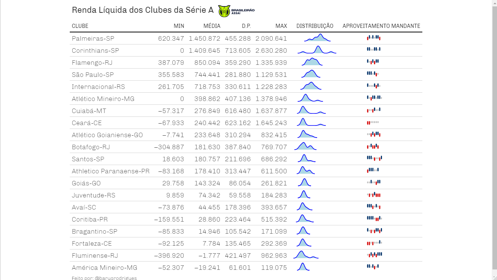

<!-- README.md is generated from README.Rmd. Please edit that file -->

```{r, include = FALSE}
knitr::opts_chunk$set(
  collapse = TRUE,
  comment = "#>",
  fig.path = "man/figures/README-",
  out.width = "100%"
)
```

```{r, echo=FALSE, message=FALSE}
library(tidyverse)
options(scipen = 999)
```

# rendas.brasileirão

Pacote criado para baixar de forma automática as rendas dos times do brasileirão. Há também a possibilidade de baixar as rendas dos times de outras séries. Verifique as funções do pacote.

# Formas de usar

O pacote está armazenado nesse repositório do github para instalar execute a função abaixo.
```{r, eval=FALSE}
devtools::install_github("BaruqueRodrigues/renda.brasileirao")
```

O uso é simples, você deve passar as rodadas que você tem interesse.

A função baixa_rendas_brasileirao() retorna a um dataframe com as rodadas desejadas.
```{r}
rodadas <- 1:15
ano <- 2022
df_rendas <- rendas.brasileirao::baixa_rendas_brasileirao(n_rodadas = rodadas, ano = ano)

df_rendas
```
O pacote permite a criação de tabela de visualização. Existem também funções para criação de tabelas de outras séries.

```{r, eval=FALSE}
df_rendas %>% 
rendas.brasileirao::cria_tabela_serie_a(renda_liq, clubem, placarm_tn, placarv_tn,
                                        "Renda Líquida")
```

```{r, echo=FALSE}

```

Também adicionamos a função que extraí as estatisticas dos times da série a

```{r}
statisticas_brasileirao_2019 <- rendas.brasileirao::pega_estatisticas(2019)

glimpse(statisticas_brasileirao_2019)
```

A partir do dataset podemos construir algumas visualizações como a da renda bruta por time.

```{r}
df_rendas %>% 
  mutate(renda_bruta = as.numeric(renda_bruta)) %>% 
  ggplot(aes(x= reorder(clubem, -renda_bruta),
             y=renda_bruta))+
  geom_col(fill = "steelblue")+
  theme_minimal()+
  theme(axis.text.x = element_text(angle = 90),
        plot.title = element_text(hjust = .5))+
  scale_y_continuous(breaks = seq(0, 18000000, 2000000))+
  labs(x= NULL,
       y= "Renda Bruta em Reais",
       title = "Renda Bruta dos Times do Brasileirão 2022 - Rodadas 1 a 15")
```

O número de ingressos vendidos

```{r}
df_rendas %>% 
  mutate(pagante = as.numeric(pagante)) %>% 
  ggplot(aes(x= reorder(clubem, -pagante),
             y=pagante))+
  geom_col(fill = "steelblue")+
  theme_minimal()+
  theme(axis.text.x = element_text(angle = 90),
        plot.title = element_text(hjust = .5))+
  scale_y_continuous(breaks = seq(0, 360000, 30000))+
  labs(x= NULL,
       y= "Número de Pagantes",
       title = "Número de Ingressos Vendidos dos Times do Brasileirão - Rodadas 1 a 15")

```

A média dos ingressos vendidos

```{r}
df_rendas %>% 
  mutate(pagante = as.numeric(pagante)) %>% 
  group_by(clubem) %>% 
  summarise(pagante = mean(pagante)) %>% 
  ggplot(aes(x= reorder(clubem, -pagante),
             y=(pagante)))+
  geom_col(fill = "steelblue")+
  theme_minimal()+
  theme(axis.text.x = element_text(angle = 90),
        plot.title = element_text(hjust = .5))+
  scale_y_continuous(breaks = seq(0, 55000, 5000))+
  labs(x= NULL,
       y= "Média de Ingressos Vendidos",
       title = "Média Ingressos Vendidos dos Times do Brasileirão - Rodadas 1 a 15")
```

