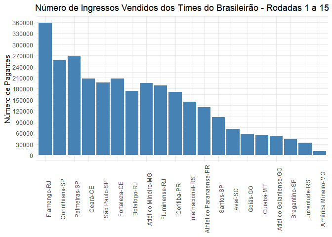
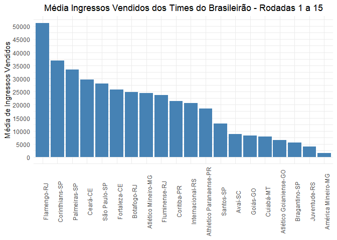
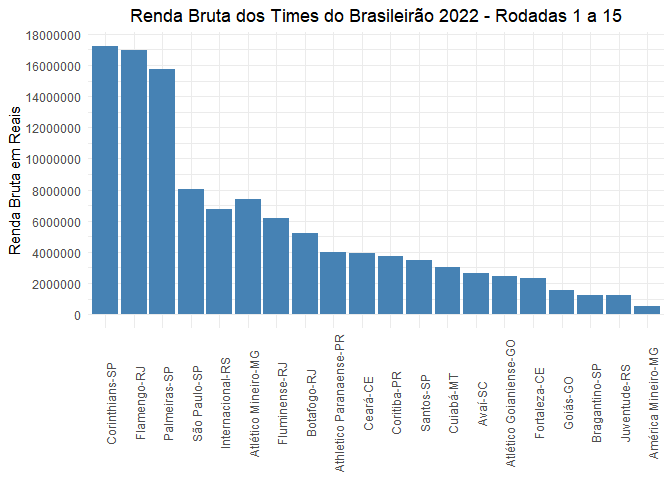

<!-- README.md is generated from README.Rmd. Please edit that file -->

# rendas.brasileirão

Pacote criado para baixar de forma automática as rendas dos times do
brasileirão. Há também a possibilidade de baixar as rendas dos times de
outras séries. Verifique as funções do pacote.

# Formas de usar

O pacote está armazenado nesse repositório do github para instalar
execute a função abaixo.

``` r
devtools::install_github("BaruqueRodrigues/renda.brasileirao")
```

O uso é simples, você deve passar as rodadas que você tem interesse.

A função baixa_rendas_brasileirao() retorna a um dataframe com as
rodadas desejadas.

``` r
rodadas <- 1:15
ano <- 2022
df_rendas <- rendas.brasileirao::baixa_rendas_brasileirao(n_rodadas = rodadas, ano = ano)

df_rendas
#> # A tibble: 150 × 42
#>    rodadas data       hora  clubem  clubev id_tabela id_clubem id_clubev escudom
#>    <chr>   <date>     <chr> <chr>   <chr>  <chr>     <chr>     <chr>     <chr>  
#>  1 1       2022-04-09 16h30 Flumin… Santo… 88416     11        17        /image…
#>  2 1       2022-04-09 19h00 Atléti… Flame… 88422     3         10        /image…
#>  3 1       2022-04-09 21h00 Palmei… Ceará… 88418     1         29        /image…
#>  4 1       2022-04-10 11h00 Coriti… Goiás… 88424     7         32        /image…
#>  5 1       2022-04-10 16h00 Atléti… Inter… 88415     4         13        /image…
#>  6 1       2022-04-10 16h00 Botafo… Corin… 88419     6         2         /image…
#>  7 1       2022-04-10 18h00 Fortal… Cuiab… 88421     47        45        /image…
#>  8 1       2022-04-10 19h00 São Pa… Athle… 88417     18        25        /image…
#>  9 1       2022-04-10 19h00 Avaí-SC Améri… 88423     26        22        /image…
#> 10 1       2022-04-11 20h00 Juvent… Braga… 88420     92        28        /image…
#> # … with 140 more rows, and 33 more variables: escudov <chr>, pagante <dbl>,
#> #   ingresso <dbl>, ingresso_vendido <dbl>, placarm_tn <chr>, placarv_tn <chr>,
#> #   prorrogacao <chr>, placarm_pr <chr>, placarv_pr <chr>, penaltis <chr>,
#> #   placarm_pe <chr>, placarv_pe <chr>, renda_bruta <dbl>,
#> #   renda_liq_sort <dbl>, renda_liq <dbl>, valor_renda_liq <dbl>,
#> #   estadio <chr>, cidade <chr>, id_periodo <chr>, so_por_rodada <chr>,
#> #   pm_abreviacao <chr>, pv_abreviacao <chr>, arbitro_principal <chr>, …
```

O pacote permite a criação de tabela de visualização. Existem também
funções para criação de tabelas de outras séries.

``` r
df_rendas %>% 
rendas.brasileirao::cria_tabela_serie_a(renda_liq, clubem, placarm_tn, placarv_tn,
                                        "Renda Liquida")
```

<div id="xjvuchhxus" style="overflow-x:auto;overflow-y:auto;width:auto;height:auto;">
<style>@import url("https://fonts.googleapis.com/css2?family=Chivo:ital,wght@0,100;0,200;0,300;0,400;0,500;0,600;0,700;0,800;0,900;1,100;1,200;1,300;1,400;1,500;1,600;1,700;1,800;1,900&display=swap");
html {
  font-family: Chivo, -apple-system, BlinkMacSystemFont, 'Segoe UI', Roboto, Oxygen, Ubuntu, Cantarell, 'Helvetica Neue', 'Fira Sans', 'Droid Sans', Arial, sans-serif;
}

#xjvuchhxus .gt_table {
  display: table;
  border-collapse: collapse;
  margin-left: auto;
  margin-right: auto;
  color: #333333;
  font-size: 16px;
  font-weight: 300;
  font-style: normal;
  background-color: #FFFFFF;
  width: auto;
  border-top-style: none;
  border-top-width: 3px;
  border-top-color: #A8A8A8;
  border-right-style: none;
  border-right-width: 2px;
  border-right-color: #D3D3D3;
  border-bottom-style: none;
  border-bottom-width: 2px;
  border-bottom-color: #A8A8A8;
  border-left-style: none;
  border-left-width: 2px;
  border-left-color: #D3D3D3;
}

#xjvuchhxus .gt_heading {
  background-color: #FFFFFF;
  text-align: left;
  border-bottom-color: #FFFFFF;
  border-left-style: none;
  border-left-width: 1px;
  border-left-color: #D3D3D3;
  border-right-style: none;
  border-right-width: 1px;
  border-right-color: #D3D3D3;
}

#xjvuchhxus .gt_title {
  color: #333333;
  font-size: 125%;
  font-weight: initial;
  padding-top: 4px;
  padding-bottom: 4px;
  padding-left: 5px;
  padding-right: 5px;
  border-bottom-color: #FFFFFF;
  border-bottom-width: 0;
}

#xjvuchhxus .gt_subtitle {
  color: #333333;
  font-size: 85%;
  font-weight: initial;
  padding-top: 0;
  padding-bottom: 6px;
  padding-left: 5px;
  padding-right: 5px;
  border-top-color: #FFFFFF;
  border-top-width: 0;
}

#xjvuchhxus .gt_bottom_border {
  border-bottom-style: none;
  border-bottom-width: 2px;
  border-bottom-color: #D3D3D3;
}

#xjvuchhxus .gt_col_headings {
  border-top-style: none;
  border-top-width: 2px;
  border-top-color: #D3D3D3;
  border-bottom-style: solid;
  border-bottom-width: 2px;
  border-bottom-color: #000000;
  border-left-style: none;
  border-left-width: 1px;
  border-left-color: #D3D3D3;
  border-right-style: none;
  border-right-width: 1px;
  border-right-color: #D3D3D3;
}

#xjvuchhxus .gt_col_heading {
  color: #333333;
  background-color: #FFFFFF;
  font-size: 80%;
  font-weight: normal;
  text-transform: uppercase;
  border-left-style: none;
  border-left-width: 1px;
  border-left-color: #D3D3D3;
  border-right-style: none;
  border-right-width: 1px;
  border-right-color: #D3D3D3;
  vertical-align: bottom;
  padding-top: 5px;
  padding-bottom: 6px;
  padding-left: 5px;
  padding-right: 5px;
  overflow-x: hidden;
}

#xjvuchhxus .gt_column_spanner_outer {
  color: #333333;
  background-color: #FFFFFF;
  font-size: 80%;
  font-weight: normal;
  text-transform: uppercase;
  padding-top: 0;
  padding-bottom: 0;
  padding-left: 4px;
  padding-right: 4px;
}

#xjvuchhxus .gt_column_spanner_outer:first-child {
  padding-left: 0;
}

#xjvuchhxus .gt_column_spanner_outer:last-child {
  padding-right: 0;
}

#xjvuchhxus .gt_column_spanner {
  border-bottom-style: solid;
  border-bottom-width: 2px;
  border-bottom-color: #000000;
  vertical-align: bottom;
  padding-top: 5px;
  padding-bottom: 5px;
  overflow-x: hidden;
  display: inline-block;
  width: 100%;
}

#xjvuchhxus .gt_group_heading {
  padding-top: 8px;
  padding-bottom: 8px;
  padding-left: 5px;
  padding-right: 5px;
  color: #333333;
  background-color: #FFFFFF;
  font-size: 80%;
  font-weight: bolder;
  text-transform: uppercase;
  border-top-style: none;
  border-top-width: 2px;
  border-top-color: #000000;
  border-bottom-style: solid;
  border-bottom-width: 1px;
  border-bottom-color: #FFFFFF;
  border-left-style: none;
  border-left-width: 1px;
  border-left-color: #D3D3D3;
  border-right-style: none;
  border-right-width: 1px;
  border-right-color: #D3D3D3;
  vertical-align: middle;
}

#xjvuchhxus .gt_empty_group_heading {
  padding: 0.5px;
  color: #333333;
  background-color: #FFFFFF;
  font-size: 80%;
  font-weight: bolder;
  border-top-style: none;
  border-top-width: 2px;
  border-top-color: #000000;
  border-bottom-style: solid;
  border-bottom-width: 1px;
  border-bottom-color: #FFFFFF;
  vertical-align: middle;
}

#xjvuchhxus .gt_from_md > :first-child {
  margin-top: 0;
}

#xjvuchhxus .gt_from_md > :last-child {
  margin-bottom: 0;
}

#xjvuchhxus .gt_row {
  padding-top: 3px;
  padding-bottom: 3px;
  padding-left: 5px;
  padding-right: 5px;
  margin: 10px;
  border-top-style: solid;
  border-top-width: 1px;
  border-top-color: #D3D3D3;
  border-left-style: none;
  border-left-width: 1px;
  border-left-color: #D3D3D3;
  border-right-style: none;
  border-right-width: 1px;
  border-right-color: #D3D3D3;
  vertical-align: middle;
  overflow-x: hidden;
}

#xjvuchhxus .gt_stub {
  color: #333333;
  background-color: #FFFFFF;
  font-size: 80%;
  font-weight: bolder;
  text-transform: uppercase;
  border-right-style: solid;
  border-right-width: 0px;
  border-right-color: #FFFFFF;
  padding-left: 5px;
  padding-right: 5px;
}

#xjvuchhxus .gt_stub_row_group {
  color: #333333;
  background-color: #FFFFFF;
  font-size: 100%;
  font-weight: initial;
  text-transform: inherit;
  border-right-style: solid;
  border-right-width: 2px;
  border-right-color: #D3D3D3;
  padding-left: 5px;
  padding-right: 5px;
  vertical-align: top;
}

#xjvuchhxus .gt_row_group_first td {
  border-top-width: 2px;
}

#xjvuchhxus .gt_summary_row {
  color: #333333;
  background-color: #FFFFFF;
  text-transform: inherit;
  padding-top: 8px;
  padding-bottom: 8px;
  padding-left: 5px;
  padding-right: 5px;
}

#xjvuchhxus .gt_first_summary_row {
  border-top-style: solid;
  border-top-color: #D3D3D3;
}

#xjvuchhxus .gt_first_summary_row.thick {
  border-top-width: 2px;
}

#xjvuchhxus .gt_last_summary_row {
  padding-top: 8px;
  padding-bottom: 8px;
  padding-left: 5px;
  padding-right: 5px;
  border-bottom-style: solid;
  border-bottom-width: 2px;
  border-bottom-color: #D3D3D3;
}

#xjvuchhxus .gt_grand_summary_row {
  color: #333333;
  background-color: #FFFFFF;
  text-transform: inherit;
  padding-top: 8px;
  padding-bottom: 8px;
  padding-left: 5px;
  padding-right: 5px;
}

#xjvuchhxus .gt_first_grand_summary_row {
  padding-top: 8px;
  padding-bottom: 8px;
  padding-left: 5px;
  padding-right: 5px;
  border-top-style: double;
  border-top-width: 6px;
  border-top-color: #D3D3D3;
}

#xjvuchhxus .gt_striped {
  background-color: rgba(128, 128, 128, 0.05);
}

#xjvuchhxus .gt_table_body {
  border-top-style: solid;
  border-top-width: 2px;
  border-top-color: #D3D3D3;
  border-bottom-style: solid;
  border-bottom-width: 2px;
  border-bottom-color: #D3D3D3;
}

#xjvuchhxus .gt_footnotes {
  color: #333333;
  background-color: #FFFFFF;
  border-bottom-style: none;
  border-bottom-width: 2px;
  border-bottom-color: #D3D3D3;
  border-left-style: none;
  border-left-width: 2px;
  border-left-color: #D3D3D3;
  border-right-style: none;
  border-right-width: 2px;
  border-right-color: #D3D3D3;
}

#xjvuchhxus .gt_footnote {
  margin: 0px;
  font-size: 90%;
  padding-left: 4px;
  padding-right: 4px;
  padding-left: 5px;
  padding-right: 5px;
}

#xjvuchhxus .gt_sourcenotes {
  color: #333333;
  background-color: #FFFFFF;
  border-bottom-style: none;
  border-bottom-width: 2px;
  border-bottom-color: #D3D3D3;
  border-left-style: none;
  border-left-width: 2px;
  border-left-color: #D3D3D3;
  border-right-style: none;
  border-right-width: 2px;
  border-right-color: #D3D3D3;
}

#xjvuchhxus .gt_sourcenote {
  font-size: 12px;
  padding-top: 4px;
  padding-bottom: 4px;
  padding-left: 5px;
  padding-right: 5px;
}

#xjvuchhxus .gt_left {
  text-align: left;
}

#xjvuchhxus .gt_center {
  text-align: center;
}

#xjvuchhxus .gt_right {
  text-align: right;
  font-variant-numeric: tabular-nums;
}

#xjvuchhxus .gt_font_normal {
  font-weight: normal;
}

#xjvuchhxus .gt_font_bold {
  font-weight: bold;
}

#xjvuchhxus .gt_font_italic {
  font-style: italic;
}

#xjvuchhxus .gt_super {
  font-size: 65%;
}

#xjvuchhxus .gt_two_val_uncert {
  display: inline-block;
  line-height: 1em;
  text-align: right;
  font-size: 60%;
  vertical-align: -0.25em;
  margin-left: 0.1em;
}

#xjvuchhxus .gt_footnote_marks {
  font-style: italic;
  font-weight: normal;
  font-size: 75%;
  vertical-align: 0.4em;
}

#xjvuchhxus .gt_asterisk {
  font-size: 100%;
  vertical-align: 0;
}

#xjvuchhxus .gt_slash_mark {
  font-size: 0.7em;
  line-height: 0.7em;
  vertical-align: 0.15em;
}

#xjvuchhxus .gt_fraction_numerator {
  font-size: 0.6em;
  line-height: 0.6em;
  vertical-align: 0.45em;
}

#xjvuchhxus .gt_fraction_denominator {
  font-size: 0.6em;
  line-height: 0.6em;
  vertical-align: -0.05em;
}

tbody tr:last-child {
  border-bottom: 2px solid #ffffff00;
}
</style>
<table class="gt_table">
  <thead class="gt_header">
    <tr>
      <th colspan="7" class="gt_heading gt_title gt_font_normal gt_bottom_border" style><div style='display:inline;vertical-align: top;'>Renda Liquida dos Clubes da Série A</div><div style='display:inline;margin-left:10px'></div></th>
    </tr>
    
  </thead>
  <thead class="gt_col_headings">
    <tr>
      <th class="gt_col_heading gt_columns_bottom_border gt_left" rowspan="1" colspan="1" style="border-top-width: 0px; border-top-style: solid; border-top-color: black;">clube</th>
      <th class="gt_col_heading gt_columns_bottom_border gt_right" rowspan="1" colspan="1" style="border-top-width: 0px; border-top-style: solid; border-top-color: black;">min</th>
      <th class="gt_col_heading gt_columns_bottom_border gt_right" rowspan="1" colspan="1" style="border-top-width: 0px; border-top-style: solid; border-top-color: black;">média</th>
      <th class="gt_col_heading gt_columns_bottom_border gt_right" rowspan="1" colspan="1" style="border-top-width: 0px; border-top-style: solid; border-top-color: black;">D.P.</th>
      <th class="gt_col_heading gt_columns_bottom_border gt_right" rowspan="1" colspan="1" style="border-top-width: 0px; border-top-style: solid; border-top-color: black;">max</th>
      <th class="gt_col_heading gt_columns_bottom_border gt_center" rowspan="1" colspan="1" style="border-top-width: 0px; border-top-style: solid; border-top-color: black;">distribuição</th>
      <th class="gt_col_heading gt_columns_bottom_border gt_center" rowspan="1" colspan="1" style="border-top-width: 0px; border-top-style: solid; border-top-color: black;">aproveitamento mandante</th>
    </tr>
  </thead>
  <tbody class="gt_table_body">
    <tr><td class="gt_row gt_left">América Mineiro-MG</td>
<td class="gt_row gt_right">&minus;52.307</td>
<td class="gt_row gt_right">&minus;19.241</td>
<td class="gt_row gt_right">61.601</td>
<td class="gt_row gt_right">119.075</td>
<td class="gt_row gt_center"><?xml version='1.0' encoding='UTF-8' ?><svg xmlns='http://www.w3.org/2000/svg' xmlns:xlink='http://www.w3.org/1999/xlink' class='svglite' width='85.04pt' height='14.17pt' viewBox='0 0 85.04 14.17'><defs>  <style type='text/css'><![CDATA[    .svglite line, .svglite polyline, .svglite polygon, .svglite path, .svglite rect, .svglite circle {      fill: none;      stroke: #000000;      stroke-linecap: round;      stroke-linejoin: round;      stroke-miterlimit: 10.00;    }    .svglite text {      white-space: pre;    }  ]]></style></defs><rect width='100%' height='100%' style='stroke: none; fill: none;'/><defs>  <clipPath id='cpMC4wMHw4NS4wNHwwLjAwfDE0LjE3'>    <rect x='0.00' y='0.00' width='85.04' height='14.17' />  </clipPath></defs><g clip-path='url(#cpMC4wMHw4NS4wNHwwLjAwfDE0LjE3)'><polygon points='10.54,13.42 10.58,13.41 10.63,13.41 10.67,13.40 10.71,13.40 10.75,13.39 10.80,13.39 10.84,13.38 10.88,13.38 10.93,13.37 10.97,13.36 11.01,13.36 11.06,13.35 11.10,13.34 11.14,13.33 11.19,13.33 11.23,13.32 11.27,13.31 11.31,13.30 11.36,13.29 11.40,13.28 11.44,13.27 11.49,13.26 11.53,13.25 11.57,13.24 11.62,13.23 11.66,13.22 11.70,13.21 11.74,13.20 11.79,13.18 11.83,13.17 11.87,13.16 11.92,13.14 11.96,13.13 12.00,13.11 12.05,13.10 12.09,13.08 12.13,13.07 12.18,13.05 12.22,13.03 12.26,13.02 12.30,13.00 12.35,12.98 12.39,12.96 12.43,12.94 12.48,12.92 12.52,12.90 12.56,12.88 12.61,12.86 12.65,12.83 12.69,12.81 12.74,12.79 12.78,12.76 12.82,12.74 12.86,12.71 12.91,12.69 12.95,12.66 12.99,12.63 13.04,12.60 13.08,12.57 13.12,12.54 13.17,12.51 13.21,12.48 13.25,12.45 13.29,12.41 13.34,12.38 13.38,12.35 13.42,12.31 13.47,12.27 13.51,12.24 13.55,12.20 13.60,12.16 13.64,12.12 13.68,12.08 13.73,12.04 13.77,11.99 13.81,11.95 13.85,11.91 13.90,11.86 13.94,11.82 13.98,11.77 14.03,11.72 14.07,11.67 14.11,11.62 14.16,11.57 14.20,11.52 14.24,11.46 14.29,11.41 14.33,11.35 14.37,11.30 14.41,11.24 14.46,11.18 14.50,11.12 14.54,11.06 14.59,11.00 14.63,10.94 14.67,10.88 14.72,10.81 14.76,10.75 14.80,10.68 14.85,10.61 14.89,10.54 14.93,10.47 14.97,10.40 15.02,10.33 15.06,10.26 15.10,10.18 15.15,10.11 15.19,10.03 15.23,9.96 15.28,9.88 15.32,9.80 15.36,9.72 15.40,9.64 15.45,9.56 15.49,9.47 15.53,9.39 15.58,9.30 15.62,9.22 15.66,9.13 15.71,9.05 15.75,8.96 15.79,8.87 15.84,8.78 15.88,8.69 15.92,8.59 15.96,8.50 16.01,8.41 16.05,8.31 16.09,8.22 16.14,8.12 16.18,8.03 16.22,7.93 16.27,7.83 16.31,7.73 16.35,7.63 16.40,7.53 16.44,7.43 16.48,7.33 16.52,7.23 16.57,7.13 16.61,7.03 16.65,6.93 16.70,6.82 16.74,6.72 16.78,6.62 16.83,6.51 16.87,6.41 16.91,6.30 16.95,6.20 17.00,6.09 17.04,5.99 17.08,5.88 17.13,5.78 17.17,5.67 17.21,5.57 17.26,5.46 17.30,5.36 17.34,5.25 17.39,5.15 17.43,5.05 17.47,4.94 17.51,4.84 17.56,4.74 17.60,4.63 17.64,4.53 17.69,4.43 17.73,4.33 17.77,4.23 17.82,4.13 17.86,4.03 17.90,3.93 17.95,3.83 17.99,3.73 18.03,3.64 18.07,3.54 18.12,3.44 18.16,3.35 18.20,3.26 18.25,3.17 18.29,3.08 18.33,2.99 18.38,2.90 18.42,2.81 18.46,2.72 18.51,2.64 18.55,2.55 18.59,2.47 18.63,2.39 18.68,2.31 18.72,2.23 18.76,2.16 18.81,2.08 18.85,2.01 18.89,1.94 18.94,1.87 18.98,1.80 19.02,1.73 19.06,1.67 19.11,1.60 19.15,1.54 19.19,1.48 19.24,1.43 19.28,1.37 19.32,1.32 19.37,1.26 19.41,1.21 19.45,1.17 19.50,1.12 19.54,1.08 19.58,1.03 19.62,0.99 19.67,0.96 19.71,0.92 19.75,0.89 19.80,0.86 19.84,0.83 19.88,0.80 19.93,0.77 19.97,0.75 20.01,0.73 20.06,0.71 20.10,0.70 20.14,0.68 20.18,0.67 20.23,0.66 20.27,0.65 20.31,0.65 20.36,0.65 20.40,0.64 20.44,0.65 20.49,0.65 20.53,0.66 20.57,0.66 20.62,0.68 20.66,0.69 20.70,0.70 20.74,0.72 20.79,0.74 20.83,0.76 20.87,0.78 20.92,0.81 20.96,0.84 21.00,0.87 21.05,0.90 21.09,0.93 21.13,0.97 21.17,1.01 21.22,1.05 21.26,1.09 21.30,1.13 21.35,1.18 21.39,1.23 21.43,1.28 21.48,1.33 21.52,1.38 21.56,1.44 21.61,1.49 21.65,1.55 21.69,1.61 21.73,1.67 21.78,1.74 21.82,1.80 21.86,1.87 21.91,1.94 21.95,2.01 21.99,2.08 22.04,2.15 22.08,2.23 22.12,2.30 22.17,2.38 22.21,2.46 22.25,2.54 22.29,2.62 22.34,2.70 22.38,2.78 22.42,2.87 22.47,2.95 22.51,3.04 22.55,3.12 22.60,3.21 22.64,3.30 22.68,3.39 22.72,3.48 22.77,3.57 22.81,3.67 22.85,3.76 22.90,3.85 22.94,3.95 22.98,4.04 23.03,4.14 23.07,4.23 23.11,4.33 23.16,4.43 23.20,4.52 23.24,4.62 23.28,4.72 23.33,4.82 23.37,4.91 23.41,5.01 23.46,5.11 23.50,5.21 23.54,5.31 23.59,5.41 23.63,5.51 23.67,5.61 23.72,5.71 23.76,5.81 23.80,5.91 23.84,6.01 23.89,6.10 23.93,6.20 23.97,6.30 24.02,6.40 24.06,6.50 24.10,6.60 24.15,6.69 24.19,6.79 24.23,6.89 24.28,6.98 24.32,7.08 24.36,7.18 24.40,7.27 24.45,7.36 24.49,7.46 24.53,7.55 24.58,7.65 24.62,7.74 24.66,7.83 24.71,7.92 24.75,8.01 24.79,8.10 24.83,8.19 24.88,8.28 24.92,8.37 24.96,8.45 25.01,8.54 25.05,8.63 25.09,8.71 25.14,8.79 25.18,8.88 25.22,8.96 25.27,9.04 25.31,9.12 25.35,9.20 25.39,9.28 25.44,9.36 25.48,9.44 25.52,9.52 25.57,9.59 25.61,9.67 25.65,9.74 25.70,9.81 25.74,9.89 25.78,9.96 25.83,10.03 25.87,10.10 25.91,10.17 25.95,10.23 26.00,10.30 26.04,10.37 26.08,10.43 26.13,10.50 26.17,10.56 26.21,10.62 26.26,10.68 26.30,10.75 26.34,10.80 26.39,10.86 26.43,10.92 26.47,10.98 26.51,11.03 26.56,11.09 26.60,11.14 26.64,11.20 26.69,11.25 26.73,11.30 26.77,11.35 26.82,11.40 26.86,11.45 26.90,11.50 26.94,11.55 26.99,11.60 27.03,11.64 27.07,11.69 27.12,11.73 27.16,11.77 27.20,11.82 27.25,11.86 27.29,11.90 27.33,11.94 27.38,11.98 27.42,12.02 27.46,12.06 27.50,12.09 27.55,12.13 27.59,12.16 27.63,12.20 27.68,12.23 27.72,12.27 27.76,12.30 27.81,12.33 27.85,12.36 27.89,12.40 27.94,12.43 27.98,12.45 28.02,12.48 28.06,12.51 28.11,12.54 28.15,12.57 28.19,12.59 28.24,12.62 28.28,12.64 28.32,12.67 28.37,12.69 28.41,12.72 28.45,12.74 28.49,12.76 28.54,12.78 28.58,12.81 28.62,12.83 28.67,12.85 28.71,12.87 28.75,12.89 28.80,12.91 28.84,12.92 28.88,12.94 28.93,12.96 28.97,12.98 29.01,12.99 29.05,13.01 29.10,13.03 29.14,13.04 29.18,13.06 29.23,13.07 29.27,13.08 29.31,13.10 29.36,13.11 29.40,13.12 29.44,13.14 29.49,13.15 29.53,13.16 29.57,13.17 29.61,13.19 29.66,13.20 29.70,13.21 29.74,13.22 29.79,13.23 29.83,13.24 29.87,13.25 29.92,13.26 29.96,13.27 30.00,13.27 30.05,13.28 30.09,13.29 30.13,13.30 30.17,13.31 30.22,13.32 30.26,13.32 30.30,13.33 30.35,13.34 30.39,13.34 30.43,13.35 30.48,13.36 30.52,13.36 30.56,13.37 30.60,13.37 30.65,13.38 30.69,13.38 30.73,13.39 30.78,13.39 30.82,13.40 30.86,13.40 30.91,13.41 30.95,13.41 30.99,13.42 31.04,13.42 31.08,13.43 31.12,13.43 31.16,13.43 31.21,13.44 31.25,13.44 31.29,13.44 31.34,13.45 31.38,13.45 31.42,13.45 31.47,13.46 31.51,13.46 31.55,13.46 31.60,13.46 31.64,13.47 31.68,13.47 31.72,13.47 31.77,13.47 31.81,13.48 31.85,13.48 31.90,13.48 31.94,13.48 31.98,13.48 32.03,13.49 32.07,13.49 32.11,13.49 32.15,13.49 32.20,13.49 32.24,13.49 32.28,13.50 32.33,13.50 32.37,13.50 32.41,13.50 32.46,13.50 32.50,13.50 32.54,13.50 32.54,13.53 32.50,13.53 32.46,13.53 32.41,13.53 32.37,13.53 32.33,13.53 32.28,13.53 32.24,13.53 32.20,13.53 32.15,13.53 32.11,13.53 32.07,13.53 32.03,13.53 31.98,13.53 31.94,13.53 31.90,13.53 31.85,13.53 31.81,13.53 31.77,13.53 31.72,13.53 31.68,13.53 31.64,13.53 31.60,13.53 31.55,13.53 31.51,13.53 31.47,13.53 31.42,13.53 31.38,13.53 31.34,13.53 31.29,13.53 31.25,13.53 31.21,13.53 31.16,13.53 31.12,13.53 31.08,13.53 31.04,13.53 30.99,13.53 30.95,13.53 30.91,13.53 30.86,13.53 30.82,13.53 30.78,13.53 30.73,13.53 30.69,13.53 30.65,13.53 30.60,13.53 30.56,13.53 30.52,13.53 30.48,13.53 30.43,13.53 30.39,13.53 30.35,13.53 30.30,13.53 30.26,13.53 30.22,13.53 30.17,13.53 30.13,13.53 30.09,13.53 30.05,13.53 30.00,13.53 29.96,13.53 29.92,13.53 29.87,13.53 29.83,13.53 29.79,13.53 29.74,13.53 29.70,13.53 29.66,13.53 29.61,13.53 29.57,13.53 29.53,13.53 29.49,13.53 29.44,13.53 29.40,13.53 29.36,13.53 29.31,13.53 29.27,13.53 29.23,13.53 29.18,13.53 29.14,13.53 29.10,13.53 29.05,13.53 29.01,13.53 28.97,13.53 28.93,13.53 28.88,13.53 28.84,13.53 28.80,13.53 28.75,13.53 28.71,13.53 28.67,13.53 28.62,13.53 28.58,13.53 28.54,13.53 28.49,13.53 28.45,13.53 28.41,13.53 28.37,13.53 28.32,13.53 28.28,13.53 28.24,13.53 28.19,13.53 28.15,13.53 28.11,13.53 28.06,13.53 28.02,13.53 27.98,13.53 27.94,13.53 27.89,13.53 27.85,13.53 27.81,13.53 27.76,13.53 27.72,13.53 27.68,13.53 27.63,13.53 27.59,13.53 27.55,13.53 27.50,13.53 27.46,13.53 27.42,13.53 27.38,13.53 27.33,13.53 27.29,13.53 27.25,13.53 27.20,13.53 27.16,13.53 27.12,13.53 27.07,13.53 27.03,13.53 26.99,13.53 26.94,13.53 26.90,13.53 26.86,13.53 26.82,13.53 26.77,13.53 26.73,13.53 26.69,13.53 26.64,13.53 26.60,13.53 26.56,13.53 26.51,13.53 26.47,13.53 26.43,13.53 26.39,13.53 26.34,13.53 26.30,13.53 26.26,13.53 26.21,13.53 26.17,13.53 26.13,13.53 26.08,13.53 26.04,13.53 26.00,13.53 25.95,13.53 25.91,13.53 25.87,13.53 25.83,13.53 25.78,13.53 25.74,13.53 25.70,13.53 25.65,13.53 25.61,13.53 25.57,13.53 25.52,13.53 25.48,13.53 25.44,13.53 25.39,13.53 25.35,13.53 25.31,13.53 25.27,13.53 25.22,13.53 25.18,13.53 25.14,13.53 25.09,13.53 25.05,13.53 25.01,13.53 24.96,13.53 24.92,13.53 24.88,13.53 24.83,13.53 24.79,13.53 24.75,13.53 24.71,13.53 24.66,13.53 24.62,13.53 24.58,13.53 24.53,13.53 24.49,13.53 24.45,13.53 24.40,13.53 24.36,13.53 24.32,13.53 24.28,13.53 24.23,13.53 24.19,13.53 24.15,13.53 24.10,13.53 24.06,13.53 24.02,13.53 23.97,13.53 23.93,13.53 23.89,13.53 23.84,13.53 23.80,13.53 23.76,13.53 23.72,13.53 23.67,13.53 23.63,13.53 23.59,13.53 23.54,13.53 23.50,13.53 23.46,13.53 23.41,13.53 23.37,13.53 23.33,13.53 23.28,13.53 23.24,13.53 23.20,13.53 23.16,13.53 23.11,13.53 23.07,13.53 23.03,13.53 22.98,13.53 22.94,13.53 22.90,13.53 22.85,13.53 22.81,13.53 22.77,13.53 22.72,13.53 22.68,13.53 22.64,13.53 22.60,13.53 22.55,13.53 22.51,13.53 22.47,13.53 22.42,13.53 22.38,13.53 22.34,13.53 22.29,13.53 22.25,13.53 22.21,13.53 22.17,13.53 22.12,13.53 22.08,13.53 22.04,13.53 21.99,13.53 21.95,13.53 21.91,13.53 21.86,13.53 21.82,13.53 21.78,13.53 21.73,13.53 21.69,13.53 21.65,13.53 21.61,13.53 21.56,13.53 21.52,13.53 21.48,13.53 21.43,13.53 21.39,13.53 21.35,13.53 21.30,13.53 21.26,13.53 21.22,13.53 21.17,13.53 21.13,13.53 21.09,13.53 21.05,13.53 21.00,13.53 20.96,13.53 20.92,13.53 20.87,13.53 20.83,13.53 20.79,13.53 20.74,13.53 20.70,13.53 20.66,13.53 20.62,13.53 20.57,13.53 20.53,13.53 20.49,13.53 20.44,13.53 20.40,13.53 20.36,13.53 20.31,13.53 20.27,13.53 20.23,13.53 20.18,13.53 20.14,13.53 20.10,13.53 20.06,13.53 20.01,13.53 19.97,13.53 19.93,13.53 19.88,13.53 19.84,13.53 19.80,13.53 19.75,13.53 19.71,13.53 19.67,13.53 19.62,13.53 19.58,13.53 19.54,13.53 19.50,13.53 19.45,13.53 19.41,13.53 19.37,13.53 19.32,13.53 19.28,13.53 19.24,13.53 19.19,13.53 19.15,13.53 19.11,13.53 19.06,13.53 19.02,13.53 18.98,13.53 18.94,13.53 18.89,13.53 18.85,13.53 18.81,13.53 18.76,13.53 18.72,13.53 18.68,13.53 18.63,13.53 18.59,13.53 18.55,13.53 18.51,13.53 18.46,13.53 18.42,13.53 18.38,13.53 18.33,13.53 18.29,13.53 18.25,13.53 18.20,13.53 18.16,13.53 18.12,13.53 18.07,13.53 18.03,13.53 17.99,13.53 17.95,13.53 17.90,13.53 17.86,13.53 17.82,13.53 17.77,13.53 17.73,13.53 17.69,13.53 17.64,13.53 17.60,13.53 17.56,13.53 17.51,13.53 17.47,13.53 17.43,13.53 17.39,13.53 17.34,13.53 17.30,13.53 17.26,13.53 17.21,13.53 17.17,13.53 17.13,13.53 17.08,13.53 17.04,13.53 17.00,13.53 16.95,13.53 16.91,13.53 16.87,13.53 16.83,13.53 16.78,13.53 16.74,13.53 16.70,13.53 16.65,13.53 16.61,13.53 16.57,13.53 16.52,13.53 16.48,13.53 16.44,13.53 16.40,13.53 16.35,13.53 16.31,13.53 16.27,13.53 16.22,13.53 16.18,13.53 16.14,13.53 16.09,13.53 16.05,13.53 16.01,13.53 15.96,13.53 15.92,13.53 15.88,13.53 15.84,13.53 15.79,13.53 15.75,13.53 15.71,13.53 15.66,13.53 15.62,13.53 15.58,13.53 15.53,13.53 15.49,13.53 15.45,13.53 15.40,13.53 15.36,13.53 15.32,13.53 15.28,13.53 15.23,13.53 15.19,13.53 15.15,13.53 15.10,13.53 15.06,13.53 15.02,13.53 14.97,13.53 14.93,13.53 14.89,13.53 14.85,13.53 14.80,13.53 14.76,13.53 14.72,13.53 14.67,13.53 14.63,13.53 14.59,13.53 14.54,13.53 14.50,13.53 14.46,13.53 14.41,13.53 14.37,13.53 14.33,13.53 14.29,13.53 14.24,13.53 14.20,13.53 14.16,13.53 14.11,13.53 14.07,13.53 14.03,13.53 13.98,13.53 13.94,13.53 13.90,13.53 13.85,13.53 13.81,13.53 13.77,13.53 13.73,13.53 13.68,13.53 13.64,13.53 13.60,13.53 13.55,13.53 13.51,13.53 13.47,13.53 13.42,13.53 13.38,13.53 13.34,13.53 13.29,13.53 13.25,13.53 13.21,13.53 13.17,13.53 13.12,13.53 13.08,13.53 13.04,13.53 12.99,13.53 12.95,13.53 12.91,13.53 12.86,13.53 12.82,13.53 12.78,13.53 12.74,13.53 12.69,13.53 12.65,13.53 12.61,13.53 12.56,13.53 12.52,13.53 12.48,13.53 12.43,13.53 12.39,13.53 12.35,13.53 12.30,13.53 12.26,13.53 12.22,13.53 12.18,13.53 12.13,13.53 12.09,13.53 12.05,13.53 12.00,13.53 11.96,13.53 11.92,13.53 11.87,13.53 11.83,13.53 11.79,13.53 11.74,13.53 11.70,13.53 11.66,13.53 11.62,13.53 11.57,13.53 11.53,13.53 11.49,13.53 11.44,13.53 11.40,13.53 11.36,13.53 11.31,13.53 11.27,13.53 11.23,13.53 11.19,13.53 11.14,13.53 11.10,13.53 11.06,13.53 11.01,13.53 10.97,13.53 10.93,13.53 10.88,13.53 10.84,13.53 10.80,13.53 10.75,13.53 10.71,13.53 10.67,13.53 10.63,13.53 10.58,13.53 10.54,13.53 ' style='stroke-width: 0.00; stroke: none; fill: #ADD8E6;' /><polyline points='10.54,13.42 10.58,13.41 10.63,13.41 10.67,13.40 10.71,13.40 10.75,13.39 10.80,13.39 10.84,13.38 10.88,13.38 10.93,13.37 10.97,13.36 11.01,13.36 11.06,13.35 11.10,13.34 11.14,13.33 11.19,13.33 11.23,13.32 11.27,13.31 11.31,13.30 11.36,13.29 11.40,13.28 11.44,13.27 11.49,13.26 11.53,13.25 11.57,13.24 11.62,13.23 11.66,13.22 11.70,13.21 11.74,13.20 11.79,13.18 11.83,13.17 11.87,13.16 11.92,13.14 11.96,13.13 12.00,13.11 12.05,13.10 12.09,13.08 12.13,13.07 12.18,13.05 12.22,13.03 12.26,13.02 12.30,13.00 12.35,12.98 12.39,12.96 12.43,12.94 12.48,12.92 12.52,12.90 12.56,12.88 12.61,12.86 12.65,12.83 12.69,12.81 12.74,12.79 12.78,12.76 12.82,12.74 12.86,12.71 12.91,12.69 12.95,12.66 12.99,12.63 13.04,12.60 13.08,12.57 13.12,12.54 13.17,12.51 13.21,12.48 13.25,12.45 13.29,12.41 13.34,12.38 13.38,12.35 13.42,12.31 13.47,12.27 13.51,12.24 13.55,12.20 13.60,12.16 13.64,12.12 13.68,12.08 13.73,12.04 13.77,11.99 13.81,11.95 13.85,11.91 13.90,11.86 13.94,11.82 13.98,11.77 14.03,11.72 14.07,11.67 14.11,11.62 14.16,11.57 14.20,11.52 14.24,11.46 14.29,11.41 14.33,11.35 14.37,11.30 14.41,11.24 14.46,11.18 14.50,11.12 14.54,11.06 14.59,11.00 14.63,10.94 14.67,10.88 14.72,10.81 14.76,10.75 14.80,10.68 14.85,10.61 14.89,10.54 14.93,10.47 14.97,10.40 15.02,10.33 15.06,10.26 15.10,10.18 15.15,10.11 15.19,10.03 15.23,9.96 15.28,9.88 15.32,9.80 15.36,9.72 15.40,9.64 15.45,9.56 15.49,9.47 15.53,9.39 15.58,9.30 15.62,9.22 15.66,9.13 15.71,9.05 15.75,8.96 15.79,8.87 15.84,8.78 15.88,8.69 15.92,8.59 15.96,8.50 16.01,8.41 16.05,8.31 16.09,8.22 16.14,8.12 16.18,8.03 16.22,7.93 16.27,7.83 16.31,7.73 16.35,7.63 16.40,7.53 16.44,7.43 16.48,7.33 16.52,7.23 16.57,7.13 16.61,7.03 16.65,6.93 16.70,6.82 16.74,6.72 16.78,6.62 16.83,6.51 16.87,6.41 16.91,6.30 16.95,6.20 17.00,6.09 17.04,5.99 17.08,5.88 17.13,5.78 17.17,5.67 17.21,5.57 17.26,5.46 17.30,5.36 17.34,5.25 17.39,5.15 17.43,5.05 17.47,4.94 17.51,4.84 17.56,4.74 17.60,4.63 17.64,4.53 17.69,4.43 17.73,4.33 17.77,4.23 17.82,4.13 17.86,4.03 17.90,3.93 17.95,3.83 17.99,3.73 18.03,3.64 18.07,3.54 18.12,3.44 18.16,3.35 18.20,3.26 18.25,3.17 18.29,3.08 18.33,2.99 18.38,2.90 18.42,2.81 18.46,2.72 18.51,2.64 18.55,2.55 18.59,2.47 18.63,2.39 18.68,2.31 18.72,2.23 18.76,2.16 18.81,2.08 18.85,2.01 18.89,1.94 18.94,1.87 18.98,1.80 19.02,1.73 19.06,1.67 19.11,1.60 19.15,1.54 19.19,1.48 19.24,1.43 19.28,1.37 19.32,1.32 19.37,1.26 19.41,1.21 19.45,1.17 19.50,1.12 19.54,1.08 19.58,1.03 19.62,0.99 19.67,0.96 19.71,0.92 19.75,0.89 19.80,0.86 19.84,0.83 19.88,0.80 19.93,0.77 19.97,0.75 20.01,0.73 20.06,0.71 20.10,0.70 20.14,0.68 20.18,0.67 20.23,0.66 20.27,0.65 20.31,0.65 20.36,0.65 20.40,0.64 20.44,0.65 20.49,0.65 20.53,0.66 20.57,0.66 20.62,0.68 20.66,0.69 20.70,0.70 20.74,0.72 20.79,0.74 20.83,0.76 20.87,0.78 20.92,0.81 20.96,0.84 21.00,0.87 21.05,0.90 21.09,0.93 21.13,0.97 21.17,1.01 21.22,1.05 21.26,1.09 21.30,1.13 21.35,1.18 21.39,1.23 21.43,1.28 21.48,1.33 21.52,1.38 21.56,1.44 21.61,1.49 21.65,1.55 21.69,1.61 21.73,1.67 21.78,1.74 21.82,1.80 21.86,1.87 21.91,1.94 21.95,2.01 21.99,2.08 22.04,2.15 22.08,2.23 22.12,2.30 22.17,2.38 22.21,2.46 22.25,2.54 22.29,2.62 22.34,2.70 22.38,2.78 22.42,2.87 22.47,2.95 22.51,3.04 22.55,3.12 22.60,3.21 22.64,3.30 22.68,3.39 22.72,3.48 22.77,3.57 22.81,3.67 22.85,3.76 22.90,3.85 22.94,3.95 22.98,4.04 23.03,4.14 23.07,4.23 23.11,4.33 23.16,4.43 23.20,4.52 23.24,4.62 23.28,4.72 23.33,4.82 23.37,4.91 23.41,5.01 23.46,5.11 23.50,5.21 23.54,5.31 23.59,5.41 23.63,5.51 23.67,5.61 23.72,5.71 23.76,5.81 23.80,5.91 23.84,6.01 23.89,6.10 23.93,6.20 23.97,6.30 24.02,6.40 24.06,6.50 24.10,6.60 24.15,6.69 24.19,6.79 24.23,6.89 24.28,6.98 24.32,7.08 24.36,7.18 24.40,7.27 24.45,7.36 24.49,7.46 24.53,7.55 24.58,7.65 24.62,7.74 24.66,7.83 24.71,7.92 24.75,8.01 24.79,8.10 24.83,8.19 24.88,8.28 24.92,8.37 24.96,8.45 25.01,8.54 25.05,8.63 25.09,8.71 25.14,8.79 25.18,8.88 25.22,8.96 25.27,9.04 25.31,9.12 25.35,9.20 25.39,9.28 25.44,9.36 25.48,9.44 25.52,9.52 25.57,9.59 25.61,9.67 25.65,9.74 25.70,9.81 25.74,9.89 25.78,9.96 25.83,10.03 25.87,10.10 25.91,10.17 25.95,10.23 26.00,10.30 26.04,10.37 26.08,10.43 26.13,10.50 26.17,10.56 26.21,10.62 26.26,10.68 26.30,10.75 26.34,10.80 26.39,10.86 26.43,10.92 26.47,10.98 26.51,11.03 26.56,11.09 26.60,11.14 26.64,11.20 26.69,11.25 26.73,11.30 26.77,11.35 26.82,11.40 26.86,11.45 26.90,11.50 26.94,11.55 26.99,11.60 27.03,11.64 27.07,11.69 27.12,11.73 27.16,11.77 27.20,11.82 27.25,11.86 27.29,11.90 27.33,11.94 27.38,11.98 27.42,12.02 27.46,12.06 27.50,12.09 27.55,12.13 27.59,12.16 27.63,12.20 27.68,12.23 27.72,12.27 27.76,12.30 27.81,12.33 27.85,12.36 27.89,12.40 27.94,12.43 27.98,12.45 28.02,12.48 28.06,12.51 28.11,12.54 28.15,12.57 28.19,12.59 28.24,12.62 28.28,12.64 28.32,12.67 28.37,12.69 28.41,12.72 28.45,12.74 28.49,12.76 28.54,12.78 28.58,12.81 28.62,12.83 28.67,12.85 28.71,12.87 28.75,12.89 28.80,12.91 28.84,12.92 28.88,12.94 28.93,12.96 28.97,12.98 29.01,12.99 29.05,13.01 29.10,13.03 29.14,13.04 29.18,13.06 29.23,13.07 29.27,13.08 29.31,13.10 29.36,13.11 29.40,13.12 29.44,13.14 29.49,13.15 29.53,13.16 29.57,13.17 29.61,13.19 29.66,13.20 29.70,13.21 29.74,13.22 29.79,13.23 29.83,13.24 29.87,13.25 29.92,13.26 29.96,13.27 30.00,13.27 30.05,13.28 30.09,13.29 30.13,13.30 30.17,13.31 30.22,13.32 30.26,13.32 30.30,13.33 30.35,13.34 30.39,13.34 30.43,13.35 30.48,13.36 30.52,13.36 30.56,13.37 30.60,13.37 30.65,13.38 30.69,13.38 30.73,13.39 30.78,13.39 30.82,13.40 30.86,13.40 30.91,13.41 30.95,13.41 30.99,13.42 31.04,13.42 31.08,13.43 31.12,13.43 31.16,13.43 31.21,13.44 31.25,13.44 31.29,13.44 31.34,13.45 31.38,13.45 31.42,13.45 31.47,13.46 31.51,13.46 31.55,13.46 31.60,13.46 31.64,13.47 31.68,13.47 31.72,13.47 31.77,13.47 31.81,13.48 31.85,13.48 31.90,13.48 31.94,13.48 31.98,13.48 32.03,13.49 32.07,13.49 32.11,13.49 32.15,13.49 32.20,13.49 32.24,13.49 32.28,13.50 32.33,13.50 32.37,13.50 32.41,13.50 32.46,13.50 32.50,13.50 32.54,13.50 ' style='stroke-width: 1.07; stroke: #0000FF;' /></g></svg></td>
<td class="gt_row gt_center"><?xml version='1.0' encoding='UTF-8' ?><svg xmlns='http://www.w3.org/2000/svg' xmlns:xlink='http://www.w3.org/1999/xlink' class='svglite' width='58.06pt' height='10.80pt' viewBox='0 0 58.06 10.80'><defs>  <style type='text/css'><![CDATA[    .svglite line, .svglite polyline, .svglite polygon, .svglite path, .svglite rect, .svglite circle {      fill: none;      stroke: #000000;      stroke-linecap: round;      stroke-linejoin: round;      stroke-miterlimit: 10.00;    }    .svglite text {      white-space: pre;    }  ]]></style></defs><rect width='100%' height='100%' style='stroke: none; fill: none;'/><defs>  <clipPath id='cpMC4wMHw1OC4wNnwwLjAwfDEwLjgw'>    <rect x='0.00' y='0.00' width='58.06' height='10.80' />  </clipPath></defs><g clip-path='url(#cpMC4wMHw1OC4wNnwwLjAwfDEwLjgw)'><line x1='4.19' y1='1.89' x2='4.19' y2='6.10' style='stroke-width: 2.13; stroke: #013369;' /><line x1='7.30' y1='1.89' x2='7.30' y2='6.10' style='stroke-width: 2.13; stroke: #013369;' /><line x1='10.40' y1='6.10' x2='10.40' y2='4.70' style='stroke-width: 2.13; stroke: #BEBEBE;' /><line x1='13.51' y1='1.89' x2='13.51' y2='6.10' style='stroke-width: 2.13; stroke: #013369;' /><line x1='16.61' y1='8.91' x2='16.61' y2='4.70' style='stroke-width: 2.13; stroke: #D50A0A;' /><line x1='19.72' y1='6.10' x2='19.72' y2='4.70' style='stroke-width: 2.13; stroke: #BEBEBE;' /><line x1='22.82' y1='1.89' x2='22.82' y2='6.10' style='stroke-width: 2.13; stroke: #013369;' /></g></svg></td></tr>
    <tr><td class="gt_row gt_left">Athletico Paranaense-PR</td>
<td class="gt_row gt_right">&minus;83.168</td>
<td class="gt_row gt_right">178.410</td>
<td class="gt_row gt_right">313.447</td>
<td class="gt_row gt_right">611.500</td>
<td class="gt_row gt_center"><?xml version='1.0' encoding='UTF-8' ?><svg xmlns='http://www.w3.org/2000/svg' xmlns:xlink='http://www.w3.org/1999/xlink' class='svglite' width='85.04pt' height='14.17pt' viewBox='0 0 85.04 14.17'><defs>  <style type='text/css'><![CDATA[    .svglite line, .svglite polyline, .svglite polygon, .svglite path, .svglite rect, .svglite circle {      fill: none;      stroke: #000000;      stroke-linecap: round;      stroke-linejoin: round;      stroke-miterlimit: 10.00;    }    .svglite text {      white-space: pre;    }  ]]></style></defs><rect width='100%' height='100%' style='stroke: none; fill: none;'/><defs>  <clipPath id='cpMC4wMHw4NS4wNHwwLjAwfDE0LjE3'>    <rect x='0.00' y='0.00' width='85.04' height='14.17' />  </clipPath></defs><g clip-path='url(#cpMC4wMHw4NS4wNHwwLjAwfDE0LjE3)'><polygon points='9.94,13.44 10.00,13.43 10.07,13.43 10.13,13.42 10.19,13.41 10.26,13.41 10.32,13.40 10.38,13.39 10.44,13.38 10.51,13.37 10.57,13.36 10.63,13.35 10.70,13.34 10.76,13.33 10.82,13.32 10.88,13.31 10.95,13.30 11.01,13.28 11.07,13.27 11.14,13.25 11.20,13.24 11.26,13.22 11.33,13.21 11.39,13.19 11.45,13.17 11.51,13.15 11.58,13.13 11.64,13.11 11.70,13.09 11.77,13.06 11.83,13.04 11.89,13.01 11.95,12.99 12.02,12.96 12.08,12.93 12.14,12.90 12.21,12.87 12.27,12.84 12.33,12.81 12.39,12.77 12.46,12.73 12.52,12.70 12.58,12.66 12.65,12.62 12.71,12.58 12.77,12.53 12.83,12.49 12.90,12.44 12.96,12.39 13.02,12.34 13.09,12.29 13.15,12.24 13.21,12.18 13.27,12.13 13.34,12.07 13.40,12.01 13.46,11.95 13.53,11.88 13.59,11.82 13.65,11.75 13.71,11.68 13.78,11.61 13.84,11.53 13.90,11.46 13.97,11.38 14.03,11.30 14.09,11.21 14.16,11.13 14.22,11.04 14.28,10.95 14.34,10.86 14.41,10.77 14.47,10.68 14.53,10.58 14.60,10.48 14.66,10.38 14.72,10.27 14.78,10.17 14.85,10.06 14.91,9.95 14.97,9.84 15.04,9.72 15.10,9.61 15.16,9.49 15.22,9.37 15.29,9.25 15.35,9.13 15.41,9.00 15.48,8.87 15.54,8.74 15.60,8.61 15.66,8.48 15.73,8.35 15.79,8.21 15.85,8.08 15.92,7.94 15.98,7.80 16.04,7.66 16.10,7.52 16.17,7.37 16.23,7.23 16.29,7.09 16.36,6.94 16.42,6.79 16.48,6.65 16.55,6.50 16.61,6.35 16.67,6.20 16.73,6.06 16.80,5.91 16.86,5.76 16.92,5.61 16.99,5.46 17.05,5.31 17.11,5.17 17.17,5.02 17.24,4.87 17.30,4.73 17.36,4.58 17.43,4.44 17.49,4.30 17.55,4.15 17.61,4.01 17.68,3.88 17.74,3.74 17.80,3.60 17.87,3.47 17.93,3.34 17.99,3.21 18.05,3.08 18.12,2.96 18.18,2.83 18.24,2.71 18.31,2.60 18.37,2.48 18.43,2.37 18.49,2.26 18.56,2.15 18.62,2.05 18.68,1.95 18.75,1.85 18.81,1.76 18.87,1.67 18.93,1.58 19.00,1.50 19.06,1.42 19.12,1.34 19.19,1.27 19.25,1.20 19.31,1.14 19.38,1.07 19.44,1.02 19.50,0.97 19.56,0.92 19.63,0.87 19.69,0.83 19.75,0.79 19.82,0.76 19.88,0.73 19.94,0.71 20.00,0.69 20.07,0.67 20.13,0.66 20.19,0.65 20.26,0.64 20.32,0.65 20.38,0.65 20.44,0.66 20.51,0.67 20.57,0.68 20.63,0.70 20.70,0.72 20.76,0.75 20.82,0.78 20.88,0.81 20.95,0.85 21.01,0.89 21.07,0.94 21.14,0.98 21.20,1.03 21.26,1.09 21.32,1.14 21.39,1.20 21.45,1.27 21.51,1.33 21.58,1.40 21.64,1.47 21.70,1.54 21.76,1.62 21.83,1.70 21.89,1.78 21.95,1.86 22.02,1.95 22.08,2.03 22.14,2.12 22.21,2.21 22.27,2.30 22.33,2.40 22.39,2.49 22.46,2.59 22.52,2.69 22.58,2.79 22.65,2.89 22.71,2.99 22.77,3.09 22.83,3.19 22.90,3.29 22.96,3.40 23.02,3.50 23.09,3.61 23.15,3.71 23.21,3.82 23.27,3.93 23.34,4.03 23.40,4.14 23.46,4.24 23.53,4.35 23.59,4.46 23.65,4.56 23.71,4.67 23.78,4.77 23.84,4.88 23.90,4.98 23.97,5.08 24.03,5.19 24.09,5.29 24.15,5.39 24.22,5.49 24.28,5.59 24.34,5.69 24.41,5.79 24.47,5.88 24.53,5.98 24.60,6.07 24.66,6.17 24.72,6.26 24.78,6.35 24.85,6.44 24.91,6.53 24.97,6.62 25.04,6.70 25.10,6.79 25.16,6.87 25.22,6.96 25.29,7.04 25.35,7.12 25.41,7.19 25.48,7.27 25.54,7.34 25.60,7.42 25.66,7.49 25.73,7.56 25.79,7.63 25.85,7.69 25.92,7.76 25.98,7.82 26.04,7.88 26.10,7.94 26.17,8.00 26.23,8.06 26.29,8.11 26.36,8.17 26.42,8.22 26.48,8.27 26.54,8.31 26.61,8.36 26.67,8.40 26.73,8.44 26.80,8.48 26.86,8.52 26.92,8.56 26.98,8.59 27.05,8.62 27.11,8.65 27.17,8.68 27.24,8.71 27.30,8.73 27.36,8.76 27.43,8.78 27.49,8.80 27.55,8.81 27.61,8.83 27.68,8.84 27.74,8.85 27.80,8.86 27.87,8.87 27.93,8.87 27.99,8.88 28.05,8.88 28.12,8.88 28.18,8.88 28.24,8.87 28.31,8.87 28.37,8.86 28.43,8.85 28.49,8.84 28.56,8.83 28.62,8.81 28.68,8.80 28.75,8.78 28.81,8.76 28.87,8.74 28.93,8.72 29.00,8.69 29.06,8.67 29.12,8.64 29.19,8.61 29.25,8.59 29.31,8.56 29.37,8.52 29.44,8.49 29.50,8.46 29.56,8.43 29.63,8.39 29.69,8.35 29.75,8.32 29.81,8.28 29.88,8.24 29.94,8.20 30.00,8.17 30.07,8.13 30.13,8.09 30.19,8.05 30.26,8.01 30.32,7.97 30.38,7.93 30.44,7.89 30.51,7.85 30.57,7.81 30.63,7.77 30.70,7.73 30.76,7.69 30.82,7.65 30.88,7.62 30.95,7.58 31.01,7.54 31.07,7.51 31.14,7.48 31.20,7.44 31.26,7.41 31.32,7.38 31.39,7.35 31.45,7.32 31.51,7.29 31.58,7.27 31.64,7.24 31.70,7.22 31.76,7.20 31.83,7.18 31.89,7.16 31.95,7.15 32.02,7.13 32.08,7.12 32.14,7.11 32.20,7.10 32.27,7.10 32.33,7.09 32.39,7.09 32.46,7.09 32.52,7.09 32.58,7.09 32.65,7.10 32.71,7.11 32.77,7.12 32.83,7.13 32.90,7.14 32.96,7.16 33.02,7.18 33.09,7.20 33.15,7.22 33.21,7.25 33.27,7.28 33.34,7.31 33.40,7.34 33.46,7.37 33.53,7.41 33.59,7.45 33.65,7.49 33.71,7.53 33.78,7.57 33.84,7.62 33.90,7.67 33.97,7.72 34.03,7.77 34.09,7.82 34.15,7.87 34.22,7.93 34.28,7.99 34.34,8.05 34.41,8.11 34.47,8.17 34.53,8.23 34.59,8.30 34.66,8.37 34.72,8.43 34.78,8.50 34.85,8.57 34.91,8.64 34.97,8.71 35.03,8.78 35.10,8.86 35.16,8.93 35.22,9.01 35.29,9.08 35.35,9.16 35.41,9.23 35.48,9.31 35.54,9.38 35.60,9.46 35.66,9.54 35.73,9.61 35.79,9.69 35.85,9.77 35.92,9.84 35.98,9.92 36.04,10.00 36.10,10.07 36.17,10.15 36.23,10.23 36.29,10.30 36.36,10.38 36.42,10.45 36.48,10.52 36.54,10.60 36.61,10.67 36.67,10.74 36.73,10.81 36.80,10.88 36.86,10.95 36.92,11.02 36.98,11.09 37.05,11.16 37.11,11.22 37.17,11.29 37.24,11.35 37.30,11.42 37.36,11.48 37.42,11.54 37.49,11.60 37.55,11.66 37.61,11.72 37.68,11.77 37.74,11.83 37.80,11.89 37.87,11.94 37.93,11.99 37.99,12.04 38.05,12.09 38.12,12.14 38.18,12.19 38.24,12.24 38.31,12.28 38.37,12.33 38.43,12.37 38.49,12.41 38.56,12.45 38.62,12.49 38.68,12.53 38.75,12.57 38.81,12.61 38.87,12.64 38.93,12.68 39.00,12.71 39.06,12.74 39.12,12.78 39.19,12.81 39.25,12.84 39.31,12.87 39.37,12.89 39.44,12.92 39.50,12.95 39.56,12.97 39.63,13.00 39.69,13.02 39.75,13.04 39.81,13.06 39.88,13.08 39.94,13.11 40.00,13.12 40.07,13.14 40.13,13.16 40.19,13.18 40.25,13.20 40.32,13.21 40.38,13.23 40.44,13.24 40.51,13.26 40.57,13.27 40.63,13.28 40.70,13.29 40.76,13.31 40.82,13.32 40.88,13.33 40.95,13.34 41.01,13.35 41.07,13.36 41.14,13.37 41.20,13.38 41.26,13.38 41.32,13.39 41.39,13.40 41.45,13.41 41.51,13.41 41.58,13.42 41.64,13.43 41.70,13.43 41.76,13.44 41.83,13.44 41.89,13.45 41.95,13.45 42.02,13.46 42.08,13.46 42.08,13.53 42.02,13.53 41.95,13.53 41.89,13.53 41.83,13.53 41.76,13.53 41.70,13.53 41.64,13.53 41.58,13.53 41.51,13.53 41.45,13.53 41.39,13.53 41.32,13.53 41.26,13.53 41.20,13.53 41.14,13.53 41.07,13.53 41.01,13.53 40.95,13.53 40.88,13.53 40.82,13.53 40.76,13.53 40.70,13.53 40.63,13.53 40.57,13.53 40.51,13.53 40.44,13.53 40.38,13.53 40.32,13.53 40.25,13.53 40.19,13.53 40.13,13.53 40.07,13.53 40.00,13.53 39.94,13.53 39.88,13.53 39.81,13.53 39.75,13.53 39.69,13.53 39.63,13.53 39.56,13.53 39.50,13.53 39.44,13.53 39.37,13.53 39.31,13.53 39.25,13.53 39.19,13.53 39.12,13.53 39.06,13.53 39.00,13.53 38.93,13.53 38.87,13.53 38.81,13.53 38.75,13.53 38.68,13.53 38.62,13.53 38.56,13.53 38.49,13.53 38.43,13.53 38.37,13.53 38.31,13.53 38.24,13.53 38.18,13.53 38.12,13.53 38.05,13.53 37.99,13.53 37.93,13.53 37.87,13.53 37.80,13.53 37.74,13.53 37.68,13.53 37.61,13.53 37.55,13.53 37.49,13.53 37.42,13.53 37.36,13.53 37.30,13.53 37.24,13.53 37.17,13.53 37.11,13.53 37.05,13.53 36.98,13.53 36.92,13.53 36.86,13.53 36.80,13.53 36.73,13.53 36.67,13.53 36.61,13.53 36.54,13.53 36.48,13.53 36.42,13.53 36.36,13.53 36.29,13.53 36.23,13.53 36.17,13.53 36.10,13.53 36.04,13.53 35.98,13.53 35.92,13.53 35.85,13.53 35.79,13.53 35.73,13.53 35.66,13.53 35.60,13.53 35.54,13.53 35.48,13.53 35.41,13.53 35.35,13.53 35.29,13.53 35.22,13.53 35.16,13.53 35.10,13.53 35.03,13.53 34.97,13.53 34.91,13.53 34.85,13.53 34.78,13.53 34.72,13.53 34.66,13.53 34.59,13.53 34.53,13.53 34.47,13.53 34.41,13.53 34.34,13.53 34.28,13.53 34.22,13.53 34.15,13.53 34.09,13.53 34.03,13.53 33.97,13.53 33.90,13.53 33.84,13.53 33.78,13.53 33.71,13.53 33.65,13.53 33.59,13.53 33.53,13.53 33.46,13.53 33.40,13.53 33.34,13.53 33.27,13.53 33.21,13.53 33.15,13.53 33.09,13.53 33.02,13.53 32.96,13.53 32.90,13.53 32.83,13.53 32.77,13.53 32.71,13.53 32.65,13.53 32.58,13.53 32.52,13.53 32.46,13.53 32.39,13.53 32.33,13.53 32.27,13.53 32.20,13.53 32.14,13.53 32.08,13.53 32.02,13.53 31.95,13.53 31.89,13.53 31.83,13.53 31.76,13.53 31.70,13.53 31.64,13.53 31.58,13.53 31.51,13.53 31.45,13.53 31.39,13.53 31.32,13.53 31.26,13.53 31.20,13.53 31.14,13.53 31.07,13.53 31.01,13.53 30.95,13.53 30.88,13.53 30.82,13.53 30.76,13.53 30.70,13.53 30.63,13.53 30.57,13.53 30.51,13.53 30.44,13.53 30.38,13.53 30.32,13.53 30.26,13.53 30.19,13.53 30.13,13.53 30.07,13.53 30.00,13.53 29.94,13.53 29.88,13.53 29.81,13.53 29.75,13.53 29.69,13.53 29.63,13.53 29.56,13.53 29.50,13.53 29.44,13.53 29.37,13.53 29.31,13.53 29.25,13.53 29.19,13.53 29.12,13.53 29.06,13.53 29.00,13.53 28.93,13.53 28.87,13.53 28.81,13.53 28.75,13.53 28.68,13.53 28.62,13.53 28.56,13.53 28.49,13.53 28.43,13.53 28.37,13.53 28.31,13.53 28.24,13.53 28.18,13.53 28.12,13.53 28.05,13.53 27.99,13.53 27.93,13.53 27.87,13.53 27.80,13.53 27.74,13.53 27.68,13.53 27.61,13.53 27.55,13.53 27.49,13.53 27.43,13.53 27.36,13.53 27.30,13.53 27.24,13.53 27.17,13.53 27.11,13.53 27.05,13.53 26.98,13.53 26.92,13.53 26.86,13.53 26.80,13.53 26.73,13.53 26.67,13.53 26.61,13.53 26.54,13.53 26.48,13.53 26.42,13.53 26.36,13.53 26.29,13.53 26.23,13.53 26.17,13.53 26.10,13.53 26.04,13.53 25.98,13.53 25.92,13.53 25.85,13.53 25.79,13.53 25.73,13.53 25.66,13.53 25.60,13.53 25.54,13.53 25.48,13.53 25.41,13.53 25.35,13.53 25.29,13.53 25.22,13.53 25.16,13.53 25.10,13.53 25.04,13.53 24.97,13.53 24.91,13.53 24.85,13.53 24.78,13.53 24.72,13.53 24.66,13.53 24.60,13.53 24.53,13.53 24.47,13.53 24.41,13.53 24.34,13.53 24.28,13.53 24.22,13.53 24.15,13.53 24.09,13.53 24.03,13.53 23.97,13.53 23.90,13.53 23.84,13.53 23.78,13.53 23.71,13.53 23.65,13.53 23.59,13.53 23.53,13.53 23.46,13.53 23.40,13.53 23.34,13.53 23.27,13.53 23.21,13.53 23.15,13.53 23.09,13.53 23.02,13.53 22.96,13.53 22.90,13.53 22.83,13.53 22.77,13.53 22.71,13.53 22.65,13.53 22.58,13.53 22.52,13.53 22.46,13.53 22.39,13.53 22.33,13.53 22.27,13.53 22.21,13.53 22.14,13.53 22.08,13.53 22.02,13.53 21.95,13.53 21.89,13.53 21.83,13.53 21.76,13.53 21.70,13.53 21.64,13.53 21.58,13.53 21.51,13.53 21.45,13.53 21.39,13.53 21.32,13.53 21.26,13.53 21.20,13.53 21.14,13.53 21.07,13.53 21.01,13.53 20.95,13.53 20.88,13.53 20.82,13.53 20.76,13.53 20.70,13.53 20.63,13.53 20.57,13.53 20.51,13.53 20.44,13.53 20.38,13.53 20.32,13.53 20.26,13.53 20.19,13.53 20.13,13.53 20.07,13.53 20.00,13.53 19.94,13.53 19.88,13.53 19.82,13.53 19.75,13.53 19.69,13.53 19.63,13.53 19.56,13.53 19.50,13.53 19.44,13.53 19.38,13.53 19.31,13.53 19.25,13.53 19.19,13.53 19.12,13.53 19.06,13.53 19.00,13.53 18.93,13.53 18.87,13.53 18.81,13.53 18.75,13.53 18.68,13.53 18.62,13.53 18.56,13.53 18.49,13.53 18.43,13.53 18.37,13.53 18.31,13.53 18.24,13.53 18.18,13.53 18.12,13.53 18.05,13.53 17.99,13.53 17.93,13.53 17.87,13.53 17.80,13.53 17.74,13.53 17.68,13.53 17.61,13.53 17.55,13.53 17.49,13.53 17.43,13.53 17.36,13.53 17.30,13.53 17.24,13.53 17.17,13.53 17.11,13.53 17.05,13.53 16.99,13.53 16.92,13.53 16.86,13.53 16.80,13.53 16.73,13.53 16.67,13.53 16.61,13.53 16.55,13.53 16.48,13.53 16.42,13.53 16.36,13.53 16.29,13.53 16.23,13.53 16.17,13.53 16.10,13.53 16.04,13.53 15.98,13.53 15.92,13.53 15.85,13.53 15.79,13.53 15.73,13.53 15.66,13.53 15.60,13.53 15.54,13.53 15.48,13.53 15.41,13.53 15.35,13.53 15.29,13.53 15.22,13.53 15.16,13.53 15.10,13.53 15.04,13.53 14.97,13.53 14.91,13.53 14.85,13.53 14.78,13.53 14.72,13.53 14.66,13.53 14.60,13.53 14.53,13.53 14.47,13.53 14.41,13.53 14.34,13.53 14.28,13.53 14.22,13.53 14.16,13.53 14.09,13.53 14.03,13.53 13.97,13.53 13.90,13.53 13.84,13.53 13.78,13.53 13.71,13.53 13.65,13.53 13.59,13.53 13.53,13.53 13.46,13.53 13.40,13.53 13.34,13.53 13.27,13.53 13.21,13.53 13.15,13.53 13.09,13.53 13.02,13.53 12.96,13.53 12.90,13.53 12.83,13.53 12.77,13.53 12.71,13.53 12.65,13.53 12.58,13.53 12.52,13.53 12.46,13.53 12.39,13.53 12.33,13.53 12.27,13.53 12.21,13.53 12.14,13.53 12.08,13.53 12.02,13.53 11.95,13.53 11.89,13.53 11.83,13.53 11.77,13.53 11.70,13.53 11.64,13.53 11.58,13.53 11.51,13.53 11.45,13.53 11.39,13.53 11.33,13.53 11.26,13.53 11.20,13.53 11.14,13.53 11.07,13.53 11.01,13.53 10.95,13.53 10.88,13.53 10.82,13.53 10.76,13.53 10.70,13.53 10.63,13.53 10.57,13.53 10.51,13.53 10.44,13.53 10.38,13.53 10.32,13.53 10.26,13.53 10.19,13.53 10.13,13.53 10.07,13.53 10.00,13.53 9.94,13.53 ' style='stroke-width: 0.00; stroke: none; fill: #ADD8E6;' /><polyline points='9.94,13.44 10.00,13.43 10.07,13.43 10.13,13.42 10.19,13.41 10.26,13.41 10.32,13.40 10.38,13.39 10.44,13.38 10.51,13.37 10.57,13.36 10.63,13.35 10.70,13.34 10.76,13.33 10.82,13.32 10.88,13.31 10.95,13.30 11.01,13.28 11.07,13.27 11.14,13.25 11.20,13.24 11.26,13.22 11.33,13.21 11.39,13.19 11.45,13.17 11.51,13.15 11.58,13.13 11.64,13.11 11.70,13.09 11.77,13.06 11.83,13.04 11.89,13.01 11.95,12.99 12.02,12.96 12.08,12.93 12.14,12.90 12.21,12.87 12.27,12.84 12.33,12.81 12.39,12.77 12.46,12.73 12.52,12.70 12.58,12.66 12.65,12.62 12.71,12.58 12.77,12.53 12.83,12.49 12.90,12.44 12.96,12.39 13.02,12.34 13.09,12.29 13.15,12.24 13.21,12.18 13.27,12.13 13.34,12.07 13.40,12.01 13.46,11.95 13.53,11.88 13.59,11.82 13.65,11.75 13.71,11.68 13.78,11.61 13.84,11.53 13.90,11.46 13.97,11.38 14.03,11.30 14.09,11.21 14.16,11.13 14.22,11.04 14.28,10.95 14.34,10.86 14.41,10.77 14.47,10.68 14.53,10.58 14.60,10.48 14.66,10.38 14.72,10.27 14.78,10.17 14.85,10.06 14.91,9.95 14.97,9.84 15.04,9.72 15.10,9.61 15.16,9.49 15.22,9.37 15.29,9.25 15.35,9.13 15.41,9.00 15.48,8.87 15.54,8.74 15.60,8.61 15.66,8.48 15.73,8.35 15.79,8.21 15.85,8.08 15.92,7.94 15.98,7.80 16.04,7.66 16.10,7.52 16.17,7.37 16.23,7.23 16.29,7.09 16.36,6.94 16.42,6.79 16.48,6.65 16.55,6.50 16.61,6.35 16.67,6.20 16.73,6.06 16.80,5.91 16.86,5.76 16.92,5.61 16.99,5.46 17.05,5.31 17.11,5.17 17.17,5.02 17.24,4.87 17.30,4.73 17.36,4.58 17.43,4.44 17.49,4.30 17.55,4.15 17.61,4.01 17.68,3.88 17.74,3.74 17.80,3.60 17.87,3.47 17.93,3.34 17.99,3.21 18.05,3.08 18.12,2.96 18.18,2.83 18.24,2.71 18.31,2.60 18.37,2.48 18.43,2.37 18.49,2.26 18.56,2.15 18.62,2.05 18.68,1.95 18.75,1.85 18.81,1.76 18.87,1.67 18.93,1.58 19.00,1.50 19.06,1.42 19.12,1.34 19.19,1.27 19.25,1.20 19.31,1.14 19.38,1.07 19.44,1.02 19.50,0.97 19.56,0.92 19.63,0.87 19.69,0.83 19.75,0.79 19.82,0.76 19.88,0.73 19.94,0.71 20.00,0.69 20.07,0.67 20.13,0.66 20.19,0.65 20.26,0.64 20.32,0.65 20.38,0.65 20.44,0.66 20.51,0.67 20.57,0.68 20.63,0.70 20.70,0.72 20.76,0.75 20.82,0.78 20.88,0.81 20.95,0.85 21.01,0.89 21.07,0.94 21.14,0.98 21.20,1.03 21.26,1.09 21.32,1.14 21.39,1.20 21.45,1.27 21.51,1.33 21.58,1.40 21.64,1.47 21.70,1.54 21.76,1.62 21.83,1.70 21.89,1.78 21.95,1.86 22.02,1.95 22.08,2.03 22.14,2.12 22.21,2.21 22.27,2.30 22.33,2.40 22.39,2.49 22.46,2.59 22.52,2.69 22.58,2.79 22.65,2.89 22.71,2.99 22.77,3.09 22.83,3.19 22.90,3.29 22.96,3.40 23.02,3.50 23.09,3.61 23.15,3.71 23.21,3.82 23.27,3.93 23.34,4.03 23.40,4.14 23.46,4.24 23.53,4.35 23.59,4.46 23.65,4.56 23.71,4.67 23.78,4.77 23.84,4.88 23.90,4.98 23.97,5.08 24.03,5.19 24.09,5.29 24.15,5.39 24.22,5.49 24.28,5.59 24.34,5.69 24.41,5.79 24.47,5.88 24.53,5.98 24.60,6.07 24.66,6.17 24.72,6.26 24.78,6.35 24.85,6.44 24.91,6.53 24.97,6.62 25.04,6.70 25.10,6.79 25.16,6.87 25.22,6.96 25.29,7.04 25.35,7.12 25.41,7.19 25.48,7.27 25.54,7.34 25.60,7.42 25.66,7.49 25.73,7.56 25.79,7.63 25.85,7.69 25.92,7.76 25.98,7.82 26.04,7.88 26.10,7.94 26.17,8.00 26.23,8.06 26.29,8.11 26.36,8.17 26.42,8.22 26.48,8.27 26.54,8.31 26.61,8.36 26.67,8.40 26.73,8.44 26.80,8.48 26.86,8.52 26.92,8.56 26.98,8.59 27.05,8.62 27.11,8.65 27.17,8.68 27.24,8.71 27.30,8.73 27.36,8.76 27.43,8.78 27.49,8.80 27.55,8.81 27.61,8.83 27.68,8.84 27.74,8.85 27.80,8.86 27.87,8.87 27.93,8.87 27.99,8.88 28.05,8.88 28.12,8.88 28.18,8.88 28.24,8.87 28.31,8.87 28.37,8.86 28.43,8.85 28.49,8.84 28.56,8.83 28.62,8.81 28.68,8.80 28.75,8.78 28.81,8.76 28.87,8.74 28.93,8.72 29.00,8.69 29.06,8.67 29.12,8.64 29.19,8.61 29.25,8.59 29.31,8.56 29.37,8.52 29.44,8.49 29.50,8.46 29.56,8.43 29.63,8.39 29.69,8.35 29.75,8.32 29.81,8.28 29.88,8.24 29.94,8.20 30.00,8.17 30.07,8.13 30.13,8.09 30.19,8.05 30.26,8.01 30.32,7.97 30.38,7.93 30.44,7.89 30.51,7.85 30.57,7.81 30.63,7.77 30.70,7.73 30.76,7.69 30.82,7.65 30.88,7.62 30.95,7.58 31.01,7.54 31.07,7.51 31.14,7.48 31.20,7.44 31.26,7.41 31.32,7.38 31.39,7.35 31.45,7.32 31.51,7.29 31.58,7.27 31.64,7.24 31.70,7.22 31.76,7.20 31.83,7.18 31.89,7.16 31.95,7.15 32.02,7.13 32.08,7.12 32.14,7.11 32.20,7.10 32.27,7.10 32.33,7.09 32.39,7.09 32.46,7.09 32.52,7.09 32.58,7.09 32.65,7.10 32.71,7.11 32.77,7.12 32.83,7.13 32.90,7.14 32.96,7.16 33.02,7.18 33.09,7.20 33.15,7.22 33.21,7.25 33.27,7.28 33.34,7.31 33.40,7.34 33.46,7.37 33.53,7.41 33.59,7.45 33.65,7.49 33.71,7.53 33.78,7.57 33.84,7.62 33.90,7.67 33.97,7.72 34.03,7.77 34.09,7.82 34.15,7.87 34.22,7.93 34.28,7.99 34.34,8.05 34.41,8.11 34.47,8.17 34.53,8.23 34.59,8.30 34.66,8.37 34.72,8.43 34.78,8.50 34.85,8.57 34.91,8.64 34.97,8.71 35.03,8.78 35.10,8.86 35.16,8.93 35.22,9.01 35.29,9.08 35.35,9.16 35.41,9.23 35.48,9.31 35.54,9.38 35.60,9.46 35.66,9.54 35.73,9.61 35.79,9.69 35.85,9.77 35.92,9.84 35.98,9.92 36.04,10.00 36.10,10.07 36.17,10.15 36.23,10.23 36.29,10.30 36.36,10.38 36.42,10.45 36.48,10.52 36.54,10.60 36.61,10.67 36.67,10.74 36.73,10.81 36.80,10.88 36.86,10.95 36.92,11.02 36.98,11.09 37.05,11.16 37.11,11.22 37.17,11.29 37.24,11.35 37.30,11.42 37.36,11.48 37.42,11.54 37.49,11.60 37.55,11.66 37.61,11.72 37.68,11.77 37.74,11.83 37.80,11.89 37.87,11.94 37.93,11.99 37.99,12.04 38.05,12.09 38.12,12.14 38.18,12.19 38.24,12.24 38.31,12.28 38.37,12.33 38.43,12.37 38.49,12.41 38.56,12.45 38.62,12.49 38.68,12.53 38.75,12.57 38.81,12.61 38.87,12.64 38.93,12.68 39.00,12.71 39.06,12.74 39.12,12.78 39.19,12.81 39.25,12.84 39.31,12.87 39.37,12.89 39.44,12.92 39.50,12.95 39.56,12.97 39.63,13.00 39.69,13.02 39.75,13.04 39.81,13.06 39.88,13.08 39.94,13.11 40.00,13.12 40.07,13.14 40.13,13.16 40.19,13.18 40.25,13.20 40.32,13.21 40.38,13.23 40.44,13.24 40.51,13.26 40.57,13.27 40.63,13.28 40.70,13.29 40.76,13.31 40.82,13.32 40.88,13.33 40.95,13.34 41.01,13.35 41.07,13.36 41.14,13.37 41.20,13.38 41.26,13.38 41.32,13.39 41.39,13.40 41.45,13.41 41.51,13.41 41.58,13.42 41.64,13.43 41.70,13.43 41.76,13.44 41.83,13.44 41.89,13.45 41.95,13.45 42.02,13.46 42.08,13.46 ' style='stroke-width: 1.07; stroke: #0000FF;' /></g></svg></td>
<td class="gt_row gt_center"><?xml version='1.0' encoding='UTF-8' ?><svg xmlns='http://www.w3.org/2000/svg' xmlns:xlink='http://www.w3.org/1999/xlink' class='svglite' width='58.06pt' height='10.80pt' viewBox='0 0 58.06 10.80'><defs>  <style type='text/css'><![CDATA[    .svglite line, .svglite polyline, .svglite polygon, .svglite path, .svglite rect, .svglite circle {      fill: none;      stroke: #000000;      stroke-linecap: round;      stroke-linejoin: round;      stroke-miterlimit: 10.00;    }    .svglite text {      white-space: pre;    }  ]]></style></defs><rect width='100%' height='100%' style='stroke: none; fill: none;'/><defs>  <clipPath id='cpMC4wMHw1OC4wNnwwLjAwfDEwLjgw'>    <rect x='0.00' y='0.00' width='58.06' height='10.80' />  </clipPath></defs><g clip-path='url(#cpMC4wMHw1OC4wNnwwLjAwfDEwLjgw)'><line x1='4.19' y1='8.91' x2='4.19' y2='4.70' style='stroke-width: 2.13; stroke: #D50A0A;' /><line x1='7.30' y1='1.89' x2='7.30' y2='6.10' style='stroke-width: 2.13; stroke: #013369;' /><line x1='10.40' y1='1.89' x2='10.40' y2='6.10' style='stroke-width: 2.13; stroke: #013369;' /><line x1='13.51' y1='1.89' x2='13.51' y2='6.10' style='stroke-width: 2.13; stroke: #013369;' /><line x1='16.61' y1='6.10' x2='16.61' y2='4.70' style='stroke-width: 2.13; stroke: #BEBEBE;' /><line x1='19.72' y1='6.10' x2='19.72' y2='4.70' style='stroke-width: 2.13; stroke: #BEBEBE;' /><line x1='22.82' y1='1.89' x2='22.82' y2='6.10' style='stroke-width: 2.13; stroke: #013369;' /></g></svg></td></tr>
    <tr><td class="gt_row gt_left">Atlético Goianiense-GO</td>
<td class="gt_row gt_right">&minus;7.741</td>
<td class="gt_row gt_right">233.648</td>
<td class="gt_row gt_right">310.294</td>
<td class="gt_row gt_right">832.415</td>
<td class="gt_row gt_center"><?xml version='1.0' encoding='UTF-8' ?><svg xmlns='http://www.w3.org/2000/svg' xmlns:xlink='http://www.w3.org/1999/xlink' class='svglite' width='85.04pt' height='14.17pt' viewBox='0 0 85.04 14.17'><defs>  <style type='text/css'><![CDATA[    .svglite line, .svglite polyline, .svglite polygon, .svglite path, .svglite rect, .svglite circle {      fill: none;      stroke: #000000;      stroke-linecap: round;      stroke-linejoin: round;      stroke-miterlimit: 10.00;    }    .svglite text {      white-space: pre;    }  ]]></style></defs><rect width='100%' height='100%' style='stroke: none; fill: none;'/><defs>  <clipPath id='cpMC4wMHw4NS4wNHwwLjAwfDE0LjE3'>    <rect x='0.00' y='0.00' width='85.04' height='14.17' />  </clipPath></defs><g clip-path='url(#cpMC4wMHw4NS4wNHwwLjAwfDE0LjE3)'><polygon points='11.40,13.43 11.47,13.43 11.54,13.42 11.61,13.41 11.68,13.40 11.74,13.39 11.81,13.39 11.88,13.38 11.95,13.37 12.02,13.35 12.09,13.34 12.15,13.33 12.22,13.32 12.29,13.31 12.36,13.29 12.43,13.28 12.50,13.26 12.57,13.24 12.63,13.23 12.70,13.21 12.77,13.19 12.84,13.17 12.91,13.15 12.98,13.13 13.04,13.10 13.11,13.08 13.18,13.05 13.25,13.02 13.32,13.00 13.39,12.97 13.45,12.94 13.52,12.90 13.59,12.87 13.66,12.83 13.73,12.80 13.80,12.76 13.86,12.72 13.93,12.68 14.00,12.63 14.07,12.59 14.14,12.54 14.21,12.49 14.28,12.44 14.34,12.39 14.41,12.33 14.48,12.28 14.55,12.22 14.62,12.16 14.69,12.09 14.75,12.03 14.82,11.96 14.89,11.89 14.96,11.82 15.03,11.74 15.10,11.67 15.16,11.59 15.23,11.50 15.30,11.42 15.37,11.33 15.44,11.24 15.51,11.15 15.57,11.06 15.64,10.96 15.71,10.86 15.78,10.76 15.85,10.65 15.92,10.54 15.99,10.43 16.05,10.32 16.12,10.21 16.19,10.09 16.26,9.97 16.33,9.85 16.40,9.72 16.46,9.59 16.53,9.46 16.60,9.33 16.67,9.19 16.74,9.06 16.81,8.92 16.87,8.78 16.94,8.63 17.01,8.49 17.08,8.34 17.15,8.19 17.22,8.04 17.28,7.89 17.35,7.73 17.42,7.58 17.49,7.42 17.56,7.26 17.63,7.10 17.70,6.94 17.76,6.78 17.83,6.62 17.90,6.46 17.97,6.29 18.04,6.13 18.11,5.96 18.17,5.80 18.24,5.64 18.31,5.47 18.38,5.31 18.45,5.14 18.52,4.98 18.58,4.82 18.65,4.66 18.72,4.50 18.79,4.34 18.86,4.18 18.93,4.03 19.00,3.87 19.06,3.72 19.13,3.57 19.20,3.42 19.27,3.28 19.34,3.14 19.41,3.00 19.47,2.86 19.54,2.72 19.61,2.59 19.68,2.46 19.75,2.34 19.82,2.22 19.88,2.10 19.95,1.99 20.02,1.88 20.09,1.77 20.16,1.67 20.23,1.58 20.29,1.48 20.36,1.39 20.43,1.31 20.50,1.23 20.57,1.16 20.64,1.09 20.71,1.02 20.77,0.96 20.84,0.91 20.91,0.86 20.98,0.82 21.05,0.78 21.12,0.74 21.18,0.71 21.25,0.69 21.32,0.67 21.39,0.66 21.46,0.65 21.53,0.64 21.59,0.65 21.66,0.65 21.73,0.66 21.80,0.68 21.87,0.70 21.94,0.73 22.00,0.76 22.07,0.79 22.14,0.83 22.21,0.88 22.28,0.92 22.35,0.98 22.42,1.03 22.48,1.09 22.55,1.16 22.62,1.23 22.69,1.30 22.76,1.37 22.83,1.45 22.89,1.53 22.96,1.62 23.03,1.70 23.10,1.79 23.17,1.89 23.24,1.98 23.30,2.08 23.37,2.18 23.44,2.28 23.51,2.38 23.58,2.49 23.65,2.59 23.71,2.70 23.78,2.81 23.85,2.92 23.92,3.02 23.99,3.13 24.06,3.24 24.13,3.36 24.19,3.47 24.26,3.58 24.33,3.69 24.40,3.80 24.47,3.91 24.54,4.02 24.60,4.12 24.67,4.23 24.74,4.34 24.81,4.44 24.88,4.55 24.95,4.65 25.01,4.75 25.08,4.85 25.15,4.95 25.22,5.04 25.29,5.14 25.36,5.23 25.43,5.32 25.49,5.41 25.56,5.49 25.63,5.58 25.70,5.66 25.77,5.74 25.84,5.82 25.90,5.89 25.97,5.97 26.04,6.04 26.11,6.11 26.18,6.17 26.25,6.24 26.31,6.30 26.38,6.36 26.45,6.41 26.52,6.47 26.59,6.52 26.66,6.57 26.72,6.62 26.79,6.67 26.86,6.71 26.93,6.76 27.00,6.80 27.07,6.84 27.14,6.87 27.20,6.91 27.27,6.94 27.34,6.97 27.41,7.00 27.48,7.03 27.55,7.06 27.61,7.09 27.68,7.11 27.75,7.14 27.82,7.16 27.89,7.18 27.96,7.21 28.02,7.23 28.09,7.25 28.16,7.27 28.23,7.28 28.30,7.30 28.37,7.32 28.43,7.34 28.50,7.36 28.57,7.37 28.64,7.39 28.71,7.41 28.78,7.43 28.85,7.44 28.91,7.46 28.98,7.48 29.05,7.50 29.12,7.52 29.19,7.54 29.26,7.56 29.32,7.58 29.39,7.60 29.46,7.62 29.53,7.64 29.60,7.66 29.67,7.69 29.73,7.71 29.80,7.74 29.87,7.76 29.94,7.79 30.01,7.82 30.08,7.85 30.15,7.87 30.21,7.90 30.28,7.94 30.35,7.97 30.42,8.00 30.49,8.03 30.56,8.07 30.62,8.10 30.69,8.14 30.76,8.17 30.83,8.21 30.90,8.24 30.97,8.28 31.03,8.32 31.10,8.36 31.17,8.40 31.24,8.44 31.31,8.48 31.38,8.52 31.44,8.56 31.51,8.60 31.58,8.64 31.65,8.68 31.72,8.73 31.79,8.77 31.86,8.81 31.92,8.85 31.99,8.89 32.06,8.93 32.13,8.98 32.20,9.02 32.27,9.06 32.33,9.10 32.40,9.14 32.47,9.18 32.54,9.22 32.61,9.26 32.68,9.29 32.74,9.33 32.81,9.37 32.88,9.41 32.95,9.44 33.02,9.48 33.09,9.51 33.15,9.55 33.22,9.58 33.29,9.61 33.36,9.64 33.43,9.67 33.50,9.71 33.57,9.73 33.63,9.76 33.70,9.79 33.77,9.82 33.84,9.84 33.91,9.87 33.98,9.89 34.04,9.92 34.11,9.94 34.18,9.96 34.25,9.98 34.32,10.00 34.39,10.02 34.45,10.04 34.52,10.06 34.59,10.07 34.66,10.09 34.73,10.11 34.80,10.12 34.86,10.14 34.93,10.15 35.00,10.17 35.07,10.18 35.14,10.19 35.21,10.21 35.28,10.22 35.34,10.23 35.41,10.24 35.48,10.25 35.55,10.27 35.62,10.28 35.69,10.29 35.75,10.30 35.82,10.31 35.89,10.32 35.96,10.33 36.03,10.34 36.10,10.36 36.16,10.37 36.23,10.38 36.30,10.39 36.37,10.40 36.44,10.42 36.51,10.43 36.58,10.44 36.64,10.46 36.71,10.47 36.78,10.49 36.85,10.50 36.92,10.52 36.99,10.53 37.05,10.55 37.12,10.57 37.19,10.59 37.26,10.61 37.33,10.63 37.40,10.65 37.46,10.67 37.53,10.69 37.60,10.71 37.67,10.73 37.74,10.76 37.81,10.78 37.87,10.81 37.94,10.83 38.01,10.86 38.08,10.88 38.15,10.91 38.22,10.94 38.29,10.97 38.35,11.00 38.42,11.03 38.49,11.06 38.56,11.09 38.63,11.12 38.70,11.15 38.76,11.19 38.83,11.22 38.90,11.25 38.97,11.29 39.04,11.32 39.11,11.36 39.17,11.39 39.24,11.43 39.31,11.46 39.38,11.50 39.45,11.54 39.52,11.57 39.58,11.61 39.65,11.64 39.72,11.68 39.79,11.72 39.86,11.76 39.93,11.79 40.00,11.83 40.06,11.87 40.13,11.90 40.20,11.94 40.27,11.98 40.34,12.01 40.41,12.05 40.47,12.08 40.54,12.12 40.61,12.16 40.68,12.19 40.75,12.23 40.82,12.26 40.88,12.30 40.95,12.33 41.02,12.36 41.09,12.40 41.16,12.43 41.23,12.46 41.29,12.49 41.36,12.52 41.43,12.55 41.50,12.58 41.57,12.61 41.64,12.64 41.71,12.67 41.77,12.70 41.84,12.73 41.91,12.76 41.98,12.78 42.05,12.81 42.12,12.83 42.18,12.86 42.25,12.88 42.32,12.91 42.39,12.93 42.46,12.95 42.53,12.97 42.59,12.99 42.66,13.02 42.73,13.04 42.80,13.06 42.87,13.07 42.94,13.09 43.01,13.11 43.07,13.13 43.14,13.14 43.21,13.16 43.28,13.18 43.35,13.19 43.42,13.21 43.48,13.22 43.55,13.24 43.62,13.25 43.69,13.26 43.76,13.27 43.83,13.29 43.89,13.30 43.96,13.31 44.03,13.32 44.10,13.33 44.17,13.34 44.24,13.35 44.30,13.36 44.37,13.37 44.44,13.37 44.51,13.38 44.58,13.39 44.65,13.40 44.72,13.40 44.78,13.41 44.85,13.42 44.92,13.42 44.99,13.43 45.06,13.43 45.13,13.44 45.19,13.44 45.26,13.45 45.33,13.45 45.40,13.46 45.47,13.46 45.54,13.47 45.60,13.47 45.67,13.47 45.74,13.48 45.81,13.48 45.88,13.48 45.95,13.49 46.01,13.49 46.08,13.49 46.15,13.49 46.22,13.50 46.29,13.50 46.36,13.50 46.36,13.53 46.29,13.53 46.22,13.53 46.15,13.53 46.08,13.53 46.01,13.53 45.95,13.53 45.88,13.53 45.81,13.53 45.74,13.53 45.67,13.53 45.60,13.53 45.54,13.53 45.47,13.53 45.40,13.53 45.33,13.53 45.26,13.53 45.19,13.53 45.13,13.53 45.06,13.53 44.99,13.53 44.92,13.53 44.85,13.53 44.78,13.53 44.72,13.53 44.65,13.53 44.58,13.53 44.51,13.53 44.44,13.53 44.37,13.53 44.30,13.53 44.24,13.53 44.17,13.53 44.10,13.53 44.03,13.53 43.96,13.53 43.89,13.53 43.83,13.53 43.76,13.53 43.69,13.53 43.62,13.53 43.55,13.53 43.48,13.53 43.42,13.53 43.35,13.53 43.28,13.53 43.21,13.53 43.14,13.53 43.07,13.53 43.01,13.53 42.94,13.53 42.87,13.53 42.80,13.53 42.73,13.53 42.66,13.53 42.59,13.53 42.53,13.53 42.46,13.53 42.39,13.53 42.32,13.53 42.25,13.53 42.18,13.53 42.12,13.53 42.05,13.53 41.98,13.53 41.91,13.53 41.84,13.53 41.77,13.53 41.71,13.53 41.64,13.53 41.57,13.53 41.50,13.53 41.43,13.53 41.36,13.53 41.29,13.53 41.23,13.53 41.16,13.53 41.09,13.53 41.02,13.53 40.95,13.53 40.88,13.53 40.82,13.53 40.75,13.53 40.68,13.53 40.61,13.53 40.54,13.53 40.47,13.53 40.41,13.53 40.34,13.53 40.27,13.53 40.20,13.53 40.13,13.53 40.06,13.53 40.00,13.53 39.93,13.53 39.86,13.53 39.79,13.53 39.72,13.53 39.65,13.53 39.58,13.53 39.52,13.53 39.45,13.53 39.38,13.53 39.31,13.53 39.24,13.53 39.17,13.53 39.11,13.53 39.04,13.53 38.97,13.53 38.90,13.53 38.83,13.53 38.76,13.53 38.70,13.53 38.63,13.53 38.56,13.53 38.49,13.53 38.42,13.53 38.35,13.53 38.29,13.53 38.22,13.53 38.15,13.53 38.08,13.53 38.01,13.53 37.94,13.53 37.87,13.53 37.81,13.53 37.74,13.53 37.67,13.53 37.60,13.53 37.53,13.53 37.46,13.53 37.40,13.53 37.33,13.53 37.26,13.53 37.19,13.53 37.12,13.53 37.05,13.53 36.99,13.53 36.92,13.53 36.85,13.53 36.78,13.53 36.71,13.53 36.64,13.53 36.58,13.53 36.51,13.53 36.44,13.53 36.37,13.53 36.30,13.53 36.23,13.53 36.16,13.53 36.10,13.53 36.03,13.53 35.96,13.53 35.89,13.53 35.82,13.53 35.75,13.53 35.69,13.53 35.62,13.53 35.55,13.53 35.48,13.53 35.41,13.53 35.34,13.53 35.28,13.53 35.21,13.53 35.14,13.53 35.07,13.53 35.00,13.53 34.93,13.53 34.86,13.53 34.80,13.53 34.73,13.53 34.66,13.53 34.59,13.53 34.52,13.53 34.45,13.53 34.39,13.53 34.32,13.53 34.25,13.53 34.18,13.53 34.11,13.53 34.04,13.53 33.98,13.53 33.91,13.53 33.84,13.53 33.77,13.53 33.70,13.53 33.63,13.53 33.57,13.53 33.50,13.53 33.43,13.53 33.36,13.53 33.29,13.53 33.22,13.53 33.15,13.53 33.09,13.53 33.02,13.53 32.95,13.53 32.88,13.53 32.81,13.53 32.74,13.53 32.68,13.53 32.61,13.53 32.54,13.53 32.47,13.53 32.40,13.53 32.33,13.53 32.27,13.53 32.20,13.53 32.13,13.53 32.06,13.53 31.99,13.53 31.92,13.53 31.86,13.53 31.79,13.53 31.72,13.53 31.65,13.53 31.58,13.53 31.51,13.53 31.44,13.53 31.38,13.53 31.31,13.53 31.24,13.53 31.17,13.53 31.10,13.53 31.03,13.53 30.97,13.53 30.90,13.53 30.83,13.53 30.76,13.53 30.69,13.53 30.62,13.53 30.56,13.53 30.49,13.53 30.42,13.53 30.35,13.53 30.28,13.53 30.21,13.53 30.15,13.53 30.08,13.53 30.01,13.53 29.94,13.53 29.87,13.53 29.80,13.53 29.73,13.53 29.67,13.53 29.60,13.53 29.53,13.53 29.46,13.53 29.39,13.53 29.32,13.53 29.26,13.53 29.19,13.53 29.12,13.53 29.05,13.53 28.98,13.53 28.91,13.53 28.85,13.53 28.78,13.53 28.71,13.53 28.64,13.53 28.57,13.53 28.50,13.53 28.43,13.53 28.37,13.53 28.30,13.53 28.23,13.53 28.16,13.53 28.09,13.53 28.02,13.53 27.96,13.53 27.89,13.53 27.82,13.53 27.75,13.53 27.68,13.53 27.61,13.53 27.55,13.53 27.48,13.53 27.41,13.53 27.34,13.53 27.27,13.53 27.20,13.53 27.14,13.53 27.07,13.53 27.00,13.53 26.93,13.53 26.86,13.53 26.79,13.53 26.72,13.53 26.66,13.53 26.59,13.53 26.52,13.53 26.45,13.53 26.38,13.53 26.31,13.53 26.25,13.53 26.18,13.53 26.11,13.53 26.04,13.53 25.97,13.53 25.90,13.53 25.84,13.53 25.77,13.53 25.70,13.53 25.63,13.53 25.56,13.53 25.49,13.53 25.43,13.53 25.36,13.53 25.29,13.53 25.22,13.53 25.15,13.53 25.08,13.53 25.01,13.53 24.95,13.53 24.88,13.53 24.81,13.53 24.74,13.53 24.67,13.53 24.60,13.53 24.54,13.53 24.47,13.53 24.40,13.53 24.33,13.53 24.26,13.53 24.19,13.53 24.13,13.53 24.06,13.53 23.99,13.53 23.92,13.53 23.85,13.53 23.78,13.53 23.71,13.53 23.65,13.53 23.58,13.53 23.51,13.53 23.44,13.53 23.37,13.53 23.30,13.53 23.24,13.53 23.17,13.53 23.10,13.53 23.03,13.53 22.96,13.53 22.89,13.53 22.83,13.53 22.76,13.53 22.69,13.53 22.62,13.53 22.55,13.53 22.48,13.53 22.42,13.53 22.35,13.53 22.28,13.53 22.21,13.53 22.14,13.53 22.07,13.53 22.00,13.53 21.94,13.53 21.87,13.53 21.80,13.53 21.73,13.53 21.66,13.53 21.59,13.53 21.53,13.53 21.46,13.53 21.39,13.53 21.32,13.53 21.25,13.53 21.18,13.53 21.12,13.53 21.05,13.53 20.98,13.53 20.91,13.53 20.84,13.53 20.77,13.53 20.71,13.53 20.64,13.53 20.57,13.53 20.50,13.53 20.43,13.53 20.36,13.53 20.29,13.53 20.23,13.53 20.16,13.53 20.09,13.53 20.02,13.53 19.95,13.53 19.88,13.53 19.82,13.53 19.75,13.53 19.68,13.53 19.61,13.53 19.54,13.53 19.47,13.53 19.41,13.53 19.34,13.53 19.27,13.53 19.20,13.53 19.13,13.53 19.06,13.53 19.00,13.53 18.93,13.53 18.86,13.53 18.79,13.53 18.72,13.53 18.65,13.53 18.58,13.53 18.52,13.53 18.45,13.53 18.38,13.53 18.31,13.53 18.24,13.53 18.17,13.53 18.11,13.53 18.04,13.53 17.97,13.53 17.90,13.53 17.83,13.53 17.76,13.53 17.70,13.53 17.63,13.53 17.56,13.53 17.49,13.53 17.42,13.53 17.35,13.53 17.28,13.53 17.22,13.53 17.15,13.53 17.08,13.53 17.01,13.53 16.94,13.53 16.87,13.53 16.81,13.53 16.74,13.53 16.67,13.53 16.60,13.53 16.53,13.53 16.46,13.53 16.40,13.53 16.33,13.53 16.26,13.53 16.19,13.53 16.12,13.53 16.05,13.53 15.99,13.53 15.92,13.53 15.85,13.53 15.78,13.53 15.71,13.53 15.64,13.53 15.57,13.53 15.51,13.53 15.44,13.53 15.37,13.53 15.30,13.53 15.23,13.53 15.16,13.53 15.10,13.53 15.03,13.53 14.96,13.53 14.89,13.53 14.82,13.53 14.75,13.53 14.69,13.53 14.62,13.53 14.55,13.53 14.48,13.53 14.41,13.53 14.34,13.53 14.28,13.53 14.21,13.53 14.14,13.53 14.07,13.53 14.00,13.53 13.93,13.53 13.86,13.53 13.80,13.53 13.73,13.53 13.66,13.53 13.59,13.53 13.52,13.53 13.45,13.53 13.39,13.53 13.32,13.53 13.25,13.53 13.18,13.53 13.11,13.53 13.04,13.53 12.98,13.53 12.91,13.53 12.84,13.53 12.77,13.53 12.70,13.53 12.63,13.53 12.57,13.53 12.50,13.53 12.43,13.53 12.36,13.53 12.29,13.53 12.22,13.53 12.15,13.53 12.09,13.53 12.02,13.53 11.95,13.53 11.88,13.53 11.81,13.53 11.74,13.53 11.68,13.53 11.61,13.53 11.54,13.53 11.47,13.53 11.40,13.53 ' style='stroke-width: 0.00; stroke: none; fill: #ADD8E6;' /><polyline points='11.40,13.43 11.47,13.43 11.54,13.42 11.61,13.41 11.68,13.40 11.74,13.39 11.81,13.39 11.88,13.38 11.95,13.37 12.02,13.35 12.09,13.34 12.15,13.33 12.22,13.32 12.29,13.31 12.36,13.29 12.43,13.28 12.50,13.26 12.57,13.24 12.63,13.23 12.70,13.21 12.77,13.19 12.84,13.17 12.91,13.15 12.98,13.13 13.04,13.10 13.11,13.08 13.18,13.05 13.25,13.02 13.32,13.00 13.39,12.97 13.45,12.94 13.52,12.90 13.59,12.87 13.66,12.83 13.73,12.80 13.80,12.76 13.86,12.72 13.93,12.68 14.00,12.63 14.07,12.59 14.14,12.54 14.21,12.49 14.28,12.44 14.34,12.39 14.41,12.33 14.48,12.28 14.55,12.22 14.62,12.16 14.69,12.09 14.75,12.03 14.82,11.96 14.89,11.89 14.96,11.82 15.03,11.74 15.10,11.67 15.16,11.59 15.23,11.50 15.30,11.42 15.37,11.33 15.44,11.24 15.51,11.15 15.57,11.06 15.64,10.96 15.71,10.86 15.78,10.76 15.85,10.65 15.92,10.54 15.99,10.43 16.05,10.32 16.12,10.21 16.19,10.09 16.26,9.97 16.33,9.85 16.40,9.72 16.46,9.59 16.53,9.46 16.60,9.33 16.67,9.19 16.74,9.06 16.81,8.92 16.87,8.78 16.94,8.63 17.01,8.49 17.08,8.34 17.15,8.19 17.22,8.04 17.28,7.89 17.35,7.73 17.42,7.58 17.49,7.42 17.56,7.26 17.63,7.10 17.70,6.94 17.76,6.78 17.83,6.62 17.90,6.46 17.97,6.29 18.04,6.13 18.11,5.96 18.17,5.80 18.24,5.64 18.31,5.47 18.38,5.31 18.45,5.14 18.52,4.98 18.58,4.82 18.65,4.66 18.72,4.50 18.79,4.34 18.86,4.18 18.93,4.03 19.00,3.87 19.06,3.72 19.13,3.57 19.20,3.42 19.27,3.28 19.34,3.14 19.41,3.00 19.47,2.86 19.54,2.72 19.61,2.59 19.68,2.46 19.75,2.34 19.82,2.22 19.88,2.10 19.95,1.99 20.02,1.88 20.09,1.77 20.16,1.67 20.23,1.58 20.29,1.48 20.36,1.39 20.43,1.31 20.50,1.23 20.57,1.16 20.64,1.09 20.71,1.02 20.77,0.96 20.84,0.91 20.91,0.86 20.98,0.82 21.05,0.78 21.12,0.74 21.18,0.71 21.25,0.69 21.32,0.67 21.39,0.66 21.46,0.65 21.53,0.64 21.59,0.65 21.66,0.65 21.73,0.66 21.80,0.68 21.87,0.70 21.94,0.73 22.00,0.76 22.07,0.79 22.14,0.83 22.21,0.88 22.28,0.92 22.35,0.98 22.42,1.03 22.48,1.09 22.55,1.16 22.62,1.23 22.69,1.30 22.76,1.37 22.83,1.45 22.89,1.53 22.96,1.62 23.03,1.70 23.10,1.79 23.17,1.89 23.24,1.98 23.30,2.08 23.37,2.18 23.44,2.28 23.51,2.38 23.58,2.49 23.65,2.59 23.71,2.70 23.78,2.81 23.85,2.92 23.92,3.02 23.99,3.13 24.06,3.24 24.13,3.36 24.19,3.47 24.26,3.58 24.33,3.69 24.40,3.80 24.47,3.91 24.54,4.02 24.60,4.12 24.67,4.23 24.74,4.34 24.81,4.44 24.88,4.55 24.95,4.65 25.01,4.75 25.08,4.85 25.15,4.95 25.22,5.04 25.29,5.14 25.36,5.23 25.43,5.32 25.49,5.41 25.56,5.49 25.63,5.58 25.70,5.66 25.77,5.74 25.84,5.82 25.90,5.89 25.97,5.97 26.04,6.04 26.11,6.11 26.18,6.17 26.25,6.24 26.31,6.30 26.38,6.36 26.45,6.41 26.52,6.47 26.59,6.52 26.66,6.57 26.72,6.62 26.79,6.67 26.86,6.71 26.93,6.76 27.00,6.80 27.07,6.84 27.14,6.87 27.20,6.91 27.27,6.94 27.34,6.97 27.41,7.00 27.48,7.03 27.55,7.06 27.61,7.09 27.68,7.11 27.75,7.14 27.82,7.16 27.89,7.18 27.96,7.21 28.02,7.23 28.09,7.25 28.16,7.27 28.23,7.28 28.30,7.30 28.37,7.32 28.43,7.34 28.50,7.36 28.57,7.37 28.64,7.39 28.71,7.41 28.78,7.43 28.85,7.44 28.91,7.46 28.98,7.48 29.05,7.50 29.12,7.52 29.19,7.54 29.26,7.56 29.32,7.58 29.39,7.60 29.46,7.62 29.53,7.64 29.60,7.66 29.67,7.69 29.73,7.71 29.80,7.74 29.87,7.76 29.94,7.79 30.01,7.82 30.08,7.85 30.15,7.87 30.21,7.90 30.28,7.94 30.35,7.97 30.42,8.00 30.49,8.03 30.56,8.07 30.62,8.10 30.69,8.14 30.76,8.17 30.83,8.21 30.90,8.24 30.97,8.28 31.03,8.32 31.10,8.36 31.17,8.40 31.24,8.44 31.31,8.48 31.38,8.52 31.44,8.56 31.51,8.60 31.58,8.64 31.65,8.68 31.72,8.73 31.79,8.77 31.86,8.81 31.92,8.85 31.99,8.89 32.06,8.93 32.13,8.98 32.20,9.02 32.27,9.06 32.33,9.10 32.40,9.14 32.47,9.18 32.54,9.22 32.61,9.26 32.68,9.29 32.74,9.33 32.81,9.37 32.88,9.41 32.95,9.44 33.02,9.48 33.09,9.51 33.15,9.55 33.22,9.58 33.29,9.61 33.36,9.64 33.43,9.67 33.50,9.71 33.57,9.73 33.63,9.76 33.70,9.79 33.77,9.82 33.84,9.84 33.91,9.87 33.98,9.89 34.04,9.92 34.11,9.94 34.18,9.96 34.25,9.98 34.32,10.00 34.39,10.02 34.45,10.04 34.52,10.06 34.59,10.07 34.66,10.09 34.73,10.11 34.80,10.12 34.86,10.14 34.93,10.15 35.00,10.17 35.07,10.18 35.14,10.19 35.21,10.21 35.28,10.22 35.34,10.23 35.41,10.24 35.48,10.25 35.55,10.27 35.62,10.28 35.69,10.29 35.75,10.30 35.82,10.31 35.89,10.32 35.96,10.33 36.03,10.34 36.10,10.36 36.16,10.37 36.23,10.38 36.30,10.39 36.37,10.40 36.44,10.42 36.51,10.43 36.58,10.44 36.64,10.46 36.71,10.47 36.78,10.49 36.85,10.50 36.92,10.52 36.99,10.53 37.05,10.55 37.12,10.57 37.19,10.59 37.26,10.61 37.33,10.63 37.40,10.65 37.46,10.67 37.53,10.69 37.60,10.71 37.67,10.73 37.74,10.76 37.81,10.78 37.87,10.81 37.94,10.83 38.01,10.86 38.08,10.88 38.15,10.91 38.22,10.94 38.29,10.97 38.35,11.00 38.42,11.03 38.49,11.06 38.56,11.09 38.63,11.12 38.70,11.15 38.76,11.19 38.83,11.22 38.90,11.25 38.97,11.29 39.04,11.32 39.11,11.36 39.17,11.39 39.24,11.43 39.31,11.46 39.38,11.50 39.45,11.54 39.52,11.57 39.58,11.61 39.65,11.64 39.72,11.68 39.79,11.72 39.86,11.76 39.93,11.79 40.00,11.83 40.06,11.87 40.13,11.90 40.20,11.94 40.27,11.98 40.34,12.01 40.41,12.05 40.47,12.08 40.54,12.12 40.61,12.16 40.68,12.19 40.75,12.23 40.82,12.26 40.88,12.30 40.95,12.33 41.02,12.36 41.09,12.40 41.16,12.43 41.23,12.46 41.29,12.49 41.36,12.52 41.43,12.55 41.50,12.58 41.57,12.61 41.64,12.64 41.71,12.67 41.77,12.70 41.84,12.73 41.91,12.76 41.98,12.78 42.05,12.81 42.12,12.83 42.18,12.86 42.25,12.88 42.32,12.91 42.39,12.93 42.46,12.95 42.53,12.97 42.59,12.99 42.66,13.02 42.73,13.04 42.80,13.06 42.87,13.07 42.94,13.09 43.01,13.11 43.07,13.13 43.14,13.14 43.21,13.16 43.28,13.18 43.35,13.19 43.42,13.21 43.48,13.22 43.55,13.24 43.62,13.25 43.69,13.26 43.76,13.27 43.83,13.29 43.89,13.30 43.96,13.31 44.03,13.32 44.10,13.33 44.17,13.34 44.24,13.35 44.30,13.36 44.37,13.37 44.44,13.37 44.51,13.38 44.58,13.39 44.65,13.40 44.72,13.40 44.78,13.41 44.85,13.42 44.92,13.42 44.99,13.43 45.06,13.43 45.13,13.44 45.19,13.44 45.26,13.45 45.33,13.45 45.40,13.46 45.47,13.46 45.54,13.47 45.60,13.47 45.67,13.47 45.74,13.48 45.81,13.48 45.88,13.48 45.95,13.49 46.01,13.49 46.08,13.49 46.15,13.49 46.22,13.50 46.29,13.50 46.36,13.50 ' style='stroke-width: 1.07; stroke: #0000FF;' /></g></svg></td>
<td class="gt_row gt_center"><?xml version='1.0' encoding='UTF-8' ?><svg xmlns='http://www.w3.org/2000/svg' xmlns:xlink='http://www.w3.org/1999/xlink' class='svglite' width='58.06pt' height='10.80pt' viewBox='0 0 58.06 10.80'><defs>  <style type='text/css'><![CDATA[    .svglite line, .svglite polyline, .svglite polygon, .svglite path, .svglite rect, .svglite circle {      fill: none;      stroke: #000000;      stroke-linecap: round;      stroke-linejoin: round;      stroke-miterlimit: 10.00;    }    .svglite text {      white-space: pre;    }  ]]></style></defs><rect width='100%' height='100%' style='stroke: none; fill: none;'/><defs>  <clipPath id='cpMC4wMHw1OC4wNnwwLjAwfDEwLjgw'>    <rect x='0.00' y='0.00' width='58.06' height='10.80' />  </clipPath></defs><g clip-path='url(#cpMC4wMHw1OC4wNnwwLjAwfDEwLjgw)'><line x1='4.19' y1='6.10' x2='4.19' y2='4.70' style='stroke-width: 2.13; stroke: #BEBEBE;' /><line x1='7.30' y1='6.10' x2='7.30' y2='4.70' style='stroke-width: 2.13; stroke: #BEBEBE;' /><line x1='10.40' y1='8.91' x2='10.40' y2='4.70' style='stroke-width: 2.13; stroke: #D50A0A;' /><line x1='13.51' y1='1.89' x2='13.51' y2='6.10' style='stroke-width: 2.13; stroke: #013369;' /><line x1='16.61' y1='8.91' x2='16.61' y2='4.70' style='stroke-width: 2.13; stroke: #D50A0A;' /><line x1='19.72' y1='1.89' x2='19.72' y2='6.10' style='stroke-width: 2.13; stroke: #013369;' /><line x1='22.82' y1='1.89' x2='22.82' y2='6.10' style='stroke-width: 2.13; stroke: #013369;' /><line x1='25.92' y1='8.91' x2='25.92' y2='4.70' style='stroke-width: 2.13; stroke: #D50A0A;' /></g></svg></td></tr>
    <tr><td class="gt_row gt_left">Atlético Mineiro-MG</td>
<td class="gt_row gt_right">141.828</td>
<td class="gt_row gt_right">448.719</td>
<td class="gt_row gt_right">404.811</td>
<td class="gt_row gt_right">1.378.946</td>
<td class="gt_row gt_center"><?xml version='1.0' encoding='UTF-8' ?><svg xmlns='http://www.w3.org/2000/svg' xmlns:xlink='http://www.w3.org/1999/xlink' class='svglite' width='85.04pt' height='14.17pt' viewBox='0 0 85.04 14.17'><defs>  <style type='text/css'><![CDATA[    .svglite line, .svglite polyline, .svglite polygon, .svglite path, .svglite rect, .svglite circle {      fill: none;      stroke: #000000;      stroke-linecap: round;      stroke-linejoin: round;      stroke-miterlimit: 10.00;    }    .svglite text {      white-space: pre;    }  ]]></style></defs><rect width='100%' height='100%' style='stroke: none; fill: none;'/><defs>  <clipPath id='cpMC4wMHw4NS4wNHwwLjAwfDE0LjE3'>    <rect x='0.00' y='0.00' width='85.04' height='14.17' />  </clipPath></defs><g clip-path='url(#cpMC4wMHw4NS4wNHwwLjAwfDE0LjE3)'><polygon points='14.30,13.49 14.38,13.49 14.47,13.49 14.55,13.48 14.63,13.48 14.72,13.48 14.80,13.47 14.88,13.47 14.97,13.46 15.05,13.46 15.13,13.45 15.22,13.44 15.30,13.44 15.38,13.43 15.47,13.42 15.55,13.41 15.63,13.40 15.72,13.39 15.80,13.38 15.88,13.37 15.97,13.36 16.05,13.35 16.13,13.33 16.22,13.32 16.30,13.30 16.38,13.29 16.47,13.27 16.55,13.25 16.64,13.23 16.72,13.21 16.80,13.19 16.89,13.16 16.97,13.14 17.05,13.11 17.14,13.09 17.22,13.06 17.30,13.03 17.39,12.99 17.47,12.96 17.55,12.93 17.64,12.89 17.72,12.85 17.80,12.81 17.89,12.76 17.97,12.72 18.05,12.67 18.14,12.62 18.22,12.57 18.30,12.51 18.39,12.45 18.47,12.39 18.55,12.33 18.64,12.27 18.72,12.20 18.80,12.13 18.89,12.05 18.97,11.98 19.06,11.90 19.14,11.82 19.22,11.73 19.31,11.64 19.39,11.55 19.47,11.45 19.56,11.36 19.64,11.25 19.72,11.15 19.81,11.04 19.89,10.93 19.97,10.81 20.06,10.69 20.14,10.57 20.22,10.45 20.31,10.32 20.39,10.18 20.47,10.05 20.56,9.91 20.64,9.77 20.72,9.62 20.81,9.47 20.89,9.32 20.97,9.17 21.06,9.01 21.14,8.85 21.22,8.68 21.31,8.52 21.39,8.35 21.48,8.17 21.56,8.00 21.64,7.82 21.73,7.65 21.81,7.47 21.89,7.28 21.98,7.10 22.06,6.91 22.14,6.73 22.23,6.54 22.31,6.35 22.39,6.16 22.48,5.97 22.56,5.78 22.64,5.59 22.73,5.40 22.81,5.21 22.89,5.02 22.98,4.83 23.06,4.65 23.14,4.46 23.23,4.28 23.31,4.10 23.39,3.92 23.48,3.74 23.56,3.56 23.64,3.39 23.73,3.22 23.81,3.06 23.90,2.90 23.98,2.74 24.06,2.58 24.15,2.44 24.23,2.29 24.31,2.15 24.40,2.02 24.48,1.89 24.56,1.76 24.65,1.65 24.73,1.53 24.81,1.43 24.90,1.33 24.98,1.23 25.06,1.15 25.15,1.06 25.23,0.99 25.31,0.92 25.40,0.86 25.48,0.81 25.56,0.77 25.65,0.73 25.73,0.70 25.81,0.67 25.90,0.65 25.98,0.65 26.06,0.64 26.15,0.65 26.23,0.66 26.32,0.68 26.40,0.71 26.48,0.74 26.57,0.78 26.65,0.83 26.73,0.89 26.82,0.95 26.90,1.02 26.98,1.09 27.07,1.17 27.15,1.25 27.23,1.34 27.32,1.44 27.40,1.55 27.48,1.65 27.57,1.77 27.65,1.88 27.73,2.00 27.82,2.13 27.90,2.26 27.98,2.39 28.07,2.53 28.15,2.67 28.23,2.81 28.32,2.96 28.40,3.11 28.48,3.26 28.57,3.41 28.65,3.56 28.74,3.72 28.82,3.87 28.90,4.03 28.99,4.19 29.07,4.35 29.15,4.50 29.24,4.66 29.32,4.82 29.40,4.98 29.49,5.14 29.57,5.29 29.65,5.45 29.74,5.60 29.82,5.75 29.90,5.90 29.99,6.05 30.07,6.20 30.15,6.34 30.24,6.49 30.32,6.63 30.40,6.77 30.49,6.90 30.57,7.04 30.65,7.17 30.74,7.30 30.82,7.42 30.90,7.55 30.99,7.67 31.07,7.78 31.16,7.90 31.24,8.01 31.32,8.12 31.41,8.23 31.49,8.33 31.57,8.44 31.66,8.53 31.74,8.63 31.82,8.72 31.91,8.82 31.99,8.91 32.07,8.99 32.16,9.08 32.24,9.16 32.32,9.24 32.41,9.32 32.49,9.39 32.57,9.47 32.66,9.54 32.74,9.61 32.82,9.68 32.91,9.75 32.99,9.81 33.07,9.88 33.16,9.94 33.24,10.00 33.32,10.06 33.41,10.12 33.49,10.18 33.58,10.24 33.66,10.29 33.74,10.35 33.83,10.41 33.91,10.46 33.99,10.51 34.08,10.57 34.16,10.62 34.24,10.67 34.33,10.72 34.41,10.78 34.49,10.83 34.58,10.88 34.66,10.93 34.74,10.98 34.83,11.03 34.91,11.08 34.99,11.13 35.08,11.18 35.16,11.23 35.24,11.28 35.33,11.33 35.41,11.37 35.49,11.42 35.58,11.47 35.66,11.52 35.74,11.57 35.83,11.61 35.91,11.66 36.00,11.71 36.08,11.76 36.16,11.80 36.25,11.85 36.33,11.89 36.41,11.94 36.50,11.98 36.58,12.03 36.66,12.07 36.75,12.11 36.83,12.16 36.91,12.20 37.00,12.24 37.08,12.28 37.16,12.32 37.25,12.36 37.33,12.40 37.41,12.43 37.50,12.47 37.58,12.51 37.66,12.54 37.75,12.58 37.83,12.61 37.91,12.64 38.00,12.68 38.08,12.71 38.16,12.74 38.25,12.77 38.33,12.80 38.42,12.82 38.50,12.85 38.58,12.87 38.67,12.90 38.75,12.92 38.83,12.94 38.92,12.97 39.00,12.99 39.08,13.01 39.17,13.02 39.25,13.04 39.33,13.06 39.42,13.07 39.50,13.09 39.58,13.10 39.67,13.11 39.75,13.12 39.83,13.13 39.92,13.14 40.00,13.15 40.08,13.15 40.17,13.16 40.25,13.16 40.33,13.17 40.42,13.17 40.50,13.17 40.58,13.17 40.67,13.17 40.75,13.17 40.84,13.16 40.92,13.16 41.00,13.16 41.09,13.15 41.17,13.14 41.25,13.13 41.34,13.12 41.42,13.11 41.50,13.10 41.59,13.09 41.67,13.08 41.75,13.06 41.84,13.05 41.92,13.03 42.00,13.01 42.09,12.99 42.17,12.97 42.25,12.95 42.34,12.93 42.42,12.91 42.50,12.89 42.59,12.86 42.67,12.84 42.75,12.81 42.84,12.78 42.92,12.76 43.00,12.73 43.09,12.70 43.17,12.67 43.26,12.64 43.34,12.61 43.42,12.57 43.51,12.54 43.59,12.51 43.67,12.47 43.76,12.44 43.84,12.40 43.92,12.37 44.01,12.33 44.09,12.30 44.17,12.26 44.26,12.22 44.34,12.19 44.42,12.15 44.51,12.11 44.59,12.08 44.67,12.04 44.76,12.00 44.84,11.96 44.92,11.93 45.01,11.89 45.09,11.86 45.17,11.82 45.26,11.79 45.34,11.75 45.42,11.72 45.51,11.68 45.59,11.65 45.68,11.62 45.76,11.59 45.84,11.56 45.93,11.53 46.01,11.50 46.09,11.47 46.18,11.45 46.26,11.42 46.34,11.40 46.43,11.38 46.51,11.36 46.59,11.34 46.68,11.32 46.76,11.30 46.84,11.29 46.93,11.27 47.01,11.26 47.09,11.25 47.18,11.24 47.26,11.23 47.34,11.23 47.43,11.22 47.51,11.22 47.59,11.22 47.68,11.22 47.76,11.22 47.84,11.23 47.93,11.23 48.01,11.24 48.10,11.25 48.18,11.26 48.26,11.27 48.35,11.29 48.43,11.30 48.51,11.32 48.60,11.34 48.68,11.36 48.76,11.38 48.85,11.40 48.93,11.42 49.01,11.45 49.10,11.47 49.18,11.50 49.26,11.53 49.35,11.56 49.43,11.59 49.51,11.62 49.60,11.65 49.68,11.68 49.76,11.72 49.85,11.75 49.93,11.78 50.01,11.82 50.10,11.85 50.18,11.89 50.27,11.93 50.35,11.96 50.43,12.00 50.52,12.04 50.60,12.08 50.68,12.11 50.77,12.15 50.85,12.19 50.93,12.23 51.02,12.26 51.10,12.30 51.18,12.34 51.27,12.37 51.35,12.41 51.43,12.45 51.52,12.48 51.60,12.52 51.68,12.55 51.77,12.58 51.85,12.62 51.93,12.65 52.02,12.68 52.10,12.72 52.18,12.75 52.27,12.78 52.35,12.81 52.43,12.84 52.52,12.86 52.60,12.89 52.69,12.92 52.77,12.95 52.85,12.97 52.94,13.00 53.02,13.02 53.10,13.04 53.19,13.07 53.27,13.09 53.35,13.11 53.44,13.13 53.52,13.15 53.60,13.17 53.69,13.19 53.77,13.20 53.85,13.22 53.94,13.24 54.02,13.25 54.10,13.27 54.19,13.28 54.27,13.30 54.35,13.31 54.44,13.32 54.52,13.33 54.60,13.34 54.69,13.35 54.77,13.37 54.85,13.38 54.94,13.38 55.02,13.39 55.11,13.40 55.19,13.41 55.27,13.42 55.36,13.42 55.44,13.43 55.52,13.44 55.61,13.44 55.69,13.45 55.77,13.45 55.86,13.46 55.94,13.46 56.02,13.47 56.11,13.47 56.19,13.48 56.27,13.48 56.36,13.48 56.44,13.49 56.52,13.49 56.61,13.49 56.69,13.50 56.77,13.50 56.86,13.50 56.94,13.50 56.94,13.53 56.86,13.53 56.77,13.53 56.69,13.53 56.61,13.53 56.52,13.53 56.44,13.53 56.36,13.53 56.27,13.53 56.19,13.53 56.11,13.53 56.02,13.53 55.94,13.53 55.86,13.53 55.77,13.53 55.69,13.53 55.61,13.53 55.52,13.53 55.44,13.53 55.36,13.53 55.27,13.53 55.19,13.53 55.11,13.53 55.02,13.53 54.94,13.53 54.85,13.53 54.77,13.53 54.69,13.53 54.60,13.53 54.52,13.53 54.44,13.53 54.35,13.53 54.27,13.53 54.19,13.53 54.10,13.53 54.02,13.53 53.94,13.53 53.85,13.53 53.77,13.53 53.69,13.53 53.60,13.53 53.52,13.53 53.44,13.53 53.35,13.53 53.27,13.53 53.19,13.53 53.10,13.53 53.02,13.53 52.94,13.53 52.85,13.53 52.77,13.53 52.69,13.53 52.60,13.53 52.52,13.53 52.43,13.53 52.35,13.53 52.27,13.53 52.18,13.53 52.10,13.53 52.02,13.53 51.93,13.53 51.85,13.53 51.77,13.53 51.68,13.53 51.60,13.53 51.52,13.53 51.43,13.53 51.35,13.53 51.27,13.53 51.18,13.53 51.10,13.53 51.02,13.53 50.93,13.53 50.85,13.53 50.77,13.53 50.68,13.53 50.60,13.53 50.52,13.53 50.43,13.53 50.35,13.53 50.27,13.53 50.18,13.53 50.10,13.53 50.01,13.53 49.93,13.53 49.85,13.53 49.76,13.53 49.68,13.53 49.60,13.53 49.51,13.53 49.43,13.53 49.35,13.53 49.26,13.53 49.18,13.53 49.10,13.53 49.01,13.53 48.93,13.53 48.85,13.53 48.76,13.53 48.68,13.53 48.60,13.53 48.51,13.53 48.43,13.53 48.35,13.53 48.26,13.53 48.18,13.53 48.10,13.53 48.01,13.53 47.93,13.53 47.84,13.53 47.76,13.53 47.68,13.53 47.59,13.53 47.51,13.53 47.43,13.53 47.34,13.53 47.26,13.53 47.18,13.53 47.09,13.53 47.01,13.53 46.93,13.53 46.84,13.53 46.76,13.53 46.68,13.53 46.59,13.53 46.51,13.53 46.43,13.53 46.34,13.53 46.26,13.53 46.18,13.53 46.09,13.53 46.01,13.53 45.93,13.53 45.84,13.53 45.76,13.53 45.68,13.53 45.59,13.53 45.51,13.53 45.42,13.53 45.34,13.53 45.26,13.53 45.17,13.53 45.09,13.53 45.01,13.53 44.92,13.53 44.84,13.53 44.76,13.53 44.67,13.53 44.59,13.53 44.51,13.53 44.42,13.53 44.34,13.53 44.26,13.53 44.17,13.53 44.09,13.53 44.01,13.53 43.92,13.53 43.84,13.53 43.76,13.53 43.67,13.53 43.59,13.53 43.51,13.53 43.42,13.53 43.34,13.53 43.26,13.53 43.17,13.53 43.09,13.53 43.00,13.53 42.92,13.53 42.84,13.53 42.75,13.53 42.67,13.53 42.59,13.53 42.50,13.53 42.42,13.53 42.34,13.53 42.25,13.53 42.17,13.53 42.09,13.53 42.00,13.53 41.92,13.53 41.84,13.53 41.75,13.53 41.67,13.53 41.59,13.53 41.50,13.53 41.42,13.53 41.34,13.53 41.25,13.53 41.17,13.53 41.09,13.53 41.00,13.53 40.92,13.53 40.84,13.53 40.75,13.53 40.67,13.53 40.58,13.53 40.50,13.53 40.42,13.53 40.33,13.53 40.25,13.53 40.17,13.53 40.08,13.53 40.00,13.53 39.92,13.53 39.83,13.53 39.75,13.53 39.67,13.53 39.58,13.53 39.50,13.53 39.42,13.53 39.33,13.53 39.25,13.53 39.17,13.53 39.08,13.53 39.00,13.53 38.92,13.53 38.83,13.53 38.75,13.53 38.67,13.53 38.58,13.53 38.50,13.53 38.42,13.53 38.33,13.53 38.25,13.53 38.16,13.53 38.08,13.53 38.00,13.53 37.91,13.53 37.83,13.53 37.75,13.53 37.66,13.53 37.58,13.53 37.50,13.53 37.41,13.53 37.33,13.53 37.25,13.53 37.16,13.53 37.08,13.53 37.00,13.53 36.91,13.53 36.83,13.53 36.75,13.53 36.66,13.53 36.58,13.53 36.50,13.53 36.41,13.53 36.33,13.53 36.25,13.53 36.16,13.53 36.08,13.53 36.00,13.53 35.91,13.53 35.83,13.53 35.74,13.53 35.66,13.53 35.58,13.53 35.49,13.53 35.41,13.53 35.33,13.53 35.24,13.53 35.16,13.53 35.08,13.53 34.99,13.53 34.91,13.53 34.83,13.53 34.74,13.53 34.66,13.53 34.58,13.53 34.49,13.53 34.41,13.53 34.33,13.53 34.24,13.53 34.16,13.53 34.08,13.53 33.99,13.53 33.91,13.53 33.83,13.53 33.74,13.53 33.66,13.53 33.58,13.53 33.49,13.53 33.41,13.53 33.32,13.53 33.24,13.53 33.16,13.53 33.07,13.53 32.99,13.53 32.91,13.53 32.82,13.53 32.74,13.53 32.66,13.53 32.57,13.53 32.49,13.53 32.41,13.53 32.32,13.53 32.24,13.53 32.16,13.53 32.07,13.53 31.99,13.53 31.91,13.53 31.82,13.53 31.74,13.53 31.66,13.53 31.57,13.53 31.49,13.53 31.41,13.53 31.32,13.53 31.24,13.53 31.16,13.53 31.07,13.53 30.99,13.53 30.90,13.53 30.82,13.53 30.74,13.53 30.65,13.53 30.57,13.53 30.49,13.53 30.40,13.53 30.32,13.53 30.24,13.53 30.15,13.53 30.07,13.53 29.99,13.53 29.90,13.53 29.82,13.53 29.74,13.53 29.65,13.53 29.57,13.53 29.49,13.53 29.40,13.53 29.32,13.53 29.24,13.53 29.15,13.53 29.07,13.53 28.99,13.53 28.90,13.53 28.82,13.53 28.74,13.53 28.65,13.53 28.57,13.53 28.48,13.53 28.40,13.53 28.32,13.53 28.23,13.53 28.15,13.53 28.07,13.53 27.98,13.53 27.90,13.53 27.82,13.53 27.73,13.53 27.65,13.53 27.57,13.53 27.48,13.53 27.40,13.53 27.32,13.53 27.23,13.53 27.15,13.53 27.07,13.53 26.98,13.53 26.90,13.53 26.82,13.53 26.73,13.53 26.65,13.53 26.57,13.53 26.48,13.53 26.40,13.53 26.32,13.53 26.23,13.53 26.15,13.53 26.06,13.53 25.98,13.53 25.90,13.53 25.81,13.53 25.73,13.53 25.65,13.53 25.56,13.53 25.48,13.53 25.40,13.53 25.31,13.53 25.23,13.53 25.15,13.53 25.06,13.53 24.98,13.53 24.90,13.53 24.81,13.53 24.73,13.53 24.65,13.53 24.56,13.53 24.48,13.53 24.40,13.53 24.31,13.53 24.23,13.53 24.15,13.53 24.06,13.53 23.98,13.53 23.90,13.53 23.81,13.53 23.73,13.53 23.64,13.53 23.56,13.53 23.48,13.53 23.39,13.53 23.31,13.53 23.23,13.53 23.14,13.53 23.06,13.53 22.98,13.53 22.89,13.53 22.81,13.53 22.73,13.53 22.64,13.53 22.56,13.53 22.48,13.53 22.39,13.53 22.31,13.53 22.23,13.53 22.14,13.53 22.06,13.53 21.98,13.53 21.89,13.53 21.81,13.53 21.73,13.53 21.64,13.53 21.56,13.53 21.48,13.53 21.39,13.53 21.31,13.53 21.22,13.53 21.14,13.53 21.06,13.53 20.97,13.53 20.89,13.53 20.81,13.53 20.72,13.53 20.64,13.53 20.56,13.53 20.47,13.53 20.39,13.53 20.31,13.53 20.22,13.53 20.14,13.53 20.06,13.53 19.97,13.53 19.89,13.53 19.81,13.53 19.72,13.53 19.64,13.53 19.56,13.53 19.47,13.53 19.39,13.53 19.31,13.53 19.22,13.53 19.14,13.53 19.06,13.53 18.97,13.53 18.89,13.53 18.80,13.53 18.72,13.53 18.64,13.53 18.55,13.53 18.47,13.53 18.39,13.53 18.30,13.53 18.22,13.53 18.14,13.53 18.05,13.53 17.97,13.53 17.89,13.53 17.80,13.53 17.72,13.53 17.64,13.53 17.55,13.53 17.47,13.53 17.39,13.53 17.30,13.53 17.22,13.53 17.14,13.53 17.05,13.53 16.97,13.53 16.89,13.53 16.80,13.53 16.72,13.53 16.64,13.53 16.55,13.53 16.47,13.53 16.38,13.53 16.30,13.53 16.22,13.53 16.13,13.53 16.05,13.53 15.97,13.53 15.88,13.53 15.80,13.53 15.72,13.53 15.63,13.53 15.55,13.53 15.47,13.53 15.38,13.53 15.30,13.53 15.22,13.53 15.13,13.53 15.05,13.53 14.97,13.53 14.88,13.53 14.80,13.53 14.72,13.53 14.63,13.53 14.55,13.53 14.47,13.53 14.38,13.53 14.30,13.53 ' style='stroke-width: 0.00; stroke: none; fill: #ADD8E6;' /><polyline points='14.30,13.49 14.38,13.49 14.47,13.49 14.55,13.48 14.63,13.48 14.72,13.48 14.80,13.47 14.88,13.47 14.97,13.46 15.05,13.46 15.13,13.45 15.22,13.44 15.30,13.44 15.38,13.43 15.47,13.42 15.55,13.41 15.63,13.40 15.72,13.39 15.80,13.38 15.88,13.37 15.97,13.36 16.05,13.35 16.13,13.33 16.22,13.32 16.30,13.30 16.38,13.29 16.47,13.27 16.55,13.25 16.64,13.23 16.72,13.21 16.80,13.19 16.89,13.16 16.97,13.14 17.05,13.11 17.14,13.09 17.22,13.06 17.30,13.03 17.39,12.99 17.47,12.96 17.55,12.93 17.64,12.89 17.72,12.85 17.80,12.81 17.89,12.76 17.97,12.72 18.05,12.67 18.14,12.62 18.22,12.57 18.30,12.51 18.39,12.45 18.47,12.39 18.55,12.33 18.64,12.27 18.72,12.20 18.80,12.13 18.89,12.05 18.97,11.98 19.06,11.90 19.14,11.82 19.22,11.73 19.31,11.64 19.39,11.55 19.47,11.45 19.56,11.36 19.64,11.25 19.72,11.15 19.81,11.04 19.89,10.93 19.97,10.81 20.06,10.69 20.14,10.57 20.22,10.45 20.31,10.32 20.39,10.18 20.47,10.05 20.56,9.91 20.64,9.77 20.72,9.62 20.81,9.47 20.89,9.32 20.97,9.17 21.06,9.01 21.14,8.85 21.22,8.68 21.31,8.52 21.39,8.35 21.48,8.17 21.56,8.00 21.64,7.82 21.73,7.65 21.81,7.47 21.89,7.28 21.98,7.10 22.06,6.91 22.14,6.73 22.23,6.54 22.31,6.35 22.39,6.16 22.48,5.97 22.56,5.78 22.64,5.59 22.73,5.40 22.81,5.21 22.89,5.02 22.98,4.83 23.06,4.65 23.14,4.46 23.23,4.28 23.31,4.10 23.39,3.92 23.48,3.74 23.56,3.56 23.64,3.39 23.73,3.22 23.81,3.06 23.90,2.90 23.98,2.74 24.06,2.58 24.15,2.44 24.23,2.29 24.31,2.15 24.40,2.02 24.48,1.89 24.56,1.76 24.65,1.65 24.73,1.53 24.81,1.43 24.90,1.33 24.98,1.23 25.06,1.15 25.15,1.06 25.23,0.99 25.31,0.92 25.40,0.86 25.48,0.81 25.56,0.77 25.65,0.73 25.73,0.70 25.81,0.67 25.90,0.65 25.98,0.65 26.06,0.64 26.15,0.65 26.23,0.66 26.32,0.68 26.40,0.71 26.48,0.74 26.57,0.78 26.65,0.83 26.73,0.89 26.82,0.95 26.90,1.02 26.98,1.09 27.07,1.17 27.15,1.25 27.23,1.34 27.32,1.44 27.40,1.55 27.48,1.65 27.57,1.77 27.65,1.88 27.73,2.00 27.82,2.13 27.90,2.26 27.98,2.39 28.07,2.53 28.15,2.67 28.23,2.81 28.32,2.96 28.40,3.11 28.48,3.26 28.57,3.41 28.65,3.56 28.74,3.72 28.82,3.87 28.90,4.03 28.99,4.19 29.07,4.35 29.15,4.50 29.24,4.66 29.32,4.82 29.40,4.98 29.49,5.14 29.57,5.29 29.65,5.45 29.74,5.60 29.82,5.75 29.90,5.90 29.99,6.05 30.07,6.20 30.15,6.34 30.24,6.49 30.32,6.63 30.40,6.77 30.49,6.90 30.57,7.04 30.65,7.17 30.74,7.30 30.82,7.42 30.90,7.55 30.99,7.67 31.07,7.78 31.16,7.90 31.24,8.01 31.32,8.12 31.41,8.23 31.49,8.33 31.57,8.44 31.66,8.53 31.74,8.63 31.82,8.72 31.91,8.82 31.99,8.91 32.07,8.99 32.16,9.08 32.24,9.16 32.32,9.24 32.41,9.32 32.49,9.39 32.57,9.47 32.66,9.54 32.74,9.61 32.82,9.68 32.91,9.75 32.99,9.81 33.07,9.88 33.16,9.94 33.24,10.00 33.32,10.06 33.41,10.12 33.49,10.18 33.58,10.24 33.66,10.29 33.74,10.35 33.83,10.41 33.91,10.46 33.99,10.51 34.08,10.57 34.16,10.62 34.24,10.67 34.33,10.72 34.41,10.78 34.49,10.83 34.58,10.88 34.66,10.93 34.74,10.98 34.83,11.03 34.91,11.08 34.99,11.13 35.08,11.18 35.16,11.23 35.24,11.28 35.33,11.33 35.41,11.37 35.49,11.42 35.58,11.47 35.66,11.52 35.74,11.57 35.83,11.61 35.91,11.66 36.00,11.71 36.08,11.76 36.16,11.80 36.25,11.85 36.33,11.89 36.41,11.94 36.50,11.98 36.58,12.03 36.66,12.07 36.75,12.11 36.83,12.16 36.91,12.20 37.00,12.24 37.08,12.28 37.16,12.32 37.25,12.36 37.33,12.40 37.41,12.43 37.50,12.47 37.58,12.51 37.66,12.54 37.75,12.58 37.83,12.61 37.91,12.64 38.00,12.68 38.08,12.71 38.16,12.74 38.25,12.77 38.33,12.80 38.42,12.82 38.50,12.85 38.58,12.87 38.67,12.90 38.75,12.92 38.83,12.94 38.92,12.97 39.00,12.99 39.08,13.01 39.17,13.02 39.25,13.04 39.33,13.06 39.42,13.07 39.50,13.09 39.58,13.10 39.67,13.11 39.75,13.12 39.83,13.13 39.92,13.14 40.00,13.15 40.08,13.15 40.17,13.16 40.25,13.16 40.33,13.17 40.42,13.17 40.50,13.17 40.58,13.17 40.67,13.17 40.75,13.17 40.84,13.16 40.92,13.16 41.00,13.16 41.09,13.15 41.17,13.14 41.25,13.13 41.34,13.12 41.42,13.11 41.50,13.10 41.59,13.09 41.67,13.08 41.75,13.06 41.84,13.05 41.92,13.03 42.00,13.01 42.09,12.99 42.17,12.97 42.25,12.95 42.34,12.93 42.42,12.91 42.50,12.89 42.59,12.86 42.67,12.84 42.75,12.81 42.84,12.78 42.92,12.76 43.00,12.73 43.09,12.70 43.17,12.67 43.26,12.64 43.34,12.61 43.42,12.57 43.51,12.54 43.59,12.51 43.67,12.47 43.76,12.44 43.84,12.40 43.92,12.37 44.01,12.33 44.09,12.30 44.17,12.26 44.26,12.22 44.34,12.19 44.42,12.15 44.51,12.11 44.59,12.08 44.67,12.04 44.76,12.00 44.84,11.96 44.92,11.93 45.01,11.89 45.09,11.86 45.17,11.82 45.26,11.79 45.34,11.75 45.42,11.72 45.51,11.68 45.59,11.65 45.68,11.62 45.76,11.59 45.84,11.56 45.93,11.53 46.01,11.50 46.09,11.47 46.18,11.45 46.26,11.42 46.34,11.40 46.43,11.38 46.51,11.36 46.59,11.34 46.68,11.32 46.76,11.30 46.84,11.29 46.93,11.27 47.01,11.26 47.09,11.25 47.18,11.24 47.26,11.23 47.34,11.23 47.43,11.22 47.51,11.22 47.59,11.22 47.68,11.22 47.76,11.22 47.84,11.23 47.93,11.23 48.01,11.24 48.10,11.25 48.18,11.26 48.26,11.27 48.35,11.29 48.43,11.30 48.51,11.32 48.60,11.34 48.68,11.36 48.76,11.38 48.85,11.40 48.93,11.42 49.01,11.45 49.10,11.47 49.18,11.50 49.26,11.53 49.35,11.56 49.43,11.59 49.51,11.62 49.60,11.65 49.68,11.68 49.76,11.72 49.85,11.75 49.93,11.78 50.01,11.82 50.10,11.85 50.18,11.89 50.27,11.93 50.35,11.96 50.43,12.00 50.52,12.04 50.60,12.08 50.68,12.11 50.77,12.15 50.85,12.19 50.93,12.23 51.02,12.26 51.10,12.30 51.18,12.34 51.27,12.37 51.35,12.41 51.43,12.45 51.52,12.48 51.60,12.52 51.68,12.55 51.77,12.58 51.85,12.62 51.93,12.65 52.02,12.68 52.10,12.72 52.18,12.75 52.27,12.78 52.35,12.81 52.43,12.84 52.52,12.86 52.60,12.89 52.69,12.92 52.77,12.95 52.85,12.97 52.94,13.00 53.02,13.02 53.10,13.04 53.19,13.07 53.27,13.09 53.35,13.11 53.44,13.13 53.52,13.15 53.60,13.17 53.69,13.19 53.77,13.20 53.85,13.22 53.94,13.24 54.02,13.25 54.10,13.27 54.19,13.28 54.27,13.30 54.35,13.31 54.44,13.32 54.52,13.33 54.60,13.34 54.69,13.35 54.77,13.37 54.85,13.38 54.94,13.38 55.02,13.39 55.11,13.40 55.19,13.41 55.27,13.42 55.36,13.42 55.44,13.43 55.52,13.44 55.61,13.44 55.69,13.45 55.77,13.45 55.86,13.46 55.94,13.46 56.02,13.47 56.11,13.47 56.19,13.48 56.27,13.48 56.36,13.48 56.44,13.49 56.52,13.49 56.61,13.49 56.69,13.50 56.77,13.50 56.86,13.50 56.94,13.50 ' style='stroke-width: 1.07; stroke: #0000FF;' /></g></svg></td>
<td class="gt_row gt_center"><?xml version='1.0' encoding='UTF-8' ?><svg xmlns='http://www.w3.org/2000/svg' xmlns:xlink='http://www.w3.org/1999/xlink' class='svglite' width='58.06pt' height='10.80pt' viewBox='0 0 58.06 10.80'><defs>  <style type='text/css'><![CDATA[    .svglite line, .svglite polyline, .svglite polygon, .svglite path, .svglite rect, .svglite circle {      fill: none;      stroke: #000000;      stroke-linecap: round;      stroke-linejoin: round;      stroke-miterlimit: 10.00;    }    .svglite text {      white-space: pre;    }  ]]></style></defs><rect width='100%' height='100%' style='stroke: none; fill: none;'/><defs>  <clipPath id='cpMC4wMHw1OC4wNnwwLjAwfDEwLjgw'>    <rect x='0.00' y='0.00' width='58.06' height='10.80' />  </clipPath></defs><g clip-path='url(#cpMC4wMHw1OC4wNnwwLjAwfDEwLjgw)'><line x1='4.19' y1='1.89' x2='4.19' y2='6.10' style='stroke-width: 2.13; stroke: #013369;' /><line x1='7.30' y1='6.10' x2='7.30' y2='4.70' style='stroke-width: 2.13; stroke: #BEBEBE;' /><line x1='10.40' y1='8.91' x2='10.40' y2='4.70' style='stroke-width: 2.13; stroke: #D50A0A;' /><line x1='13.51' y1='1.89' x2='13.51' y2='6.10' style='stroke-width: 2.13; stroke: #013369;' /><line x1='16.61' y1='1.89' x2='16.61' y2='6.10' style='stroke-width: 2.13; stroke: #013369;' /><line x1='19.72' y1='6.10' x2='19.72' y2='4.70' style='stroke-width: 2.13; stroke: #BEBEBE;' /><line x1='22.82' y1='1.89' x2='22.82' y2='6.10' style='stroke-width: 2.13; stroke: #013369;' /><line x1='25.92' y1='1.89' x2='25.92' y2='6.10' style='stroke-width: 2.13; stroke: #013369;' /></g></svg></td></tr>
    <tr><td class="gt_row gt_left">Avaí-SC</td>
<td class="gt_row gt_right">&minus;73.876</td>
<td class="gt_row gt_right">44.455</td>
<td class="gt_row gt_right">178.396</td>
<td class="gt_row gt_right">393.657</td>
<td class="gt_row gt_center"><?xml version='1.0' encoding='UTF-8' ?><svg xmlns='http://www.w3.org/2000/svg' xmlns:xlink='http://www.w3.org/1999/xlink' class='svglite' width='85.04pt' height='14.17pt' viewBox='0 0 85.04 14.17'><defs>  <style type='text/css'><![CDATA[    .svglite line, .svglite polyline, .svglite polygon, .svglite path, .svglite rect, .svglite circle {      fill: none;      stroke: #000000;      stroke-linecap: round;      stroke-linejoin: round;      stroke-miterlimit: 10.00;    }    .svglite text {      white-space: pre;    }  ]]></style></defs><rect width='100%' height='100%' style='stroke: none; fill: none;'/><defs>  <clipPath id='cpMC4wMHw4NS4wNHwwLjAwfDE0LjE3'>    <rect x='0.00' y='0.00' width='85.04' height='14.17' />  </clipPath></defs><g clip-path='url(#cpMC4wMHw4NS4wNHwwLjAwfDE0LjE3)'><polygon points='10.12,13.43 10.18,13.43 10.23,13.42 10.28,13.41 10.34,13.41 10.39,13.40 10.45,13.39 10.50,13.39 10.56,13.38 10.61,13.37 10.66,13.36 10.72,13.36 10.77,13.35 10.83,13.34 10.88,13.33 10.94,13.32 10.99,13.31 11.04,13.30 11.10,13.28 11.15,13.27 11.21,13.26 11.26,13.25 11.32,13.23 11.37,13.22 11.42,13.20 11.48,13.19 11.53,13.17 11.59,13.15 11.64,13.14 11.70,13.12 11.75,13.10 11.80,13.08 11.86,13.06 11.91,13.04 11.97,13.02 12.02,12.99 12.08,12.97 12.13,12.95 12.18,12.92 12.24,12.89 12.29,12.87 12.35,12.84 12.40,12.81 12.46,12.78 12.51,12.75 12.56,12.72 12.62,12.68 12.67,12.65 12.73,12.61 12.78,12.58 12.84,12.54 12.89,12.50 12.94,12.46 13.00,12.42 13.05,12.38 13.11,12.33 13.16,12.29 13.22,12.24 13.27,12.19 13.32,12.14 13.38,12.09 13.43,12.04 13.49,11.99 13.54,11.93 13.60,11.88 13.65,11.82 13.70,11.76 13.76,11.70 13.81,11.64 13.87,11.57 13.92,11.51 13.98,11.44 14.03,11.37 14.08,11.30 14.14,11.23 14.19,11.15 14.25,11.08 14.30,11.00 14.36,10.92 14.41,10.84 14.46,10.76 14.52,10.68 14.57,10.59 14.63,10.51 14.68,10.42 14.74,10.33 14.79,10.24 14.84,10.14 14.90,10.05 14.95,9.95 15.01,9.85 15.06,9.75 15.12,9.65 15.17,9.55 15.22,9.44 15.28,9.34 15.33,9.23 15.39,9.12 15.44,9.01 15.50,8.90 15.55,8.79 15.60,8.67 15.66,8.56 15.71,8.44 15.77,8.32 15.82,8.20 15.88,8.08 15.93,7.96 15.98,7.84 16.04,7.71 16.09,7.59 16.15,7.46 16.20,7.34 16.26,7.21 16.31,7.08 16.36,6.95 16.42,6.82 16.47,6.69 16.53,6.56 16.58,6.43 16.64,6.30 16.69,6.17 16.74,6.04 16.80,5.91 16.85,5.78 16.91,5.65 16.96,5.51 17.02,5.38 17.07,5.25 17.12,5.12 17.18,4.99 17.23,4.86 17.29,4.73 17.34,4.60 17.40,4.48 17.45,4.35 17.50,4.22 17.56,4.10 17.61,3.97 17.67,3.85 17.72,3.73 17.78,3.61 17.83,3.49 17.88,3.37 17.94,3.26 17.99,3.14 18.05,3.03 18.10,2.92 18.16,2.81 18.21,2.70 18.26,2.60 18.32,2.49 18.37,2.39 18.43,2.29 18.48,2.20 18.54,2.10 18.59,2.01 18.64,1.92 18.70,1.84 18.75,1.75 18.81,1.67 18.86,1.60 18.92,1.52 18.97,1.45 19.02,1.38 19.08,1.31 19.13,1.25 19.19,1.19 19.24,1.13 19.30,1.07 19.35,1.02 19.40,0.97 19.46,0.93 19.51,0.89 19.57,0.85 19.62,0.81 19.68,0.78 19.73,0.75 19.78,0.73 19.84,0.71 19.89,0.69 19.95,0.67 20.00,0.66 20.06,0.65 20.11,0.65 20.16,0.64 20.22,0.64 20.27,0.65 20.33,0.66 20.38,0.67 20.44,0.68 20.49,0.70 20.54,0.72 20.60,0.74 20.65,0.77 20.71,0.80 20.76,0.83 20.82,0.86 20.87,0.90 20.92,0.94 20.98,0.98 21.03,1.03 21.09,1.08 21.14,1.13 21.20,1.18 21.25,1.24 21.30,1.30 21.36,1.36 21.41,1.42 21.47,1.48 21.52,1.55 21.58,1.62 21.63,1.69 21.68,1.76 21.74,1.84 21.79,1.91 21.85,1.99 21.90,2.07 21.96,2.15 22.01,2.23 22.06,2.32 22.12,2.40 22.17,2.49 22.23,2.58 22.28,2.66 22.34,2.75 22.39,2.84 22.44,2.93 22.50,3.02 22.55,3.11 22.61,3.21 22.66,3.30 22.72,3.39 22.77,3.49 22.82,3.58 22.88,3.67 22.93,3.77 22.99,3.86 23.04,3.95 23.10,4.05 23.15,4.14 23.20,4.24 23.26,4.33 23.31,4.42 23.37,4.51 23.42,4.61 23.48,4.70 23.53,4.79 23.58,4.88 23.64,4.97 23.69,5.06 23.75,5.14 23.80,5.23 23.86,5.32 23.91,5.40 23.96,5.49 24.02,5.57 24.07,5.65 24.13,5.74 24.18,5.82 24.23,5.90 24.29,5.98 24.34,6.05 24.40,6.13 24.45,6.21 24.51,6.28 24.56,6.36 24.61,6.43 24.67,6.50 24.72,6.57 24.78,6.64 24.83,6.71 24.89,6.77 24.94,6.84 24.99,6.90 25.05,6.97 25.10,7.03 25.16,7.09 25.21,7.15 25.27,7.21 25.32,7.27 25.37,7.32 25.43,7.38 25.48,7.44 25.54,7.49 25.59,7.54 25.65,7.59 25.70,7.65 25.75,7.70 25.81,7.75 25.86,7.79 25.92,7.84 25.97,7.89 26.03,7.93 26.08,7.98 26.13,8.02 26.19,8.07 26.24,8.11 26.30,8.15 26.35,8.20 26.41,8.24 26.46,8.28 26.51,8.32 26.57,8.36 26.62,8.40 26.68,8.44 26.73,8.48 26.79,8.51 26.84,8.55 26.89,8.59 26.95,8.63 27.00,8.66 27.06,8.70 27.11,8.74 27.17,8.77 27.22,8.81 27.27,8.84 27.33,8.88 27.38,8.91 27.44,8.95 27.49,8.98 27.55,9.02 27.60,9.05 27.65,9.09 27.71,9.12 27.76,9.16 27.82,9.19 27.87,9.23 27.93,9.27 27.98,9.30 28.03,9.34 28.09,9.37 28.14,9.41 28.20,9.44 28.25,9.48 28.31,9.51 28.36,9.55 28.41,9.59 28.47,9.62 28.52,9.66 28.58,9.70 28.63,9.73 28.69,9.77 28.74,9.81 28.79,9.84 28.85,9.88 28.90,9.92 28.96,9.96 29.01,9.99 29.07,10.03 29.12,10.07 29.17,10.11 29.23,10.15 29.28,10.19 29.34,10.23 29.39,10.26 29.45,10.30 29.50,10.34 29.55,10.38 29.61,10.42 29.66,10.46 29.72,10.50 29.77,10.54 29.83,10.58 29.88,10.62 29.93,10.66 29.99,10.70 30.04,10.74 30.10,10.78 30.15,10.82 30.21,10.86 30.26,10.90 30.31,10.94 30.37,10.98 30.42,11.02 30.48,11.06 30.53,11.10 30.59,11.14 30.64,11.18 30.69,11.22 30.75,11.26 30.80,11.30 30.86,11.33 30.91,11.37 30.97,11.41 31.02,11.45 31.07,11.49 31.13,11.53 31.18,11.56 31.24,11.60 31.29,11.64 31.35,11.68 31.40,11.71 31.45,11.75 31.51,11.78 31.56,11.82 31.62,11.86 31.67,11.89 31.73,11.93 31.78,11.96 31.83,11.99 31.89,12.03 31.94,12.06 32.00,12.09 32.05,12.13 32.11,12.16 32.16,12.19 32.21,12.22 32.27,12.25 32.32,12.28 32.38,12.31 32.43,12.34 32.49,12.37 32.54,12.40 32.59,12.43 32.65,12.46 32.70,12.49 32.76,12.51 32.81,12.54 32.87,12.57 32.92,12.59 32.97,12.62 33.03,12.64 33.08,12.67 33.14,12.69 33.19,12.71 33.25,12.74 33.30,12.76 33.35,12.78 33.41,12.80 33.46,12.82 33.52,12.85 33.57,12.87 33.63,12.89 33.68,12.91 33.73,12.92 33.79,12.94 33.84,12.96 33.90,12.98 33.95,13.00 34.01,13.01 34.06,13.03 34.11,13.05 34.17,13.06 34.22,13.08 34.28,13.09 34.33,13.11 34.39,13.12 34.44,13.14 34.49,13.15 34.55,13.16 34.60,13.18 34.66,13.19 34.71,13.20 34.77,13.21 34.82,13.22 34.87,13.23 34.93,13.24 34.98,13.26 35.04,13.27 35.09,13.28 35.15,13.28 35.20,13.29 35.25,13.30 35.31,13.31 35.36,13.32 35.42,13.33 35.47,13.34 35.53,13.34 35.58,13.35 35.63,13.36 35.69,13.37 35.74,13.37 35.80,13.38 35.85,13.38 35.91,13.39 35.96,13.40 36.01,13.40 36.07,13.41 36.12,13.41 36.18,13.42 36.23,13.42 36.29,13.43 36.34,13.43 36.39,13.44 36.45,13.44 36.50,13.44 36.56,13.45 36.61,13.45 36.67,13.45 36.72,13.46 36.77,13.46 36.83,13.46 36.88,13.47 36.94,13.47 36.99,13.47 37.05,13.48 37.10,13.48 37.15,13.48 37.21,13.48 37.26,13.49 37.32,13.49 37.37,13.49 37.43,13.49 37.48,13.49 37.53,13.50 37.59,13.50 37.64,13.50 37.70,13.50 37.75,13.50 37.81,13.50 37.86,13.50 37.86,13.53 37.81,13.53 37.75,13.53 37.70,13.53 37.64,13.53 37.59,13.53 37.53,13.53 37.48,13.53 37.43,13.53 37.37,13.53 37.32,13.53 37.26,13.53 37.21,13.53 37.15,13.53 37.10,13.53 37.05,13.53 36.99,13.53 36.94,13.53 36.88,13.53 36.83,13.53 36.77,13.53 36.72,13.53 36.67,13.53 36.61,13.53 36.56,13.53 36.50,13.53 36.45,13.53 36.39,13.53 36.34,13.53 36.29,13.53 36.23,13.53 36.18,13.53 36.12,13.53 36.07,13.53 36.01,13.53 35.96,13.53 35.91,13.53 35.85,13.53 35.80,13.53 35.74,13.53 35.69,13.53 35.63,13.53 35.58,13.53 35.53,13.53 35.47,13.53 35.42,13.53 35.36,13.53 35.31,13.53 35.25,13.53 35.20,13.53 35.15,13.53 35.09,13.53 35.04,13.53 34.98,13.53 34.93,13.53 34.87,13.53 34.82,13.53 34.77,13.53 34.71,13.53 34.66,13.53 34.60,13.53 34.55,13.53 34.49,13.53 34.44,13.53 34.39,13.53 34.33,13.53 34.28,13.53 34.22,13.53 34.17,13.53 34.11,13.53 34.06,13.53 34.01,13.53 33.95,13.53 33.90,13.53 33.84,13.53 33.79,13.53 33.73,13.53 33.68,13.53 33.63,13.53 33.57,13.53 33.52,13.53 33.46,13.53 33.41,13.53 33.35,13.53 33.30,13.53 33.25,13.53 33.19,13.53 33.14,13.53 33.08,13.53 33.03,13.53 32.97,13.53 32.92,13.53 32.87,13.53 32.81,13.53 32.76,13.53 32.70,13.53 32.65,13.53 32.59,13.53 32.54,13.53 32.49,13.53 32.43,13.53 32.38,13.53 32.32,13.53 32.27,13.53 32.21,13.53 32.16,13.53 32.11,13.53 32.05,13.53 32.00,13.53 31.94,13.53 31.89,13.53 31.83,13.53 31.78,13.53 31.73,13.53 31.67,13.53 31.62,13.53 31.56,13.53 31.51,13.53 31.45,13.53 31.40,13.53 31.35,13.53 31.29,13.53 31.24,13.53 31.18,13.53 31.13,13.53 31.07,13.53 31.02,13.53 30.97,13.53 30.91,13.53 30.86,13.53 30.80,13.53 30.75,13.53 30.69,13.53 30.64,13.53 30.59,13.53 30.53,13.53 30.48,13.53 30.42,13.53 30.37,13.53 30.31,13.53 30.26,13.53 30.21,13.53 30.15,13.53 30.10,13.53 30.04,13.53 29.99,13.53 29.93,13.53 29.88,13.53 29.83,13.53 29.77,13.53 29.72,13.53 29.66,13.53 29.61,13.53 29.55,13.53 29.50,13.53 29.45,13.53 29.39,13.53 29.34,13.53 29.28,13.53 29.23,13.53 29.17,13.53 29.12,13.53 29.07,13.53 29.01,13.53 28.96,13.53 28.90,13.53 28.85,13.53 28.79,13.53 28.74,13.53 28.69,13.53 28.63,13.53 28.58,13.53 28.52,13.53 28.47,13.53 28.41,13.53 28.36,13.53 28.31,13.53 28.25,13.53 28.20,13.53 28.14,13.53 28.09,13.53 28.03,13.53 27.98,13.53 27.93,13.53 27.87,13.53 27.82,13.53 27.76,13.53 27.71,13.53 27.65,13.53 27.60,13.53 27.55,13.53 27.49,13.53 27.44,13.53 27.38,13.53 27.33,13.53 27.27,13.53 27.22,13.53 27.17,13.53 27.11,13.53 27.06,13.53 27.00,13.53 26.95,13.53 26.89,13.53 26.84,13.53 26.79,13.53 26.73,13.53 26.68,13.53 26.62,13.53 26.57,13.53 26.51,13.53 26.46,13.53 26.41,13.53 26.35,13.53 26.30,13.53 26.24,13.53 26.19,13.53 26.13,13.53 26.08,13.53 26.03,13.53 25.97,13.53 25.92,13.53 25.86,13.53 25.81,13.53 25.75,13.53 25.70,13.53 25.65,13.53 25.59,13.53 25.54,13.53 25.48,13.53 25.43,13.53 25.37,13.53 25.32,13.53 25.27,13.53 25.21,13.53 25.16,13.53 25.10,13.53 25.05,13.53 24.99,13.53 24.94,13.53 24.89,13.53 24.83,13.53 24.78,13.53 24.72,13.53 24.67,13.53 24.61,13.53 24.56,13.53 24.51,13.53 24.45,13.53 24.40,13.53 24.34,13.53 24.29,13.53 24.23,13.53 24.18,13.53 24.13,13.53 24.07,13.53 24.02,13.53 23.96,13.53 23.91,13.53 23.86,13.53 23.80,13.53 23.75,13.53 23.69,13.53 23.64,13.53 23.58,13.53 23.53,13.53 23.48,13.53 23.42,13.53 23.37,13.53 23.31,13.53 23.26,13.53 23.20,13.53 23.15,13.53 23.10,13.53 23.04,13.53 22.99,13.53 22.93,13.53 22.88,13.53 22.82,13.53 22.77,13.53 22.72,13.53 22.66,13.53 22.61,13.53 22.55,13.53 22.50,13.53 22.44,13.53 22.39,13.53 22.34,13.53 22.28,13.53 22.23,13.53 22.17,13.53 22.12,13.53 22.06,13.53 22.01,13.53 21.96,13.53 21.90,13.53 21.85,13.53 21.79,13.53 21.74,13.53 21.68,13.53 21.63,13.53 21.58,13.53 21.52,13.53 21.47,13.53 21.41,13.53 21.36,13.53 21.30,13.53 21.25,13.53 21.20,13.53 21.14,13.53 21.09,13.53 21.03,13.53 20.98,13.53 20.92,13.53 20.87,13.53 20.82,13.53 20.76,13.53 20.71,13.53 20.65,13.53 20.60,13.53 20.54,13.53 20.49,13.53 20.44,13.53 20.38,13.53 20.33,13.53 20.27,13.53 20.22,13.53 20.16,13.53 20.11,13.53 20.06,13.53 20.00,13.53 19.95,13.53 19.89,13.53 19.84,13.53 19.78,13.53 19.73,13.53 19.68,13.53 19.62,13.53 19.57,13.53 19.51,13.53 19.46,13.53 19.40,13.53 19.35,13.53 19.30,13.53 19.24,13.53 19.19,13.53 19.13,13.53 19.08,13.53 19.02,13.53 18.97,13.53 18.92,13.53 18.86,13.53 18.81,13.53 18.75,13.53 18.70,13.53 18.64,13.53 18.59,13.53 18.54,13.53 18.48,13.53 18.43,13.53 18.37,13.53 18.32,13.53 18.26,13.53 18.21,13.53 18.16,13.53 18.10,13.53 18.05,13.53 17.99,13.53 17.94,13.53 17.88,13.53 17.83,13.53 17.78,13.53 17.72,13.53 17.67,13.53 17.61,13.53 17.56,13.53 17.50,13.53 17.45,13.53 17.40,13.53 17.34,13.53 17.29,13.53 17.23,13.53 17.18,13.53 17.12,13.53 17.07,13.53 17.02,13.53 16.96,13.53 16.91,13.53 16.85,13.53 16.80,13.53 16.74,13.53 16.69,13.53 16.64,13.53 16.58,13.53 16.53,13.53 16.47,13.53 16.42,13.53 16.36,13.53 16.31,13.53 16.26,13.53 16.20,13.53 16.15,13.53 16.09,13.53 16.04,13.53 15.98,13.53 15.93,13.53 15.88,13.53 15.82,13.53 15.77,13.53 15.71,13.53 15.66,13.53 15.60,13.53 15.55,13.53 15.50,13.53 15.44,13.53 15.39,13.53 15.33,13.53 15.28,13.53 15.22,13.53 15.17,13.53 15.12,13.53 15.06,13.53 15.01,13.53 14.95,13.53 14.90,13.53 14.84,13.53 14.79,13.53 14.74,13.53 14.68,13.53 14.63,13.53 14.57,13.53 14.52,13.53 14.46,13.53 14.41,13.53 14.36,13.53 14.30,13.53 14.25,13.53 14.19,13.53 14.14,13.53 14.08,13.53 14.03,13.53 13.98,13.53 13.92,13.53 13.87,13.53 13.81,13.53 13.76,13.53 13.70,13.53 13.65,13.53 13.60,13.53 13.54,13.53 13.49,13.53 13.43,13.53 13.38,13.53 13.32,13.53 13.27,13.53 13.22,13.53 13.16,13.53 13.11,13.53 13.05,13.53 13.00,13.53 12.94,13.53 12.89,13.53 12.84,13.53 12.78,13.53 12.73,13.53 12.67,13.53 12.62,13.53 12.56,13.53 12.51,13.53 12.46,13.53 12.40,13.53 12.35,13.53 12.29,13.53 12.24,13.53 12.18,13.53 12.13,13.53 12.08,13.53 12.02,13.53 11.97,13.53 11.91,13.53 11.86,13.53 11.80,13.53 11.75,13.53 11.70,13.53 11.64,13.53 11.59,13.53 11.53,13.53 11.48,13.53 11.42,13.53 11.37,13.53 11.32,13.53 11.26,13.53 11.21,13.53 11.15,13.53 11.10,13.53 11.04,13.53 10.99,13.53 10.94,13.53 10.88,13.53 10.83,13.53 10.77,13.53 10.72,13.53 10.66,13.53 10.61,13.53 10.56,13.53 10.50,13.53 10.45,13.53 10.39,13.53 10.34,13.53 10.28,13.53 10.23,13.53 10.18,13.53 10.12,13.53 ' style='stroke-width: 0.00; stroke: none; fill: #ADD8E6;' /><polyline points='10.12,13.43 10.18,13.43 10.23,13.42 10.28,13.41 10.34,13.41 10.39,13.40 10.45,13.39 10.50,13.39 10.56,13.38 10.61,13.37 10.66,13.36 10.72,13.36 10.77,13.35 10.83,13.34 10.88,13.33 10.94,13.32 10.99,13.31 11.04,13.30 11.10,13.28 11.15,13.27 11.21,13.26 11.26,13.25 11.32,13.23 11.37,13.22 11.42,13.20 11.48,13.19 11.53,13.17 11.59,13.15 11.64,13.14 11.70,13.12 11.75,13.10 11.80,13.08 11.86,13.06 11.91,13.04 11.97,13.02 12.02,12.99 12.08,12.97 12.13,12.95 12.18,12.92 12.24,12.89 12.29,12.87 12.35,12.84 12.40,12.81 12.46,12.78 12.51,12.75 12.56,12.72 12.62,12.68 12.67,12.65 12.73,12.61 12.78,12.58 12.84,12.54 12.89,12.50 12.94,12.46 13.00,12.42 13.05,12.38 13.11,12.33 13.16,12.29 13.22,12.24 13.27,12.19 13.32,12.14 13.38,12.09 13.43,12.04 13.49,11.99 13.54,11.93 13.60,11.88 13.65,11.82 13.70,11.76 13.76,11.70 13.81,11.64 13.87,11.57 13.92,11.51 13.98,11.44 14.03,11.37 14.08,11.30 14.14,11.23 14.19,11.15 14.25,11.08 14.30,11.00 14.36,10.92 14.41,10.84 14.46,10.76 14.52,10.68 14.57,10.59 14.63,10.51 14.68,10.42 14.74,10.33 14.79,10.24 14.84,10.14 14.90,10.05 14.95,9.95 15.01,9.85 15.06,9.75 15.12,9.65 15.17,9.55 15.22,9.44 15.28,9.34 15.33,9.23 15.39,9.12 15.44,9.01 15.50,8.90 15.55,8.79 15.60,8.67 15.66,8.56 15.71,8.44 15.77,8.32 15.82,8.20 15.88,8.08 15.93,7.96 15.98,7.84 16.04,7.71 16.09,7.59 16.15,7.46 16.20,7.34 16.26,7.21 16.31,7.08 16.36,6.95 16.42,6.82 16.47,6.69 16.53,6.56 16.58,6.43 16.64,6.30 16.69,6.17 16.74,6.04 16.80,5.91 16.85,5.78 16.91,5.65 16.96,5.51 17.02,5.38 17.07,5.25 17.12,5.12 17.18,4.99 17.23,4.86 17.29,4.73 17.34,4.60 17.40,4.48 17.45,4.35 17.50,4.22 17.56,4.10 17.61,3.97 17.67,3.85 17.72,3.73 17.78,3.61 17.83,3.49 17.88,3.37 17.94,3.26 17.99,3.14 18.05,3.03 18.10,2.92 18.16,2.81 18.21,2.70 18.26,2.60 18.32,2.49 18.37,2.39 18.43,2.29 18.48,2.20 18.54,2.10 18.59,2.01 18.64,1.92 18.70,1.84 18.75,1.75 18.81,1.67 18.86,1.60 18.92,1.52 18.97,1.45 19.02,1.38 19.08,1.31 19.13,1.25 19.19,1.19 19.24,1.13 19.30,1.07 19.35,1.02 19.40,0.97 19.46,0.93 19.51,0.89 19.57,0.85 19.62,0.81 19.68,0.78 19.73,0.75 19.78,0.73 19.84,0.71 19.89,0.69 19.95,0.67 20.00,0.66 20.06,0.65 20.11,0.65 20.16,0.64 20.22,0.64 20.27,0.65 20.33,0.66 20.38,0.67 20.44,0.68 20.49,0.70 20.54,0.72 20.60,0.74 20.65,0.77 20.71,0.80 20.76,0.83 20.82,0.86 20.87,0.90 20.92,0.94 20.98,0.98 21.03,1.03 21.09,1.08 21.14,1.13 21.20,1.18 21.25,1.24 21.30,1.30 21.36,1.36 21.41,1.42 21.47,1.48 21.52,1.55 21.58,1.62 21.63,1.69 21.68,1.76 21.74,1.84 21.79,1.91 21.85,1.99 21.90,2.07 21.96,2.15 22.01,2.23 22.06,2.32 22.12,2.40 22.17,2.49 22.23,2.58 22.28,2.66 22.34,2.75 22.39,2.84 22.44,2.93 22.50,3.02 22.55,3.11 22.61,3.21 22.66,3.30 22.72,3.39 22.77,3.49 22.82,3.58 22.88,3.67 22.93,3.77 22.99,3.86 23.04,3.95 23.10,4.05 23.15,4.14 23.20,4.24 23.26,4.33 23.31,4.42 23.37,4.51 23.42,4.61 23.48,4.70 23.53,4.79 23.58,4.88 23.64,4.97 23.69,5.06 23.75,5.14 23.80,5.23 23.86,5.32 23.91,5.40 23.96,5.49 24.02,5.57 24.07,5.65 24.13,5.74 24.18,5.82 24.23,5.90 24.29,5.98 24.34,6.05 24.40,6.13 24.45,6.21 24.51,6.28 24.56,6.36 24.61,6.43 24.67,6.50 24.72,6.57 24.78,6.64 24.83,6.71 24.89,6.77 24.94,6.84 24.99,6.90 25.05,6.97 25.10,7.03 25.16,7.09 25.21,7.15 25.27,7.21 25.32,7.27 25.37,7.32 25.43,7.38 25.48,7.44 25.54,7.49 25.59,7.54 25.65,7.59 25.70,7.65 25.75,7.70 25.81,7.75 25.86,7.79 25.92,7.84 25.97,7.89 26.03,7.93 26.08,7.98 26.13,8.02 26.19,8.07 26.24,8.11 26.30,8.15 26.35,8.20 26.41,8.24 26.46,8.28 26.51,8.32 26.57,8.36 26.62,8.40 26.68,8.44 26.73,8.48 26.79,8.51 26.84,8.55 26.89,8.59 26.95,8.63 27.00,8.66 27.06,8.70 27.11,8.74 27.17,8.77 27.22,8.81 27.27,8.84 27.33,8.88 27.38,8.91 27.44,8.95 27.49,8.98 27.55,9.02 27.60,9.05 27.65,9.09 27.71,9.12 27.76,9.16 27.82,9.19 27.87,9.23 27.93,9.27 27.98,9.30 28.03,9.34 28.09,9.37 28.14,9.41 28.20,9.44 28.25,9.48 28.31,9.51 28.36,9.55 28.41,9.59 28.47,9.62 28.52,9.66 28.58,9.70 28.63,9.73 28.69,9.77 28.74,9.81 28.79,9.84 28.85,9.88 28.90,9.92 28.96,9.96 29.01,9.99 29.07,10.03 29.12,10.07 29.17,10.11 29.23,10.15 29.28,10.19 29.34,10.23 29.39,10.26 29.45,10.30 29.50,10.34 29.55,10.38 29.61,10.42 29.66,10.46 29.72,10.50 29.77,10.54 29.83,10.58 29.88,10.62 29.93,10.66 29.99,10.70 30.04,10.74 30.10,10.78 30.15,10.82 30.21,10.86 30.26,10.90 30.31,10.94 30.37,10.98 30.42,11.02 30.48,11.06 30.53,11.10 30.59,11.14 30.64,11.18 30.69,11.22 30.75,11.26 30.80,11.30 30.86,11.33 30.91,11.37 30.97,11.41 31.02,11.45 31.07,11.49 31.13,11.53 31.18,11.56 31.24,11.60 31.29,11.64 31.35,11.68 31.40,11.71 31.45,11.75 31.51,11.78 31.56,11.82 31.62,11.86 31.67,11.89 31.73,11.93 31.78,11.96 31.83,11.99 31.89,12.03 31.94,12.06 32.00,12.09 32.05,12.13 32.11,12.16 32.16,12.19 32.21,12.22 32.27,12.25 32.32,12.28 32.38,12.31 32.43,12.34 32.49,12.37 32.54,12.40 32.59,12.43 32.65,12.46 32.70,12.49 32.76,12.51 32.81,12.54 32.87,12.57 32.92,12.59 32.97,12.62 33.03,12.64 33.08,12.67 33.14,12.69 33.19,12.71 33.25,12.74 33.30,12.76 33.35,12.78 33.41,12.80 33.46,12.82 33.52,12.85 33.57,12.87 33.63,12.89 33.68,12.91 33.73,12.92 33.79,12.94 33.84,12.96 33.90,12.98 33.95,13.00 34.01,13.01 34.06,13.03 34.11,13.05 34.17,13.06 34.22,13.08 34.28,13.09 34.33,13.11 34.39,13.12 34.44,13.14 34.49,13.15 34.55,13.16 34.60,13.18 34.66,13.19 34.71,13.20 34.77,13.21 34.82,13.22 34.87,13.23 34.93,13.24 34.98,13.26 35.04,13.27 35.09,13.28 35.15,13.28 35.20,13.29 35.25,13.30 35.31,13.31 35.36,13.32 35.42,13.33 35.47,13.34 35.53,13.34 35.58,13.35 35.63,13.36 35.69,13.37 35.74,13.37 35.80,13.38 35.85,13.38 35.91,13.39 35.96,13.40 36.01,13.40 36.07,13.41 36.12,13.41 36.18,13.42 36.23,13.42 36.29,13.43 36.34,13.43 36.39,13.44 36.45,13.44 36.50,13.44 36.56,13.45 36.61,13.45 36.67,13.45 36.72,13.46 36.77,13.46 36.83,13.46 36.88,13.47 36.94,13.47 36.99,13.47 37.05,13.48 37.10,13.48 37.15,13.48 37.21,13.48 37.26,13.49 37.32,13.49 37.37,13.49 37.43,13.49 37.48,13.49 37.53,13.50 37.59,13.50 37.64,13.50 37.70,13.50 37.75,13.50 37.81,13.50 37.86,13.50 ' style='stroke-width: 1.07; stroke: #0000FF;' /></g></svg></td>
<td class="gt_row gt_center"><?xml version='1.0' encoding='UTF-8' ?><svg xmlns='http://www.w3.org/2000/svg' xmlns:xlink='http://www.w3.org/1999/xlink' class='svglite' width='58.06pt' height='10.80pt' viewBox='0 0 58.06 10.80'><defs>  <style type='text/css'><![CDATA[    .svglite line, .svglite polyline, .svglite polygon, .svglite path, .svglite rect, .svglite circle {      fill: none;      stroke: #000000;      stroke-linecap: round;      stroke-linejoin: round;      stroke-miterlimit: 10.00;    }    .svglite text {      white-space: pre;    }  ]]></style></defs><rect width='100%' height='100%' style='stroke: none; fill: none;'/><defs>  <clipPath id='cpMC4wMHw1OC4wNnwwLjAwfDEwLjgw'>    <rect x='0.00' y='0.00' width='58.06' height='10.80' />  </clipPath></defs><g clip-path='url(#cpMC4wMHw1OC4wNnwwLjAwfDEwLjgw)'><line x1='4.19' y1='1.89' x2='4.19' y2='6.10' style='stroke-width: 2.13; stroke: #013369;' /><line x1='7.30' y1='1.89' x2='7.30' y2='6.10' style='stroke-width: 2.13; stroke: #013369;' /><line x1='10.40' y1='1.89' x2='10.40' y2='6.10' style='stroke-width: 2.13; stroke: #013369;' /><line x1='13.51' y1='8.91' x2='13.51' y2='4.70' style='stroke-width: 2.13; stroke: #D50A0A;' /><line x1='16.61' y1='6.10' x2='16.61' y2='4.70' style='stroke-width: 2.13; stroke: #BEBEBE;' /><line x1='19.72' y1='1.89' x2='19.72' y2='6.10' style='stroke-width: 2.13; stroke: #013369;' /><line x1='22.82' y1='6.10' x2='22.82' y2='4.70' style='stroke-width: 2.13; stroke: #BEBEBE;' /><line x1='25.92' y1='8.91' x2='25.92' y2='4.70' style='stroke-width: 2.13; stroke: #D50A0A;' /></g></svg></td></tr>
    <tr><td class="gt_row gt_left">Botafogo-RJ</td>
<td class="gt_row gt_right">&minus;304.887</td>
<td class="gt_row gt_right">181.630</td>
<td class="gt_row gt_right">387.840</td>
<td class="gt_row gt_right">769.707</td>
<td class="gt_row gt_center"><?xml version='1.0' encoding='UTF-8' ?><svg xmlns='http://www.w3.org/2000/svg' xmlns:xlink='http://www.w3.org/1999/xlink' class='svglite' width='85.04pt' height='14.17pt' viewBox='0 0 85.04 14.17'><defs>  <style type='text/css'><![CDATA[    .svglite line, .svglite polyline, .svglite polygon, .svglite path, .svglite rect, .svglite circle {      fill: none;      stroke: #000000;      stroke-linecap: round;      stroke-linejoin: round;      stroke-miterlimit: 10.00;    }    .svglite text {      white-space: pre;    }  ]]></style></defs><rect width='100%' height='100%' style='stroke: none; fill: none;'/><defs>  <clipPath id='cpMC4wMHw4NS4wNHwwLjAwfDE0LjE3'>    <rect x='0.00' y='0.00' width='85.04' height='14.17' />  </clipPath></defs><g clip-path='url(#cpMC4wMHw4NS4wNHwwLjAwfDE0LjE3)'><polygon points='5.65,13.48 5.72,13.48 5.80,13.48 5.88,13.47 5.96,13.47 6.03,13.46 6.11,13.46 6.19,13.45 6.27,13.45 6.34,13.44 6.42,13.44 6.50,13.43 6.58,13.42 6.65,13.41 6.73,13.41 6.81,13.40 6.88,13.39 6.96,13.38 7.04,13.37 7.12,13.36 7.19,13.35 7.27,13.34 7.35,13.33 7.43,13.31 7.50,13.30 7.58,13.28 7.66,13.27 7.73,13.25 7.81,13.24 7.89,13.22 7.97,13.20 8.04,13.18 8.12,13.16 8.20,13.14 8.28,13.12 8.35,13.09 8.43,13.07 8.51,13.05 8.58,13.02 8.66,12.99 8.74,12.96 8.82,12.93 8.89,12.90 8.97,12.87 9.05,12.84 9.13,12.80 9.20,12.77 9.28,12.73 9.36,12.69 9.43,12.65 9.51,12.61 9.59,12.57 9.67,12.52 9.74,12.48 9.82,12.43 9.90,12.38 9.98,12.33 10.05,12.28 10.13,12.22 10.21,12.17 10.29,12.11 10.36,12.05 10.44,11.99 10.52,11.93 10.59,11.87 10.67,11.81 10.75,11.74 10.83,11.67 10.90,11.60 10.98,11.53 11.06,11.46 11.14,11.39 11.21,11.31 11.29,11.24 11.37,11.16 11.44,11.08 11.52,11.00 11.60,10.92 11.68,10.83 11.75,10.75 11.83,10.66 11.91,10.58 11.99,10.49 12.06,10.40 12.14,10.31 12.22,10.22 12.29,10.13 12.37,10.03 12.45,9.94 12.53,9.85 12.60,9.75 12.68,9.65 12.76,9.56 12.84,9.46 12.91,9.36 12.99,9.26 13.07,9.16 13.14,9.07 13.22,8.97 13.30,8.87 13.38,8.77 13.45,8.67 13.53,8.57 13.61,8.46 13.69,8.36 13.76,8.26 13.84,8.16 13.92,8.06 13.99,7.96 14.07,7.87 14.15,7.77 14.23,7.67 14.30,7.57 14.38,7.47 14.46,7.37 14.54,7.28 14.61,7.18 14.69,7.08 14.77,6.99 14.85,6.90 14.92,6.80 15.00,6.71 15.08,6.62 15.15,6.52 15.23,6.43 15.31,6.34 15.39,6.25 15.46,6.17 15.54,6.08 15.62,5.99 15.70,5.90 15.77,5.82 15.85,5.73 15.93,5.65 16.00,5.57 16.08,5.48 16.16,5.40 16.24,5.32 16.31,5.24 16.39,5.16 16.47,5.08 16.55,5.00 16.62,4.92 16.70,4.84 16.78,4.76 16.85,4.69 16.93,4.61 17.01,4.53 17.09,4.46 17.16,4.38 17.24,4.31 17.32,4.23 17.40,4.16 17.47,4.08 17.55,4.01 17.63,3.93 17.70,3.86 17.78,3.78 17.86,3.71 17.94,3.63 18.01,3.56 18.09,3.48 18.17,3.41 18.25,3.34 18.32,3.26 18.40,3.19 18.48,3.11 18.56,3.04 18.63,2.96 18.71,2.89 18.79,2.82 18.86,2.74 18.94,2.67 19.02,2.59 19.10,2.52 19.17,2.45 19.25,2.37 19.33,2.30 19.41,2.23 19.48,2.16 19.56,2.08 19.64,2.01 19.71,1.94 19.79,1.87 19.87,1.81 19.95,1.74 20.02,1.67 20.10,1.61 20.18,1.54 20.26,1.48 20.33,1.42 20.41,1.36 20.49,1.30 20.56,1.24 20.64,1.18 20.72,1.13 20.80,1.08 20.87,1.03 20.95,0.99 21.03,0.94 21.11,0.90 21.18,0.86 21.26,0.83 21.34,0.79 21.41,0.76 21.49,0.74 21.57,0.71 21.65,0.69 21.72,0.68 21.80,0.66 21.88,0.65 21.96,0.65 22.03,0.64 22.11,0.65 22.19,0.65 22.26,0.66 22.34,0.68 22.42,0.69 22.50,0.72 22.57,0.74 22.65,0.78 22.73,0.81 22.81,0.85 22.88,0.90 22.96,0.95 23.04,1.00 23.12,1.06 23.19,1.12 23.27,1.19 23.35,1.26 23.42,1.34 23.50,1.42 23.58,1.50 23.66,1.59 23.73,1.68 23.81,1.78 23.89,1.88 23.97,1.98 24.04,2.09 24.12,2.20 24.20,2.32 24.27,2.44 24.35,2.56 24.43,2.68 24.51,2.81 24.58,2.94 24.66,3.07 24.74,3.21 24.82,3.35 24.89,3.49 24.97,3.63 25.05,3.77 25.12,3.92 25.20,4.07 25.28,4.21 25.36,4.36 25.43,4.51 25.51,4.66 25.59,4.81 25.67,4.97 25.74,5.12 25.82,5.27 25.90,5.42 25.97,5.57 26.05,5.72 26.13,5.86 26.21,6.01 26.28,6.16 26.36,6.30 26.44,6.44 26.52,6.58 26.59,6.72 26.67,6.86 26.75,6.99 26.82,7.12 26.90,7.25 26.98,7.38 27.06,7.50 27.13,7.62 27.21,7.73 27.29,7.84 27.37,7.95 27.44,8.06 27.52,8.16 27.60,8.26 27.68,8.35 27.75,8.44 27.83,8.52 27.91,8.60 27.98,8.68 28.06,8.75 28.14,8.82 28.22,8.89 28.29,8.95 28.37,9.00 28.45,9.05 28.53,9.10 28.60,9.14 28.68,9.17 28.76,9.21 28.83,9.24 28.91,9.26 28.99,9.28 29.07,9.29 29.14,9.30 29.22,9.31 29.30,9.31 29.38,9.31 29.45,9.31 29.53,9.30 29.61,9.28 29.68,9.27 29.76,9.25 29.84,9.22 29.92,9.19 29.99,9.16 30.07,9.13 30.15,9.09 30.23,9.05 30.30,9.01 30.38,8.96 30.46,8.91 30.53,8.86 30.61,8.81 30.69,8.76 30.77,8.70 30.84,8.64 30.92,8.58 31.00,8.52 31.08,8.45 31.15,8.39 31.23,8.32 31.31,8.26 31.39,8.19 31.46,8.12 31.54,8.05 31.62,7.98 31.69,7.92 31.77,7.85 31.85,7.78 31.93,7.71 32.00,7.64 32.08,7.58 32.16,7.51 32.24,7.44 32.31,7.38 32.39,7.31 32.47,7.25 32.54,7.19 32.62,7.13 32.70,7.08 32.78,7.02 32.85,6.97 32.93,6.91 33.01,6.86 33.09,6.82 33.16,6.77 33.24,6.73 33.32,6.69 33.39,6.65 33.47,6.62 33.55,6.59 33.63,6.56 33.70,6.53 33.78,6.51 33.86,6.49 33.94,6.47 34.01,6.46 34.09,6.45 34.17,6.44 34.24,6.43 34.32,6.43 34.40,6.43 34.48,6.44 34.55,6.45 34.63,6.46 34.71,6.48 34.79,6.49 34.86,6.52 34.94,6.54 35.02,6.57 35.09,6.60 35.17,6.63 35.25,6.67 35.33,6.71 35.40,6.75 35.48,6.80 35.56,6.85 35.64,6.90 35.71,6.96 35.79,7.01 35.87,7.08 35.95,7.14 36.02,7.20 36.10,7.27 36.18,7.34 36.25,7.41 36.33,7.49 36.41,7.56 36.49,7.64 36.56,7.72 36.64,7.80 36.72,7.89 36.80,7.97 36.87,8.06 36.95,8.15 37.03,8.23 37.10,8.33 37.18,8.42 37.26,8.51 37.34,8.60 37.41,8.69 37.49,8.79 37.57,8.88 37.65,8.98 37.72,9.07 37.80,9.17 37.88,9.27 37.95,9.36 38.03,9.46 38.11,9.55 38.19,9.65 38.26,9.74 38.34,9.84 38.42,9.93 38.50,10.03 38.57,10.12 38.65,10.21 38.73,10.30 38.80,10.39 38.88,10.48 38.96,10.57 39.04,10.66 39.11,10.75 39.19,10.83 39.27,10.91 39.35,11.00 39.42,11.08 39.50,11.16 39.58,11.24 39.65,11.32 39.73,11.39 39.81,11.47 39.89,11.54 39.96,11.61 40.04,11.68 40.12,11.75 40.20,11.81 40.27,11.88 40.35,11.94 40.43,12.00 40.51,12.07 40.58,12.12 40.66,12.18 40.74,12.24 40.81,12.29 40.89,12.34 40.97,12.39 41.05,12.44 41.12,12.49 41.20,12.54 41.28,12.58 41.36,12.62 41.43,12.66 41.51,12.71 41.59,12.74 41.66,12.78 41.74,12.82 41.82,12.85 41.90,12.88 41.97,12.92 42.05,12.95 42.13,12.98 42.21,13.01 42.28,13.03 42.36,13.06 42.44,13.08 42.51,13.11 42.59,13.13 42.67,13.15 42.75,13.17 42.82,13.19 42.90,13.21 42.98,13.23 43.06,13.25 43.13,13.26 43.21,13.28 43.29,13.29 43.36,13.31 43.44,13.32 43.52,13.33 43.60,13.35 43.67,13.36 43.75,13.37 43.83,13.38 43.91,13.39 43.98,13.40 44.06,13.40 44.14,13.41 44.22,13.42 44.29,13.43 44.37,13.43 44.45,13.44 44.52,13.45 44.60,13.45 44.68,13.46 44.76,13.46 44.83,13.47 44.91,13.47 44.99,13.48 45.07,13.48 45.14,13.48 45.14,13.53 45.07,13.53 44.99,13.53 44.91,13.53 44.83,13.53 44.76,13.53 44.68,13.53 44.60,13.53 44.52,13.53 44.45,13.53 44.37,13.53 44.29,13.53 44.22,13.53 44.14,13.53 44.06,13.53 43.98,13.53 43.91,13.53 43.83,13.53 43.75,13.53 43.67,13.53 43.60,13.53 43.52,13.53 43.44,13.53 43.36,13.53 43.29,13.53 43.21,13.53 43.13,13.53 43.06,13.53 42.98,13.53 42.90,13.53 42.82,13.53 42.75,13.53 42.67,13.53 42.59,13.53 42.51,13.53 42.44,13.53 42.36,13.53 42.28,13.53 42.21,13.53 42.13,13.53 42.05,13.53 41.97,13.53 41.90,13.53 41.82,13.53 41.74,13.53 41.66,13.53 41.59,13.53 41.51,13.53 41.43,13.53 41.36,13.53 41.28,13.53 41.20,13.53 41.12,13.53 41.05,13.53 40.97,13.53 40.89,13.53 40.81,13.53 40.74,13.53 40.66,13.53 40.58,13.53 40.51,13.53 40.43,13.53 40.35,13.53 40.27,13.53 40.20,13.53 40.12,13.53 40.04,13.53 39.96,13.53 39.89,13.53 39.81,13.53 39.73,13.53 39.65,13.53 39.58,13.53 39.50,13.53 39.42,13.53 39.35,13.53 39.27,13.53 39.19,13.53 39.11,13.53 39.04,13.53 38.96,13.53 38.88,13.53 38.80,13.53 38.73,13.53 38.65,13.53 38.57,13.53 38.50,13.53 38.42,13.53 38.34,13.53 38.26,13.53 38.19,13.53 38.11,13.53 38.03,13.53 37.95,13.53 37.88,13.53 37.80,13.53 37.72,13.53 37.65,13.53 37.57,13.53 37.49,13.53 37.41,13.53 37.34,13.53 37.26,13.53 37.18,13.53 37.10,13.53 37.03,13.53 36.95,13.53 36.87,13.53 36.80,13.53 36.72,13.53 36.64,13.53 36.56,13.53 36.49,13.53 36.41,13.53 36.33,13.53 36.25,13.53 36.18,13.53 36.10,13.53 36.02,13.53 35.95,13.53 35.87,13.53 35.79,13.53 35.71,13.53 35.64,13.53 35.56,13.53 35.48,13.53 35.40,13.53 35.33,13.53 35.25,13.53 35.17,13.53 35.09,13.53 35.02,13.53 34.94,13.53 34.86,13.53 34.79,13.53 34.71,13.53 34.63,13.53 34.55,13.53 34.48,13.53 34.40,13.53 34.32,13.53 34.24,13.53 34.17,13.53 34.09,13.53 34.01,13.53 33.94,13.53 33.86,13.53 33.78,13.53 33.70,13.53 33.63,13.53 33.55,13.53 33.47,13.53 33.39,13.53 33.32,13.53 33.24,13.53 33.16,13.53 33.09,13.53 33.01,13.53 32.93,13.53 32.85,13.53 32.78,13.53 32.70,13.53 32.62,13.53 32.54,13.53 32.47,13.53 32.39,13.53 32.31,13.53 32.24,13.53 32.16,13.53 32.08,13.53 32.00,13.53 31.93,13.53 31.85,13.53 31.77,13.53 31.69,13.53 31.62,13.53 31.54,13.53 31.46,13.53 31.39,13.53 31.31,13.53 31.23,13.53 31.15,13.53 31.08,13.53 31.00,13.53 30.92,13.53 30.84,13.53 30.77,13.53 30.69,13.53 30.61,13.53 30.53,13.53 30.46,13.53 30.38,13.53 30.30,13.53 30.23,13.53 30.15,13.53 30.07,13.53 29.99,13.53 29.92,13.53 29.84,13.53 29.76,13.53 29.68,13.53 29.61,13.53 29.53,13.53 29.45,13.53 29.38,13.53 29.30,13.53 29.22,13.53 29.14,13.53 29.07,13.53 28.99,13.53 28.91,13.53 28.83,13.53 28.76,13.53 28.68,13.53 28.60,13.53 28.53,13.53 28.45,13.53 28.37,13.53 28.29,13.53 28.22,13.53 28.14,13.53 28.06,13.53 27.98,13.53 27.91,13.53 27.83,13.53 27.75,13.53 27.68,13.53 27.60,13.53 27.52,13.53 27.44,13.53 27.37,13.53 27.29,13.53 27.21,13.53 27.13,13.53 27.06,13.53 26.98,13.53 26.90,13.53 26.82,13.53 26.75,13.53 26.67,13.53 26.59,13.53 26.52,13.53 26.44,13.53 26.36,13.53 26.28,13.53 26.21,13.53 26.13,13.53 26.05,13.53 25.97,13.53 25.90,13.53 25.82,13.53 25.74,13.53 25.67,13.53 25.59,13.53 25.51,13.53 25.43,13.53 25.36,13.53 25.28,13.53 25.20,13.53 25.12,13.53 25.05,13.53 24.97,13.53 24.89,13.53 24.82,13.53 24.74,13.53 24.66,13.53 24.58,13.53 24.51,13.53 24.43,13.53 24.35,13.53 24.27,13.53 24.20,13.53 24.12,13.53 24.04,13.53 23.97,13.53 23.89,13.53 23.81,13.53 23.73,13.53 23.66,13.53 23.58,13.53 23.50,13.53 23.42,13.53 23.35,13.53 23.27,13.53 23.19,13.53 23.12,13.53 23.04,13.53 22.96,13.53 22.88,13.53 22.81,13.53 22.73,13.53 22.65,13.53 22.57,13.53 22.50,13.53 22.42,13.53 22.34,13.53 22.26,13.53 22.19,13.53 22.11,13.53 22.03,13.53 21.96,13.53 21.88,13.53 21.80,13.53 21.72,13.53 21.65,13.53 21.57,13.53 21.49,13.53 21.41,13.53 21.34,13.53 21.26,13.53 21.18,13.53 21.11,13.53 21.03,13.53 20.95,13.53 20.87,13.53 20.80,13.53 20.72,13.53 20.64,13.53 20.56,13.53 20.49,13.53 20.41,13.53 20.33,13.53 20.26,13.53 20.18,13.53 20.10,13.53 20.02,13.53 19.95,13.53 19.87,13.53 19.79,13.53 19.71,13.53 19.64,13.53 19.56,13.53 19.48,13.53 19.41,13.53 19.33,13.53 19.25,13.53 19.17,13.53 19.10,13.53 19.02,13.53 18.94,13.53 18.86,13.53 18.79,13.53 18.71,13.53 18.63,13.53 18.56,13.53 18.48,13.53 18.40,13.53 18.32,13.53 18.25,13.53 18.17,13.53 18.09,13.53 18.01,13.53 17.94,13.53 17.86,13.53 17.78,13.53 17.70,13.53 17.63,13.53 17.55,13.53 17.47,13.53 17.40,13.53 17.32,13.53 17.24,13.53 17.16,13.53 17.09,13.53 17.01,13.53 16.93,13.53 16.85,13.53 16.78,13.53 16.70,13.53 16.62,13.53 16.55,13.53 16.47,13.53 16.39,13.53 16.31,13.53 16.24,13.53 16.16,13.53 16.08,13.53 16.00,13.53 15.93,13.53 15.85,13.53 15.77,13.53 15.70,13.53 15.62,13.53 15.54,13.53 15.46,13.53 15.39,13.53 15.31,13.53 15.23,13.53 15.15,13.53 15.08,13.53 15.00,13.53 14.92,13.53 14.85,13.53 14.77,13.53 14.69,13.53 14.61,13.53 14.54,13.53 14.46,13.53 14.38,13.53 14.30,13.53 14.23,13.53 14.15,13.53 14.07,13.53 13.99,13.53 13.92,13.53 13.84,13.53 13.76,13.53 13.69,13.53 13.61,13.53 13.53,13.53 13.45,13.53 13.38,13.53 13.30,13.53 13.22,13.53 13.14,13.53 13.07,13.53 12.99,13.53 12.91,13.53 12.84,13.53 12.76,13.53 12.68,13.53 12.60,13.53 12.53,13.53 12.45,13.53 12.37,13.53 12.29,13.53 12.22,13.53 12.14,13.53 12.06,13.53 11.99,13.53 11.91,13.53 11.83,13.53 11.75,13.53 11.68,13.53 11.60,13.53 11.52,13.53 11.44,13.53 11.37,13.53 11.29,13.53 11.21,13.53 11.14,13.53 11.06,13.53 10.98,13.53 10.90,13.53 10.83,13.53 10.75,13.53 10.67,13.53 10.59,13.53 10.52,13.53 10.44,13.53 10.36,13.53 10.29,13.53 10.21,13.53 10.13,13.53 10.05,13.53 9.98,13.53 9.90,13.53 9.82,13.53 9.74,13.53 9.67,13.53 9.59,13.53 9.51,13.53 9.43,13.53 9.36,13.53 9.28,13.53 9.20,13.53 9.13,13.53 9.05,13.53 8.97,13.53 8.89,13.53 8.82,13.53 8.74,13.53 8.66,13.53 8.58,13.53 8.51,13.53 8.43,13.53 8.35,13.53 8.28,13.53 8.20,13.53 8.12,13.53 8.04,13.53 7.97,13.53 7.89,13.53 7.81,13.53 7.73,13.53 7.66,13.53 7.58,13.53 7.50,13.53 7.43,13.53 7.35,13.53 7.27,13.53 7.19,13.53 7.12,13.53 7.04,13.53 6.96,13.53 6.88,13.53 6.81,13.53 6.73,13.53 6.65,13.53 6.58,13.53 6.50,13.53 6.42,13.53 6.34,13.53 6.27,13.53 6.19,13.53 6.11,13.53 6.03,13.53 5.96,13.53 5.88,13.53 5.80,13.53 5.72,13.53 5.65,13.53 ' style='stroke-width: 0.00; stroke: none; fill: #ADD8E6;' /><polyline points='5.65,13.48 5.72,13.48 5.80,13.48 5.88,13.47 5.96,13.47 6.03,13.46 6.11,13.46 6.19,13.45 6.27,13.45 6.34,13.44 6.42,13.44 6.50,13.43 6.58,13.42 6.65,13.41 6.73,13.41 6.81,13.40 6.88,13.39 6.96,13.38 7.04,13.37 7.12,13.36 7.19,13.35 7.27,13.34 7.35,13.33 7.43,13.31 7.50,13.30 7.58,13.28 7.66,13.27 7.73,13.25 7.81,13.24 7.89,13.22 7.97,13.20 8.04,13.18 8.12,13.16 8.20,13.14 8.28,13.12 8.35,13.09 8.43,13.07 8.51,13.05 8.58,13.02 8.66,12.99 8.74,12.96 8.82,12.93 8.89,12.90 8.97,12.87 9.05,12.84 9.13,12.80 9.20,12.77 9.28,12.73 9.36,12.69 9.43,12.65 9.51,12.61 9.59,12.57 9.67,12.52 9.74,12.48 9.82,12.43 9.90,12.38 9.98,12.33 10.05,12.28 10.13,12.22 10.21,12.17 10.29,12.11 10.36,12.05 10.44,11.99 10.52,11.93 10.59,11.87 10.67,11.81 10.75,11.74 10.83,11.67 10.90,11.60 10.98,11.53 11.06,11.46 11.14,11.39 11.21,11.31 11.29,11.24 11.37,11.16 11.44,11.08 11.52,11.00 11.60,10.92 11.68,10.83 11.75,10.75 11.83,10.66 11.91,10.58 11.99,10.49 12.06,10.40 12.14,10.31 12.22,10.22 12.29,10.13 12.37,10.03 12.45,9.94 12.53,9.85 12.60,9.75 12.68,9.65 12.76,9.56 12.84,9.46 12.91,9.36 12.99,9.26 13.07,9.16 13.14,9.07 13.22,8.97 13.30,8.87 13.38,8.77 13.45,8.67 13.53,8.57 13.61,8.46 13.69,8.36 13.76,8.26 13.84,8.16 13.92,8.06 13.99,7.96 14.07,7.87 14.15,7.77 14.23,7.67 14.30,7.57 14.38,7.47 14.46,7.37 14.54,7.28 14.61,7.18 14.69,7.08 14.77,6.99 14.85,6.90 14.92,6.80 15.00,6.71 15.08,6.62 15.15,6.52 15.23,6.43 15.31,6.34 15.39,6.25 15.46,6.17 15.54,6.08 15.62,5.99 15.70,5.90 15.77,5.82 15.85,5.73 15.93,5.65 16.00,5.57 16.08,5.48 16.16,5.40 16.24,5.32 16.31,5.24 16.39,5.16 16.47,5.08 16.55,5.00 16.62,4.92 16.70,4.84 16.78,4.76 16.85,4.69 16.93,4.61 17.01,4.53 17.09,4.46 17.16,4.38 17.24,4.31 17.32,4.23 17.40,4.16 17.47,4.08 17.55,4.01 17.63,3.93 17.70,3.86 17.78,3.78 17.86,3.71 17.94,3.63 18.01,3.56 18.09,3.48 18.17,3.41 18.25,3.34 18.32,3.26 18.40,3.19 18.48,3.11 18.56,3.04 18.63,2.96 18.71,2.89 18.79,2.82 18.86,2.74 18.94,2.67 19.02,2.59 19.10,2.52 19.17,2.45 19.25,2.37 19.33,2.30 19.41,2.23 19.48,2.16 19.56,2.08 19.64,2.01 19.71,1.94 19.79,1.87 19.87,1.81 19.95,1.74 20.02,1.67 20.10,1.61 20.18,1.54 20.26,1.48 20.33,1.42 20.41,1.36 20.49,1.30 20.56,1.24 20.64,1.18 20.72,1.13 20.80,1.08 20.87,1.03 20.95,0.99 21.03,0.94 21.11,0.90 21.18,0.86 21.26,0.83 21.34,0.79 21.41,0.76 21.49,0.74 21.57,0.71 21.65,0.69 21.72,0.68 21.80,0.66 21.88,0.65 21.96,0.65 22.03,0.64 22.11,0.65 22.19,0.65 22.26,0.66 22.34,0.68 22.42,0.69 22.50,0.72 22.57,0.74 22.65,0.78 22.73,0.81 22.81,0.85 22.88,0.90 22.96,0.95 23.04,1.00 23.12,1.06 23.19,1.12 23.27,1.19 23.35,1.26 23.42,1.34 23.50,1.42 23.58,1.50 23.66,1.59 23.73,1.68 23.81,1.78 23.89,1.88 23.97,1.98 24.04,2.09 24.12,2.20 24.20,2.32 24.27,2.44 24.35,2.56 24.43,2.68 24.51,2.81 24.58,2.94 24.66,3.07 24.74,3.21 24.82,3.35 24.89,3.49 24.97,3.63 25.05,3.77 25.12,3.92 25.20,4.07 25.28,4.21 25.36,4.36 25.43,4.51 25.51,4.66 25.59,4.81 25.67,4.97 25.74,5.12 25.82,5.27 25.90,5.42 25.97,5.57 26.05,5.72 26.13,5.86 26.21,6.01 26.28,6.16 26.36,6.30 26.44,6.44 26.52,6.58 26.59,6.72 26.67,6.86 26.75,6.99 26.82,7.12 26.90,7.25 26.98,7.38 27.06,7.50 27.13,7.62 27.21,7.73 27.29,7.84 27.37,7.95 27.44,8.06 27.52,8.16 27.60,8.26 27.68,8.35 27.75,8.44 27.83,8.52 27.91,8.60 27.98,8.68 28.06,8.75 28.14,8.82 28.22,8.89 28.29,8.95 28.37,9.00 28.45,9.05 28.53,9.10 28.60,9.14 28.68,9.17 28.76,9.21 28.83,9.24 28.91,9.26 28.99,9.28 29.07,9.29 29.14,9.30 29.22,9.31 29.30,9.31 29.38,9.31 29.45,9.31 29.53,9.30 29.61,9.28 29.68,9.27 29.76,9.25 29.84,9.22 29.92,9.19 29.99,9.16 30.07,9.13 30.15,9.09 30.23,9.05 30.30,9.01 30.38,8.96 30.46,8.91 30.53,8.86 30.61,8.81 30.69,8.76 30.77,8.70 30.84,8.64 30.92,8.58 31.00,8.52 31.08,8.45 31.15,8.39 31.23,8.32 31.31,8.26 31.39,8.19 31.46,8.12 31.54,8.05 31.62,7.98 31.69,7.92 31.77,7.85 31.85,7.78 31.93,7.71 32.00,7.64 32.08,7.58 32.16,7.51 32.24,7.44 32.31,7.38 32.39,7.31 32.47,7.25 32.54,7.19 32.62,7.13 32.70,7.08 32.78,7.02 32.85,6.97 32.93,6.91 33.01,6.86 33.09,6.82 33.16,6.77 33.24,6.73 33.32,6.69 33.39,6.65 33.47,6.62 33.55,6.59 33.63,6.56 33.70,6.53 33.78,6.51 33.86,6.49 33.94,6.47 34.01,6.46 34.09,6.45 34.17,6.44 34.24,6.43 34.32,6.43 34.40,6.43 34.48,6.44 34.55,6.45 34.63,6.46 34.71,6.48 34.79,6.49 34.86,6.52 34.94,6.54 35.02,6.57 35.09,6.60 35.17,6.63 35.25,6.67 35.33,6.71 35.40,6.75 35.48,6.80 35.56,6.85 35.64,6.90 35.71,6.96 35.79,7.01 35.87,7.08 35.95,7.14 36.02,7.20 36.10,7.27 36.18,7.34 36.25,7.41 36.33,7.49 36.41,7.56 36.49,7.64 36.56,7.72 36.64,7.80 36.72,7.89 36.80,7.97 36.87,8.06 36.95,8.15 37.03,8.23 37.10,8.33 37.18,8.42 37.26,8.51 37.34,8.60 37.41,8.69 37.49,8.79 37.57,8.88 37.65,8.98 37.72,9.07 37.80,9.17 37.88,9.27 37.95,9.36 38.03,9.46 38.11,9.55 38.19,9.65 38.26,9.74 38.34,9.84 38.42,9.93 38.50,10.03 38.57,10.12 38.65,10.21 38.73,10.30 38.80,10.39 38.88,10.48 38.96,10.57 39.04,10.66 39.11,10.75 39.19,10.83 39.27,10.91 39.35,11.00 39.42,11.08 39.50,11.16 39.58,11.24 39.65,11.32 39.73,11.39 39.81,11.47 39.89,11.54 39.96,11.61 40.04,11.68 40.12,11.75 40.20,11.81 40.27,11.88 40.35,11.94 40.43,12.00 40.51,12.07 40.58,12.12 40.66,12.18 40.74,12.24 40.81,12.29 40.89,12.34 40.97,12.39 41.05,12.44 41.12,12.49 41.20,12.54 41.28,12.58 41.36,12.62 41.43,12.66 41.51,12.71 41.59,12.74 41.66,12.78 41.74,12.82 41.82,12.85 41.90,12.88 41.97,12.92 42.05,12.95 42.13,12.98 42.21,13.01 42.28,13.03 42.36,13.06 42.44,13.08 42.51,13.11 42.59,13.13 42.67,13.15 42.75,13.17 42.82,13.19 42.90,13.21 42.98,13.23 43.06,13.25 43.13,13.26 43.21,13.28 43.29,13.29 43.36,13.31 43.44,13.32 43.52,13.33 43.60,13.35 43.67,13.36 43.75,13.37 43.83,13.38 43.91,13.39 43.98,13.40 44.06,13.40 44.14,13.41 44.22,13.42 44.29,13.43 44.37,13.43 44.45,13.44 44.52,13.45 44.60,13.45 44.68,13.46 44.76,13.46 44.83,13.47 44.91,13.47 44.99,13.48 45.07,13.48 45.14,13.48 ' style='stroke-width: 1.07; stroke: #0000FF;' /></g></svg></td>
<td class="gt_row gt_center"><?xml version='1.0' encoding='UTF-8' ?><svg xmlns='http://www.w3.org/2000/svg' xmlns:xlink='http://www.w3.org/1999/xlink' class='svglite' width='58.06pt' height='10.80pt' viewBox='0 0 58.06 10.80'><defs>  <style type='text/css'><![CDATA[    .svglite line, .svglite polyline, .svglite polygon, .svglite path, .svglite rect, .svglite circle {      fill: none;      stroke: #000000;      stroke-linecap: round;      stroke-linejoin: round;      stroke-miterlimit: 10.00;    }    .svglite text {      white-space: pre;    }  ]]></style></defs><rect width='100%' height='100%' style='stroke: none; fill: none;'/><defs>  <clipPath id='cpMC4wMHw1OC4wNnwwLjAwfDEwLjgw'>    <rect x='0.00' y='0.00' width='58.06' height='10.80' />  </clipPath></defs><g clip-path='url(#cpMC4wMHw1OC4wNnwwLjAwfDEwLjgw)'><line x1='4.19' y1='8.91' x2='4.19' y2='4.70' style='stroke-width: 2.13; stroke: #D50A0A;' /><line x1='7.30' y1='6.10' x2='7.30' y2='4.70' style='stroke-width: 2.13; stroke: #BEBEBE;' /><line x1='10.40' y1='1.89' x2='10.40' y2='6.10' style='stroke-width: 2.13; stroke: #013369;' /><line x1='13.51' y1='8.91' x2='13.51' y2='4.70' style='stroke-width: 2.13; stroke: #D50A0A;' /><line x1='16.61' y1='8.91' x2='16.61' y2='4.70' style='stroke-width: 2.13; stroke: #D50A0A;' /><line x1='19.72' y1='1.89' x2='19.72' y2='6.10' style='stroke-width: 2.13; stroke: #013369;' /><line x1='22.82' y1='8.91' x2='22.82' y2='4.70' style='stroke-width: 2.13; stroke: #D50A0A;' /></g></svg></td></tr>
    <tr><td class="gt_row gt_left">Bragantino-SP</td>
<td class="gt_row gt_right">&minus;85.833</td>
<td class="gt_row gt_right">14.946</td>
<td class="gt_row gt_right">105.542</td>
<td class="gt_row gt_right">171.099</td>
<td class="gt_row gt_center"><?xml version='1.0' encoding='UTF-8' ?><svg xmlns='http://www.w3.org/2000/svg' xmlns:xlink='http://www.w3.org/1999/xlink' class='svglite' width='85.04pt' height='14.17pt' viewBox='0 0 85.04 14.17'><defs>  <style type='text/css'><![CDATA[    .svglite line, .svglite polyline, .svglite polygon, .svglite path, .svglite rect, .svglite circle {      fill: none;      stroke: #000000;      stroke-linecap: round;      stroke-linejoin: round;      stroke-miterlimit: 10.00;    }    .svglite text {      white-space: pre;    }  ]]></style></defs><rect width='100%' height='100%' style='stroke: none; fill: none;'/><defs>  <clipPath id='cpMC4wMHw4NS4wNHwwLjAwfDE0LjE3'>    <rect x='0.00' y='0.00' width='85.04' height='14.17' />  </clipPath></defs><g clip-path='url(#cpMC4wMHw4NS4wNHwwLjAwfDE0LjE3)'><polygon points='9.89,13.46 9.94,13.45 9.98,13.45 10.03,13.45 10.08,13.44 10.12,13.44 10.17,13.43 10.21,13.43 10.26,13.42 10.31,13.42 10.35,13.41 10.40,13.41 10.45,13.40 10.49,13.40 10.54,13.39 10.58,13.39 10.63,13.38 10.68,13.37 10.72,13.37 10.77,13.36 10.82,13.35 10.86,13.35 10.91,13.34 10.95,13.33 11.00,13.32 11.05,13.31 11.09,13.31 11.14,13.30 11.19,13.29 11.23,13.28 11.28,13.27 11.33,13.26 11.37,13.24 11.42,13.23 11.46,13.22 11.51,13.21 11.56,13.20 11.60,13.18 11.65,13.17 11.70,13.16 11.74,13.14 11.79,13.13 11.83,13.11 11.88,13.10 11.93,13.08 11.97,13.06 12.02,13.05 12.07,13.03 12.11,13.01 12.16,12.99 12.20,12.97 12.25,12.95 12.30,12.93 12.34,12.91 12.39,12.89 12.44,12.87 12.48,12.84 12.53,12.82 12.58,12.80 12.62,12.77 12.67,12.75 12.71,12.72 12.76,12.69 12.81,12.66 12.85,12.64 12.90,12.61 12.95,12.58 12.99,12.55 13.04,12.51 13.08,12.48 13.13,12.45 13.18,12.41 13.22,12.38 13.27,12.34 13.32,12.31 13.36,12.27 13.41,12.23 13.46,12.19 13.50,12.15 13.55,12.11 13.59,12.07 13.64,12.03 13.69,11.98 13.73,11.94 13.78,11.89 13.83,11.85 13.87,11.80 13.92,11.75 13.96,11.70 14.01,11.65 14.06,11.60 14.10,11.54 14.15,11.49 14.20,11.44 14.24,11.38 14.29,11.32 14.33,11.27 14.38,11.21 14.43,11.15 14.47,11.09 14.52,11.02 14.57,10.96 14.61,10.90 14.66,10.83 14.71,10.77 14.75,10.70 14.80,10.63 14.84,10.56 14.89,10.49 14.94,10.42 14.98,10.35 15.03,10.27 15.08,10.20 15.12,10.12 15.17,10.05 15.21,9.97 15.26,9.89 15.31,9.81 15.35,9.73 15.40,9.65 15.45,9.57 15.49,9.49 15.54,9.40 15.58,9.32 15.63,9.23 15.68,9.14 15.72,9.06 15.77,8.97 15.82,8.88 15.86,8.79 15.91,8.70 15.96,8.60 16.00,8.51 16.05,8.42 16.09,8.32 16.14,8.23 16.19,8.13 16.23,8.04 16.28,7.94 16.33,7.84 16.37,7.75 16.42,7.65 16.46,7.55 16.51,7.45 16.56,7.35 16.60,7.25 16.65,7.15 16.70,7.05 16.74,6.95 16.79,6.85 16.84,6.74 16.88,6.64 16.93,6.54 16.97,6.44 17.02,6.33 17.07,6.23 17.11,6.13 17.16,6.02 17.21,5.92 17.25,5.82 17.30,5.72 17.34,5.61 17.39,5.51 17.44,5.41 17.48,5.30 17.53,5.20 17.58,5.10 17.62,5.00 17.67,4.90 17.71,4.80 17.76,4.70 17.81,4.60 17.85,4.50 17.90,4.40 17.95,4.30 17.99,4.20 18.04,4.11 18.09,4.01 18.13,3.91 18.18,3.82 18.22,3.72 18.27,3.63 18.32,3.54 18.36,3.45 18.41,3.36 18.46,3.27 18.50,3.18 18.55,3.09 18.59,3.01 18.64,2.92 18.69,2.84 18.73,2.75 18.78,2.67 18.83,2.59 18.87,2.51 18.92,2.43 18.96,2.36 19.01,2.28 19.06,2.21 19.10,2.14 19.15,2.07 19.20,2.00 19.24,1.93 19.29,1.86 19.34,1.80 19.38,1.74 19.43,1.67 19.47,1.61 19.52,1.56 19.57,1.50 19.61,1.44 19.66,1.39 19.71,1.34 19.75,1.29 19.80,1.24 19.84,1.20 19.89,1.15 19.94,1.11 19.98,1.07 20.03,1.03 20.08,0.99 20.12,0.96 20.17,0.92 20.22,0.89 20.26,0.86 20.31,0.83 20.35,0.81 20.40,0.78 20.45,0.76 20.49,0.74 20.54,0.72 20.59,0.71 20.63,0.69 20.68,0.68 20.72,0.67 20.77,0.66 20.82,0.65 20.86,0.65 20.91,0.64 20.96,0.64 21.00,0.64 21.05,0.65 21.09,0.65 21.14,0.66 21.19,0.67 21.23,0.68 21.28,0.69 21.33,0.70 21.37,0.72 21.42,0.74 21.47,0.75 21.51,0.78 21.56,0.80 21.60,0.82 21.65,0.85 21.70,0.88 21.74,0.91 21.79,0.94 21.84,0.97 21.88,1.01 21.93,1.04 21.97,1.08 22.02,1.12 22.07,1.16 22.11,1.21 22.16,1.25 22.21,1.30 22.25,1.34 22.30,1.39 22.35,1.44 22.39,1.49 22.44,1.55 22.48,1.60 22.53,1.66 22.58,1.72 22.62,1.77 22.67,1.84 22.72,1.90 22.76,1.96 22.81,2.02 22.85,2.09 22.90,2.15 22.95,2.22 22.99,2.29 23.04,2.36 23.09,2.43 23.13,2.50 23.18,2.58 23.22,2.65 23.27,2.73 23.32,2.80 23.36,2.88 23.41,2.96 23.46,3.03 23.50,3.11 23.55,3.19 23.60,3.28 23.64,3.36 23.69,3.44 23.73,3.52 23.78,3.61 23.83,3.69 23.87,3.78 23.92,3.86 23.97,3.95 24.01,4.04 24.06,4.13 24.10,4.21 24.15,4.30 24.20,4.39 24.24,4.48 24.29,4.57 24.34,4.66 24.38,4.75 24.43,4.84 24.47,4.93 24.52,5.02 24.57,5.12 24.61,5.21 24.66,5.30 24.71,5.39 24.75,5.49 24.80,5.58 24.85,5.67 24.89,5.76 24.94,5.86 24.98,5.95 25.03,6.04 25.08,6.13 25.12,6.23 25.17,6.32 25.22,6.41 25.26,6.50 25.31,6.60 25.35,6.69 25.40,6.78 25.45,6.87 25.49,6.96 25.54,7.05 25.59,7.14 25.63,7.23 25.68,7.33 25.73,7.41 25.77,7.50 25.82,7.59 25.86,7.68 25.91,7.77 25.96,7.86 26.00,7.95 26.05,8.03 26.10,8.12 26.14,8.21 26.19,8.29 26.23,8.38 26.28,8.46 26.33,8.54 26.37,8.63 26.42,8.71 26.47,8.79 26.51,8.87 26.56,8.95 26.60,9.03 26.65,9.11 26.70,9.19 26.74,9.27 26.79,9.35 26.84,9.42 26.88,9.50 26.93,9.57 26.98,9.65 27.02,9.72 27.07,9.79 27.11,9.87 27.16,9.94 27.21,10.01 27.25,10.08 27.30,10.15 27.35,10.21 27.39,10.28 27.44,10.35 27.48,10.41 27.53,10.48 27.58,10.54 27.62,10.61 27.67,10.67 27.72,10.73 27.76,10.79 27.81,10.85 27.85,10.91 27.90,10.97 27.95,11.03 27.99,11.08 28.04,11.14 28.09,11.19 28.13,11.25 28.18,11.30 28.23,11.35 28.27,11.40 28.32,11.45 28.36,11.50 28.41,11.55 28.46,11.60 28.50,11.65 28.55,11.69 28.60,11.74 28.64,11.79 28.69,11.83 28.73,11.87 28.78,11.91 28.83,11.96 28.87,12.00 28.92,12.04 28.97,12.08 29.01,12.12 29.06,12.15 29.11,12.19 29.15,12.23 29.20,12.26 29.24,12.30 29.29,12.33 29.34,12.36 29.38,12.40 29.43,12.43 29.48,12.46 29.52,12.49 29.57,12.52 29.61,12.55 29.66,12.58 29.71,12.61 29.75,12.63 29.80,12.66 29.85,12.69 29.89,12.71 29.94,12.74 29.98,12.76 30.03,12.78 30.08,12.81 30.12,12.83 30.17,12.85 30.22,12.87 30.26,12.89 30.31,12.91 30.36,12.93 30.40,12.95 30.45,12.97 30.49,12.99 30.54,13.01 30.59,13.02 30.63,13.04 30.68,13.06 30.73,13.07 30.77,13.09 30.82,13.10 30.86,13.12 30.91,13.13 30.96,13.15 31.00,13.16 31.05,13.17 31.10,13.18 31.14,13.20 31.19,13.21 31.23,13.22 31.28,13.23 31.33,13.24 31.37,13.25 31.42,13.26 31.47,13.27 31.51,13.28 31.56,13.29 31.61,13.30 31.65,13.31 31.70,13.32 31.74,13.32 31.79,13.33 31.84,13.34 31.88,13.35 31.93,13.35 31.98,13.36 32.02,13.37 32.07,13.37 32.11,13.38 32.16,13.39 32.21,13.39 32.25,13.40 32.30,13.40 32.35,13.41 32.39,13.41 32.44,13.42 32.49,13.42 32.53,13.43 32.58,13.43 32.62,13.43 32.67,13.44 32.72,13.44 32.76,13.45 32.81,13.45 32.86,13.45 32.90,13.46 32.95,13.46 32.99,13.46 33.04,13.47 33.09,13.47 33.13,13.47 33.18,13.47 33.23,13.48 33.27,13.48 33.32,13.48 33.36,13.48 33.41,13.48 33.46,13.49 33.50,13.49 33.55,13.49 33.55,13.53 33.50,13.53 33.46,13.53 33.41,13.53 33.36,13.53 33.32,13.53 33.27,13.53 33.23,13.53 33.18,13.53 33.13,13.53 33.09,13.53 33.04,13.53 32.99,13.53 32.95,13.53 32.90,13.53 32.86,13.53 32.81,13.53 32.76,13.53 32.72,13.53 32.67,13.53 32.62,13.53 32.58,13.53 32.53,13.53 32.49,13.53 32.44,13.53 32.39,13.53 32.35,13.53 32.30,13.53 32.25,13.53 32.21,13.53 32.16,13.53 32.11,13.53 32.07,13.53 32.02,13.53 31.98,13.53 31.93,13.53 31.88,13.53 31.84,13.53 31.79,13.53 31.74,13.53 31.70,13.53 31.65,13.53 31.61,13.53 31.56,13.53 31.51,13.53 31.47,13.53 31.42,13.53 31.37,13.53 31.33,13.53 31.28,13.53 31.23,13.53 31.19,13.53 31.14,13.53 31.10,13.53 31.05,13.53 31.00,13.53 30.96,13.53 30.91,13.53 30.86,13.53 30.82,13.53 30.77,13.53 30.73,13.53 30.68,13.53 30.63,13.53 30.59,13.53 30.54,13.53 30.49,13.53 30.45,13.53 30.40,13.53 30.36,13.53 30.31,13.53 30.26,13.53 30.22,13.53 30.17,13.53 30.12,13.53 30.08,13.53 30.03,13.53 29.98,13.53 29.94,13.53 29.89,13.53 29.85,13.53 29.80,13.53 29.75,13.53 29.71,13.53 29.66,13.53 29.61,13.53 29.57,13.53 29.52,13.53 29.48,13.53 29.43,13.53 29.38,13.53 29.34,13.53 29.29,13.53 29.24,13.53 29.20,13.53 29.15,13.53 29.11,13.53 29.06,13.53 29.01,13.53 28.97,13.53 28.92,13.53 28.87,13.53 28.83,13.53 28.78,13.53 28.73,13.53 28.69,13.53 28.64,13.53 28.60,13.53 28.55,13.53 28.50,13.53 28.46,13.53 28.41,13.53 28.36,13.53 28.32,13.53 28.27,13.53 28.23,13.53 28.18,13.53 28.13,13.53 28.09,13.53 28.04,13.53 27.99,13.53 27.95,13.53 27.90,13.53 27.85,13.53 27.81,13.53 27.76,13.53 27.72,13.53 27.67,13.53 27.62,13.53 27.58,13.53 27.53,13.53 27.48,13.53 27.44,13.53 27.39,13.53 27.35,13.53 27.30,13.53 27.25,13.53 27.21,13.53 27.16,13.53 27.11,13.53 27.07,13.53 27.02,13.53 26.98,13.53 26.93,13.53 26.88,13.53 26.84,13.53 26.79,13.53 26.74,13.53 26.70,13.53 26.65,13.53 26.60,13.53 26.56,13.53 26.51,13.53 26.47,13.53 26.42,13.53 26.37,13.53 26.33,13.53 26.28,13.53 26.23,13.53 26.19,13.53 26.14,13.53 26.10,13.53 26.05,13.53 26.00,13.53 25.96,13.53 25.91,13.53 25.86,13.53 25.82,13.53 25.77,13.53 25.73,13.53 25.68,13.53 25.63,13.53 25.59,13.53 25.54,13.53 25.49,13.53 25.45,13.53 25.40,13.53 25.35,13.53 25.31,13.53 25.26,13.53 25.22,13.53 25.17,13.53 25.12,13.53 25.08,13.53 25.03,13.53 24.98,13.53 24.94,13.53 24.89,13.53 24.85,13.53 24.80,13.53 24.75,13.53 24.71,13.53 24.66,13.53 24.61,13.53 24.57,13.53 24.52,13.53 24.47,13.53 24.43,13.53 24.38,13.53 24.34,13.53 24.29,13.53 24.24,13.53 24.20,13.53 24.15,13.53 24.10,13.53 24.06,13.53 24.01,13.53 23.97,13.53 23.92,13.53 23.87,13.53 23.83,13.53 23.78,13.53 23.73,13.53 23.69,13.53 23.64,13.53 23.60,13.53 23.55,13.53 23.50,13.53 23.46,13.53 23.41,13.53 23.36,13.53 23.32,13.53 23.27,13.53 23.22,13.53 23.18,13.53 23.13,13.53 23.09,13.53 23.04,13.53 22.99,13.53 22.95,13.53 22.90,13.53 22.85,13.53 22.81,13.53 22.76,13.53 22.72,13.53 22.67,13.53 22.62,13.53 22.58,13.53 22.53,13.53 22.48,13.53 22.44,13.53 22.39,13.53 22.35,13.53 22.30,13.53 22.25,13.53 22.21,13.53 22.16,13.53 22.11,13.53 22.07,13.53 22.02,13.53 21.97,13.53 21.93,13.53 21.88,13.53 21.84,13.53 21.79,13.53 21.74,13.53 21.70,13.53 21.65,13.53 21.60,13.53 21.56,13.53 21.51,13.53 21.47,13.53 21.42,13.53 21.37,13.53 21.33,13.53 21.28,13.53 21.23,13.53 21.19,13.53 21.14,13.53 21.09,13.53 21.05,13.53 21.00,13.53 20.96,13.53 20.91,13.53 20.86,13.53 20.82,13.53 20.77,13.53 20.72,13.53 20.68,13.53 20.63,13.53 20.59,13.53 20.54,13.53 20.49,13.53 20.45,13.53 20.40,13.53 20.35,13.53 20.31,13.53 20.26,13.53 20.22,13.53 20.17,13.53 20.12,13.53 20.08,13.53 20.03,13.53 19.98,13.53 19.94,13.53 19.89,13.53 19.84,13.53 19.80,13.53 19.75,13.53 19.71,13.53 19.66,13.53 19.61,13.53 19.57,13.53 19.52,13.53 19.47,13.53 19.43,13.53 19.38,13.53 19.34,13.53 19.29,13.53 19.24,13.53 19.20,13.53 19.15,13.53 19.10,13.53 19.06,13.53 19.01,13.53 18.96,13.53 18.92,13.53 18.87,13.53 18.83,13.53 18.78,13.53 18.73,13.53 18.69,13.53 18.64,13.53 18.59,13.53 18.55,13.53 18.50,13.53 18.46,13.53 18.41,13.53 18.36,13.53 18.32,13.53 18.27,13.53 18.22,13.53 18.18,13.53 18.13,13.53 18.09,13.53 18.04,13.53 17.99,13.53 17.95,13.53 17.90,13.53 17.85,13.53 17.81,13.53 17.76,13.53 17.71,13.53 17.67,13.53 17.62,13.53 17.58,13.53 17.53,13.53 17.48,13.53 17.44,13.53 17.39,13.53 17.34,13.53 17.30,13.53 17.25,13.53 17.21,13.53 17.16,13.53 17.11,13.53 17.07,13.53 17.02,13.53 16.97,13.53 16.93,13.53 16.88,13.53 16.84,13.53 16.79,13.53 16.74,13.53 16.70,13.53 16.65,13.53 16.60,13.53 16.56,13.53 16.51,13.53 16.46,13.53 16.42,13.53 16.37,13.53 16.33,13.53 16.28,13.53 16.23,13.53 16.19,13.53 16.14,13.53 16.09,13.53 16.05,13.53 16.00,13.53 15.96,13.53 15.91,13.53 15.86,13.53 15.82,13.53 15.77,13.53 15.72,13.53 15.68,13.53 15.63,13.53 15.58,13.53 15.54,13.53 15.49,13.53 15.45,13.53 15.40,13.53 15.35,13.53 15.31,13.53 15.26,13.53 15.21,13.53 15.17,13.53 15.12,13.53 15.08,13.53 15.03,13.53 14.98,13.53 14.94,13.53 14.89,13.53 14.84,13.53 14.80,13.53 14.75,13.53 14.71,13.53 14.66,13.53 14.61,13.53 14.57,13.53 14.52,13.53 14.47,13.53 14.43,13.53 14.38,13.53 14.33,13.53 14.29,13.53 14.24,13.53 14.20,13.53 14.15,13.53 14.10,13.53 14.06,13.53 14.01,13.53 13.96,13.53 13.92,13.53 13.87,13.53 13.83,13.53 13.78,13.53 13.73,13.53 13.69,13.53 13.64,13.53 13.59,13.53 13.55,13.53 13.50,13.53 13.46,13.53 13.41,13.53 13.36,13.53 13.32,13.53 13.27,13.53 13.22,13.53 13.18,13.53 13.13,13.53 13.08,13.53 13.04,13.53 12.99,13.53 12.95,13.53 12.90,13.53 12.85,13.53 12.81,13.53 12.76,13.53 12.71,13.53 12.67,13.53 12.62,13.53 12.58,13.53 12.53,13.53 12.48,13.53 12.44,13.53 12.39,13.53 12.34,13.53 12.30,13.53 12.25,13.53 12.20,13.53 12.16,13.53 12.11,13.53 12.07,13.53 12.02,13.53 11.97,13.53 11.93,13.53 11.88,13.53 11.83,13.53 11.79,13.53 11.74,13.53 11.70,13.53 11.65,13.53 11.60,13.53 11.56,13.53 11.51,13.53 11.46,13.53 11.42,13.53 11.37,13.53 11.33,13.53 11.28,13.53 11.23,13.53 11.19,13.53 11.14,13.53 11.09,13.53 11.05,13.53 11.00,13.53 10.95,13.53 10.91,13.53 10.86,13.53 10.82,13.53 10.77,13.53 10.72,13.53 10.68,13.53 10.63,13.53 10.58,13.53 10.54,13.53 10.49,13.53 10.45,13.53 10.40,13.53 10.35,13.53 10.31,13.53 10.26,13.53 10.21,13.53 10.17,13.53 10.12,13.53 10.08,13.53 10.03,13.53 9.98,13.53 9.94,13.53 9.89,13.53 ' style='stroke-width: 0.00; stroke: none; fill: #ADD8E6;' /><polyline points='9.89,13.46 9.94,13.45 9.98,13.45 10.03,13.45 10.08,13.44 10.12,13.44 10.17,13.43 10.21,13.43 10.26,13.42 10.31,13.42 10.35,13.41 10.40,13.41 10.45,13.40 10.49,13.40 10.54,13.39 10.58,13.39 10.63,13.38 10.68,13.37 10.72,13.37 10.77,13.36 10.82,13.35 10.86,13.35 10.91,13.34 10.95,13.33 11.00,13.32 11.05,13.31 11.09,13.31 11.14,13.30 11.19,13.29 11.23,13.28 11.28,13.27 11.33,13.26 11.37,13.24 11.42,13.23 11.46,13.22 11.51,13.21 11.56,13.20 11.60,13.18 11.65,13.17 11.70,13.16 11.74,13.14 11.79,13.13 11.83,13.11 11.88,13.10 11.93,13.08 11.97,13.06 12.02,13.05 12.07,13.03 12.11,13.01 12.16,12.99 12.20,12.97 12.25,12.95 12.30,12.93 12.34,12.91 12.39,12.89 12.44,12.87 12.48,12.84 12.53,12.82 12.58,12.80 12.62,12.77 12.67,12.75 12.71,12.72 12.76,12.69 12.81,12.66 12.85,12.64 12.90,12.61 12.95,12.58 12.99,12.55 13.04,12.51 13.08,12.48 13.13,12.45 13.18,12.41 13.22,12.38 13.27,12.34 13.32,12.31 13.36,12.27 13.41,12.23 13.46,12.19 13.50,12.15 13.55,12.11 13.59,12.07 13.64,12.03 13.69,11.98 13.73,11.94 13.78,11.89 13.83,11.85 13.87,11.80 13.92,11.75 13.96,11.70 14.01,11.65 14.06,11.60 14.10,11.54 14.15,11.49 14.20,11.44 14.24,11.38 14.29,11.32 14.33,11.27 14.38,11.21 14.43,11.15 14.47,11.09 14.52,11.02 14.57,10.96 14.61,10.90 14.66,10.83 14.71,10.77 14.75,10.70 14.80,10.63 14.84,10.56 14.89,10.49 14.94,10.42 14.98,10.35 15.03,10.27 15.08,10.20 15.12,10.12 15.17,10.05 15.21,9.97 15.26,9.89 15.31,9.81 15.35,9.73 15.40,9.65 15.45,9.57 15.49,9.49 15.54,9.40 15.58,9.32 15.63,9.23 15.68,9.14 15.72,9.06 15.77,8.97 15.82,8.88 15.86,8.79 15.91,8.70 15.96,8.60 16.00,8.51 16.05,8.42 16.09,8.32 16.14,8.23 16.19,8.13 16.23,8.04 16.28,7.94 16.33,7.84 16.37,7.75 16.42,7.65 16.46,7.55 16.51,7.45 16.56,7.35 16.60,7.25 16.65,7.15 16.70,7.05 16.74,6.95 16.79,6.85 16.84,6.74 16.88,6.64 16.93,6.54 16.97,6.44 17.02,6.33 17.07,6.23 17.11,6.13 17.16,6.02 17.21,5.92 17.25,5.82 17.30,5.72 17.34,5.61 17.39,5.51 17.44,5.41 17.48,5.30 17.53,5.20 17.58,5.10 17.62,5.00 17.67,4.90 17.71,4.80 17.76,4.70 17.81,4.60 17.85,4.50 17.90,4.40 17.95,4.30 17.99,4.20 18.04,4.11 18.09,4.01 18.13,3.91 18.18,3.82 18.22,3.72 18.27,3.63 18.32,3.54 18.36,3.45 18.41,3.36 18.46,3.27 18.50,3.18 18.55,3.09 18.59,3.01 18.64,2.92 18.69,2.84 18.73,2.75 18.78,2.67 18.83,2.59 18.87,2.51 18.92,2.43 18.96,2.36 19.01,2.28 19.06,2.21 19.10,2.14 19.15,2.07 19.20,2.00 19.24,1.93 19.29,1.86 19.34,1.80 19.38,1.74 19.43,1.67 19.47,1.61 19.52,1.56 19.57,1.50 19.61,1.44 19.66,1.39 19.71,1.34 19.75,1.29 19.80,1.24 19.84,1.20 19.89,1.15 19.94,1.11 19.98,1.07 20.03,1.03 20.08,0.99 20.12,0.96 20.17,0.92 20.22,0.89 20.26,0.86 20.31,0.83 20.35,0.81 20.40,0.78 20.45,0.76 20.49,0.74 20.54,0.72 20.59,0.71 20.63,0.69 20.68,0.68 20.72,0.67 20.77,0.66 20.82,0.65 20.86,0.65 20.91,0.64 20.96,0.64 21.00,0.64 21.05,0.65 21.09,0.65 21.14,0.66 21.19,0.67 21.23,0.68 21.28,0.69 21.33,0.70 21.37,0.72 21.42,0.74 21.47,0.75 21.51,0.78 21.56,0.80 21.60,0.82 21.65,0.85 21.70,0.88 21.74,0.91 21.79,0.94 21.84,0.97 21.88,1.01 21.93,1.04 21.97,1.08 22.02,1.12 22.07,1.16 22.11,1.21 22.16,1.25 22.21,1.30 22.25,1.34 22.30,1.39 22.35,1.44 22.39,1.49 22.44,1.55 22.48,1.60 22.53,1.66 22.58,1.72 22.62,1.77 22.67,1.84 22.72,1.90 22.76,1.96 22.81,2.02 22.85,2.09 22.90,2.15 22.95,2.22 22.99,2.29 23.04,2.36 23.09,2.43 23.13,2.50 23.18,2.58 23.22,2.65 23.27,2.73 23.32,2.80 23.36,2.88 23.41,2.96 23.46,3.03 23.50,3.11 23.55,3.19 23.60,3.28 23.64,3.36 23.69,3.44 23.73,3.52 23.78,3.61 23.83,3.69 23.87,3.78 23.92,3.86 23.97,3.95 24.01,4.04 24.06,4.13 24.10,4.21 24.15,4.30 24.20,4.39 24.24,4.48 24.29,4.57 24.34,4.66 24.38,4.75 24.43,4.84 24.47,4.93 24.52,5.02 24.57,5.12 24.61,5.21 24.66,5.30 24.71,5.39 24.75,5.49 24.80,5.58 24.85,5.67 24.89,5.76 24.94,5.86 24.98,5.95 25.03,6.04 25.08,6.13 25.12,6.23 25.17,6.32 25.22,6.41 25.26,6.50 25.31,6.60 25.35,6.69 25.40,6.78 25.45,6.87 25.49,6.96 25.54,7.05 25.59,7.14 25.63,7.23 25.68,7.33 25.73,7.41 25.77,7.50 25.82,7.59 25.86,7.68 25.91,7.77 25.96,7.86 26.00,7.95 26.05,8.03 26.10,8.12 26.14,8.21 26.19,8.29 26.23,8.38 26.28,8.46 26.33,8.54 26.37,8.63 26.42,8.71 26.47,8.79 26.51,8.87 26.56,8.95 26.60,9.03 26.65,9.11 26.70,9.19 26.74,9.27 26.79,9.35 26.84,9.42 26.88,9.50 26.93,9.57 26.98,9.65 27.02,9.72 27.07,9.79 27.11,9.87 27.16,9.94 27.21,10.01 27.25,10.08 27.30,10.15 27.35,10.21 27.39,10.28 27.44,10.35 27.48,10.41 27.53,10.48 27.58,10.54 27.62,10.61 27.67,10.67 27.72,10.73 27.76,10.79 27.81,10.85 27.85,10.91 27.90,10.97 27.95,11.03 27.99,11.08 28.04,11.14 28.09,11.19 28.13,11.25 28.18,11.30 28.23,11.35 28.27,11.40 28.32,11.45 28.36,11.50 28.41,11.55 28.46,11.60 28.50,11.65 28.55,11.69 28.60,11.74 28.64,11.79 28.69,11.83 28.73,11.87 28.78,11.91 28.83,11.96 28.87,12.00 28.92,12.04 28.97,12.08 29.01,12.12 29.06,12.15 29.11,12.19 29.15,12.23 29.20,12.26 29.24,12.30 29.29,12.33 29.34,12.36 29.38,12.40 29.43,12.43 29.48,12.46 29.52,12.49 29.57,12.52 29.61,12.55 29.66,12.58 29.71,12.61 29.75,12.63 29.80,12.66 29.85,12.69 29.89,12.71 29.94,12.74 29.98,12.76 30.03,12.78 30.08,12.81 30.12,12.83 30.17,12.85 30.22,12.87 30.26,12.89 30.31,12.91 30.36,12.93 30.40,12.95 30.45,12.97 30.49,12.99 30.54,13.01 30.59,13.02 30.63,13.04 30.68,13.06 30.73,13.07 30.77,13.09 30.82,13.10 30.86,13.12 30.91,13.13 30.96,13.15 31.00,13.16 31.05,13.17 31.10,13.18 31.14,13.20 31.19,13.21 31.23,13.22 31.28,13.23 31.33,13.24 31.37,13.25 31.42,13.26 31.47,13.27 31.51,13.28 31.56,13.29 31.61,13.30 31.65,13.31 31.70,13.32 31.74,13.32 31.79,13.33 31.84,13.34 31.88,13.35 31.93,13.35 31.98,13.36 32.02,13.37 32.07,13.37 32.11,13.38 32.16,13.39 32.21,13.39 32.25,13.40 32.30,13.40 32.35,13.41 32.39,13.41 32.44,13.42 32.49,13.42 32.53,13.43 32.58,13.43 32.62,13.43 32.67,13.44 32.72,13.44 32.76,13.45 32.81,13.45 32.86,13.45 32.90,13.46 32.95,13.46 32.99,13.46 33.04,13.47 33.09,13.47 33.13,13.47 33.18,13.47 33.23,13.48 33.27,13.48 33.32,13.48 33.36,13.48 33.41,13.48 33.46,13.49 33.50,13.49 33.55,13.49 ' style='stroke-width: 1.07; stroke: #0000FF;' /></g></svg></td>
<td class="gt_row gt_center"><?xml version='1.0' encoding='UTF-8' ?><svg xmlns='http://www.w3.org/2000/svg' xmlns:xlink='http://www.w3.org/1999/xlink' class='svglite' width='58.06pt' height='10.80pt' viewBox='0 0 58.06 10.80'><defs>  <style type='text/css'><![CDATA[    .svglite line, .svglite polyline, .svglite polygon, .svglite path, .svglite rect, .svglite circle {      fill: none;      stroke: #000000;      stroke-linecap: round;      stroke-linejoin: round;      stroke-miterlimit: 10.00;    }    .svglite text {      white-space: pre;    }  ]]></style></defs><rect width='100%' height='100%' style='stroke: none; fill: none;'/><defs>  <clipPath id='cpMC4wMHw1OC4wNnwwLjAwfDEwLjgw'>    <rect x='0.00' y='0.00' width='58.06' height='10.80' />  </clipPath></defs><g clip-path='url(#cpMC4wMHw1OC4wNnwwLjAwfDEwLjgw)'><line x1='4.19' y1='1.89' x2='4.19' y2='6.10' style='stroke-width: 2.13; stroke: #013369;' /><line x1='7.30' y1='6.10' x2='7.30' y2='4.70' style='stroke-width: 2.13; stroke: #BEBEBE;' /><line x1='10.40' y1='8.91' x2='10.40' y2='4.70' style='stroke-width: 2.13; stroke: #D50A0A;' /><line x1='13.51' y1='6.10' x2='13.51' y2='4.70' style='stroke-width: 2.13; stroke: #BEBEBE;' /><line x1='16.61' y1='8.91' x2='16.61' y2='4.70' style='stroke-width: 2.13; stroke: #D50A0A;' /><line x1='19.72' y1='1.89' x2='19.72' y2='6.10' style='stroke-width: 2.13; stroke: #013369;' /><line x1='22.82' y1='1.89' x2='22.82' y2='6.10' style='stroke-width: 2.13; stroke: #013369;' /><line x1='25.92' y1='8.91' x2='25.92' y2='4.70' style='stroke-width: 2.13; stroke: #D50A0A;' /></g></svg></td></tr>
    <tr><td class="gt_row gt_left">Ceará-CE</td>
<td class="gt_row gt_right">&minus;67.933</td>
<td class="gt_row gt_right">240.442</td>
<td class="gt_row gt_right">623.162</td>
<td class="gt_row gt_right">1.645.243</td>
<td class="gt_row gt_center"><?xml version='1.0' encoding='UTF-8' ?><svg xmlns='http://www.w3.org/2000/svg' xmlns:xlink='http://www.w3.org/1999/xlink' class='svglite' width='85.04pt' height='14.17pt' viewBox='0 0 85.04 14.17'><defs>  <style type='text/css'><![CDATA[    .svglite line, .svglite polyline, .svglite polygon, .svglite path, .svglite rect, .svglite circle {      fill: none;      stroke: #000000;      stroke-linecap: round;      stroke-linejoin: round;      stroke-miterlimit: 10.00;    }    .svglite text {      white-space: pre;    }  ]]></style></defs><rect width='100%' height='100%' style='stroke: none; fill: none;'/><defs>  <clipPath id='cpMC4wMHw4NS4wNHwwLjAwfDE0LjE3'>    <rect x='0.00' y='0.00' width='85.04' height='14.17' />  </clipPath></defs><g clip-path='url(#cpMC4wMHw4NS4wNHwwLjAwfDE0LjE3)'><polygon points='10.24,13.46 10.34,13.46 10.44,13.45 10.54,13.44 10.64,13.43 10.74,13.42 10.85,13.41 10.95,13.40 11.05,13.38 11.15,13.37 11.25,13.35 11.35,13.34 11.45,13.32 11.56,13.30 11.66,13.28 11.76,13.26 11.86,13.23 11.96,13.20 12.06,13.18 12.16,13.15 12.27,13.11 12.37,13.08 12.47,13.04 12.57,13.00 12.67,12.96 12.77,12.91 12.88,12.86 12.98,12.81 13.08,12.75 13.18,12.69 13.28,12.63 13.38,12.56 13.48,12.49 13.59,12.42 13.69,12.34 13.79,12.26 13.89,12.17 13.99,12.08 14.09,11.98 14.19,11.88 14.30,11.77 14.40,11.66 14.50,11.54 14.60,11.42 14.70,11.29 14.80,11.16 14.91,11.02 15.01,10.88 15.11,10.73 15.21,10.58 15.31,10.42 15.41,10.25 15.51,10.08 15.62,9.91 15.72,9.72 15.82,9.54 15.92,9.35 16.02,9.15 16.12,8.95 16.22,8.74 16.33,8.53 16.43,8.32 16.53,8.10 16.63,7.88 16.73,7.66 16.83,7.43 16.93,7.20 17.04,6.96 17.14,6.73 17.24,6.49 17.34,6.25 17.44,6.01 17.54,5.78 17.65,5.54 17.75,5.30 17.85,5.06 17.95,4.82 18.05,4.59 18.15,4.36 18.25,4.13 18.36,3.90 18.46,3.68 18.56,3.46 18.66,3.25 18.76,3.04 18.86,2.84 18.96,2.64 19.07,2.45 19.17,2.27 19.27,2.10 19.37,1.93 19.47,1.78 19.57,1.63 19.68,1.49 19.78,1.36 19.88,1.24 19.98,1.13 20.08,1.03 20.18,0.94 20.28,0.87 20.39,0.80 20.49,0.75 20.59,0.70 20.69,0.67 20.79,0.65 20.89,0.64 20.99,0.65 21.10,0.66 21.20,0.69 21.30,0.73 21.40,0.78 21.50,0.84 21.60,0.91 21.70,0.99 21.81,1.08 21.91,1.19 22.01,1.30 22.11,1.42 22.21,1.55 22.31,1.69 22.42,1.84 22.52,2.00 22.62,2.16 22.72,2.33 22.82,2.51 22.92,2.70 23.02,2.89 23.13,3.09 23.23,3.29 23.33,3.50 23.43,3.71 23.53,3.93 23.63,4.14 23.73,4.37 23.84,4.59 23.94,4.81 24.04,5.04 24.14,5.27 24.24,5.50 24.34,5.73 24.45,5.96 24.55,6.18 24.65,6.41 24.75,6.64 24.85,6.86 24.95,7.09 25.05,7.31 25.16,7.52 25.26,7.74 25.36,7.95 25.46,8.16 25.56,8.37 25.66,8.57 25.76,8.76 25.87,8.96 25.97,9.15 26.07,9.33 26.17,9.51 26.27,9.69 26.37,9.86 26.47,10.03 26.58,10.19 26.68,10.34 26.78,10.50 26.88,10.64 26.98,10.79 27.08,10.92 27.19,11.06 27.29,11.18 27.39,11.31 27.49,11.43 27.59,11.54 27.69,11.65 27.79,11.75 27.90,11.85 28.00,11.95 28.10,12.04 28.20,12.13 28.30,12.21 28.40,12.29 28.50,12.37 28.61,12.44 28.71,12.51 28.81,12.57 28.91,12.63 29.01,12.69 29.11,12.75 29.22,12.80 29.32,12.85 29.42,12.90 29.52,12.94 29.62,12.98 29.72,13.02 29.82,13.06 29.93,13.09 30.03,13.12 30.13,13.15 30.23,13.18 30.33,13.21 30.43,13.23 30.53,13.26 30.64,13.28 30.74,13.30 30.84,13.32 30.94,13.33 31.04,13.35 31.14,13.36 31.24,13.38 31.35,13.39 31.45,13.40 31.55,13.41 31.65,13.42 31.75,13.43 31.85,13.44 31.96,13.45 32.06,13.46 32.16,13.46 32.26,13.47 32.36,13.47 32.46,13.48 32.56,13.48 32.67,13.49 32.77,13.49 32.87,13.50 32.97,13.50 33.07,13.50 33.17,13.50 33.27,13.51 33.38,13.51 33.48,13.51 33.58,13.51 33.68,13.51 33.78,13.52 33.88,13.52 33.99,13.52 34.09,13.52 34.19,13.52 34.29,13.52 34.39,13.52 34.49,13.52 34.59,13.52 34.70,13.52 34.80,13.52 34.90,13.53 35.00,13.53 35.10,13.53 35.20,13.53 35.30,13.53 35.41,13.53 35.51,13.53 35.61,13.53 35.71,13.53 35.81,13.53 35.91,13.53 36.01,13.53 36.12,13.53 36.22,13.53 36.32,13.53 36.42,13.53 36.52,13.53 36.62,13.53 36.73,13.53 36.83,13.53 36.93,13.53 37.03,13.53 37.13,13.53 37.23,13.53 37.33,13.53 37.44,13.53 37.54,13.53 37.64,13.53 37.74,13.53 37.84,13.53 37.94,13.53 38.04,13.53 38.15,13.53 38.25,13.53 38.35,13.53 38.45,13.53 38.55,13.53 38.65,13.53 38.76,13.53 38.86,13.53 38.96,13.53 39.06,13.53 39.16,13.53 39.26,13.53 39.36,13.53 39.47,13.53 39.57,13.53 39.67,13.53 39.77,13.53 39.87,13.53 39.97,13.53 40.07,13.53 40.18,13.53 40.28,13.53 40.38,13.53 40.48,13.53 40.58,13.53 40.68,13.53 40.79,13.53 40.89,13.53 40.99,13.53 41.09,13.53 41.19,13.53 41.29,13.53 41.39,13.53 41.50,13.53 41.60,13.53 41.70,13.52 41.80,13.52 41.90,13.52 42.00,13.52 42.10,13.52 42.21,13.52 42.31,13.52 42.41,13.52 42.51,13.52 42.61,13.52 42.71,13.52 42.81,13.51 42.92,13.51 43.02,13.51 43.12,13.51 43.22,13.51 43.32,13.51 43.42,13.50 43.53,13.50 43.63,13.50 43.73,13.49 43.83,13.49 43.93,13.49 44.03,13.48 44.13,13.48 44.24,13.47 44.34,13.47 44.44,13.46 44.54,13.46 44.64,13.45 44.74,13.44 44.84,13.44 44.95,13.43 45.05,13.42 45.15,13.41 45.25,13.40 45.35,13.39 45.45,13.38 45.56,13.37 45.66,13.35 45.76,13.34 45.86,13.33 45.96,13.31 46.06,13.30 46.16,13.28 46.27,13.26 46.37,13.24 46.47,13.22 46.57,13.20 46.67,13.18 46.77,13.16 46.87,13.14 46.98,13.11 47.08,13.09 47.18,13.06 47.28,13.03 47.38,13.00 47.48,12.97 47.58,12.94 47.69,12.91 47.79,12.87 47.89,12.84 47.99,12.80 48.09,12.77 48.19,12.73 48.30,12.69 48.40,12.65 48.50,12.61 48.60,12.57 48.70,12.53 48.80,12.49 48.90,12.44 49.01,12.40 49.11,12.35 49.21,12.31 49.31,12.26 49.41,12.22 49.51,12.17 49.61,12.13 49.72,12.08 49.82,12.03 49.92,11.99 50.02,11.94 50.12,11.90 50.22,11.85 50.33,11.81 50.43,11.77 50.53,11.72 50.63,11.68 50.73,11.64 50.83,11.60 50.93,11.56 51.04,11.53 51.14,11.49 51.24,11.46 51.34,11.43 51.44,11.40 51.54,11.37 51.64,11.34 51.75,11.32 51.85,11.29 51.95,11.28 52.05,11.26 52.15,11.24 52.25,11.23 52.35,11.22 52.46,11.21 52.56,11.20 52.66,11.20 52.76,11.20 52.86,11.20 52.96,11.20 53.07,11.21 53.17,11.22 53.27,11.23 53.37,11.24 53.47,11.26 53.57,11.28 53.67,11.30 53.78,11.32 53.88,11.34 53.98,11.37 54.08,11.40 54.18,11.43 54.28,11.46 54.38,11.50 54.49,11.53 54.59,11.57 54.69,11.61 54.79,11.65 54.89,11.69 54.99,11.73 55.10,11.77 55.20,11.81 55.30,11.86 55.40,11.90 55.50,11.95 55.60,11.99 55.70,12.04 55.81,12.08 55.91,12.13 56.01,12.18 56.11,12.22 56.21,12.27 56.31,12.31 56.41,12.36 56.52,12.40 56.62,12.45 56.72,12.49 56.82,12.53 56.92,12.57 57.02,12.62 57.12,12.66 57.23,12.70 57.33,12.73 57.43,12.77 57.53,12.81 57.63,12.84 57.73,12.88 57.84,12.91 57.94,12.94 58.04,12.97 58.14,13.00 58.24,13.03 58.34,13.06 58.44,13.09 58.55,13.11 58.65,13.14 58.75,13.16 58.85,13.18 58.95,13.21 59.05,13.23 59.15,13.25 59.26,13.26 59.36,13.28 59.46,13.30 59.56,13.31 59.66,13.33 59.76,13.34 59.87,13.36 59.97,13.37 60.07,13.38 60.17,13.39 60.27,13.40 60.37,13.41 60.47,13.42 60.58,13.43 60.68,13.44 60.78,13.44 60.88,13.45 60.98,13.46 61.08,13.46 61.18,13.47 61.29,13.47 61.39,13.48 61.49,13.48 61.59,13.49 61.69,13.49 61.79,13.49 61.89,13.50 62.00,13.50 62.10,13.50 62.10,13.53 62.00,13.53 61.89,13.53 61.79,13.53 61.69,13.53 61.59,13.53 61.49,13.53 61.39,13.53 61.29,13.53 61.18,13.53 61.08,13.53 60.98,13.53 60.88,13.53 60.78,13.53 60.68,13.53 60.58,13.53 60.47,13.53 60.37,13.53 60.27,13.53 60.17,13.53 60.07,13.53 59.97,13.53 59.87,13.53 59.76,13.53 59.66,13.53 59.56,13.53 59.46,13.53 59.36,13.53 59.26,13.53 59.15,13.53 59.05,13.53 58.95,13.53 58.85,13.53 58.75,13.53 58.65,13.53 58.55,13.53 58.44,13.53 58.34,13.53 58.24,13.53 58.14,13.53 58.04,13.53 57.94,13.53 57.84,13.53 57.73,13.53 57.63,13.53 57.53,13.53 57.43,13.53 57.33,13.53 57.23,13.53 57.12,13.53 57.02,13.53 56.92,13.53 56.82,13.53 56.72,13.53 56.62,13.53 56.52,13.53 56.41,13.53 56.31,13.53 56.21,13.53 56.11,13.53 56.01,13.53 55.91,13.53 55.81,13.53 55.70,13.53 55.60,13.53 55.50,13.53 55.40,13.53 55.30,13.53 55.20,13.53 55.10,13.53 54.99,13.53 54.89,13.53 54.79,13.53 54.69,13.53 54.59,13.53 54.49,13.53 54.38,13.53 54.28,13.53 54.18,13.53 54.08,13.53 53.98,13.53 53.88,13.53 53.78,13.53 53.67,13.53 53.57,13.53 53.47,13.53 53.37,13.53 53.27,13.53 53.17,13.53 53.07,13.53 52.96,13.53 52.86,13.53 52.76,13.53 52.66,13.53 52.56,13.53 52.46,13.53 52.35,13.53 52.25,13.53 52.15,13.53 52.05,13.53 51.95,13.53 51.85,13.53 51.75,13.53 51.64,13.53 51.54,13.53 51.44,13.53 51.34,13.53 51.24,13.53 51.14,13.53 51.04,13.53 50.93,13.53 50.83,13.53 50.73,13.53 50.63,13.53 50.53,13.53 50.43,13.53 50.33,13.53 50.22,13.53 50.12,13.53 50.02,13.53 49.92,13.53 49.82,13.53 49.72,13.53 49.61,13.53 49.51,13.53 49.41,13.53 49.31,13.53 49.21,13.53 49.11,13.53 49.01,13.53 48.90,13.53 48.80,13.53 48.70,13.53 48.60,13.53 48.50,13.53 48.40,13.53 48.30,13.53 48.19,13.53 48.09,13.53 47.99,13.53 47.89,13.53 47.79,13.53 47.69,13.53 47.58,13.53 47.48,13.53 47.38,13.53 47.28,13.53 47.18,13.53 47.08,13.53 46.98,13.53 46.87,13.53 46.77,13.53 46.67,13.53 46.57,13.53 46.47,13.53 46.37,13.53 46.27,13.53 46.16,13.53 46.06,13.53 45.96,13.53 45.86,13.53 45.76,13.53 45.66,13.53 45.56,13.53 45.45,13.53 45.35,13.53 45.25,13.53 45.15,13.53 45.05,13.53 44.95,13.53 44.84,13.53 44.74,13.53 44.64,13.53 44.54,13.53 44.44,13.53 44.34,13.53 44.24,13.53 44.13,13.53 44.03,13.53 43.93,13.53 43.83,13.53 43.73,13.53 43.63,13.53 43.53,13.53 43.42,13.53 43.32,13.53 43.22,13.53 43.12,13.53 43.02,13.53 42.92,13.53 42.81,13.53 42.71,13.53 42.61,13.53 42.51,13.53 42.41,13.53 42.31,13.53 42.21,13.53 42.10,13.53 42.00,13.53 41.90,13.53 41.80,13.53 41.70,13.53 41.60,13.53 41.50,13.53 41.39,13.53 41.29,13.53 41.19,13.53 41.09,13.53 40.99,13.53 40.89,13.53 40.79,13.53 40.68,13.53 40.58,13.53 40.48,13.53 40.38,13.53 40.28,13.53 40.18,13.53 40.07,13.53 39.97,13.53 39.87,13.53 39.77,13.53 39.67,13.53 39.57,13.53 39.47,13.53 39.36,13.53 39.26,13.53 39.16,13.53 39.06,13.53 38.96,13.53 38.86,13.53 38.76,13.53 38.65,13.53 38.55,13.53 38.45,13.53 38.35,13.53 38.25,13.53 38.15,13.53 38.04,13.53 37.94,13.53 37.84,13.53 37.74,13.53 37.64,13.53 37.54,13.53 37.44,13.53 37.33,13.53 37.23,13.53 37.13,13.53 37.03,13.53 36.93,13.53 36.83,13.53 36.73,13.53 36.62,13.53 36.52,13.53 36.42,13.53 36.32,13.53 36.22,13.53 36.12,13.53 36.01,13.53 35.91,13.53 35.81,13.53 35.71,13.53 35.61,13.53 35.51,13.53 35.41,13.53 35.30,13.53 35.20,13.53 35.10,13.53 35.00,13.53 34.90,13.53 34.80,13.53 34.70,13.53 34.59,13.53 34.49,13.53 34.39,13.53 34.29,13.53 34.19,13.53 34.09,13.53 33.99,13.53 33.88,13.53 33.78,13.53 33.68,13.53 33.58,13.53 33.48,13.53 33.38,13.53 33.27,13.53 33.17,13.53 33.07,13.53 32.97,13.53 32.87,13.53 32.77,13.53 32.67,13.53 32.56,13.53 32.46,13.53 32.36,13.53 32.26,13.53 32.16,13.53 32.06,13.53 31.96,13.53 31.85,13.53 31.75,13.53 31.65,13.53 31.55,13.53 31.45,13.53 31.35,13.53 31.24,13.53 31.14,13.53 31.04,13.53 30.94,13.53 30.84,13.53 30.74,13.53 30.64,13.53 30.53,13.53 30.43,13.53 30.33,13.53 30.23,13.53 30.13,13.53 30.03,13.53 29.93,13.53 29.82,13.53 29.72,13.53 29.62,13.53 29.52,13.53 29.42,13.53 29.32,13.53 29.22,13.53 29.11,13.53 29.01,13.53 28.91,13.53 28.81,13.53 28.71,13.53 28.61,13.53 28.50,13.53 28.40,13.53 28.30,13.53 28.20,13.53 28.10,13.53 28.00,13.53 27.90,13.53 27.79,13.53 27.69,13.53 27.59,13.53 27.49,13.53 27.39,13.53 27.29,13.53 27.19,13.53 27.08,13.53 26.98,13.53 26.88,13.53 26.78,13.53 26.68,13.53 26.58,13.53 26.47,13.53 26.37,13.53 26.27,13.53 26.17,13.53 26.07,13.53 25.97,13.53 25.87,13.53 25.76,13.53 25.66,13.53 25.56,13.53 25.46,13.53 25.36,13.53 25.26,13.53 25.16,13.53 25.05,13.53 24.95,13.53 24.85,13.53 24.75,13.53 24.65,13.53 24.55,13.53 24.45,13.53 24.34,13.53 24.24,13.53 24.14,13.53 24.04,13.53 23.94,13.53 23.84,13.53 23.73,13.53 23.63,13.53 23.53,13.53 23.43,13.53 23.33,13.53 23.23,13.53 23.13,13.53 23.02,13.53 22.92,13.53 22.82,13.53 22.72,13.53 22.62,13.53 22.52,13.53 22.42,13.53 22.31,13.53 22.21,13.53 22.11,13.53 22.01,13.53 21.91,13.53 21.81,13.53 21.70,13.53 21.60,13.53 21.50,13.53 21.40,13.53 21.30,13.53 21.20,13.53 21.10,13.53 20.99,13.53 20.89,13.53 20.79,13.53 20.69,13.53 20.59,13.53 20.49,13.53 20.39,13.53 20.28,13.53 20.18,13.53 20.08,13.53 19.98,13.53 19.88,13.53 19.78,13.53 19.68,13.53 19.57,13.53 19.47,13.53 19.37,13.53 19.27,13.53 19.17,13.53 19.07,13.53 18.96,13.53 18.86,13.53 18.76,13.53 18.66,13.53 18.56,13.53 18.46,13.53 18.36,13.53 18.25,13.53 18.15,13.53 18.05,13.53 17.95,13.53 17.85,13.53 17.75,13.53 17.65,13.53 17.54,13.53 17.44,13.53 17.34,13.53 17.24,13.53 17.14,13.53 17.04,13.53 16.93,13.53 16.83,13.53 16.73,13.53 16.63,13.53 16.53,13.53 16.43,13.53 16.33,13.53 16.22,13.53 16.12,13.53 16.02,13.53 15.92,13.53 15.82,13.53 15.72,13.53 15.62,13.53 15.51,13.53 15.41,13.53 15.31,13.53 15.21,13.53 15.11,13.53 15.01,13.53 14.91,13.53 14.80,13.53 14.70,13.53 14.60,13.53 14.50,13.53 14.40,13.53 14.30,13.53 14.19,13.53 14.09,13.53 13.99,13.53 13.89,13.53 13.79,13.53 13.69,13.53 13.59,13.53 13.48,13.53 13.38,13.53 13.28,13.53 13.18,13.53 13.08,13.53 12.98,13.53 12.88,13.53 12.77,13.53 12.67,13.53 12.57,13.53 12.47,13.53 12.37,13.53 12.27,13.53 12.16,13.53 12.06,13.53 11.96,13.53 11.86,13.53 11.76,13.53 11.66,13.53 11.56,13.53 11.45,13.53 11.35,13.53 11.25,13.53 11.15,13.53 11.05,13.53 10.95,13.53 10.85,13.53 10.74,13.53 10.64,13.53 10.54,13.53 10.44,13.53 10.34,13.53 10.24,13.53 ' style='stroke-width: 0.00; stroke: none; fill: #ADD8E6;' /><polyline points='10.24,13.46 10.34,13.46 10.44,13.45 10.54,13.44 10.64,13.43 10.74,13.42 10.85,13.41 10.95,13.40 11.05,13.38 11.15,13.37 11.25,13.35 11.35,13.34 11.45,13.32 11.56,13.30 11.66,13.28 11.76,13.26 11.86,13.23 11.96,13.20 12.06,13.18 12.16,13.15 12.27,13.11 12.37,13.08 12.47,13.04 12.57,13.00 12.67,12.96 12.77,12.91 12.88,12.86 12.98,12.81 13.08,12.75 13.18,12.69 13.28,12.63 13.38,12.56 13.48,12.49 13.59,12.42 13.69,12.34 13.79,12.26 13.89,12.17 13.99,12.08 14.09,11.98 14.19,11.88 14.30,11.77 14.40,11.66 14.50,11.54 14.60,11.42 14.70,11.29 14.80,11.16 14.91,11.02 15.01,10.88 15.11,10.73 15.21,10.58 15.31,10.42 15.41,10.25 15.51,10.08 15.62,9.91 15.72,9.72 15.82,9.54 15.92,9.35 16.02,9.15 16.12,8.95 16.22,8.74 16.33,8.53 16.43,8.32 16.53,8.10 16.63,7.88 16.73,7.66 16.83,7.43 16.93,7.20 17.04,6.96 17.14,6.73 17.24,6.49 17.34,6.25 17.44,6.01 17.54,5.78 17.65,5.54 17.75,5.30 17.85,5.06 17.95,4.82 18.05,4.59 18.15,4.36 18.25,4.13 18.36,3.90 18.46,3.68 18.56,3.46 18.66,3.25 18.76,3.04 18.86,2.84 18.96,2.64 19.07,2.45 19.17,2.27 19.27,2.10 19.37,1.93 19.47,1.78 19.57,1.63 19.68,1.49 19.78,1.36 19.88,1.24 19.98,1.13 20.08,1.03 20.18,0.94 20.28,0.87 20.39,0.80 20.49,0.75 20.59,0.70 20.69,0.67 20.79,0.65 20.89,0.64 20.99,0.65 21.10,0.66 21.20,0.69 21.30,0.73 21.40,0.78 21.50,0.84 21.60,0.91 21.70,0.99 21.81,1.08 21.91,1.19 22.01,1.30 22.11,1.42 22.21,1.55 22.31,1.69 22.42,1.84 22.52,2.00 22.62,2.16 22.72,2.33 22.82,2.51 22.92,2.70 23.02,2.89 23.13,3.09 23.23,3.29 23.33,3.50 23.43,3.71 23.53,3.93 23.63,4.14 23.73,4.37 23.84,4.59 23.94,4.81 24.04,5.04 24.14,5.27 24.24,5.50 24.34,5.73 24.45,5.96 24.55,6.18 24.65,6.41 24.75,6.64 24.85,6.86 24.95,7.09 25.05,7.31 25.16,7.52 25.26,7.74 25.36,7.95 25.46,8.16 25.56,8.37 25.66,8.57 25.76,8.76 25.87,8.96 25.97,9.15 26.07,9.33 26.17,9.51 26.27,9.69 26.37,9.86 26.47,10.03 26.58,10.19 26.68,10.34 26.78,10.50 26.88,10.64 26.98,10.79 27.08,10.92 27.19,11.06 27.29,11.18 27.39,11.31 27.49,11.43 27.59,11.54 27.69,11.65 27.79,11.75 27.90,11.85 28.00,11.95 28.10,12.04 28.20,12.13 28.30,12.21 28.40,12.29 28.50,12.37 28.61,12.44 28.71,12.51 28.81,12.57 28.91,12.63 29.01,12.69 29.11,12.75 29.22,12.80 29.32,12.85 29.42,12.90 29.52,12.94 29.62,12.98 29.72,13.02 29.82,13.06 29.93,13.09 30.03,13.12 30.13,13.15 30.23,13.18 30.33,13.21 30.43,13.23 30.53,13.26 30.64,13.28 30.74,13.30 30.84,13.32 30.94,13.33 31.04,13.35 31.14,13.36 31.24,13.38 31.35,13.39 31.45,13.40 31.55,13.41 31.65,13.42 31.75,13.43 31.85,13.44 31.96,13.45 32.06,13.46 32.16,13.46 32.26,13.47 32.36,13.47 32.46,13.48 32.56,13.48 32.67,13.49 32.77,13.49 32.87,13.50 32.97,13.50 33.07,13.50 33.17,13.50 33.27,13.51 33.38,13.51 33.48,13.51 33.58,13.51 33.68,13.51 33.78,13.52 33.88,13.52 33.99,13.52 34.09,13.52 34.19,13.52 34.29,13.52 34.39,13.52 34.49,13.52 34.59,13.52 34.70,13.52 34.80,13.52 34.90,13.53 35.00,13.53 35.10,13.53 35.20,13.53 35.30,13.53 35.41,13.53 35.51,13.53 35.61,13.53 35.71,13.53 35.81,13.53 35.91,13.53 36.01,13.53 36.12,13.53 36.22,13.53 36.32,13.53 36.42,13.53 36.52,13.53 36.62,13.53 36.73,13.53 36.83,13.53 36.93,13.53 37.03,13.53 37.13,13.53 37.23,13.53 37.33,13.53 37.44,13.53 37.54,13.53 37.64,13.53 37.74,13.53 37.84,13.53 37.94,13.53 38.04,13.53 38.15,13.53 38.25,13.53 38.35,13.53 38.45,13.53 38.55,13.53 38.65,13.53 38.76,13.53 38.86,13.53 38.96,13.53 39.06,13.53 39.16,13.53 39.26,13.53 39.36,13.53 39.47,13.53 39.57,13.53 39.67,13.53 39.77,13.53 39.87,13.53 39.97,13.53 40.07,13.53 40.18,13.53 40.28,13.53 40.38,13.53 40.48,13.53 40.58,13.53 40.68,13.53 40.79,13.53 40.89,13.53 40.99,13.53 41.09,13.53 41.19,13.53 41.29,13.53 41.39,13.53 41.50,13.53 41.60,13.53 41.70,13.52 41.80,13.52 41.90,13.52 42.00,13.52 42.10,13.52 42.21,13.52 42.31,13.52 42.41,13.52 42.51,13.52 42.61,13.52 42.71,13.52 42.81,13.51 42.92,13.51 43.02,13.51 43.12,13.51 43.22,13.51 43.32,13.51 43.42,13.50 43.53,13.50 43.63,13.50 43.73,13.49 43.83,13.49 43.93,13.49 44.03,13.48 44.13,13.48 44.24,13.47 44.34,13.47 44.44,13.46 44.54,13.46 44.64,13.45 44.74,13.44 44.84,13.44 44.95,13.43 45.05,13.42 45.15,13.41 45.25,13.40 45.35,13.39 45.45,13.38 45.56,13.37 45.66,13.35 45.76,13.34 45.86,13.33 45.96,13.31 46.06,13.30 46.16,13.28 46.27,13.26 46.37,13.24 46.47,13.22 46.57,13.20 46.67,13.18 46.77,13.16 46.87,13.14 46.98,13.11 47.08,13.09 47.18,13.06 47.28,13.03 47.38,13.00 47.48,12.97 47.58,12.94 47.69,12.91 47.79,12.87 47.89,12.84 47.99,12.80 48.09,12.77 48.19,12.73 48.30,12.69 48.40,12.65 48.50,12.61 48.60,12.57 48.70,12.53 48.80,12.49 48.90,12.44 49.01,12.40 49.11,12.35 49.21,12.31 49.31,12.26 49.41,12.22 49.51,12.17 49.61,12.13 49.72,12.08 49.82,12.03 49.92,11.99 50.02,11.94 50.12,11.90 50.22,11.85 50.33,11.81 50.43,11.77 50.53,11.72 50.63,11.68 50.73,11.64 50.83,11.60 50.93,11.56 51.04,11.53 51.14,11.49 51.24,11.46 51.34,11.43 51.44,11.40 51.54,11.37 51.64,11.34 51.75,11.32 51.85,11.29 51.95,11.28 52.05,11.26 52.15,11.24 52.25,11.23 52.35,11.22 52.46,11.21 52.56,11.20 52.66,11.20 52.76,11.20 52.86,11.20 52.96,11.20 53.07,11.21 53.17,11.22 53.27,11.23 53.37,11.24 53.47,11.26 53.57,11.28 53.67,11.30 53.78,11.32 53.88,11.34 53.98,11.37 54.08,11.40 54.18,11.43 54.28,11.46 54.38,11.50 54.49,11.53 54.59,11.57 54.69,11.61 54.79,11.65 54.89,11.69 54.99,11.73 55.10,11.77 55.20,11.81 55.30,11.86 55.40,11.90 55.50,11.95 55.60,11.99 55.70,12.04 55.81,12.08 55.91,12.13 56.01,12.18 56.11,12.22 56.21,12.27 56.31,12.31 56.41,12.36 56.52,12.40 56.62,12.45 56.72,12.49 56.82,12.53 56.92,12.57 57.02,12.62 57.12,12.66 57.23,12.70 57.33,12.73 57.43,12.77 57.53,12.81 57.63,12.84 57.73,12.88 57.84,12.91 57.94,12.94 58.04,12.97 58.14,13.00 58.24,13.03 58.34,13.06 58.44,13.09 58.55,13.11 58.65,13.14 58.75,13.16 58.85,13.18 58.95,13.21 59.05,13.23 59.15,13.25 59.26,13.26 59.36,13.28 59.46,13.30 59.56,13.31 59.66,13.33 59.76,13.34 59.87,13.36 59.97,13.37 60.07,13.38 60.17,13.39 60.27,13.40 60.37,13.41 60.47,13.42 60.58,13.43 60.68,13.44 60.78,13.44 60.88,13.45 60.98,13.46 61.08,13.46 61.18,13.47 61.29,13.47 61.39,13.48 61.49,13.48 61.59,13.49 61.69,13.49 61.79,13.49 61.89,13.50 62.00,13.50 62.10,13.50 ' style='stroke-width: 1.07; stroke: #0000FF;' /></g></svg></td>
<td class="gt_row gt_center"><?xml version='1.0' encoding='UTF-8' ?><svg xmlns='http://www.w3.org/2000/svg' xmlns:xlink='http://www.w3.org/1999/xlink' class='svglite' width='58.06pt' height='10.80pt' viewBox='0 0 58.06 10.80'><defs>  <style type='text/css'><![CDATA[    .svglite line, .svglite polyline, .svglite polygon, .svglite path, .svglite rect, .svglite circle {      fill: none;      stroke: #000000;      stroke-linecap: round;      stroke-linejoin: round;      stroke-miterlimit: 10.00;    }    .svglite text {      white-space: pre;    }  ]]></style></defs><rect width='100%' height='100%' style='stroke: none; fill: none;'/><defs>  <clipPath id='cpMC4wMHw1OC4wNnwwLjAwfDEwLjgw'>    <rect x='0.00' y='0.00' width='58.06' height='10.80' />  </clipPath></defs><g clip-path='url(#cpMC4wMHw1OC4wNnwwLjAwfDEwLjgw)'><line x1='4.19' y1='8.91' x2='4.19' y2='4.70' style='stroke-width: 2.13; stroke: #D50A0A;' /><line x1='7.30' y1='8.91' x2='7.30' y2='4.70' style='stroke-width: 2.13; stroke: #D50A0A;' /><line x1='10.40' y1='6.10' x2='10.40' y2='4.70' style='stroke-width: 2.13; stroke: #BEBEBE;' /><line x1='13.51' y1='6.10' x2='13.51' y2='4.70' style='stroke-width: 2.13; stroke: #BEBEBE;' /><line x1='16.61' y1='6.10' x2='16.61' y2='4.70' style='stroke-width: 2.13; stroke: #BEBEBE;' /><line x1='19.72' y1='6.10' x2='19.72' y2='4.70' style='stroke-width: 2.13; stroke: #BEBEBE;' /><line x1='22.82' y1='6.10' x2='22.82' y2='4.70' style='stroke-width: 2.13; stroke: #BEBEBE;' /></g></svg></td></tr>
    <tr><td class="gt_row gt_left">Corinthians-SP</td>
<td class="gt_row gt_right">1.289.407</td>
<td class="gt_row gt_right">1.611.023</td>
<td class="gt_row gt_right">464.337</td>
<td class="gt_row gt_right">2.630.280</td>
<td class="gt_row gt_center"><?xml version='1.0' encoding='UTF-8' ?><svg xmlns='http://www.w3.org/2000/svg' xmlns:xlink='http://www.w3.org/1999/xlink' class='svglite' width='85.04pt' height='14.17pt' viewBox='0 0 85.04 14.17'><defs>  <style type='text/css'><![CDATA[    .svglite line, .svglite polyline, .svglite polygon, .svglite path, .svglite rect, .svglite circle {      fill: none;      stroke: #000000;      stroke-linecap: round;      stroke-linejoin: round;      stroke-miterlimit: 10.00;    }    .svglite text {      white-space: pre;    }  ]]></style></defs><rect width='100%' height='100%' style='stroke: none; fill: none;'/><defs>  <clipPath id='cpMC4wMHw4NS4wNHwwLjAwfDE0LjE3'>    <rect x='0.00' y='0.00' width='85.04' height='14.17' />  </clipPath></defs><g clip-path='url(#cpMC4wMHw4NS4wNHwwLjAwfDE0LjE3)'><polygon points='36.52,13.49 36.61,13.48 36.70,13.48 36.78,13.47 36.87,13.47 36.96,13.46 37.05,13.46 37.13,13.45 37.22,13.44 37.31,13.44 37.40,13.43 37.48,13.42 37.57,13.41 37.66,13.40 37.75,13.39 37.83,13.38 37.92,13.37 38.01,13.35 38.10,13.34 38.18,13.33 38.27,13.31 38.36,13.29 38.44,13.27 38.53,13.26 38.62,13.24 38.71,13.21 38.79,13.19 38.88,13.17 38.97,13.14 39.06,13.11 39.14,13.08 39.23,13.05 39.32,13.02 39.41,12.99 39.49,12.95 39.58,12.91 39.67,12.87 39.76,12.83 39.84,12.78 39.93,12.74 40.02,12.69 40.11,12.64 40.19,12.58 40.28,12.52 40.37,12.46 40.45,12.40 40.54,12.34 40.63,12.27 40.72,12.20 40.80,12.12 40.89,12.04 40.98,11.96 41.07,11.88 41.15,11.79 41.24,11.70 41.33,11.61 41.42,11.51 41.50,11.41 41.59,11.30 41.68,11.20 41.77,11.09 41.85,10.97 41.94,10.85 42.03,10.73 42.11,10.60 42.20,10.47 42.29,10.34 42.38,10.20 42.46,10.07 42.55,9.92 42.64,9.77 42.73,9.63 42.81,9.47 42.90,9.31 42.99,9.16 43.08,8.99 43.16,8.83 43.25,8.66 43.34,8.49 43.43,8.31 43.51,8.14 43.60,7.96 43.69,7.78 43.78,7.60 43.86,7.41 43.95,7.23 44.04,7.04 44.12,6.85 44.21,6.67 44.30,6.48 44.39,6.28 44.47,6.09 44.56,5.90 44.65,5.71 44.74,5.52 44.82,5.33 44.91,5.14 45.00,4.96 45.09,4.77 45.17,4.58 45.26,4.40 45.35,4.22 45.44,4.04 45.52,3.86 45.61,3.69 45.70,3.52 45.78,3.35 45.87,3.19 45.96,3.02 46.05,2.87 46.13,2.71 46.22,2.57 46.31,2.42 46.40,2.28 46.48,2.15 46.57,2.02 46.66,1.89 46.75,1.77 46.83,1.66 46.92,1.55 47.01,1.45 47.10,1.35 47.18,1.26 47.27,1.18 47.36,1.10 47.45,1.03 47.53,0.96 47.62,0.90 47.71,0.85 47.79,0.80 47.88,0.76 47.97,0.72 48.06,0.69 48.14,0.67 48.23,0.66 48.32,0.65 48.41,0.64 48.49,0.65 48.58,0.66 48.67,0.67 48.76,0.69 48.84,0.72 48.93,0.75 49.02,0.79 49.11,0.83 49.19,0.88 49.28,0.94 49.37,1.00 49.45,1.06 49.54,1.13 49.63,1.21 49.72,1.29 49.80,1.37 49.89,1.46 49.98,1.56 50.07,1.65 50.15,1.76 50.24,1.86 50.33,1.97 50.42,2.08 50.50,2.20 50.59,2.32 50.68,2.44 50.77,2.57 50.85,2.69 50.94,2.83 51.03,2.96 51.11,3.10 51.20,3.23 51.29,3.37 51.38,3.52 51.46,3.66 51.55,3.81 51.64,3.96 51.73,4.11 51.81,4.26 51.90,4.41 51.99,4.56 52.08,4.72 52.16,4.87 52.25,5.03 52.34,5.19 52.43,5.34 52.51,5.50 52.60,5.66 52.69,5.82 52.78,5.98 52.86,6.14 52.95,6.29 53.04,6.45 53.12,6.61 53.21,6.77 53.30,6.92 53.39,7.08 53.47,7.24 53.56,7.39 53.65,7.54 53.74,7.70 53.82,7.85 53.91,8.00 54.00,8.15 54.09,8.29 54.17,8.44 54.26,8.59 54.35,8.73 54.44,8.87 54.52,9.01 54.61,9.15 54.70,9.28 54.78,9.42 54.87,9.55 54.96,9.68 55.05,9.81 55.13,9.93 55.22,10.05 55.31,10.17 55.40,10.29 55.48,10.41 55.57,10.52 55.66,10.63 55.75,10.74 55.83,10.85 55.92,10.95 56.01,11.05 56.10,11.15 56.18,11.25 56.27,11.34 56.36,11.43 56.45,11.52 56.53,11.61 56.62,11.69 56.71,11.77 56.79,11.85 56.88,11.93 56.97,12.00 57.06,12.07 57.14,12.14 57.23,12.21 57.32,12.27 57.41,12.33 57.49,12.39 57.58,12.45 57.67,12.51 57.76,12.56 57.84,12.61 57.93,12.66 58.02,12.70 58.11,12.75 58.19,12.79 58.28,12.83 58.37,12.87 58.45,12.91 58.54,12.95 58.63,12.98 58.72,13.01 58.80,13.04 58.89,13.07 58.98,13.10 59.07,13.13 59.15,13.15 59.24,13.17 59.33,13.20 59.42,13.22 59.50,13.24 59.59,13.26 59.68,13.27 59.77,13.29 59.85,13.31 59.94,13.32 60.03,13.34 60.12,13.35 60.20,13.36 60.29,13.37 60.38,13.38 60.46,13.39 60.55,13.40 60.64,13.41 60.73,13.42 60.81,13.43 60.90,13.43 60.99,13.44 61.08,13.45 61.16,13.45 61.25,13.46 61.34,13.46 61.43,13.46 61.51,13.47 61.60,13.47 61.69,13.47 61.78,13.47 61.86,13.48 61.95,13.48 62.04,13.48 62.12,13.48 62.21,13.48 62.30,13.48 62.39,13.48 62.47,13.48 62.56,13.48 62.65,13.48 62.74,13.48 62.82,13.47 62.91,13.47 63.00,13.47 63.09,13.47 63.17,13.46 63.26,13.46 63.35,13.45 63.44,13.45 63.52,13.45 63.61,13.44 63.70,13.43 63.79,13.43 63.87,13.42 63.96,13.41 64.05,13.41 64.13,13.40 64.22,13.39 64.31,13.38 64.40,13.37 64.48,13.36 64.57,13.35 64.66,13.34 64.75,13.32 64.83,13.31 64.92,13.30 65.01,13.28 65.10,13.27 65.18,13.25 65.27,13.23 65.36,13.21 65.45,13.20 65.53,13.18 65.62,13.16 65.71,13.14 65.79,13.11 65.88,13.09 65.97,13.07 66.06,13.04 66.14,13.02 66.23,12.99 66.32,12.96 66.41,12.93 66.49,12.90 66.58,12.87 66.67,12.84 66.76,12.81 66.84,12.78 66.93,12.74 67.02,12.71 67.11,12.67 67.19,12.63 67.28,12.60 67.37,12.56 67.46,12.52 67.54,12.48 67.63,12.44 67.72,12.40 67.80,12.35 67.89,12.31 67.98,12.27 68.07,12.22 68.15,12.18 68.24,12.14 68.33,12.09 68.42,12.04 68.50,12.00 68.59,11.95 68.68,11.91 68.77,11.86 68.85,11.82 68.94,11.77 69.03,11.72 69.12,11.68 69.20,11.63 69.29,11.59 69.38,11.54 69.46,11.50 69.55,11.46 69.64,11.42 69.73,11.38 69.81,11.33 69.90,11.30 69.99,11.26 70.08,11.22 70.16,11.18 70.25,11.15 70.34,11.12 70.43,11.09 70.51,11.06 70.60,11.03 70.69,11.00 70.78,10.97 70.86,10.95 70.95,10.93 71.04,10.91 71.13,10.89 71.21,10.88 71.30,10.86 71.39,10.85 71.47,10.84 71.56,10.83 71.65,10.83 71.74,10.83 71.82,10.82 71.91,10.83 72.00,10.83 72.09,10.83 72.17,10.84 72.26,10.85 72.35,10.86 72.44,10.87 72.52,10.89 72.61,10.91 72.70,10.93 72.79,10.95 72.87,10.97 72.96,11.00 73.05,11.02 73.13,11.05 73.22,11.08 73.31,11.11 73.40,11.14 73.48,11.18 73.57,11.21 73.66,11.25 73.75,11.29 73.83,11.33 73.92,11.37 74.01,11.41 74.10,11.45 74.18,11.49 74.27,11.54 74.36,11.58 74.45,11.63 74.53,11.67 74.62,11.72 74.71,11.76 74.80,11.81 74.88,11.85 74.97,11.90 75.06,11.95 75.14,11.99 75.23,12.04 75.32,12.08 75.41,12.13 75.49,12.17 75.58,12.22 75.67,12.26 75.76,12.30 75.84,12.35 75.93,12.39 76.02,12.43 76.11,12.47 76.19,12.51 76.28,12.55 76.37,12.59 76.46,12.63 76.54,12.67 76.63,12.70 76.72,12.74 76.80,12.77 76.89,12.80 76.98,12.84 77.07,12.87 77.15,12.90 77.24,12.93 77.33,12.96 77.42,12.99 77.50,13.01 77.59,13.04 77.68,13.06 77.77,13.09 77.85,13.11 77.94,13.13 78.03,13.15 78.12,13.17 78.20,13.19 78.29,13.21 78.38,13.23 78.47,13.25 78.55,13.26 78.64,13.28 78.73,13.29 78.81,13.31 78.90,13.32 78.99,13.33 79.08,13.35 79.16,13.36 79.25,13.37 79.34,13.38 79.43,13.39 79.51,13.40 79.60,13.41 79.69,13.42 79.78,13.42 79.86,13.43 79.95,13.44 80.04,13.44 80.13,13.45 80.21,13.46 80.30,13.46 80.39,13.47 80.47,13.47 80.56,13.48 80.65,13.48 80.74,13.48 80.82,13.49 80.91,13.49 81.00,13.49 81.09,13.50 81.17,13.50 81.17,13.53 81.09,13.53 81.00,13.53 80.91,13.53 80.82,13.53 80.74,13.53 80.65,13.53 80.56,13.53 80.47,13.53 80.39,13.53 80.30,13.53 80.21,13.53 80.13,13.53 80.04,13.53 79.95,13.53 79.86,13.53 79.78,13.53 79.69,13.53 79.60,13.53 79.51,13.53 79.43,13.53 79.34,13.53 79.25,13.53 79.16,13.53 79.08,13.53 78.99,13.53 78.90,13.53 78.81,13.53 78.73,13.53 78.64,13.53 78.55,13.53 78.47,13.53 78.38,13.53 78.29,13.53 78.20,13.53 78.12,13.53 78.03,13.53 77.94,13.53 77.85,13.53 77.77,13.53 77.68,13.53 77.59,13.53 77.50,13.53 77.42,13.53 77.33,13.53 77.24,13.53 77.15,13.53 77.07,13.53 76.98,13.53 76.89,13.53 76.80,13.53 76.72,13.53 76.63,13.53 76.54,13.53 76.46,13.53 76.37,13.53 76.28,13.53 76.19,13.53 76.11,13.53 76.02,13.53 75.93,13.53 75.84,13.53 75.76,13.53 75.67,13.53 75.58,13.53 75.49,13.53 75.41,13.53 75.32,13.53 75.23,13.53 75.14,13.53 75.06,13.53 74.97,13.53 74.88,13.53 74.80,13.53 74.71,13.53 74.62,13.53 74.53,13.53 74.45,13.53 74.36,13.53 74.27,13.53 74.18,13.53 74.10,13.53 74.01,13.53 73.92,13.53 73.83,13.53 73.75,13.53 73.66,13.53 73.57,13.53 73.48,13.53 73.40,13.53 73.31,13.53 73.22,13.53 73.13,13.53 73.05,13.53 72.96,13.53 72.87,13.53 72.79,13.53 72.70,13.53 72.61,13.53 72.52,13.53 72.44,13.53 72.35,13.53 72.26,13.53 72.17,13.53 72.09,13.53 72.00,13.53 71.91,13.53 71.82,13.53 71.74,13.53 71.65,13.53 71.56,13.53 71.47,13.53 71.39,13.53 71.30,13.53 71.21,13.53 71.13,13.53 71.04,13.53 70.95,13.53 70.86,13.53 70.78,13.53 70.69,13.53 70.60,13.53 70.51,13.53 70.43,13.53 70.34,13.53 70.25,13.53 70.16,13.53 70.08,13.53 69.99,13.53 69.90,13.53 69.81,13.53 69.73,13.53 69.64,13.53 69.55,13.53 69.46,13.53 69.38,13.53 69.29,13.53 69.20,13.53 69.12,13.53 69.03,13.53 68.94,13.53 68.85,13.53 68.77,13.53 68.68,13.53 68.59,13.53 68.50,13.53 68.42,13.53 68.33,13.53 68.24,13.53 68.15,13.53 68.07,13.53 67.98,13.53 67.89,13.53 67.80,13.53 67.72,13.53 67.63,13.53 67.54,13.53 67.46,13.53 67.37,13.53 67.28,13.53 67.19,13.53 67.11,13.53 67.02,13.53 66.93,13.53 66.84,13.53 66.76,13.53 66.67,13.53 66.58,13.53 66.49,13.53 66.41,13.53 66.32,13.53 66.23,13.53 66.14,13.53 66.06,13.53 65.97,13.53 65.88,13.53 65.79,13.53 65.71,13.53 65.62,13.53 65.53,13.53 65.45,13.53 65.36,13.53 65.27,13.53 65.18,13.53 65.10,13.53 65.01,13.53 64.92,13.53 64.83,13.53 64.75,13.53 64.66,13.53 64.57,13.53 64.48,13.53 64.40,13.53 64.31,13.53 64.22,13.53 64.13,13.53 64.05,13.53 63.96,13.53 63.87,13.53 63.79,13.53 63.70,13.53 63.61,13.53 63.52,13.53 63.44,13.53 63.35,13.53 63.26,13.53 63.17,13.53 63.09,13.53 63.00,13.53 62.91,13.53 62.82,13.53 62.74,13.53 62.65,13.53 62.56,13.53 62.47,13.53 62.39,13.53 62.30,13.53 62.21,13.53 62.12,13.53 62.04,13.53 61.95,13.53 61.86,13.53 61.78,13.53 61.69,13.53 61.60,13.53 61.51,13.53 61.43,13.53 61.34,13.53 61.25,13.53 61.16,13.53 61.08,13.53 60.99,13.53 60.90,13.53 60.81,13.53 60.73,13.53 60.64,13.53 60.55,13.53 60.46,13.53 60.38,13.53 60.29,13.53 60.20,13.53 60.12,13.53 60.03,13.53 59.94,13.53 59.85,13.53 59.77,13.53 59.68,13.53 59.59,13.53 59.50,13.53 59.42,13.53 59.33,13.53 59.24,13.53 59.15,13.53 59.07,13.53 58.98,13.53 58.89,13.53 58.80,13.53 58.72,13.53 58.63,13.53 58.54,13.53 58.45,13.53 58.37,13.53 58.28,13.53 58.19,13.53 58.11,13.53 58.02,13.53 57.93,13.53 57.84,13.53 57.76,13.53 57.67,13.53 57.58,13.53 57.49,13.53 57.41,13.53 57.32,13.53 57.23,13.53 57.14,13.53 57.06,13.53 56.97,13.53 56.88,13.53 56.79,13.53 56.71,13.53 56.62,13.53 56.53,13.53 56.45,13.53 56.36,13.53 56.27,13.53 56.18,13.53 56.10,13.53 56.01,13.53 55.92,13.53 55.83,13.53 55.75,13.53 55.66,13.53 55.57,13.53 55.48,13.53 55.40,13.53 55.31,13.53 55.22,13.53 55.13,13.53 55.05,13.53 54.96,13.53 54.87,13.53 54.78,13.53 54.70,13.53 54.61,13.53 54.52,13.53 54.44,13.53 54.35,13.53 54.26,13.53 54.17,13.53 54.09,13.53 54.00,13.53 53.91,13.53 53.82,13.53 53.74,13.53 53.65,13.53 53.56,13.53 53.47,13.53 53.39,13.53 53.30,13.53 53.21,13.53 53.12,13.53 53.04,13.53 52.95,13.53 52.86,13.53 52.78,13.53 52.69,13.53 52.60,13.53 52.51,13.53 52.43,13.53 52.34,13.53 52.25,13.53 52.16,13.53 52.08,13.53 51.99,13.53 51.90,13.53 51.81,13.53 51.73,13.53 51.64,13.53 51.55,13.53 51.46,13.53 51.38,13.53 51.29,13.53 51.20,13.53 51.11,13.53 51.03,13.53 50.94,13.53 50.85,13.53 50.77,13.53 50.68,13.53 50.59,13.53 50.50,13.53 50.42,13.53 50.33,13.53 50.24,13.53 50.15,13.53 50.07,13.53 49.98,13.53 49.89,13.53 49.80,13.53 49.72,13.53 49.63,13.53 49.54,13.53 49.45,13.53 49.37,13.53 49.28,13.53 49.19,13.53 49.11,13.53 49.02,13.53 48.93,13.53 48.84,13.53 48.76,13.53 48.67,13.53 48.58,13.53 48.49,13.53 48.41,13.53 48.32,13.53 48.23,13.53 48.14,13.53 48.06,13.53 47.97,13.53 47.88,13.53 47.79,13.53 47.71,13.53 47.62,13.53 47.53,13.53 47.45,13.53 47.36,13.53 47.27,13.53 47.18,13.53 47.10,13.53 47.01,13.53 46.92,13.53 46.83,13.53 46.75,13.53 46.66,13.53 46.57,13.53 46.48,13.53 46.40,13.53 46.31,13.53 46.22,13.53 46.13,13.53 46.05,13.53 45.96,13.53 45.87,13.53 45.78,13.53 45.70,13.53 45.61,13.53 45.52,13.53 45.44,13.53 45.35,13.53 45.26,13.53 45.17,13.53 45.09,13.53 45.00,13.53 44.91,13.53 44.82,13.53 44.74,13.53 44.65,13.53 44.56,13.53 44.47,13.53 44.39,13.53 44.30,13.53 44.21,13.53 44.12,13.53 44.04,13.53 43.95,13.53 43.86,13.53 43.78,13.53 43.69,13.53 43.60,13.53 43.51,13.53 43.43,13.53 43.34,13.53 43.25,13.53 43.16,13.53 43.08,13.53 42.99,13.53 42.90,13.53 42.81,13.53 42.73,13.53 42.64,13.53 42.55,13.53 42.46,13.53 42.38,13.53 42.29,13.53 42.20,13.53 42.11,13.53 42.03,13.53 41.94,13.53 41.85,13.53 41.77,13.53 41.68,13.53 41.59,13.53 41.50,13.53 41.42,13.53 41.33,13.53 41.24,13.53 41.15,13.53 41.07,13.53 40.98,13.53 40.89,13.53 40.80,13.53 40.72,13.53 40.63,13.53 40.54,13.53 40.45,13.53 40.37,13.53 40.28,13.53 40.19,13.53 40.11,13.53 40.02,13.53 39.93,13.53 39.84,13.53 39.76,13.53 39.67,13.53 39.58,13.53 39.49,13.53 39.41,13.53 39.32,13.53 39.23,13.53 39.14,13.53 39.06,13.53 38.97,13.53 38.88,13.53 38.79,13.53 38.71,13.53 38.62,13.53 38.53,13.53 38.44,13.53 38.36,13.53 38.27,13.53 38.18,13.53 38.10,13.53 38.01,13.53 37.92,13.53 37.83,13.53 37.75,13.53 37.66,13.53 37.57,13.53 37.48,13.53 37.40,13.53 37.31,13.53 37.22,13.53 37.13,13.53 37.05,13.53 36.96,13.53 36.87,13.53 36.78,13.53 36.70,13.53 36.61,13.53 36.52,13.53 ' style='stroke-width: 0.00; stroke: none; fill: #ADD8E6;' /><polyline points='36.52,13.49 36.61,13.48 36.70,13.48 36.78,13.47 36.87,13.47 36.96,13.46 37.05,13.46 37.13,13.45 37.22,13.44 37.31,13.44 37.40,13.43 37.48,13.42 37.57,13.41 37.66,13.40 37.75,13.39 37.83,13.38 37.92,13.37 38.01,13.35 38.10,13.34 38.18,13.33 38.27,13.31 38.36,13.29 38.44,13.27 38.53,13.26 38.62,13.24 38.71,13.21 38.79,13.19 38.88,13.17 38.97,13.14 39.06,13.11 39.14,13.08 39.23,13.05 39.32,13.02 39.41,12.99 39.49,12.95 39.58,12.91 39.67,12.87 39.76,12.83 39.84,12.78 39.93,12.74 40.02,12.69 40.11,12.64 40.19,12.58 40.28,12.52 40.37,12.46 40.45,12.40 40.54,12.34 40.63,12.27 40.72,12.20 40.80,12.12 40.89,12.04 40.98,11.96 41.07,11.88 41.15,11.79 41.24,11.70 41.33,11.61 41.42,11.51 41.50,11.41 41.59,11.30 41.68,11.20 41.77,11.09 41.85,10.97 41.94,10.85 42.03,10.73 42.11,10.60 42.20,10.47 42.29,10.34 42.38,10.20 42.46,10.07 42.55,9.92 42.64,9.77 42.73,9.63 42.81,9.47 42.90,9.31 42.99,9.16 43.08,8.99 43.16,8.83 43.25,8.66 43.34,8.49 43.43,8.31 43.51,8.14 43.60,7.96 43.69,7.78 43.78,7.60 43.86,7.41 43.95,7.23 44.04,7.04 44.12,6.85 44.21,6.67 44.30,6.48 44.39,6.28 44.47,6.09 44.56,5.90 44.65,5.71 44.74,5.52 44.82,5.33 44.91,5.14 45.00,4.96 45.09,4.77 45.17,4.58 45.26,4.40 45.35,4.22 45.44,4.04 45.52,3.86 45.61,3.69 45.70,3.52 45.78,3.35 45.87,3.19 45.96,3.02 46.05,2.87 46.13,2.71 46.22,2.57 46.31,2.42 46.40,2.28 46.48,2.15 46.57,2.02 46.66,1.89 46.75,1.77 46.83,1.66 46.92,1.55 47.01,1.45 47.10,1.35 47.18,1.26 47.27,1.18 47.36,1.10 47.45,1.03 47.53,0.96 47.62,0.90 47.71,0.85 47.79,0.80 47.88,0.76 47.97,0.72 48.06,0.69 48.14,0.67 48.23,0.66 48.32,0.65 48.41,0.64 48.49,0.65 48.58,0.66 48.67,0.67 48.76,0.69 48.84,0.72 48.93,0.75 49.02,0.79 49.11,0.83 49.19,0.88 49.28,0.94 49.37,1.00 49.45,1.06 49.54,1.13 49.63,1.21 49.72,1.29 49.80,1.37 49.89,1.46 49.98,1.56 50.07,1.65 50.15,1.76 50.24,1.86 50.33,1.97 50.42,2.08 50.50,2.20 50.59,2.32 50.68,2.44 50.77,2.57 50.85,2.69 50.94,2.83 51.03,2.96 51.11,3.10 51.20,3.23 51.29,3.37 51.38,3.52 51.46,3.66 51.55,3.81 51.64,3.96 51.73,4.11 51.81,4.26 51.90,4.41 51.99,4.56 52.08,4.72 52.16,4.87 52.25,5.03 52.34,5.19 52.43,5.34 52.51,5.50 52.60,5.66 52.69,5.82 52.78,5.98 52.86,6.14 52.95,6.29 53.04,6.45 53.12,6.61 53.21,6.77 53.30,6.92 53.39,7.08 53.47,7.24 53.56,7.39 53.65,7.54 53.74,7.70 53.82,7.85 53.91,8.00 54.00,8.15 54.09,8.29 54.17,8.44 54.26,8.59 54.35,8.73 54.44,8.87 54.52,9.01 54.61,9.15 54.70,9.28 54.78,9.42 54.87,9.55 54.96,9.68 55.05,9.81 55.13,9.93 55.22,10.05 55.31,10.17 55.40,10.29 55.48,10.41 55.57,10.52 55.66,10.63 55.75,10.74 55.83,10.85 55.92,10.95 56.01,11.05 56.10,11.15 56.18,11.25 56.27,11.34 56.36,11.43 56.45,11.52 56.53,11.61 56.62,11.69 56.71,11.77 56.79,11.85 56.88,11.93 56.97,12.00 57.06,12.07 57.14,12.14 57.23,12.21 57.32,12.27 57.41,12.33 57.49,12.39 57.58,12.45 57.67,12.51 57.76,12.56 57.84,12.61 57.93,12.66 58.02,12.70 58.11,12.75 58.19,12.79 58.28,12.83 58.37,12.87 58.45,12.91 58.54,12.95 58.63,12.98 58.72,13.01 58.80,13.04 58.89,13.07 58.98,13.10 59.07,13.13 59.15,13.15 59.24,13.17 59.33,13.20 59.42,13.22 59.50,13.24 59.59,13.26 59.68,13.27 59.77,13.29 59.85,13.31 59.94,13.32 60.03,13.34 60.12,13.35 60.20,13.36 60.29,13.37 60.38,13.38 60.46,13.39 60.55,13.40 60.64,13.41 60.73,13.42 60.81,13.43 60.90,13.43 60.99,13.44 61.08,13.45 61.16,13.45 61.25,13.46 61.34,13.46 61.43,13.46 61.51,13.47 61.60,13.47 61.69,13.47 61.78,13.47 61.86,13.48 61.95,13.48 62.04,13.48 62.12,13.48 62.21,13.48 62.30,13.48 62.39,13.48 62.47,13.48 62.56,13.48 62.65,13.48 62.74,13.48 62.82,13.47 62.91,13.47 63.00,13.47 63.09,13.47 63.17,13.46 63.26,13.46 63.35,13.45 63.44,13.45 63.52,13.45 63.61,13.44 63.70,13.43 63.79,13.43 63.87,13.42 63.96,13.41 64.05,13.41 64.13,13.40 64.22,13.39 64.31,13.38 64.40,13.37 64.48,13.36 64.57,13.35 64.66,13.34 64.75,13.32 64.83,13.31 64.92,13.30 65.01,13.28 65.10,13.27 65.18,13.25 65.27,13.23 65.36,13.21 65.45,13.20 65.53,13.18 65.62,13.16 65.71,13.14 65.79,13.11 65.88,13.09 65.97,13.07 66.06,13.04 66.14,13.02 66.23,12.99 66.32,12.96 66.41,12.93 66.49,12.90 66.58,12.87 66.67,12.84 66.76,12.81 66.84,12.78 66.93,12.74 67.02,12.71 67.11,12.67 67.19,12.63 67.28,12.60 67.37,12.56 67.46,12.52 67.54,12.48 67.63,12.44 67.72,12.40 67.80,12.35 67.89,12.31 67.98,12.27 68.07,12.22 68.15,12.18 68.24,12.14 68.33,12.09 68.42,12.04 68.50,12.00 68.59,11.95 68.68,11.91 68.77,11.86 68.85,11.82 68.94,11.77 69.03,11.72 69.12,11.68 69.20,11.63 69.29,11.59 69.38,11.54 69.46,11.50 69.55,11.46 69.64,11.42 69.73,11.38 69.81,11.33 69.90,11.30 69.99,11.26 70.08,11.22 70.16,11.18 70.25,11.15 70.34,11.12 70.43,11.09 70.51,11.06 70.60,11.03 70.69,11.00 70.78,10.97 70.86,10.95 70.95,10.93 71.04,10.91 71.13,10.89 71.21,10.88 71.30,10.86 71.39,10.85 71.47,10.84 71.56,10.83 71.65,10.83 71.74,10.83 71.82,10.82 71.91,10.83 72.00,10.83 72.09,10.83 72.17,10.84 72.26,10.85 72.35,10.86 72.44,10.87 72.52,10.89 72.61,10.91 72.70,10.93 72.79,10.95 72.87,10.97 72.96,11.00 73.05,11.02 73.13,11.05 73.22,11.08 73.31,11.11 73.40,11.14 73.48,11.18 73.57,11.21 73.66,11.25 73.75,11.29 73.83,11.33 73.92,11.37 74.01,11.41 74.10,11.45 74.18,11.49 74.27,11.54 74.36,11.58 74.45,11.63 74.53,11.67 74.62,11.72 74.71,11.76 74.80,11.81 74.88,11.85 74.97,11.90 75.06,11.95 75.14,11.99 75.23,12.04 75.32,12.08 75.41,12.13 75.49,12.17 75.58,12.22 75.67,12.26 75.76,12.30 75.84,12.35 75.93,12.39 76.02,12.43 76.11,12.47 76.19,12.51 76.28,12.55 76.37,12.59 76.46,12.63 76.54,12.67 76.63,12.70 76.72,12.74 76.80,12.77 76.89,12.80 76.98,12.84 77.07,12.87 77.15,12.90 77.24,12.93 77.33,12.96 77.42,12.99 77.50,13.01 77.59,13.04 77.68,13.06 77.77,13.09 77.85,13.11 77.94,13.13 78.03,13.15 78.12,13.17 78.20,13.19 78.29,13.21 78.38,13.23 78.47,13.25 78.55,13.26 78.64,13.28 78.73,13.29 78.81,13.31 78.90,13.32 78.99,13.33 79.08,13.35 79.16,13.36 79.25,13.37 79.34,13.38 79.43,13.39 79.51,13.40 79.60,13.41 79.69,13.42 79.78,13.42 79.86,13.43 79.95,13.44 80.04,13.44 80.13,13.45 80.21,13.46 80.30,13.46 80.39,13.47 80.47,13.47 80.56,13.48 80.65,13.48 80.74,13.48 80.82,13.49 80.91,13.49 81.00,13.49 81.09,13.50 81.17,13.50 ' style='stroke-width: 1.07; stroke: #0000FF;' /></g></svg></td>
<td class="gt_row gt_center"><?xml version='1.0' encoding='UTF-8' ?><svg xmlns='http://www.w3.org/2000/svg' xmlns:xlink='http://www.w3.org/1999/xlink' class='svglite' width='58.06pt' height='10.80pt' viewBox='0 0 58.06 10.80'><defs>  <style type='text/css'><![CDATA[    .svglite line, .svglite polyline, .svglite polygon, .svglite path, .svglite rect, .svglite circle {      fill: none;      stroke: #000000;      stroke-linecap: round;      stroke-linejoin: round;      stroke-miterlimit: 10.00;    }    .svglite text {      white-space: pre;    }  ]]></style></defs><rect width='100%' height='100%' style='stroke: none; fill: none;'/><defs>  <clipPath id='cpMC4wMHw1OC4wNnwwLjAwfDEwLjgw'>    <rect x='0.00' y='0.00' width='58.06' height='10.80' />  </clipPath></defs><g clip-path='url(#cpMC4wMHw1OC4wNnwwLjAwfDEwLjgw)'><line x1='4.19' y1='1.89' x2='4.19' y2='6.10' style='stroke-width: 2.13; stroke: #013369;' /><line x1='7.30' y1='1.89' x2='7.30' y2='6.10' style='stroke-width: 2.13; stroke: #013369;' /><line x1='10.40' y1='6.10' x2='10.40' y2='4.70' style='stroke-width: 2.13; stroke: #BEBEBE;' /><line x1='13.51' y1='6.10' x2='13.51' y2='4.70' style='stroke-width: 2.13; stroke: #BEBEBE;' /><line x1='16.61' y1='1.89' x2='16.61' y2='6.10' style='stroke-width: 2.13; stroke: #013369;' /><line x1='19.72' y1='1.89' x2='19.72' y2='6.10' style='stroke-width: 2.13; stroke: #013369;' /><line x1='22.82' y1='6.10' x2='22.82' y2='4.70' style='stroke-width: 2.13; stroke: #BEBEBE;' /></g></svg></td></tr>
    <tr><td class="gt_row gt_left">Coritiba-PR</td>
<td class="gt_row gt_right">&minus;159.551</td>
<td class="gt_row gt_right">28.860</td>
<td class="gt_row gt_right">223.464</td>
<td class="gt_row gt_right">515.392</td>
<td class="gt_row gt_center"><?xml version='1.0' encoding='UTF-8' ?><svg xmlns='http://www.w3.org/2000/svg' xmlns:xlink='http://www.w3.org/1999/xlink' class='svglite' width='85.04pt' height='14.17pt' viewBox='0 0 85.04 14.17'><defs>  <style type='text/css'><![CDATA[    .svglite line, .svglite polyline, .svglite polygon, .svglite path, .svglite rect, .svglite circle {      fill: none;      stroke: #000000;      stroke-linecap: round;      stroke-linejoin: round;      stroke-miterlimit: 10.00;    }    .svglite text {      white-space: pre;    }  ]]></style></defs><rect width='100%' height='100%' style='stroke: none; fill: none;'/><defs>  <clipPath id='cpMC4wMHw4NS4wNHwwLjAwfDE0LjE3'>    <rect x='0.00' y='0.00' width='85.04' height='14.17' />  </clipPath></defs><g clip-path='url(#cpMC4wMHw4NS4wNHwwLjAwfDE0LjE3)'><polygon points='8.46,13.47 8.52,13.47 8.59,13.46 8.65,13.46 8.71,13.46 8.77,13.45 8.84,13.45 8.90,13.44 8.96,13.44 9.02,13.43 9.08,13.42 9.15,13.42 9.21,13.41 9.27,13.40 9.33,13.40 9.39,13.39 9.46,13.38 9.52,13.37 9.58,13.36 9.64,13.35 9.71,13.34 9.77,13.33 9.83,13.32 9.89,13.31 9.95,13.30 10.02,13.29 10.08,13.27 10.14,13.26 10.20,13.25 10.26,13.23 10.33,13.21 10.39,13.20 10.45,13.18 10.51,13.16 10.58,13.14 10.64,13.12 10.70,13.10 10.76,13.08 10.82,13.06 10.89,13.04 10.95,13.01 11.01,12.99 11.07,12.96 11.13,12.93 11.20,12.91 11.26,12.88 11.32,12.85 11.38,12.81 11.45,12.78 11.51,12.75 11.57,12.71 11.63,12.68 11.69,12.64 11.76,12.60 11.82,12.56 11.88,12.52 11.94,12.47 12.00,12.43 12.07,12.38 12.13,12.33 12.19,12.29 12.25,12.23 12.32,12.18 12.38,12.13 12.44,12.07 12.50,12.01 12.56,11.95 12.63,11.89 12.69,11.83 12.75,11.77 12.81,11.70 12.87,11.63 12.94,11.56 13.00,11.49 13.06,11.42 13.12,11.34 13.19,11.27 13.25,11.19 13.31,11.11 13.37,11.02 13.43,10.94 13.50,10.85 13.56,10.76 13.62,10.67 13.68,10.58 13.74,10.49 13.81,10.39 13.87,10.29 13.93,10.19 13.99,10.09 14.06,9.99 14.12,9.88 14.18,9.78 14.24,9.67 14.30,9.56 14.37,9.45 14.43,9.33 14.49,9.22 14.55,9.10 14.61,8.98 14.68,8.86 14.74,8.74 14.80,8.61 14.86,8.49 14.93,8.36 14.99,8.24 15.05,8.11 15.11,7.98 15.17,7.85 15.24,7.71 15.30,7.58 15.36,7.45 15.42,7.31 15.48,7.18 15.55,7.04 15.61,6.90 15.67,6.77 15.73,6.63 15.80,6.49 15.86,6.35 15.92,6.21 15.98,6.07 16.04,5.93 16.11,5.79 16.17,5.65 16.23,5.51 16.29,5.38 16.35,5.24 16.42,5.10 16.48,4.96 16.54,4.82 16.60,4.69 16.67,4.55 16.73,4.42 16.79,4.29 16.85,4.15 16.91,4.02 16.98,3.89 17.04,3.76 17.10,3.64 17.16,3.51 17.22,3.39 17.29,3.27 17.35,3.15 17.41,3.03 17.47,2.91 17.54,2.80 17.60,2.69 17.66,2.58 17.72,2.47 17.78,2.36 17.85,2.26 17.91,2.16 17.97,2.07 18.03,1.97 18.09,1.88 18.16,1.79 18.22,1.71 18.28,1.62 18.34,1.55 18.41,1.47 18.47,1.40 18.53,1.32 18.59,1.26 18.65,1.19 18.72,1.13 18.78,1.08 18.84,1.02 18.90,0.97 18.96,0.93 19.03,0.89 19.09,0.85 19.15,0.81 19.21,0.78 19.28,0.75 19.34,0.72 19.40,0.70 19.46,0.68 19.52,0.67 19.59,0.66 19.65,0.65 19.71,0.64 19.77,0.64 19.83,0.65 19.90,0.65 19.96,0.66 20.02,0.68 20.08,0.69 20.15,0.71 20.21,0.74 20.27,0.76 20.33,0.79 20.39,0.82 20.46,0.86 20.52,0.90 20.58,0.94 20.64,0.99 20.70,1.04 20.77,1.09 20.83,1.14 20.89,1.20 20.95,1.26 21.02,1.32 21.08,1.39 21.14,1.45 21.20,1.52 21.26,1.60 21.33,1.67 21.39,1.75 21.45,1.83 21.51,1.91 21.57,1.99 21.64,2.08 21.70,2.16 21.76,2.25 21.82,2.34 21.89,2.44 21.95,2.53 22.01,2.63 22.07,2.72 22.13,2.82 22.20,2.92 22.26,3.02 22.32,3.13 22.38,3.23 22.44,3.34 22.51,3.44 22.57,3.55 22.63,3.66 22.69,3.76 22.76,3.87 22.82,3.98 22.88,4.09 22.94,4.20 23.00,4.31 23.07,4.42 23.13,4.54 23.19,4.65 23.25,4.76 23.31,4.87 23.38,4.98 23.44,5.10 23.50,5.21 23.56,5.32 23.63,5.43 23.69,5.54 23.75,5.66 23.81,5.77 23.87,5.88 23.94,5.99 24.00,6.09 24.06,6.20 24.12,6.31 24.18,6.42 24.25,6.53 24.31,6.63 24.37,6.74 24.43,6.84 24.50,6.94 24.56,7.05 24.62,7.15 24.68,7.25 24.74,7.35 24.81,7.44 24.87,7.54 24.93,7.64 24.99,7.73 25.05,7.82 25.12,7.91 25.18,8.01 25.24,8.09 25.30,8.18 25.37,8.27 25.43,8.35 25.49,8.44 25.55,8.52 25.61,8.60 25.68,8.68 25.74,8.76 25.80,8.83 25.86,8.91 25.92,8.98 25.99,9.05 26.05,9.12 26.11,9.19 26.17,9.26 26.24,9.32 26.30,9.38 26.36,9.45 26.42,9.51 26.48,9.57 26.55,9.62 26.61,9.68 26.67,9.73 26.73,9.79 26.79,9.84 26.86,9.89 26.92,9.93 26.98,9.98 27.04,10.02 27.11,10.07 27.17,10.11 27.23,10.15 27.29,10.19 27.35,10.23 27.42,10.26 27.48,10.30 27.54,10.33 27.60,10.36 27.66,10.39 27.73,10.42 27.79,10.45 27.85,10.48 27.91,10.50 27.98,10.53 28.04,10.55 28.10,10.57 28.16,10.60 28.22,10.62 28.29,10.63 28.35,10.65 28.41,10.67 28.47,10.69 28.53,10.70 28.60,10.72 28.66,10.73 28.72,10.75 28.78,10.76 28.85,10.77 28.91,10.78 28.97,10.80 29.03,10.81 29.09,10.82 29.16,10.83 29.22,10.84 29.28,10.84 29.34,10.85 29.40,10.86 29.47,10.87 29.53,10.88 29.59,10.89 29.65,10.89 29.72,10.90 29.78,10.91 29.84,10.92 29.90,10.92 29.96,10.93 30.03,10.94 30.09,10.95 30.15,10.96 30.21,10.96 30.27,10.97 30.34,10.98 30.40,10.99 30.46,11.00 30.52,11.01 30.59,11.02 30.65,11.03 30.71,11.04 30.77,11.05 30.83,11.06 30.90,11.07 30.96,11.08 31.02,11.10 31.08,11.11 31.14,11.12 31.21,11.14 31.27,11.15 31.33,11.16 31.39,11.18 31.46,11.19 31.52,11.21 31.58,11.23 31.64,11.24 31.70,11.26 31.77,11.28 31.83,11.30 31.89,11.32 31.95,11.34 32.01,11.36 32.08,11.38 32.14,11.40 32.20,11.42 32.26,11.44 32.33,11.46 32.39,11.49 32.45,11.51 32.51,11.53 32.57,11.56 32.64,11.58 32.70,11.61 32.76,11.63 32.82,11.66 32.88,11.68 32.95,11.71 33.01,11.73 33.07,11.76 33.13,11.79 33.20,11.81 33.26,11.84 33.32,11.87 33.38,11.90 33.44,11.92 33.51,11.95 33.57,11.98 33.63,12.01 33.69,12.03 33.75,12.06 33.82,12.09 33.88,12.12 33.94,12.15 34.00,12.17 34.07,12.20 34.13,12.23 34.19,12.26 34.25,12.28 34.31,12.31 34.38,12.34 34.44,12.36 34.50,12.39 34.56,12.42 34.62,12.44 34.69,12.47 34.75,12.50 34.81,12.52 34.87,12.55 34.94,12.57 35.00,12.60 35.06,12.62 35.12,12.65 35.18,12.67 35.25,12.69 35.31,12.72 35.37,12.74 35.43,12.76 35.49,12.79 35.56,12.81 35.62,12.83 35.68,12.85 35.74,12.87 35.81,12.89 35.87,12.91 35.93,12.93 35.99,12.95 36.05,12.97 36.12,12.99 36.18,13.01 36.24,13.02 36.30,13.04 36.36,13.06 36.43,13.07 36.49,13.09 36.55,13.10 36.61,13.12 36.68,13.13 36.74,13.15 36.80,13.16 36.86,13.18 36.92,13.19 36.99,13.20 37.05,13.22 37.11,13.23 37.17,13.24 37.23,13.25 37.30,13.26 37.36,13.27 37.42,13.28 37.48,13.29 37.55,13.30 37.61,13.31 37.67,13.32 37.73,13.33 37.79,13.34 37.86,13.35 37.92,13.36 37.98,13.36 38.04,13.37 38.10,13.38 38.17,13.38 38.23,13.39 38.29,13.40 38.35,13.40 38.42,13.41 38.48,13.42 38.54,13.42 38.60,13.43 38.66,13.43 38.73,13.44 38.79,13.44 38.85,13.44 38.91,13.45 38.97,13.45 39.04,13.46 39.10,13.46 39.16,13.46 39.22,13.47 39.29,13.47 39.35,13.47 39.41,13.48 39.47,13.48 39.53,13.48 39.60,13.48 39.66,13.49 39.72,13.49 39.78,13.49 39.84,13.49 39.91,13.50 39.97,13.50 40.03,13.50 40.09,13.50 40.16,13.50 40.22,13.50 40.22,13.53 40.16,13.53 40.09,13.53 40.03,13.53 39.97,13.53 39.91,13.53 39.84,13.53 39.78,13.53 39.72,13.53 39.66,13.53 39.60,13.53 39.53,13.53 39.47,13.53 39.41,13.53 39.35,13.53 39.29,13.53 39.22,13.53 39.16,13.53 39.10,13.53 39.04,13.53 38.97,13.53 38.91,13.53 38.85,13.53 38.79,13.53 38.73,13.53 38.66,13.53 38.60,13.53 38.54,13.53 38.48,13.53 38.42,13.53 38.35,13.53 38.29,13.53 38.23,13.53 38.17,13.53 38.10,13.53 38.04,13.53 37.98,13.53 37.92,13.53 37.86,13.53 37.79,13.53 37.73,13.53 37.67,13.53 37.61,13.53 37.55,13.53 37.48,13.53 37.42,13.53 37.36,13.53 37.30,13.53 37.23,13.53 37.17,13.53 37.11,13.53 37.05,13.53 36.99,13.53 36.92,13.53 36.86,13.53 36.80,13.53 36.74,13.53 36.68,13.53 36.61,13.53 36.55,13.53 36.49,13.53 36.43,13.53 36.36,13.53 36.30,13.53 36.24,13.53 36.18,13.53 36.12,13.53 36.05,13.53 35.99,13.53 35.93,13.53 35.87,13.53 35.81,13.53 35.74,13.53 35.68,13.53 35.62,13.53 35.56,13.53 35.49,13.53 35.43,13.53 35.37,13.53 35.31,13.53 35.25,13.53 35.18,13.53 35.12,13.53 35.06,13.53 35.00,13.53 34.94,13.53 34.87,13.53 34.81,13.53 34.75,13.53 34.69,13.53 34.62,13.53 34.56,13.53 34.50,13.53 34.44,13.53 34.38,13.53 34.31,13.53 34.25,13.53 34.19,13.53 34.13,13.53 34.07,13.53 34.00,13.53 33.94,13.53 33.88,13.53 33.82,13.53 33.75,13.53 33.69,13.53 33.63,13.53 33.57,13.53 33.51,13.53 33.44,13.53 33.38,13.53 33.32,13.53 33.26,13.53 33.20,13.53 33.13,13.53 33.07,13.53 33.01,13.53 32.95,13.53 32.88,13.53 32.82,13.53 32.76,13.53 32.70,13.53 32.64,13.53 32.57,13.53 32.51,13.53 32.45,13.53 32.39,13.53 32.33,13.53 32.26,13.53 32.20,13.53 32.14,13.53 32.08,13.53 32.01,13.53 31.95,13.53 31.89,13.53 31.83,13.53 31.77,13.53 31.70,13.53 31.64,13.53 31.58,13.53 31.52,13.53 31.46,13.53 31.39,13.53 31.33,13.53 31.27,13.53 31.21,13.53 31.14,13.53 31.08,13.53 31.02,13.53 30.96,13.53 30.90,13.53 30.83,13.53 30.77,13.53 30.71,13.53 30.65,13.53 30.59,13.53 30.52,13.53 30.46,13.53 30.40,13.53 30.34,13.53 30.27,13.53 30.21,13.53 30.15,13.53 30.09,13.53 30.03,13.53 29.96,13.53 29.90,13.53 29.84,13.53 29.78,13.53 29.72,13.53 29.65,13.53 29.59,13.53 29.53,13.53 29.47,13.53 29.40,13.53 29.34,13.53 29.28,13.53 29.22,13.53 29.16,13.53 29.09,13.53 29.03,13.53 28.97,13.53 28.91,13.53 28.85,13.53 28.78,13.53 28.72,13.53 28.66,13.53 28.60,13.53 28.53,13.53 28.47,13.53 28.41,13.53 28.35,13.53 28.29,13.53 28.22,13.53 28.16,13.53 28.10,13.53 28.04,13.53 27.98,13.53 27.91,13.53 27.85,13.53 27.79,13.53 27.73,13.53 27.66,13.53 27.60,13.53 27.54,13.53 27.48,13.53 27.42,13.53 27.35,13.53 27.29,13.53 27.23,13.53 27.17,13.53 27.11,13.53 27.04,13.53 26.98,13.53 26.92,13.53 26.86,13.53 26.79,13.53 26.73,13.53 26.67,13.53 26.61,13.53 26.55,13.53 26.48,13.53 26.42,13.53 26.36,13.53 26.30,13.53 26.24,13.53 26.17,13.53 26.11,13.53 26.05,13.53 25.99,13.53 25.92,13.53 25.86,13.53 25.80,13.53 25.74,13.53 25.68,13.53 25.61,13.53 25.55,13.53 25.49,13.53 25.43,13.53 25.37,13.53 25.30,13.53 25.24,13.53 25.18,13.53 25.12,13.53 25.05,13.53 24.99,13.53 24.93,13.53 24.87,13.53 24.81,13.53 24.74,13.53 24.68,13.53 24.62,13.53 24.56,13.53 24.50,13.53 24.43,13.53 24.37,13.53 24.31,13.53 24.25,13.53 24.18,13.53 24.12,13.53 24.06,13.53 24.00,13.53 23.94,13.53 23.87,13.53 23.81,13.53 23.75,13.53 23.69,13.53 23.63,13.53 23.56,13.53 23.50,13.53 23.44,13.53 23.38,13.53 23.31,13.53 23.25,13.53 23.19,13.53 23.13,13.53 23.07,13.53 23.00,13.53 22.94,13.53 22.88,13.53 22.82,13.53 22.76,13.53 22.69,13.53 22.63,13.53 22.57,13.53 22.51,13.53 22.44,13.53 22.38,13.53 22.32,13.53 22.26,13.53 22.20,13.53 22.13,13.53 22.07,13.53 22.01,13.53 21.95,13.53 21.89,13.53 21.82,13.53 21.76,13.53 21.70,13.53 21.64,13.53 21.57,13.53 21.51,13.53 21.45,13.53 21.39,13.53 21.33,13.53 21.26,13.53 21.20,13.53 21.14,13.53 21.08,13.53 21.02,13.53 20.95,13.53 20.89,13.53 20.83,13.53 20.77,13.53 20.70,13.53 20.64,13.53 20.58,13.53 20.52,13.53 20.46,13.53 20.39,13.53 20.33,13.53 20.27,13.53 20.21,13.53 20.15,13.53 20.08,13.53 20.02,13.53 19.96,13.53 19.90,13.53 19.83,13.53 19.77,13.53 19.71,13.53 19.65,13.53 19.59,13.53 19.52,13.53 19.46,13.53 19.40,13.53 19.34,13.53 19.28,13.53 19.21,13.53 19.15,13.53 19.09,13.53 19.03,13.53 18.96,13.53 18.90,13.53 18.84,13.53 18.78,13.53 18.72,13.53 18.65,13.53 18.59,13.53 18.53,13.53 18.47,13.53 18.41,13.53 18.34,13.53 18.28,13.53 18.22,13.53 18.16,13.53 18.09,13.53 18.03,13.53 17.97,13.53 17.91,13.53 17.85,13.53 17.78,13.53 17.72,13.53 17.66,13.53 17.60,13.53 17.54,13.53 17.47,13.53 17.41,13.53 17.35,13.53 17.29,13.53 17.22,13.53 17.16,13.53 17.10,13.53 17.04,13.53 16.98,13.53 16.91,13.53 16.85,13.53 16.79,13.53 16.73,13.53 16.67,13.53 16.60,13.53 16.54,13.53 16.48,13.53 16.42,13.53 16.35,13.53 16.29,13.53 16.23,13.53 16.17,13.53 16.11,13.53 16.04,13.53 15.98,13.53 15.92,13.53 15.86,13.53 15.80,13.53 15.73,13.53 15.67,13.53 15.61,13.53 15.55,13.53 15.48,13.53 15.42,13.53 15.36,13.53 15.30,13.53 15.24,13.53 15.17,13.53 15.11,13.53 15.05,13.53 14.99,13.53 14.93,13.53 14.86,13.53 14.80,13.53 14.74,13.53 14.68,13.53 14.61,13.53 14.55,13.53 14.49,13.53 14.43,13.53 14.37,13.53 14.30,13.53 14.24,13.53 14.18,13.53 14.12,13.53 14.06,13.53 13.99,13.53 13.93,13.53 13.87,13.53 13.81,13.53 13.74,13.53 13.68,13.53 13.62,13.53 13.56,13.53 13.50,13.53 13.43,13.53 13.37,13.53 13.31,13.53 13.25,13.53 13.19,13.53 13.12,13.53 13.06,13.53 13.00,13.53 12.94,13.53 12.87,13.53 12.81,13.53 12.75,13.53 12.69,13.53 12.63,13.53 12.56,13.53 12.50,13.53 12.44,13.53 12.38,13.53 12.32,13.53 12.25,13.53 12.19,13.53 12.13,13.53 12.07,13.53 12.00,13.53 11.94,13.53 11.88,13.53 11.82,13.53 11.76,13.53 11.69,13.53 11.63,13.53 11.57,13.53 11.51,13.53 11.45,13.53 11.38,13.53 11.32,13.53 11.26,13.53 11.20,13.53 11.13,13.53 11.07,13.53 11.01,13.53 10.95,13.53 10.89,13.53 10.82,13.53 10.76,13.53 10.70,13.53 10.64,13.53 10.58,13.53 10.51,13.53 10.45,13.53 10.39,13.53 10.33,13.53 10.26,13.53 10.20,13.53 10.14,13.53 10.08,13.53 10.02,13.53 9.95,13.53 9.89,13.53 9.83,13.53 9.77,13.53 9.71,13.53 9.64,13.53 9.58,13.53 9.52,13.53 9.46,13.53 9.39,13.53 9.33,13.53 9.27,13.53 9.21,13.53 9.15,13.53 9.08,13.53 9.02,13.53 8.96,13.53 8.90,13.53 8.84,13.53 8.77,13.53 8.71,13.53 8.65,13.53 8.59,13.53 8.52,13.53 8.46,13.53 ' style='stroke-width: 0.00; stroke: none; fill: #ADD8E6;' /><polyline points='8.46,13.47 8.52,13.47 8.59,13.46 8.65,13.46 8.71,13.46 8.77,13.45 8.84,13.45 8.90,13.44 8.96,13.44 9.02,13.43 9.08,13.42 9.15,13.42 9.21,13.41 9.27,13.40 9.33,13.40 9.39,13.39 9.46,13.38 9.52,13.37 9.58,13.36 9.64,13.35 9.71,13.34 9.77,13.33 9.83,13.32 9.89,13.31 9.95,13.30 10.02,13.29 10.08,13.27 10.14,13.26 10.20,13.25 10.26,13.23 10.33,13.21 10.39,13.20 10.45,13.18 10.51,13.16 10.58,13.14 10.64,13.12 10.70,13.10 10.76,13.08 10.82,13.06 10.89,13.04 10.95,13.01 11.01,12.99 11.07,12.96 11.13,12.93 11.20,12.91 11.26,12.88 11.32,12.85 11.38,12.81 11.45,12.78 11.51,12.75 11.57,12.71 11.63,12.68 11.69,12.64 11.76,12.60 11.82,12.56 11.88,12.52 11.94,12.47 12.00,12.43 12.07,12.38 12.13,12.33 12.19,12.29 12.25,12.23 12.32,12.18 12.38,12.13 12.44,12.07 12.50,12.01 12.56,11.95 12.63,11.89 12.69,11.83 12.75,11.77 12.81,11.70 12.87,11.63 12.94,11.56 13.00,11.49 13.06,11.42 13.12,11.34 13.19,11.27 13.25,11.19 13.31,11.11 13.37,11.02 13.43,10.94 13.50,10.85 13.56,10.76 13.62,10.67 13.68,10.58 13.74,10.49 13.81,10.39 13.87,10.29 13.93,10.19 13.99,10.09 14.06,9.99 14.12,9.88 14.18,9.78 14.24,9.67 14.30,9.56 14.37,9.45 14.43,9.33 14.49,9.22 14.55,9.10 14.61,8.98 14.68,8.86 14.74,8.74 14.80,8.61 14.86,8.49 14.93,8.36 14.99,8.24 15.05,8.11 15.11,7.98 15.17,7.85 15.24,7.71 15.30,7.58 15.36,7.45 15.42,7.31 15.48,7.18 15.55,7.04 15.61,6.90 15.67,6.77 15.73,6.63 15.80,6.49 15.86,6.35 15.92,6.21 15.98,6.07 16.04,5.93 16.11,5.79 16.17,5.65 16.23,5.51 16.29,5.38 16.35,5.24 16.42,5.10 16.48,4.96 16.54,4.82 16.60,4.69 16.67,4.55 16.73,4.42 16.79,4.29 16.85,4.15 16.91,4.02 16.98,3.89 17.04,3.76 17.10,3.64 17.16,3.51 17.22,3.39 17.29,3.27 17.35,3.15 17.41,3.03 17.47,2.91 17.54,2.80 17.60,2.69 17.66,2.58 17.72,2.47 17.78,2.36 17.85,2.26 17.91,2.16 17.97,2.07 18.03,1.97 18.09,1.88 18.16,1.79 18.22,1.71 18.28,1.62 18.34,1.55 18.41,1.47 18.47,1.40 18.53,1.32 18.59,1.26 18.65,1.19 18.72,1.13 18.78,1.08 18.84,1.02 18.90,0.97 18.96,0.93 19.03,0.89 19.09,0.85 19.15,0.81 19.21,0.78 19.28,0.75 19.34,0.72 19.40,0.70 19.46,0.68 19.52,0.67 19.59,0.66 19.65,0.65 19.71,0.64 19.77,0.64 19.83,0.65 19.90,0.65 19.96,0.66 20.02,0.68 20.08,0.69 20.15,0.71 20.21,0.74 20.27,0.76 20.33,0.79 20.39,0.82 20.46,0.86 20.52,0.90 20.58,0.94 20.64,0.99 20.70,1.04 20.77,1.09 20.83,1.14 20.89,1.20 20.95,1.26 21.02,1.32 21.08,1.39 21.14,1.45 21.20,1.52 21.26,1.60 21.33,1.67 21.39,1.75 21.45,1.83 21.51,1.91 21.57,1.99 21.64,2.08 21.70,2.16 21.76,2.25 21.82,2.34 21.89,2.44 21.95,2.53 22.01,2.63 22.07,2.72 22.13,2.82 22.20,2.92 22.26,3.02 22.32,3.13 22.38,3.23 22.44,3.34 22.51,3.44 22.57,3.55 22.63,3.66 22.69,3.76 22.76,3.87 22.82,3.98 22.88,4.09 22.94,4.20 23.00,4.31 23.07,4.42 23.13,4.54 23.19,4.65 23.25,4.76 23.31,4.87 23.38,4.98 23.44,5.10 23.50,5.21 23.56,5.32 23.63,5.43 23.69,5.54 23.75,5.66 23.81,5.77 23.87,5.88 23.94,5.99 24.00,6.09 24.06,6.20 24.12,6.31 24.18,6.42 24.25,6.53 24.31,6.63 24.37,6.74 24.43,6.84 24.50,6.94 24.56,7.05 24.62,7.15 24.68,7.25 24.74,7.35 24.81,7.44 24.87,7.54 24.93,7.64 24.99,7.73 25.05,7.82 25.12,7.91 25.18,8.01 25.24,8.09 25.30,8.18 25.37,8.27 25.43,8.35 25.49,8.44 25.55,8.52 25.61,8.60 25.68,8.68 25.74,8.76 25.80,8.83 25.86,8.91 25.92,8.98 25.99,9.05 26.05,9.12 26.11,9.19 26.17,9.26 26.24,9.32 26.30,9.38 26.36,9.45 26.42,9.51 26.48,9.57 26.55,9.62 26.61,9.68 26.67,9.73 26.73,9.79 26.79,9.84 26.86,9.89 26.92,9.93 26.98,9.98 27.04,10.02 27.11,10.07 27.17,10.11 27.23,10.15 27.29,10.19 27.35,10.23 27.42,10.26 27.48,10.30 27.54,10.33 27.60,10.36 27.66,10.39 27.73,10.42 27.79,10.45 27.85,10.48 27.91,10.50 27.98,10.53 28.04,10.55 28.10,10.57 28.16,10.60 28.22,10.62 28.29,10.63 28.35,10.65 28.41,10.67 28.47,10.69 28.53,10.70 28.60,10.72 28.66,10.73 28.72,10.75 28.78,10.76 28.85,10.77 28.91,10.78 28.97,10.80 29.03,10.81 29.09,10.82 29.16,10.83 29.22,10.84 29.28,10.84 29.34,10.85 29.40,10.86 29.47,10.87 29.53,10.88 29.59,10.89 29.65,10.89 29.72,10.90 29.78,10.91 29.84,10.92 29.90,10.92 29.96,10.93 30.03,10.94 30.09,10.95 30.15,10.96 30.21,10.96 30.27,10.97 30.34,10.98 30.40,10.99 30.46,11.00 30.52,11.01 30.59,11.02 30.65,11.03 30.71,11.04 30.77,11.05 30.83,11.06 30.90,11.07 30.96,11.08 31.02,11.10 31.08,11.11 31.14,11.12 31.21,11.14 31.27,11.15 31.33,11.16 31.39,11.18 31.46,11.19 31.52,11.21 31.58,11.23 31.64,11.24 31.70,11.26 31.77,11.28 31.83,11.30 31.89,11.32 31.95,11.34 32.01,11.36 32.08,11.38 32.14,11.40 32.20,11.42 32.26,11.44 32.33,11.46 32.39,11.49 32.45,11.51 32.51,11.53 32.57,11.56 32.64,11.58 32.70,11.61 32.76,11.63 32.82,11.66 32.88,11.68 32.95,11.71 33.01,11.73 33.07,11.76 33.13,11.79 33.20,11.81 33.26,11.84 33.32,11.87 33.38,11.90 33.44,11.92 33.51,11.95 33.57,11.98 33.63,12.01 33.69,12.03 33.75,12.06 33.82,12.09 33.88,12.12 33.94,12.15 34.00,12.17 34.07,12.20 34.13,12.23 34.19,12.26 34.25,12.28 34.31,12.31 34.38,12.34 34.44,12.36 34.50,12.39 34.56,12.42 34.62,12.44 34.69,12.47 34.75,12.50 34.81,12.52 34.87,12.55 34.94,12.57 35.00,12.60 35.06,12.62 35.12,12.65 35.18,12.67 35.25,12.69 35.31,12.72 35.37,12.74 35.43,12.76 35.49,12.79 35.56,12.81 35.62,12.83 35.68,12.85 35.74,12.87 35.81,12.89 35.87,12.91 35.93,12.93 35.99,12.95 36.05,12.97 36.12,12.99 36.18,13.01 36.24,13.02 36.30,13.04 36.36,13.06 36.43,13.07 36.49,13.09 36.55,13.10 36.61,13.12 36.68,13.13 36.74,13.15 36.80,13.16 36.86,13.18 36.92,13.19 36.99,13.20 37.05,13.22 37.11,13.23 37.17,13.24 37.23,13.25 37.30,13.26 37.36,13.27 37.42,13.28 37.48,13.29 37.55,13.30 37.61,13.31 37.67,13.32 37.73,13.33 37.79,13.34 37.86,13.35 37.92,13.36 37.98,13.36 38.04,13.37 38.10,13.38 38.17,13.38 38.23,13.39 38.29,13.40 38.35,13.40 38.42,13.41 38.48,13.42 38.54,13.42 38.60,13.43 38.66,13.43 38.73,13.44 38.79,13.44 38.85,13.44 38.91,13.45 38.97,13.45 39.04,13.46 39.10,13.46 39.16,13.46 39.22,13.47 39.29,13.47 39.35,13.47 39.41,13.48 39.47,13.48 39.53,13.48 39.60,13.48 39.66,13.49 39.72,13.49 39.78,13.49 39.84,13.49 39.91,13.50 39.97,13.50 40.03,13.50 40.09,13.50 40.16,13.50 40.22,13.50 ' style='stroke-width: 1.07; stroke: #0000FF;' /></g></svg></td>
<td class="gt_row gt_center"><?xml version='1.0' encoding='UTF-8' ?><svg xmlns='http://www.w3.org/2000/svg' xmlns:xlink='http://www.w3.org/1999/xlink' class='svglite' width='58.06pt' height='10.80pt' viewBox='0 0 58.06 10.80'><defs>  <style type='text/css'><![CDATA[    .svglite line, .svglite polyline, .svglite polygon, .svglite path, .svglite rect, .svglite circle {      fill: none;      stroke: #000000;      stroke-linecap: round;      stroke-linejoin: round;      stroke-miterlimit: 10.00;    }    .svglite text {      white-space: pre;    }  ]]></style></defs><rect width='100%' height='100%' style='stroke: none; fill: none;'/><defs>  <clipPath id='cpMC4wMHw1OC4wNnwwLjAwfDEwLjgw'>    <rect x='0.00' y='0.00' width='58.06' height='10.80' />  </clipPath></defs><g clip-path='url(#cpMC4wMHw1OC4wNnwwLjAwfDEwLjgw)'><line x1='4.19' y1='1.89' x2='4.19' y2='6.10' style='stroke-width: 2.13; stroke: #013369;' /><line x1='7.30' y1='1.89' x2='7.30' y2='6.10' style='stroke-width: 2.13; stroke: #013369;' /><line x1='10.40' y1='1.89' x2='10.40' y2='6.10' style='stroke-width: 2.13; stroke: #013369;' /><line x1='13.51' y1='1.89' x2='13.51' y2='6.10' style='stroke-width: 2.13; stroke: #013369;' /><line x1='16.61' y1='6.10' x2='16.61' y2='4.70' style='stroke-width: 2.13; stroke: #BEBEBE;' /><line x1='19.72' y1='8.91' x2='19.72' y2='4.70' style='stroke-width: 2.13; stroke: #D50A0A;' /><line x1='22.82' y1='8.91' x2='22.82' y2='4.70' style='stroke-width: 2.13; stroke: #D50A0A;' /><line x1='25.92' y1='1.89' x2='25.92' y2='6.10' style='stroke-width: 2.13; stroke: #013369;' /></g></svg></td></tr>
    <tr><td class="gt_row gt_left">Cuiabá-MT</td>
<td class="gt_row gt_right">&minus;57.317</td>
<td class="gt_row gt_right">276.849</td>
<td class="gt_row gt_right">616.480</td>
<td class="gt_row gt_right">1.637.877</td>
<td class="gt_row gt_center"><?xml version='1.0' encoding='UTF-8' ?><svg xmlns='http://www.w3.org/2000/svg' xmlns:xlink='http://www.w3.org/1999/xlink' class='svglite' width='85.04pt' height='14.17pt' viewBox='0 0 85.04 14.17'><defs>  <style type='text/css'><![CDATA[    .svglite line, .svglite polyline, .svglite polygon, .svglite path, .svglite rect, .svglite circle {      fill: none;      stroke: #000000;      stroke-linecap: round;      stroke-linejoin: round;      stroke-miterlimit: 10.00;    }    .svglite text {      white-space: pre;    }  ]]></style></defs><rect width='100%' height='100%' style='stroke: none; fill: none;'/><defs>  <clipPath id='cpMC4wMHw4NS4wNHwwLjAwfDE0LjE3'>    <rect x='0.00' y='0.00' width='85.04' height='14.17' />  </clipPath></defs><g clip-path='url(#cpMC4wMHw4NS4wNHwwLjAwfDE0LjE3)'><polygon points='10.44,13.43 10.54,13.42 10.64,13.41 10.74,13.40 10.85,13.38 10.95,13.37 11.05,13.35 11.15,13.34 11.25,13.32 11.35,13.30 11.45,13.28 11.55,13.25 11.65,13.23 11.75,13.20 11.85,13.17 11.95,13.14 12.06,13.11 12.16,13.07 12.26,13.03 12.36,12.99 12.46,12.95 12.56,12.90 12.66,12.85 12.76,12.80 12.86,12.74 12.96,12.68 13.06,12.62 13.16,12.55 13.26,12.48 13.37,12.40 13.47,12.32 13.57,12.24 13.67,12.15 13.77,12.06 13.87,11.96 13.97,11.86 14.07,11.75 14.17,11.64 14.27,11.52 14.37,11.39 14.47,11.26 14.58,11.13 14.68,10.99 14.78,10.85 14.88,10.70 14.98,10.54 15.08,10.38 15.18,10.22 15.28,10.04 15.38,9.87 15.48,9.69 15.58,9.50 15.68,9.31 15.78,9.11 15.89,8.91 15.99,8.70 16.09,8.49 16.19,8.28 16.29,8.06 16.39,7.84 16.49,7.62 16.59,7.39 16.69,7.16 16.79,6.93 16.89,6.70 16.99,6.46 17.10,6.23 17.20,5.99 17.30,5.76 17.40,5.52 17.50,5.29 17.60,5.05 17.70,4.82 17.80,4.59 17.90,4.36 18.00,4.14 18.10,3.92 18.20,3.70 18.31,3.49 18.41,3.28 18.51,3.08 18.61,2.88 18.71,2.69 18.81,2.51 18.91,2.33 19.01,2.16 19.11,2.00 19.21,1.84 19.31,1.70 19.41,1.56 19.51,1.43 19.62,1.31 19.72,1.20 19.82,1.10 19.92,1.01 20.02,0.93 20.12,0.86 20.22,0.80 20.32,0.75 20.42,0.71 20.52,0.68 20.62,0.66 20.72,0.64 20.83,0.64 20.93,0.65 21.03,0.67 21.13,0.70 21.23,0.73 21.33,0.78 21.43,0.83 21.53,0.89 21.63,0.96 21.73,1.04 21.83,1.13 21.93,1.22 22.04,1.32 22.14,1.42 22.24,1.53 22.34,1.65 22.44,1.77 22.54,1.90 22.64,2.03 22.74,2.17 22.84,2.31 22.94,2.45 23.04,2.60 23.14,2.75 23.24,2.90 23.35,3.05 23.45,3.21 23.55,3.36 23.65,3.52 23.75,3.68 23.85,3.84 23.95,3.99 24.05,4.15 24.15,4.31 24.25,4.47 24.35,4.63 24.45,4.79 24.56,4.94 24.66,5.10 24.76,5.25 24.86,5.40 24.96,5.55 25.06,5.70 25.16,5.85 25.26,6.00 25.36,6.14 25.46,6.28 25.56,6.42 25.66,6.56 25.76,6.70 25.87,6.84 25.97,6.97 26.07,7.10 26.17,7.23 26.27,7.36 26.37,7.49 26.47,7.62 26.57,7.74 26.67,7.86 26.77,7.98 26.87,8.10 26.97,8.22 27.08,8.34 27.18,8.46 27.28,8.57 27.38,8.68 27.48,8.80 27.58,8.91 27.68,9.02 27.78,9.13 27.88,9.24 27.98,9.34 28.08,9.45 28.18,9.55 28.29,9.66 28.39,9.76 28.49,9.86 28.59,9.96 28.69,10.07 28.79,10.16 28.89,10.26 28.99,10.36 29.09,10.46 29.19,10.55 29.29,10.64 29.39,10.74 29.49,10.83 29.60,10.92 29.70,11.01 29.80,11.09 29.90,11.18 30.00,11.27 30.10,11.35 30.20,11.43 30.30,11.51 30.40,11.59 30.50,11.66 30.60,11.74 30.70,11.81 30.81,11.89 30.91,11.96 31.01,12.02 31.11,12.09 31.21,12.16 31.31,12.22 31.41,12.28 31.51,12.34 31.61,12.40 31.71,12.45 31.81,12.51 31.91,12.56 32.02,12.61 32.12,12.66 32.22,12.70 32.32,12.75 32.42,12.79 32.52,12.83 32.62,12.87 32.72,12.91 32.82,12.95 32.92,12.98 33.02,13.01 33.12,13.05 33.22,13.08 33.33,13.10 33.43,13.13 33.53,13.16 33.63,13.18 33.73,13.21 33.83,13.23 33.93,13.25 34.03,13.27 34.13,13.29 34.23,13.30 34.33,13.32 34.43,13.33 34.54,13.35 34.64,13.36 34.74,13.37 34.84,13.39 34.94,13.40 35.04,13.41 35.14,13.42 35.24,13.43 35.34,13.44 35.44,13.44 35.54,13.45 35.64,13.46 35.75,13.46 35.85,13.47 35.95,13.47 36.05,13.48 36.15,13.48 36.25,13.49 36.35,13.49 36.45,13.49 36.55,13.50 36.65,13.50 36.75,13.50 36.85,13.51 36.95,13.51 37.06,13.51 37.16,13.51 37.26,13.51 37.36,13.52 37.46,13.52 37.56,13.52 37.66,13.52 37.76,13.52 37.86,13.52 37.96,13.52 38.06,13.52 38.16,13.52 38.27,13.52 38.37,13.52 38.47,13.52 38.57,13.53 38.67,13.53 38.77,13.53 38.87,13.53 38.97,13.53 39.07,13.53 39.17,13.53 39.27,13.53 39.37,13.53 39.47,13.53 39.58,13.53 39.68,13.53 39.78,13.53 39.88,13.53 39.98,13.53 40.08,13.53 40.18,13.53 40.28,13.53 40.38,13.53 40.48,13.53 40.58,13.53 40.68,13.53 40.79,13.53 40.89,13.53 40.99,13.53 41.09,13.53 41.19,13.53 41.29,13.53 41.39,13.52 41.49,13.52 41.59,13.52 41.69,13.52 41.79,13.52 41.89,13.52 42.00,13.52 42.10,13.52 42.20,13.52 42.30,13.52 42.40,13.52 42.50,13.51 42.60,13.51 42.70,13.51 42.80,13.51 42.90,13.51 43.00,13.51 43.10,13.50 43.20,13.50 43.31,13.50 43.41,13.49 43.51,13.49 43.61,13.49 43.71,13.48 43.81,13.48 43.91,13.47 44.01,13.47 44.11,13.46 44.21,13.46 44.31,13.45 44.41,13.44 44.52,13.43 44.62,13.43 44.72,13.42 44.82,13.41 44.92,13.40 45.02,13.39 45.12,13.37 45.22,13.36 45.32,13.35 45.42,13.34 45.52,13.32 45.62,13.30 45.73,13.29 45.83,13.27 45.93,13.25 46.03,13.23 46.13,13.21 46.23,13.19 46.33,13.17 46.43,13.14 46.53,13.12 46.63,13.09 46.73,13.06 46.83,13.03 46.93,13.00 47.04,12.97 47.14,12.94 47.24,12.90 47.34,12.87 47.44,12.83 47.54,12.79 47.64,12.75 47.74,12.71 47.84,12.67 47.94,12.63 48.04,12.58 48.14,12.54 48.25,12.49 48.35,12.44 48.45,12.40 48.55,12.35 48.65,12.30 48.75,12.24 48.85,12.19 48.95,12.14 49.05,12.09 49.15,12.03 49.25,11.98 49.35,11.93 49.46,11.87 49.56,11.82 49.66,11.76 49.76,11.71 49.86,11.66 49.96,11.60 50.06,11.55 50.16,11.50 50.26,11.45 50.36,11.40 50.46,11.35 50.56,11.30 50.66,11.25 50.77,11.21 50.87,11.16 50.97,11.12 51.07,11.08 51.17,11.04 51.27,11.01 51.37,10.97 51.47,10.94 51.57,10.91 51.67,10.88 51.77,10.86 51.87,10.84 51.98,10.82 52.08,10.80 52.18,10.79 52.28,10.78 52.38,10.77 52.48,10.76 52.58,10.76 52.68,10.76 52.78,10.77 52.88,10.77 52.98,10.78 53.08,10.79 53.18,10.81 53.29,10.83 53.39,10.85 53.49,10.87 53.59,10.89 53.69,10.92 53.79,10.95 53.89,10.98 53.99,11.02 54.09,11.06 54.19,11.09 54.29,11.14 54.39,11.18 54.50,11.22 54.60,11.27 54.70,11.32 54.80,11.36 54.90,11.41 55.00,11.46 55.10,11.52 55.20,11.57 55.30,11.62 55.40,11.67 55.50,11.73 55.60,11.78 55.71,11.84 55.81,11.89 55.91,11.94 56.01,12.00 56.11,12.05 56.21,12.11 56.31,12.16 56.41,12.21 56.51,12.26 56.61,12.31 56.71,12.36 56.81,12.41 56.91,12.46 57.02,12.51 57.12,12.55 57.22,12.60 57.32,12.64 57.42,12.68 57.52,12.73 57.62,12.77 57.72,12.81 57.82,12.84 57.92,12.88 58.02,12.91 58.12,12.95 58.23,12.98 58.33,13.01 58.43,13.04 58.53,13.07 58.63,13.10 58.73,13.12 58.83,13.15 58.93,13.17 59.03,13.20 59.13,13.22 59.23,13.24 59.33,13.26 59.44,13.28 59.54,13.29 59.64,13.31 59.74,13.33 59.84,13.34 59.94,13.35 60.04,13.37 60.14,13.38 60.24,13.39 60.34,13.40 60.44,13.41 60.54,13.42 60.64,13.43 60.75,13.44 60.85,13.44 60.95,13.45 61.05,13.46 61.15,13.46 61.25,13.47 61.35,13.47 61.45,13.48 61.55,13.48 61.65,13.49 61.75,13.49 61.85,13.49 61.96,13.50 61.96,13.53 61.85,13.53 61.75,13.53 61.65,13.53 61.55,13.53 61.45,13.53 61.35,13.53 61.25,13.53 61.15,13.53 61.05,13.53 60.95,13.53 60.85,13.53 60.75,13.53 60.64,13.53 60.54,13.53 60.44,13.53 60.34,13.53 60.24,13.53 60.14,13.53 60.04,13.53 59.94,13.53 59.84,13.53 59.74,13.53 59.64,13.53 59.54,13.53 59.44,13.53 59.33,13.53 59.23,13.53 59.13,13.53 59.03,13.53 58.93,13.53 58.83,13.53 58.73,13.53 58.63,13.53 58.53,13.53 58.43,13.53 58.33,13.53 58.23,13.53 58.12,13.53 58.02,13.53 57.92,13.53 57.82,13.53 57.72,13.53 57.62,13.53 57.52,13.53 57.42,13.53 57.32,13.53 57.22,13.53 57.12,13.53 57.02,13.53 56.91,13.53 56.81,13.53 56.71,13.53 56.61,13.53 56.51,13.53 56.41,13.53 56.31,13.53 56.21,13.53 56.11,13.53 56.01,13.53 55.91,13.53 55.81,13.53 55.71,13.53 55.60,13.53 55.50,13.53 55.40,13.53 55.30,13.53 55.20,13.53 55.10,13.53 55.00,13.53 54.90,13.53 54.80,13.53 54.70,13.53 54.60,13.53 54.50,13.53 54.39,13.53 54.29,13.53 54.19,13.53 54.09,13.53 53.99,13.53 53.89,13.53 53.79,13.53 53.69,13.53 53.59,13.53 53.49,13.53 53.39,13.53 53.29,13.53 53.18,13.53 53.08,13.53 52.98,13.53 52.88,13.53 52.78,13.53 52.68,13.53 52.58,13.53 52.48,13.53 52.38,13.53 52.28,13.53 52.18,13.53 52.08,13.53 51.98,13.53 51.87,13.53 51.77,13.53 51.67,13.53 51.57,13.53 51.47,13.53 51.37,13.53 51.27,13.53 51.17,13.53 51.07,13.53 50.97,13.53 50.87,13.53 50.77,13.53 50.66,13.53 50.56,13.53 50.46,13.53 50.36,13.53 50.26,13.53 50.16,13.53 50.06,13.53 49.96,13.53 49.86,13.53 49.76,13.53 49.66,13.53 49.56,13.53 49.46,13.53 49.35,13.53 49.25,13.53 49.15,13.53 49.05,13.53 48.95,13.53 48.85,13.53 48.75,13.53 48.65,13.53 48.55,13.53 48.45,13.53 48.35,13.53 48.25,13.53 48.14,13.53 48.04,13.53 47.94,13.53 47.84,13.53 47.74,13.53 47.64,13.53 47.54,13.53 47.44,13.53 47.34,13.53 47.24,13.53 47.14,13.53 47.04,13.53 46.93,13.53 46.83,13.53 46.73,13.53 46.63,13.53 46.53,13.53 46.43,13.53 46.33,13.53 46.23,13.53 46.13,13.53 46.03,13.53 45.93,13.53 45.83,13.53 45.73,13.53 45.62,13.53 45.52,13.53 45.42,13.53 45.32,13.53 45.22,13.53 45.12,13.53 45.02,13.53 44.92,13.53 44.82,13.53 44.72,13.53 44.62,13.53 44.52,13.53 44.41,13.53 44.31,13.53 44.21,13.53 44.11,13.53 44.01,13.53 43.91,13.53 43.81,13.53 43.71,13.53 43.61,13.53 43.51,13.53 43.41,13.53 43.31,13.53 43.20,13.53 43.10,13.53 43.00,13.53 42.90,13.53 42.80,13.53 42.70,13.53 42.60,13.53 42.50,13.53 42.40,13.53 42.30,13.53 42.20,13.53 42.10,13.53 42.00,13.53 41.89,13.53 41.79,13.53 41.69,13.53 41.59,13.53 41.49,13.53 41.39,13.53 41.29,13.53 41.19,13.53 41.09,13.53 40.99,13.53 40.89,13.53 40.79,13.53 40.68,13.53 40.58,13.53 40.48,13.53 40.38,13.53 40.28,13.53 40.18,13.53 40.08,13.53 39.98,13.53 39.88,13.53 39.78,13.53 39.68,13.53 39.58,13.53 39.47,13.53 39.37,13.53 39.27,13.53 39.17,13.53 39.07,13.53 38.97,13.53 38.87,13.53 38.77,13.53 38.67,13.53 38.57,13.53 38.47,13.53 38.37,13.53 38.27,13.53 38.16,13.53 38.06,13.53 37.96,13.53 37.86,13.53 37.76,13.53 37.66,13.53 37.56,13.53 37.46,13.53 37.36,13.53 37.26,13.53 37.16,13.53 37.06,13.53 36.95,13.53 36.85,13.53 36.75,13.53 36.65,13.53 36.55,13.53 36.45,13.53 36.35,13.53 36.25,13.53 36.15,13.53 36.05,13.53 35.95,13.53 35.85,13.53 35.75,13.53 35.64,13.53 35.54,13.53 35.44,13.53 35.34,13.53 35.24,13.53 35.14,13.53 35.04,13.53 34.94,13.53 34.84,13.53 34.74,13.53 34.64,13.53 34.54,13.53 34.43,13.53 34.33,13.53 34.23,13.53 34.13,13.53 34.03,13.53 33.93,13.53 33.83,13.53 33.73,13.53 33.63,13.53 33.53,13.53 33.43,13.53 33.33,13.53 33.22,13.53 33.12,13.53 33.02,13.53 32.92,13.53 32.82,13.53 32.72,13.53 32.62,13.53 32.52,13.53 32.42,13.53 32.32,13.53 32.22,13.53 32.12,13.53 32.02,13.53 31.91,13.53 31.81,13.53 31.71,13.53 31.61,13.53 31.51,13.53 31.41,13.53 31.31,13.53 31.21,13.53 31.11,13.53 31.01,13.53 30.91,13.53 30.81,13.53 30.70,13.53 30.60,13.53 30.50,13.53 30.40,13.53 30.30,13.53 30.20,13.53 30.10,13.53 30.00,13.53 29.90,13.53 29.80,13.53 29.70,13.53 29.60,13.53 29.49,13.53 29.39,13.53 29.29,13.53 29.19,13.53 29.09,13.53 28.99,13.53 28.89,13.53 28.79,13.53 28.69,13.53 28.59,13.53 28.49,13.53 28.39,13.53 28.29,13.53 28.18,13.53 28.08,13.53 27.98,13.53 27.88,13.53 27.78,13.53 27.68,13.53 27.58,13.53 27.48,13.53 27.38,13.53 27.28,13.53 27.18,13.53 27.08,13.53 26.97,13.53 26.87,13.53 26.77,13.53 26.67,13.53 26.57,13.53 26.47,13.53 26.37,13.53 26.27,13.53 26.17,13.53 26.07,13.53 25.97,13.53 25.87,13.53 25.76,13.53 25.66,13.53 25.56,13.53 25.46,13.53 25.36,13.53 25.26,13.53 25.16,13.53 25.06,13.53 24.96,13.53 24.86,13.53 24.76,13.53 24.66,13.53 24.56,13.53 24.45,13.53 24.35,13.53 24.25,13.53 24.15,13.53 24.05,13.53 23.95,13.53 23.85,13.53 23.75,13.53 23.65,13.53 23.55,13.53 23.45,13.53 23.35,13.53 23.24,13.53 23.14,13.53 23.04,13.53 22.94,13.53 22.84,13.53 22.74,13.53 22.64,13.53 22.54,13.53 22.44,13.53 22.34,13.53 22.24,13.53 22.14,13.53 22.04,13.53 21.93,13.53 21.83,13.53 21.73,13.53 21.63,13.53 21.53,13.53 21.43,13.53 21.33,13.53 21.23,13.53 21.13,13.53 21.03,13.53 20.93,13.53 20.83,13.53 20.72,13.53 20.62,13.53 20.52,13.53 20.42,13.53 20.32,13.53 20.22,13.53 20.12,13.53 20.02,13.53 19.92,13.53 19.82,13.53 19.72,13.53 19.62,13.53 19.51,13.53 19.41,13.53 19.31,13.53 19.21,13.53 19.11,13.53 19.01,13.53 18.91,13.53 18.81,13.53 18.71,13.53 18.61,13.53 18.51,13.53 18.41,13.53 18.31,13.53 18.20,13.53 18.10,13.53 18.00,13.53 17.90,13.53 17.80,13.53 17.70,13.53 17.60,13.53 17.50,13.53 17.40,13.53 17.30,13.53 17.20,13.53 17.10,13.53 16.99,13.53 16.89,13.53 16.79,13.53 16.69,13.53 16.59,13.53 16.49,13.53 16.39,13.53 16.29,13.53 16.19,13.53 16.09,13.53 15.99,13.53 15.89,13.53 15.78,13.53 15.68,13.53 15.58,13.53 15.48,13.53 15.38,13.53 15.28,13.53 15.18,13.53 15.08,13.53 14.98,13.53 14.88,13.53 14.78,13.53 14.68,13.53 14.58,13.53 14.47,13.53 14.37,13.53 14.27,13.53 14.17,13.53 14.07,13.53 13.97,13.53 13.87,13.53 13.77,13.53 13.67,13.53 13.57,13.53 13.47,13.53 13.37,13.53 13.26,13.53 13.16,13.53 13.06,13.53 12.96,13.53 12.86,13.53 12.76,13.53 12.66,13.53 12.56,13.53 12.46,13.53 12.36,13.53 12.26,13.53 12.16,13.53 12.06,13.53 11.95,13.53 11.85,13.53 11.75,13.53 11.65,13.53 11.55,13.53 11.45,13.53 11.35,13.53 11.25,13.53 11.15,13.53 11.05,13.53 10.95,13.53 10.85,13.53 10.74,13.53 10.64,13.53 10.54,13.53 10.44,13.53 ' style='stroke-width: 0.00; stroke: none; fill: #ADD8E6;' /><polyline points='10.44,13.43 10.54,13.42 10.64,13.41 10.74,13.40 10.85,13.38 10.95,13.37 11.05,13.35 11.15,13.34 11.25,13.32 11.35,13.30 11.45,13.28 11.55,13.25 11.65,13.23 11.75,13.20 11.85,13.17 11.95,13.14 12.06,13.11 12.16,13.07 12.26,13.03 12.36,12.99 12.46,12.95 12.56,12.90 12.66,12.85 12.76,12.80 12.86,12.74 12.96,12.68 13.06,12.62 13.16,12.55 13.26,12.48 13.37,12.40 13.47,12.32 13.57,12.24 13.67,12.15 13.77,12.06 13.87,11.96 13.97,11.86 14.07,11.75 14.17,11.64 14.27,11.52 14.37,11.39 14.47,11.26 14.58,11.13 14.68,10.99 14.78,10.85 14.88,10.70 14.98,10.54 15.08,10.38 15.18,10.22 15.28,10.04 15.38,9.87 15.48,9.69 15.58,9.50 15.68,9.31 15.78,9.11 15.89,8.91 15.99,8.70 16.09,8.49 16.19,8.28 16.29,8.06 16.39,7.84 16.49,7.62 16.59,7.39 16.69,7.16 16.79,6.93 16.89,6.70 16.99,6.46 17.10,6.23 17.20,5.99 17.30,5.76 17.40,5.52 17.50,5.29 17.60,5.05 17.70,4.82 17.80,4.59 17.90,4.36 18.00,4.14 18.10,3.92 18.20,3.70 18.31,3.49 18.41,3.28 18.51,3.08 18.61,2.88 18.71,2.69 18.81,2.51 18.91,2.33 19.01,2.16 19.11,2.00 19.21,1.84 19.31,1.70 19.41,1.56 19.51,1.43 19.62,1.31 19.72,1.20 19.82,1.10 19.92,1.01 20.02,0.93 20.12,0.86 20.22,0.80 20.32,0.75 20.42,0.71 20.52,0.68 20.62,0.66 20.72,0.64 20.83,0.64 20.93,0.65 21.03,0.67 21.13,0.70 21.23,0.73 21.33,0.78 21.43,0.83 21.53,0.89 21.63,0.96 21.73,1.04 21.83,1.13 21.93,1.22 22.04,1.32 22.14,1.42 22.24,1.53 22.34,1.65 22.44,1.77 22.54,1.90 22.64,2.03 22.74,2.17 22.84,2.31 22.94,2.45 23.04,2.60 23.14,2.75 23.24,2.90 23.35,3.05 23.45,3.21 23.55,3.36 23.65,3.52 23.75,3.68 23.85,3.84 23.95,3.99 24.05,4.15 24.15,4.31 24.25,4.47 24.35,4.63 24.45,4.79 24.56,4.94 24.66,5.10 24.76,5.25 24.86,5.40 24.96,5.55 25.06,5.70 25.16,5.85 25.26,6.00 25.36,6.14 25.46,6.28 25.56,6.42 25.66,6.56 25.76,6.70 25.87,6.84 25.97,6.97 26.07,7.10 26.17,7.23 26.27,7.36 26.37,7.49 26.47,7.62 26.57,7.74 26.67,7.86 26.77,7.98 26.87,8.10 26.97,8.22 27.08,8.34 27.18,8.46 27.28,8.57 27.38,8.68 27.48,8.80 27.58,8.91 27.68,9.02 27.78,9.13 27.88,9.24 27.98,9.34 28.08,9.45 28.18,9.55 28.29,9.66 28.39,9.76 28.49,9.86 28.59,9.96 28.69,10.07 28.79,10.16 28.89,10.26 28.99,10.36 29.09,10.46 29.19,10.55 29.29,10.64 29.39,10.74 29.49,10.83 29.60,10.92 29.70,11.01 29.80,11.09 29.90,11.18 30.00,11.27 30.10,11.35 30.20,11.43 30.30,11.51 30.40,11.59 30.50,11.66 30.60,11.74 30.70,11.81 30.81,11.89 30.91,11.96 31.01,12.02 31.11,12.09 31.21,12.16 31.31,12.22 31.41,12.28 31.51,12.34 31.61,12.40 31.71,12.45 31.81,12.51 31.91,12.56 32.02,12.61 32.12,12.66 32.22,12.70 32.32,12.75 32.42,12.79 32.52,12.83 32.62,12.87 32.72,12.91 32.82,12.95 32.92,12.98 33.02,13.01 33.12,13.05 33.22,13.08 33.33,13.10 33.43,13.13 33.53,13.16 33.63,13.18 33.73,13.21 33.83,13.23 33.93,13.25 34.03,13.27 34.13,13.29 34.23,13.30 34.33,13.32 34.43,13.33 34.54,13.35 34.64,13.36 34.74,13.37 34.84,13.39 34.94,13.40 35.04,13.41 35.14,13.42 35.24,13.43 35.34,13.44 35.44,13.44 35.54,13.45 35.64,13.46 35.75,13.46 35.85,13.47 35.95,13.47 36.05,13.48 36.15,13.48 36.25,13.49 36.35,13.49 36.45,13.49 36.55,13.50 36.65,13.50 36.75,13.50 36.85,13.51 36.95,13.51 37.06,13.51 37.16,13.51 37.26,13.51 37.36,13.52 37.46,13.52 37.56,13.52 37.66,13.52 37.76,13.52 37.86,13.52 37.96,13.52 38.06,13.52 38.16,13.52 38.27,13.52 38.37,13.52 38.47,13.52 38.57,13.53 38.67,13.53 38.77,13.53 38.87,13.53 38.97,13.53 39.07,13.53 39.17,13.53 39.27,13.53 39.37,13.53 39.47,13.53 39.58,13.53 39.68,13.53 39.78,13.53 39.88,13.53 39.98,13.53 40.08,13.53 40.18,13.53 40.28,13.53 40.38,13.53 40.48,13.53 40.58,13.53 40.68,13.53 40.79,13.53 40.89,13.53 40.99,13.53 41.09,13.53 41.19,13.53 41.29,13.53 41.39,13.52 41.49,13.52 41.59,13.52 41.69,13.52 41.79,13.52 41.89,13.52 42.00,13.52 42.10,13.52 42.20,13.52 42.30,13.52 42.40,13.52 42.50,13.51 42.60,13.51 42.70,13.51 42.80,13.51 42.90,13.51 43.00,13.51 43.10,13.50 43.20,13.50 43.31,13.50 43.41,13.49 43.51,13.49 43.61,13.49 43.71,13.48 43.81,13.48 43.91,13.47 44.01,13.47 44.11,13.46 44.21,13.46 44.31,13.45 44.41,13.44 44.52,13.43 44.62,13.43 44.72,13.42 44.82,13.41 44.92,13.40 45.02,13.39 45.12,13.37 45.22,13.36 45.32,13.35 45.42,13.34 45.52,13.32 45.62,13.30 45.73,13.29 45.83,13.27 45.93,13.25 46.03,13.23 46.13,13.21 46.23,13.19 46.33,13.17 46.43,13.14 46.53,13.12 46.63,13.09 46.73,13.06 46.83,13.03 46.93,13.00 47.04,12.97 47.14,12.94 47.24,12.90 47.34,12.87 47.44,12.83 47.54,12.79 47.64,12.75 47.74,12.71 47.84,12.67 47.94,12.63 48.04,12.58 48.14,12.54 48.25,12.49 48.35,12.44 48.45,12.40 48.55,12.35 48.65,12.30 48.75,12.24 48.85,12.19 48.95,12.14 49.05,12.09 49.15,12.03 49.25,11.98 49.35,11.93 49.46,11.87 49.56,11.82 49.66,11.76 49.76,11.71 49.86,11.66 49.96,11.60 50.06,11.55 50.16,11.50 50.26,11.45 50.36,11.40 50.46,11.35 50.56,11.30 50.66,11.25 50.77,11.21 50.87,11.16 50.97,11.12 51.07,11.08 51.17,11.04 51.27,11.01 51.37,10.97 51.47,10.94 51.57,10.91 51.67,10.88 51.77,10.86 51.87,10.84 51.98,10.82 52.08,10.80 52.18,10.79 52.28,10.78 52.38,10.77 52.48,10.76 52.58,10.76 52.68,10.76 52.78,10.77 52.88,10.77 52.98,10.78 53.08,10.79 53.18,10.81 53.29,10.83 53.39,10.85 53.49,10.87 53.59,10.89 53.69,10.92 53.79,10.95 53.89,10.98 53.99,11.02 54.09,11.06 54.19,11.09 54.29,11.14 54.39,11.18 54.50,11.22 54.60,11.27 54.70,11.32 54.80,11.36 54.90,11.41 55.00,11.46 55.10,11.52 55.20,11.57 55.30,11.62 55.40,11.67 55.50,11.73 55.60,11.78 55.71,11.84 55.81,11.89 55.91,11.94 56.01,12.00 56.11,12.05 56.21,12.11 56.31,12.16 56.41,12.21 56.51,12.26 56.61,12.31 56.71,12.36 56.81,12.41 56.91,12.46 57.02,12.51 57.12,12.55 57.22,12.60 57.32,12.64 57.42,12.68 57.52,12.73 57.62,12.77 57.72,12.81 57.82,12.84 57.92,12.88 58.02,12.91 58.12,12.95 58.23,12.98 58.33,13.01 58.43,13.04 58.53,13.07 58.63,13.10 58.73,13.12 58.83,13.15 58.93,13.17 59.03,13.20 59.13,13.22 59.23,13.24 59.33,13.26 59.44,13.28 59.54,13.29 59.64,13.31 59.74,13.33 59.84,13.34 59.94,13.35 60.04,13.37 60.14,13.38 60.24,13.39 60.34,13.40 60.44,13.41 60.54,13.42 60.64,13.43 60.75,13.44 60.85,13.44 60.95,13.45 61.05,13.46 61.15,13.46 61.25,13.47 61.35,13.47 61.45,13.48 61.55,13.48 61.65,13.49 61.75,13.49 61.85,13.49 61.96,13.50 ' style='stroke-width: 1.07; stroke: #0000FF;' /></g></svg></td>
<td class="gt_row gt_center"><?xml version='1.0' encoding='UTF-8' ?><svg xmlns='http://www.w3.org/2000/svg' xmlns:xlink='http://www.w3.org/1999/xlink' class='svglite' width='58.06pt' height='10.80pt' viewBox='0 0 58.06 10.80'><defs>  <style type='text/css'><![CDATA[    .svglite line, .svglite polyline, .svglite polygon, .svglite path, .svglite rect, .svglite circle {      fill: none;      stroke: #000000;      stroke-linecap: round;      stroke-linejoin: round;      stroke-miterlimit: 10.00;    }    .svglite text {      white-space: pre;    }  ]]></style></defs><rect width='100%' height='100%' style='stroke: none; fill: none;'/><defs>  <clipPath id='cpMC4wMHw1OC4wNnwwLjAwfDEwLjgw'>    <rect x='0.00' y='0.00' width='58.06' height='10.80' />  </clipPath></defs><g clip-path='url(#cpMC4wMHw1OC4wNnwwLjAwfDEwLjgw)'><line x1='4.19' y1='8.91' x2='4.19' y2='4.70' style='stroke-width: 2.13; stroke: #D50A0A;' /><line x1='7.30' y1='6.10' x2='7.30' y2='4.70' style='stroke-width: 2.13; stroke: #BEBEBE;' /><line x1='10.40' y1='6.10' x2='10.40' y2='4.70' style='stroke-width: 2.13; stroke: #BEBEBE;' /><line x1='13.51' y1='8.91' x2='13.51' y2='4.70' style='stroke-width: 2.13; stroke: #D50A0A;' /><line x1='16.61' y1='1.89' x2='16.61' y2='6.10' style='stroke-width: 2.13; stroke: #013369;' /><line x1='19.72' y1='6.10' x2='19.72' y2='4.70' style='stroke-width: 2.13; stroke: #BEBEBE;' /><line x1='22.82' y1='6.10' x2='22.82' y2='4.70' style='stroke-width: 2.13; stroke: #BEBEBE;' /></g></svg></td></tr>
    <tr><td class="gt_row gt_left">Flamengo-RJ</td>
<td class="gt_row gt_right">387.079</td>
<td class="gt_row gt_right">850.094</td>
<td class="gt_row gt_right">359.290</td>
<td class="gt_row gt_right">1.335.939</td>
<td class="gt_row gt_center"><?xml version='1.0' encoding='UTF-8' ?><svg xmlns='http://www.w3.org/2000/svg' xmlns:xlink='http://www.w3.org/1999/xlink' class='svglite' width='85.04pt' height='14.17pt' viewBox='0 0 85.04 14.17'><defs>  <style type='text/css'><![CDATA[    .svglite line, .svglite polyline, .svglite polygon, .svglite path, .svglite rect, .svglite circle {      fill: none;      stroke: #000000;      stroke-linecap: round;      stroke-linejoin: round;      stroke-miterlimit: 10.00;    }    .svglite text {      white-space: pre;    }  ]]></style></defs><rect width='100%' height='100%' style='stroke: none; fill: none;'/><defs>  <clipPath id='cpMC4wMHw4NS4wNHwwLjAwfDE0LjE3'>    <rect x='0.00' y='0.00' width='85.04' height='14.17' />  </clipPath></defs><g clip-path='url(#cpMC4wMHw4NS4wNHwwLjAwfDE0LjE3)'><polygon points='19.05,13.45 19.12,13.45 19.19,13.44 19.27,13.44 19.34,13.43 19.41,13.42 19.48,13.41 19.56,13.41 19.63,13.40 19.70,13.39 19.77,13.38 19.85,13.37 19.92,13.36 19.99,13.35 20.06,13.33 20.14,13.32 20.21,13.31 20.28,13.29 20.35,13.28 20.43,13.26 20.50,13.25 20.57,13.23 20.64,13.21 20.72,13.19 20.79,13.17 20.86,13.15 20.93,13.13 21.01,13.10 21.08,13.08 21.15,13.05 21.22,13.02 21.30,12.99 21.37,12.96 21.44,12.93 21.51,12.90 21.59,12.86 21.66,12.83 21.73,12.79 21.80,12.75 21.88,12.71 21.95,12.67 22.02,12.62 22.09,12.58 22.17,12.53 22.24,12.48 22.31,12.43 22.38,12.38 22.46,12.32 22.53,12.26 22.60,12.21 22.67,12.14 22.75,12.08 22.82,12.02 22.89,11.95 22.96,11.88 23.04,11.81 23.11,11.73 23.18,11.66 23.25,11.58 23.33,11.50 23.40,11.41 23.47,11.33 23.54,11.24 23.62,11.15 23.69,11.06 23.76,10.97 23.83,10.87 23.91,10.77 23.98,10.67 24.05,10.57 24.12,10.47 24.20,10.36 24.27,10.25 24.34,10.14 24.41,10.03 24.49,9.92 24.56,9.80 24.63,9.69 24.71,9.57 24.78,9.45 24.85,9.32 24.92,9.20 25.00,9.08 25.07,8.95 25.14,8.83 25.21,8.70 25.29,8.57 25.36,8.44 25.43,8.31 25.50,8.18 25.58,8.05 25.65,7.92 25.72,7.79 25.79,7.66 25.87,7.52 25.94,7.39 26.01,7.26 26.08,7.13 26.16,7.00 26.23,6.88 26.30,6.75 26.37,6.62 26.45,6.50 26.52,6.37 26.59,6.25 26.66,6.13 26.74,6.01 26.81,5.89 26.88,5.78 26.95,5.66 27.03,5.55 27.10,5.44 27.17,5.34 27.24,5.24 27.32,5.14 27.39,5.04 27.46,4.94 27.53,4.85 27.61,4.76 27.68,4.68 27.75,4.60 27.82,4.52 27.90,4.44 27.97,4.37 28.04,4.31 28.11,4.24 28.19,4.18 28.26,4.13 28.33,4.07 28.40,4.02 28.48,3.98 28.55,3.93 28.62,3.90 28.69,3.86 28.77,3.83 28.84,3.81 28.91,3.78 28.98,3.76 29.06,3.75 29.13,3.73 29.20,3.72 29.27,3.72 29.35,3.71 29.42,3.71 29.49,3.72 29.56,3.72 29.64,3.73 29.71,3.74 29.78,3.75 29.85,3.77 29.93,3.79 30.00,3.81 30.07,3.83 30.14,3.85 30.22,3.88 30.29,3.90 30.36,3.93 30.43,3.96 30.51,3.99 30.58,4.02 30.65,4.05 30.72,4.08 30.80,4.11 30.87,4.14 30.94,4.17 31.01,4.20 31.09,4.23 31.16,4.26 31.23,4.28 31.30,4.31 31.38,4.33 31.45,4.36 31.52,4.38 31.59,4.40 31.67,4.42 31.74,4.44 31.81,4.45 31.88,4.46 31.96,4.47 32.03,4.48 32.10,4.49 32.18,4.49 32.25,4.49 32.32,4.48 32.39,4.48 32.47,4.47 32.54,4.46 32.61,4.44 32.68,4.43 32.76,4.40 32.83,4.38 32.90,4.35 32.97,4.32 33.05,4.29 33.12,4.25 33.19,4.21 33.26,4.17 33.34,4.13 33.41,4.08 33.48,4.03 33.55,3.97 33.63,3.92 33.70,3.86 33.77,3.80 33.84,3.74 33.92,3.67 33.99,3.60 34.06,3.53 34.13,3.46 34.21,3.39 34.28,3.31 34.35,3.24 34.42,3.16 34.50,3.08 34.57,3.00 34.64,2.92 34.71,2.84 34.79,2.76 34.86,2.68 34.93,2.60 35.00,2.52 35.08,2.43 35.15,2.35 35.22,2.27 35.29,2.19 35.37,2.11 35.44,2.03 35.51,1.96 35.58,1.88 35.66,1.80 35.73,1.73 35.80,1.66 35.87,1.59 35.95,1.52 36.02,1.45 36.09,1.39 36.16,1.33 36.24,1.27 36.31,1.21 36.38,1.15 36.45,1.10 36.53,1.05 36.60,1.00 36.67,0.96 36.74,0.92 36.82,0.88 36.89,0.84 36.96,0.81 37.03,0.78 37.11,0.75 37.18,0.73 37.25,0.71 37.32,0.69 37.40,0.67 37.47,0.66 37.54,0.65 37.61,0.65 37.69,0.65 37.76,0.64 37.83,0.65 37.90,0.65 37.98,0.66 38.05,0.67 38.12,0.68 38.19,0.70 38.27,0.72 38.34,0.74 38.41,0.76 38.48,0.78 38.56,0.81 38.63,0.84 38.70,0.87 38.77,0.90 38.85,0.94 38.92,0.97 38.99,1.01 39.06,1.05 39.14,1.09 39.21,1.13 39.28,1.17 39.35,1.21 39.43,1.26 39.50,1.30 39.57,1.35 39.65,1.39 39.72,1.44 39.79,1.48 39.86,1.53 39.94,1.58 40.01,1.62 40.08,1.67 40.15,1.72 40.23,1.76 40.30,1.81 40.37,1.85 40.44,1.90 40.52,1.94 40.59,1.99 40.66,2.03 40.73,2.07 40.81,2.12 40.88,2.16 40.95,2.20 41.02,2.23 41.10,2.27 41.17,2.31 41.24,2.35 41.31,2.38 41.39,2.41 41.46,2.45 41.53,2.48 41.60,2.51 41.68,2.54 41.75,2.57 41.82,2.59 41.89,2.62 41.97,2.65 42.04,2.67 42.11,2.69 42.18,2.72 42.26,2.74 42.33,2.76 42.40,2.78 42.47,2.80 42.55,2.81 42.62,2.83 42.69,2.85 42.76,2.86 42.84,2.88 42.91,2.90 42.98,2.91 43.05,2.93 43.13,2.94 43.20,2.95 43.27,2.97 43.34,2.98 43.42,3.00 43.49,3.01 43.56,3.03 43.63,3.04 43.71,3.06 43.78,3.08 43.85,3.09 43.92,3.11 44.00,3.13 44.07,3.15 44.14,3.17 44.21,3.19 44.29,3.21 44.36,3.24 44.43,3.26 44.50,3.29 44.58,3.32 44.65,3.35 44.72,3.38 44.79,3.41 44.87,3.45 44.94,3.48 45.01,3.52 45.08,3.56 45.16,3.60 45.23,3.65 45.30,3.69 45.37,3.74 45.45,3.79 45.52,3.84 45.59,3.89 45.66,3.95 45.74,4.01 45.81,4.07 45.88,4.13 45.95,4.20 46.03,4.27 46.10,4.34 46.17,4.41 46.24,4.48 46.32,4.56 46.39,4.64 46.46,4.72 46.53,4.80 46.61,4.88 46.68,4.97 46.75,5.06 46.82,5.15 46.90,5.24 46.97,5.34 47.04,5.43 47.12,5.53 47.19,5.63 47.26,5.73 47.33,5.83 47.41,5.94 47.48,6.04 47.55,6.15 47.62,6.26 47.70,6.37 47.77,6.48 47.84,6.59 47.91,6.70 47.99,6.82 48.06,6.93 48.13,7.05 48.20,7.16 48.28,7.28 48.35,7.39 48.42,7.51 48.49,7.63 48.57,7.74 48.64,7.86 48.71,7.98 48.78,8.09 48.86,8.21 48.93,8.33 49.00,8.44 49.07,8.56 49.15,8.68 49.22,8.79 49.29,8.90 49.36,9.02 49.44,9.13 49.51,9.24 49.58,9.35 49.65,9.46 49.73,9.57 49.80,9.68 49.87,9.78 49.94,9.89 50.02,9.99 50.09,10.09 50.16,10.19 50.23,10.29 50.31,10.39 50.38,10.49 50.45,10.58 50.52,10.67 50.60,10.77 50.67,10.86 50.74,10.94 50.81,11.03 50.89,11.11 50.96,11.20 51.03,11.28 51.10,11.36 51.18,11.43 51.25,11.51 51.32,11.58 51.39,11.66 51.47,11.73 51.54,11.79 51.61,11.86 51.68,11.93 51.76,11.99 51.83,12.05 51.90,12.11 51.97,12.17 52.05,12.22 52.12,12.28 52.19,12.33 52.26,12.38 52.34,12.43 52.41,12.48 52.48,12.53 52.55,12.57 52.63,12.61 52.70,12.66 52.77,12.70 52.84,12.73 52.92,12.77 52.99,12.81 53.06,12.84 53.13,12.88 53.21,12.91 53.28,12.94 53.35,12.97 53.42,13.00 53.50,13.02 53.57,13.05 53.64,13.07 53.71,13.10 53.79,13.12 53.86,13.14 53.93,13.16 54.00,13.18 54.08,13.20 54.15,13.22 54.22,13.24 54.29,13.25 54.37,13.27 54.44,13.28 54.51,13.30 54.59,13.31 54.66,13.32 54.73,13.34 54.80,13.35 54.88,13.36 54.95,13.37 55.02,13.38 55.09,13.39 55.17,13.40 55.24,13.40 55.31,13.41 55.38,13.42 55.46,13.43 55.53,13.43 55.60,13.44 55.67,13.45 55.75,13.45 55.82,13.46 55.89,13.46 55.96,13.47 56.04,13.47 56.11,13.47 56.11,13.53 56.04,13.53 55.96,13.53 55.89,13.53 55.82,13.53 55.75,13.53 55.67,13.53 55.60,13.53 55.53,13.53 55.46,13.53 55.38,13.53 55.31,13.53 55.24,13.53 55.17,13.53 55.09,13.53 55.02,13.53 54.95,13.53 54.88,13.53 54.80,13.53 54.73,13.53 54.66,13.53 54.59,13.53 54.51,13.53 54.44,13.53 54.37,13.53 54.29,13.53 54.22,13.53 54.15,13.53 54.08,13.53 54.00,13.53 53.93,13.53 53.86,13.53 53.79,13.53 53.71,13.53 53.64,13.53 53.57,13.53 53.50,13.53 53.42,13.53 53.35,13.53 53.28,13.53 53.21,13.53 53.13,13.53 53.06,13.53 52.99,13.53 52.92,13.53 52.84,13.53 52.77,13.53 52.70,13.53 52.63,13.53 52.55,13.53 52.48,13.53 52.41,13.53 52.34,13.53 52.26,13.53 52.19,13.53 52.12,13.53 52.05,13.53 51.97,13.53 51.90,13.53 51.83,13.53 51.76,13.53 51.68,13.53 51.61,13.53 51.54,13.53 51.47,13.53 51.39,13.53 51.32,13.53 51.25,13.53 51.18,13.53 51.10,13.53 51.03,13.53 50.96,13.53 50.89,13.53 50.81,13.53 50.74,13.53 50.67,13.53 50.60,13.53 50.52,13.53 50.45,13.53 50.38,13.53 50.31,13.53 50.23,13.53 50.16,13.53 50.09,13.53 50.02,13.53 49.94,13.53 49.87,13.53 49.80,13.53 49.73,13.53 49.65,13.53 49.58,13.53 49.51,13.53 49.44,13.53 49.36,13.53 49.29,13.53 49.22,13.53 49.15,13.53 49.07,13.53 49.00,13.53 48.93,13.53 48.86,13.53 48.78,13.53 48.71,13.53 48.64,13.53 48.57,13.53 48.49,13.53 48.42,13.53 48.35,13.53 48.28,13.53 48.20,13.53 48.13,13.53 48.06,13.53 47.99,13.53 47.91,13.53 47.84,13.53 47.77,13.53 47.70,13.53 47.62,13.53 47.55,13.53 47.48,13.53 47.41,13.53 47.33,13.53 47.26,13.53 47.19,13.53 47.12,13.53 47.04,13.53 46.97,13.53 46.90,13.53 46.82,13.53 46.75,13.53 46.68,13.53 46.61,13.53 46.53,13.53 46.46,13.53 46.39,13.53 46.32,13.53 46.24,13.53 46.17,13.53 46.10,13.53 46.03,13.53 45.95,13.53 45.88,13.53 45.81,13.53 45.74,13.53 45.66,13.53 45.59,13.53 45.52,13.53 45.45,13.53 45.37,13.53 45.30,13.53 45.23,13.53 45.16,13.53 45.08,13.53 45.01,13.53 44.94,13.53 44.87,13.53 44.79,13.53 44.72,13.53 44.65,13.53 44.58,13.53 44.50,13.53 44.43,13.53 44.36,13.53 44.29,13.53 44.21,13.53 44.14,13.53 44.07,13.53 44.00,13.53 43.92,13.53 43.85,13.53 43.78,13.53 43.71,13.53 43.63,13.53 43.56,13.53 43.49,13.53 43.42,13.53 43.34,13.53 43.27,13.53 43.20,13.53 43.13,13.53 43.05,13.53 42.98,13.53 42.91,13.53 42.84,13.53 42.76,13.53 42.69,13.53 42.62,13.53 42.55,13.53 42.47,13.53 42.40,13.53 42.33,13.53 42.26,13.53 42.18,13.53 42.11,13.53 42.04,13.53 41.97,13.53 41.89,13.53 41.82,13.53 41.75,13.53 41.68,13.53 41.60,13.53 41.53,13.53 41.46,13.53 41.39,13.53 41.31,13.53 41.24,13.53 41.17,13.53 41.10,13.53 41.02,13.53 40.95,13.53 40.88,13.53 40.81,13.53 40.73,13.53 40.66,13.53 40.59,13.53 40.52,13.53 40.44,13.53 40.37,13.53 40.30,13.53 40.23,13.53 40.15,13.53 40.08,13.53 40.01,13.53 39.94,13.53 39.86,13.53 39.79,13.53 39.72,13.53 39.65,13.53 39.57,13.53 39.50,13.53 39.43,13.53 39.35,13.53 39.28,13.53 39.21,13.53 39.14,13.53 39.06,13.53 38.99,13.53 38.92,13.53 38.85,13.53 38.77,13.53 38.70,13.53 38.63,13.53 38.56,13.53 38.48,13.53 38.41,13.53 38.34,13.53 38.27,13.53 38.19,13.53 38.12,13.53 38.05,13.53 37.98,13.53 37.90,13.53 37.83,13.53 37.76,13.53 37.69,13.53 37.61,13.53 37.54,13.53 37.47,13.53 37.40,13.53 37.32,13.53 37.25,13.53 37.18,13.53 37.11,13.53 37.03,13.53 36.96,13.53 36.89,13.53 36.82,13.53 36.74,13.53 36.67,13.53 36.60,13.53 36.53,13.53 36.45,13.53 36.38,13.53 36.31,13.53 36.24,13.53 36.16,13.53 36.09,13.53 36.02,13.53 35.95,13.53 35.87,13.53 35.80,13.53 35.73,13.53 35.66,13.53 35.58,13.53 35.51,13.53 35.44,13.53 35.37,13.53 35.29,13.53 35.22,13.53 35.15,13.53 35.08,13.53 35.00,13.53 34.93,13.53 34.86,13.53 34.79,13.53 34.71,13.53 34.64,13.53 34.57,13.53 34.50,13.53 34.42,13.53 34.35,13.53 34.28,13.53 34.21,13.53 34.13,13.53 34.06,13.53 33.99,13.53 33.92,13.53 33.84,13.53 33.77,13.53 33.70,13.53 33.63,13.53 33.55,13.53 33.48,13.53 33.41,13.53 33.34,13.53 33.26,13.53 33.19,13.53 33.12,13.53 33.05,13.53 32.97,13.53 32.90,13.53 32.83,13.53 32.76,13.53 32.68,13.53 32.61,13.53 32.54,13.53 32.47,13.53 32.39,13.53 32.32,13.53 32.25,13.53 32.18,13.53 32.10,13.53 32.03,13.53 31.96,13.53 31.88,13.53 31.81,13.53 31.74,13.53 31.67,13.53 31.59,13.53 31.52,13.53 31.45,13.53 31.38,13.53 31.30,13.53 31.23,13.53 31.16,13.53 31.09,13.53 31.01,13.53 30.94,13.53 30.87,13.53 30.80,13.53 30.72,13.53 30.65,13.53 30.58,13.53 30.51,13.53 30.43,13.53 30.36,13.53 30.29,13.53 30.22,13.53 30.14,13.53 30.07,13.53 30.00,13.53 29.93,13.53 29.85,13.53 29.78,13.53 29.71,13.53 29.64,13.53 29.56,13.53 29.49,13.53 29.42,13.53 29.35,13.53 29.27,13.53 29.20,13.53 29.13,13.53 29.06,13.53 28.98,13.53 28.91,13.53 28.84,13.53 28.77,13.53 28.69,13.53 28.62,13.53 28.55,13.53 28.48,13.53 28.40,13.53 28.33,13.53 28.26,13.53 28.19,13.53 28.11,13.53 28.04,13.53 27.97,13.53 27.90,13.53 27.82,13.53 27.75,13.53 27.68,13.53 27.61,13.53 27.53,13.53 27.46,13.53 27.39,13.53 27.32,13.53 27.24,13.53 27.17,13.53 27.10,13.53 27.03,13.53 26.95,13.53 26.88,13.53 26.81,13.53 26.74,13.53 26.66,13.53 26.59,13.53 26.52,13.53 26.45,13.53 26.37,13.53 26.30,13.53 26.23,13.53 26.16,13.53 26.08,13.53 26.01,13.53 25.94,13.53 25.87,13.53 25.79,13.53 25.72,13.53 25.65,13.53 25.58,13.53 25.50,13.53 25.43,13.53 25.36,13.53 25.29,13.53 25.21,13.53 25.14,13.53 25.07,13.53 25.00,13.53 24.92,13.53 24.85,13.53 24.78,13.53 24.71,13.53 24.63,13.53 24.56,13.53 24.49,13.53 24.41,13.53 24.34,13.53 24.27,13.53 24.20,13.53 24.12,13.53 24.05,13.53 23.98,13.53 23.91,13.53 23.83,13.53 23.76,13.53 23.69,13.53 23.62,13.53 23.54,13.53 23.47,13.53 23.40,13.53 23.33,13.53 23.25,13.53 23.18,13.53 23.11,13.53 23.04,13.53 22.96,13.53 22.89,13.53 22.82,13.53 22.75,13.53 22.67,13.53 22.60,13.53 22.53,13.53 22.46,13.53 22.38,13.53 22.31,13.53 22.24,13.53 22.17,13.53 22.09,13.53 22.02,13.53 21.95,13.53 21.88,13.53 21.80,13.53 21.73,13.53 21.66,13.53 21.59,13.53 21.51,13.53 21.44,13.53 21.37,13.53 21.30,13.53 21.22,13.53 21.15,13.53 21.08,13.53 21.01,13.53 20.93,13.53 20.86,13.53 20.79,13.53 20.72,13.53 20.64,13.53 20.57,13.53 20.50,13.53 20.43,13.53 20.35,13.53 20.28,13.53 20.21,13.53 20.14,13.53 20.06,13.53 19.99,13.53 19.92,13.53 19.85,13.53 19.77,13.53 19.70,13.53 19.63,13.53 19.56,13.53 19.48,13.53 19.41,13.53 19.34,13.53 19.27,13.53 19.19,13.53 19.12,13.53 19.05,13.53 ' style='stroke-width: 0.00; stroke: none; fill: #ADD8E6;' /><polyline points='19.05,13.45 19.12,13.45 19.19,13.44 19.27,13.44 19.34,13.43 19.41,13.42 19.48,13.41 19.56,13.41 19.63,13.40 19.70,13.39 19.77,13.38 19.85,13.37 19.92,13.36 19.99,13.35 20.06,13.33 20.14,13.32 20.21,13.31 20.28,13.29 20.35,13.28 20.43,13.26 20.50,13.25 20.57,13.23 20.64,13.21 20.72,13.19 20.79,13.17 20.86,13.15 20.93,13.13 21.01,13.10 21.08,13.08 21.15,13.05 21.22,13.02 21.30,12.99 21.37,12.96 21.44,12.93 21.51,12.90 21.59,12.86 21.66,12.83 21.73,12.79 21.80,12.75 21.88,12.71 21.95,12.67 22.02,12.62 22.09,12.58 22.17,12.53 22.24,12.48 22.31,12.43 22.38,12.38 22.46,12.32 22.53,12.26 22.60,12.21 22.67,12.14 22.75,12.08 22.82,12.02 22.89,11.95 22.96,11.88 23.04,11.81 23.11,11.73 23.18,11.66 23.25,11.58 23.33,11.50 23.40,11.41 23.47,11.33 23.54,11.24 23.62,11.15 23.69,11.06 23.76,10.97 23.83,10.87 23.91,10.77 23.98,10.67 24.05,10.57 24.12,10.47 24.20,10.36 24.27,10.25 24.34,10.14 24.41,10.03 24.49,9.92 24.56,9.80 24.63,9.69 24.71,9.57 24.78,9.45 24.85,9.32 24.92,9.20 25.00,9.08 25.07,8.95 25.14,8.83 25.21,8.70 25.29,8.57 25.36,8.44 25.43,8.31 25.50,8.18 25.58,8.05 25.65,7.92 25.72,7.79 25.79,7.66 25.87,7.52 25.94,7.39 26.01,7.26 26.08,7.13 26.16,7.00 26.23,6.88 26.30,6.75 26.37,6.62 26.45,6.50 26.52,6.37 26.59,6.25 26.66,6.13 26.74,6.01 26.81,5.89 26.88,5.78 26.95,5.66 27.03,5.55 27.10,5.44 27.17,5.34 27.24,5.24 27.32,5.14 27.39,5.04 27.46,4.94 27.53,4.85 27.61,4.76 27.68,4.68 27.75,4.60 27.82,4.52 27.90,4.44 27.97,4.37 28.04,4.31 28.11,4.24 28.19,4.18 28.26,4.13 28.33,4.07 28.40,4.02 28.48,3.98 28.55,3.93 28.62,3.90 28.69,3.86 28.77,3.83 28.84,3.81 28.91,3.78 28.98,3.76 29.06,3.75 29.13,3.73 29.20,3.72 29.27,3.72 29.35,3.71 29.42,3.71 29.49,3.72 29.56,3.72 29.64,3.73 29.71,3.74 29.78,3.75 29.85,3.77 29.93,3.79 30.00,3.81 30.07,3.83 30.14,3.85 30.22,3.88 30.29,3.90 30.36,3.93 30.43,3.96 30.51,3.99 30.58,4.02 30.65,4.05 30.72,4.08 30.80,4.11 30.87,4.14 30.94,4.17 31.01,4.20 31.09,4.23 31.16,4.26 31.23,4.28 31.30,4.31 31.38,4.33 31.45,4.36 31.52,4.38 31.59,4.40 31.67,4.42 31.74,4.44 31.81,4.45 31.88,4.46 31.96,4.47 32.03,4.48 32.10,4.49 32.18,4.49 32.25,4.49 32.32,4.48 32.39,4.48 32.47,4.47 32.54,4.46 32.61,4.44 32.68,4.43 32.76,4.40 32.83,4.38 32.90,4.35 32.97,4.32 33.05,4.29 33.12,4.25 33.19,4.21 33.26,4.17 33.34,4.13 33.41,4.08 33.48,4.03 33.55,3.97 33.63,3.92 33.70,3.86 33.77,3.80 33.84,3.74 33.92,3.67 33.99,3.60 34.06,3.53 34.13,3.46 34.21,3.39 34.28,3.31 34.35,3.24 34.42,3.16 34.50,3.08 34.57,3.00 34.64,2.92 34.71,2.84 34.79,2.76 34.86,2.68 34.93,2.60 35.00,2.52 35.08,2.43 35.15,2.35 35.22,2.27 35.29,2.19 35.37,2.11 35.44,2.03 35.51,1.96 35.58,1.88 35.66,1.80 35.73,1.73 35.80,1.66 35.87,1.59 35.95,1.52 36.02,1.45 36.09,1.39 36.16,1.33 36.24,1.27 36.31,1.21 36.38,1.15 36.45,1.10 36.53,1.05 36.60,1.00 36.67,0.96 36.74,0.92 36.82,0.88 36.89,0.84 36.96,0.81 37.03,0.78 37.11,0.75 37.18,0.73 37.25,0.71 37.32,0.69 37.40,0.67 37.47,0.66 37.54,0.65 37.61,0.65 37.69,0.65 37.76,0.64 37.83,0.65 37.90,0.65 37.98,0.66 38.05,0.67 38.12,0.68 38.19,0.70 38.27,0.72 38.34,0.74 38.41,0.76 38.48,0.78 38.56,0.81 38.63,0.84 38.70,0.87 38.77,0.90 38.85,0.94 38.92,0.97 38.99,1.01 39.06,1.05 39.14,1.09 39.21,1.13 39.28,1.17 39.35,1.21 39.43,1.26 39.50,1.30 39.57,1.35 39.65,1.39 39.72,1.44 39.79,1.48 39.86,1.53 39.94,1.58 40.01,1.62 40.08,1.67 40.15,1.72 40.23,1.76 40.30,1.81 40.37,1.85 40.44,1.90 40.52,1.94 40.59,1.99 40.66,2.03 40.73,2.07 40.81,2.12 40.88,2.16 40.95,2.20 41.02,2.23 41.10,2.27 41.17,2.31 41.24,2.35 41.31,2.38 41.39,2.41 41.46,2.45 41.53,2.48 41.60,2.51 41.68,2.54 41.75,2.57 41.82,2.59 41.89,2.62 41.97,2.65 42.04,2.67 42.11,2.69 42.18,2.72 42.26,2.74 42.33,2.76 42.40,2.78 42.47,2.80 42.55,2.81 42.62,2.83 42.69,2.85 42.76,2.86 42.84,2.88 42.91,2.90 42.98,2.91 43.05,2.93 43.13,2.94 43.20,2.95 43.27,2.97 43.34,2.98 43.42,3.00 43.49,3.01 43.56,3.03 43.63,3.04 43.71,3.06 43.78,3.08 43.85,3.09 43.92,3.11 44.00,3.13 44.07,3.15 44.14,3.17 44.21,3.19 44.29,3.21 44.36,3.24 44.43,3.26 44.50,3.29 44.58,3.32 44.65,3.35 44.72,3.38 44.79,3.41 44.87,3.45 44.94,3.48 45.01,3.52 45.08,3.56 45.16,3.60 45.23,3.65 45.30,3.69 45.37,3.74 45.45,3.79 45.52,3.84 45.59,3.89 45.66,3.95 45.74,4.01 45.81,4.07 45.88,4.13 45.95,4.20 46.03,4.27 46.10,4.34 46.17,4.41 46.24,4.48 46.32,4.56 46.39,4.64 46.46,4.72 46.53,4.80 46.61,4.88 46.68,4.97 46.75,5.06 46.82,5.15 46.90,5.24 46.97,5.34 47.04,5.43 47.12,5.53 47.19,5.63 47.26,5.73 47.33,5.83 47.41,5.94 47.48,6.04 47.55,6.15 47.62,6.26 47.70,6.37 47.77,6.48 47.84,6.59 47.91,6.70 47.99,6.82 48.06,6.93 48.13,7.05 48.20,7.16 48.28,7.28 48.35,7.39 48.42,7.51 48.49,7.63 48.57,7.74 48.64,7.86 48.71,7.98 48.78,8.09 48.86,8.21 48.93,8.33 49.00,8.44 49.07,8.56 49.15,8.68 49.22,8.79 49.29,8.90 49.36,9.02 49.44,9.13 49.51,9.24 49.58,9.35 49.65,9.46 49.73,9.57 49.80,9.68 49.87,9.78 49.94,9.89 50.02,9.99 50.09,10.09 50.16,10.19 50.23,10.29 50.31,10.39 50.38,10.49 50.45,10.58 50.52,10.67 50.60,10.77 50.67,10.86 50.74,10.94 50.81,11.03 50.89,11.11 50.96,11.20 51.03,11.28 51.10,11.36 51.18,11.43 51.25,11.51 51.32,11.58 51.39,11.66 51.47,11.73 51.54,11.79 51.61,11.86 51.68,11.93 51.76,11.99 51.83,12.05 51.90,12.11 51.97,12.17 52.05,12.22 52.12,12.28 52.19,12.33 52.26,12.38 52.34,12.43 52.41,12.48 52.48,12.53 52.55,12.57 52.63,12.61 52.70,12.66 52.77,12.70 52.84,12.73 52.92,12.77 52.99,12.81 53.06,12.84 53.13,12.88 53.21,12.91 53.28,12.94 53.35,12.97 53.42,13.00 53.50,13.02 53.57,13.05 53.64,13.07 53.71,13.10 53.79,13.12 53.86,13.14 53.93,13.16 54.00,13.18 54.08,13.20 54.15,13.22 54.22,13.24 54.29,13.25 54.37,13.27 54.44,13.28 54.51,13.30 54.59,13.31 54.66,13.32 54.73,13.34 54.80,13.35 54.88,13.36 54.95,13.37 55.02,13.38 55.09,13.39 55.17,13.40 55.24,13.40 55.31,13.41 55.38,13.42 55.46,13.43 55.53,13.43 55.60,13.44 55.67,13.45 55.75,13.45 55.82,13.46 55.89,13.46 55.96,13.47 56.04,13.47 56.11,13.47 ' style='stroke-width: 1.07; stroke: #0000FF;' /></g></svg></td>
<td class="gt_row gt_center"><?xml version='1.0' encoding='UTF-8' ?><svg xmlns='http://www.w3.org/2000/svg' xmlns:xlink='http://www.w3.org/1999/xlink' class='svglite' width='58.06pt' height='10.80pt' viewBox='0 0 58.06 10.80'><defs>  <style type='text/css'><![CDATA[    .svglite line, .svglite polyline, .svglite polygon, .svglite path, .svglite rect, .svglite circle {      fill: none;      stroke: #000000;      stroke-linecap: round;      stroke-linejoin: round;      stroke-miterlimit: 10.00;    }    .svglite text {      white-space: pre;    }  ]]></style></defs><rect width='100%' height='100%' style='stroke: none; fill: none;'/><defs>  <clipPath id='cpMC4wMHw1OC4wNnwwLjAwfDEwLjgw'>    <rect x='0.00' y='0.00' width='58.06' height='10.80' />  </clipPath></defs><g clip-path='url(#cpMC4wMHw1OC4wNnwwLjAwfDEwLjgw)'><line x1='4.19' y1='1.89' x2='4.19' y2='6.10' style='stroke-width: 2.13; stroke: #013369;' /><line x1='7.30' y1='6.10' x2='7.30' y2='4.70' style='stroke-width: 2.13; stroke: #BEBEBE;' /><line x1='10.40' y1='8.91' x2='10.40' y2='4.70' style='stroke-width: 2.13; stroke: #D50A0A;' /><line x1='13.51' y1='1.89' x2='13.51' y2='6.10' style='stroke-width: 2.13; stroke: #013369;' /><line x1='16.61' y1='8.91' x2='16.61' y2='4.70' style='stroke-width: 2.13; stroke: #D50A0A;' /><line x1='19.72' y1='1.89' x2='19.72' y2='6.10' style='stroke-width: 2.13; stroke: #013369;' /><line x1='22.82' y1='1.89' x2='22.82' y2='6.10' style='stroke-width: 2.13; stroke: #013369;' /></g></svg></td></tr>
    <tr><td class="gt_row gt_left">Fluminense-RJ</td>
<td class="gt_row gt_right">&minus;396.920</td>
<td class="gt_row gt_right">&minus;1.999</td>
<td class="gt_row gt_right">450.598</td>
<td class="gt_row gt_right">962.963</td>
<td class="gt_row gt_center"><?xml version='1.0' encoding='UTF-8' ?><svg xmlns='http://www.w3.org/2000/svg' xmlns:xlink='http://www.w3.org/1999/xlink' class='svglite' width='85.04pt' height='14.17pt' viewBox='0 0 85.04 14.17'><defs>  <style type='text/css'><![CDATA[    .svglite line, .svglite polyline, .svglite polygon, .svglite path, .svglite rect, .svglite circle {      fill: none;      stroke: #000000;      stroke-linecap: round;      stroke-linejoin: round;      stroke-miterlimit: 10.00;    }    .svglite text {      white-space: pre;    }  ]]></style></defs><rect width='100%' height='100%' style='stroke: none; fill: none;'/><defs>  <clipPath id='cpMC4wMHw4NS4wNHwwLjAwfDE0LjE3'>    <rect x='0.00' y='0.00' width='85.04' height='14.17' />  </clipPath></defs><g clip-path='url(#cpMC4wMHw4NS4wNHwwLjAwfDE0LjE3)'><polygon points='3.87,13.47 3.95,13.47 4.04,13.46 4.13,13.46 4.22,13.45 4.31,13.44 4.39,13.44 4.48,13.43 4.57,13.42 4.66,13.41 4.75,13.40 4.83,13.39 4.92,13.38 5.01,13.37 5.10,13.35 5.19,13.34 5.28,13.33 5.36,13.31 5.45,13.29 5.54,13.28 5.63,13.26 5.72,13.24 5.80,13.22 5.89,13.19 5.98,13.17 6.07,13.15 6.16,13.12 6.24,13.09 6.33,13.06 6.42,13.03 6.51,13.00 6.60,12.96 6.68,12.93 6.77,12.89 6.86,12.85 6.95,12.80 7.04,12.76 7.13,12.71 7.21,12.67 7.30,12.61 7.39,12.56 7.48,12.51 7.57,12.45 7.65,12.39 7.74,12.32 7.83,12.26 7.92,12.19 8.01,12.12 8.09,12.05 8.18,11.97 8.27,11.89 8.36,11.81 8.45,11.73 8.53,11.64 8.62,11.55 8.71,11.46 8.80,11.37 8.89,11.27 8.98,11.17 9.06,11.07 9.15,10.96 9.24,10.85 9.33,10.74 9.42,10.63 9.50,10.51 9.59,10.39 9.68,10.27 9.77,10.15 9.86,10.02 9.94,9.89 10.03,9.76 10.12,9.63 10.21,9.49 10.30,9.35 10.38,9.22 10.47,9.07 10.56,8.93 10.65,8.79 10.74,8.64 10.83,8.49 10.91,8.35 11.00,8.20 11.09,8.05 11.18,7.89 11.27,7.74 11.35,7.59 11.44,7.43 11.53,7.28 11.62,7.12 11.71,6.97 11.79,6.81 11.88,6.66 11.97,6.50 12.06,6.35 12.15,6.19 12.24,6.04 12.32,5.89 12.41,5.73 12.50,5.58 12.59,5.43 12.68,5.28 12.76,5.13 12.85,4.98 12.94,4.84 13.03,4.69 13.12,4.55 13.20,4.41 13.29,4.27 13.38,4.13 13.47,3.99 13.56,3.86 13.64,3.72 13.73,3.59 13.82,3.46 13.91,3.33 14.00,3.21 14.09,3.09 14.17,2.97 14.26,2.85 14.35,2.73 14.44,2.62 14.53,2.51 14.61,2.40 14.70,2.29 14.79,2.19 14.88,2.09 14.97,1.99 15.05,1.90 15.14,1.80 15.23,1.72 15.32,1.63 15.41,1.55 15.49,1.47 15.58,1.39 15.67,1.32 15.76,1.25 15.85,1.18 15.94,1.12 16.02,1.06 16.11,1.00 16.20,0.95 16.29,0.90 16.38,0.86 16.46,0.82 16.55,0.78 16.64,0.75 16.73,0.72 16.82,0.70 16.90,0.68 16.99,0.66 17.08,0.65 17.17,0.65 17.26,0.64 17.34,0.65 17.43,0.66 17.52,0.67 17.61,0.69 17.70,0.71 17.79,0.74 17.87,0.78 17.96,0.81 18.05,0.86 18.14,0.91 18.23,0.96 18.31,1.02 18.40,1.09 18.49,1.16 18.58,1.23 18.67,1.31 18.75,1.40 18.84,1.49 18.93,1.59 19.02,1.69 19.11,1.79 19.20,1.90 19.28,2.01 19.37,2.13 19.46,2.25 19.55,2.38 19.64,2.51 19.72,2.65 19.81,2.78 19.90,2.93 19.99,3.07 20.08,3.22 20.16,3.37 20.25,3.52 20.34,3.67 20.43,3.83 20.52,3.99 20.60,4.15 20.69,4.31 20.78,4.48 20.87,4.64 20.96,4.80 21.05,4.97 21.13,5.13 21.22,5.30 21.31,5.46 21.40,5.62 21.49,5.79 21.57,5.95 21.66,6.11 21.75,6.27 21.84,6.42 21.93,6.58 22.01,6.73 22.10,6.88 22.19,7.03 22.28,7.17 22.37,7.31 22.45,7.45 22.54,7.59 22.63,7.72 22.72,7.85 22.81,7.97 22.90,8.09 22.98,8.21 23.07,8.32 23.16,8.43 23.25,8.54 23.34,8.64 23.42,8.74 23.51,8.83 23.60,8.92 23.69,9.01 23.78,9.09 23.86,9.17 23.95,9.24 24.04,9.31 24.13,9.38 24.22,9.44 24.30,9.50 24.39,9.56 24.48,9.61 24.57,9.66 24.66,9.70 24.75,9.74 24.83,9.78 24.92,9.82 25.01,9.86 25.10,9.89 25.19,9.92 25.27,9.95 25.36,9.97 25.45,10.00 25.54,10.02 25.63,10.04 25.71,10.06 25.80,10.08 25.89,10.10 25.98,10.12 26.07,10.13 26.15,10.15 26.24,10.16 26.33,10.18 26.42,10.19 26.51,10.21 26.60,10.23 26.68,10.24 26.77,10.26 26.86,10.27 26.95,10.29 27.04,10.31 27.12,10.33 27.21,10.35 27.30,10.37 27.39,10.39 27.48,10.41 27.56,10.44 27.65,10.46 27.74,10.49 27.83,10.51 27.92,10.54 28.01,10.57 28.09,10.60 28.18,10.64 28.27,10.67 28.36,10.70 28.45,10.74 28.53,10.78 28.62,10.82 28.71,10.86 28.80,10.90 28.89,10.94 28.97,10.98 29.06,11.02 29.15,11.07 29.24,11.11 29.33,11.16 29.41,11.20 29.50,11.25 29.59,11.30 29.68,11.35 29.77,11.39 29.86,11.44 29.94,11.49 30.03,11.54 30.12,11.59 30.21,11.64 30.30,11.68 30.38,11.73 30.47,11.78 30.56,11.83 30.65,11.87 30.74,11.92 30.82,11.96 30.91,12.01 31.00,12.05 31.09,12.09 31.18,12.14 31.26,12.18 31.35,12.22 31.44,12.25 31.53,12.29 31.62,12.33 31.71,12.36 31.79,12.39 31.88,12.43 31.97,12.46 32.06,12.48 32.15,12.51 32.23,12.54 32.32,12.56 32.41,12.58 32.50,12.60 32.59,12.62 32.67,12.64 32.76,12.65 32.85,12.66 32.94,12.67 33.03,12.68 33.11,12.69 33.20,12.69 33.29,12.70 33.38,12.70 33.47,12.70 33.56,12.70 33.64,12.69 33.73,12.69 33.82,12.68 33.91,12.67 34.00,12.66 34.08,12.64 34.17,12.63 34.26,12.61 34.35,12.59 34.44,12.57 34.52,12.55 34.61,12.52 34.70,12.50 34.79,12.47 34.88,12.44 34.97,12.41 35.05,12.38 35.14,12.34 35.23,12.31 35.32,12.27 35.41,12.23 35.49,12.20 35.58,12.16 35.67,12.11 35.76,12.07 35.85,12.03 35.93,11.99 36.02,11.94 36.11,11.90 36.20,11.85 36.29,11.81 36.37,11.76 36.46,11.71 36.55,11.67 36.64,11.62 36.73,11.57 36.82,11.53 36.90,11.48 36.99,11.44 37.08,11.39 37.17,11.34 37.26,11.30 37.34,11.26 37.43,11.21 37.52,11.17 37.61,11.13 37.70,11.09 37.78,11.05 37.87,11.01 37.96,10.98 38.05,10.94 38.14,10.91 38.22,10.87 38.31,10.84 38.40,10.82 38.49,10.79 38.58,10.77 38.67,10.74 38.75,10.72 38.84,10.70 38.93,10.69 39.02,10.67 39.11,10.66 39.19,10.65 39.28,10.64 39.37,10.64 39.46,10.63 39.55,10.63 39.63,10.63 39.72,10.64 39.81,10.64 39.90,10.65 39.99,10.66 40.07,10.67 40.16,10.69 40.25,10.71 40.34,10.73 40.43,10.75 40.52,10.77 40.60,10.80 40.69,10.82 40.78,10.85 40.87,10.88 40.96,10.92 41.04,10.95 41.13,10.99 41.22,11.02 41.31,11.06 41.40,11.10 41.48,11.14 41.57,11.19 41.66,11.23 41.75,11.27 41.84,11.32 41.93,11.37 42.01,11.41 42.10,11.46 42.19,11.51 42.28,11.56 42.37,11.61 42.45,11.66 42.54,11.71 42.63,11.76 42.72,11.80 42.81,11.85 42.89,11.90 42.98,11.95 43.07,12.00 43.16,12.05 43.25,12.10 43.33,12.15 43.42,12.19 43.51,12.24 43.60,12.29 43.69,12.33 43.78,12.38 43.86,12.42 43.95,12.46 44.04,12.51 44.13,12.55 44.22,12.59 44.30,12.63 44.39,12.66 44.48,12.70 44.57,12.74 44.66,12.77 44.74,12.81 44.83,12.84 44.92,12.87 45.01,12.91 45.10,12.94 45.18,12.97 45.27,12.99 45.36,13.02 45.45,13.05 45.54,13.07 45.63,13.10 45.71,13.12 45.80,13.14 45.89,13.16 45.98,13.18 46.07,13.20 46.15,13.22 46.24,13.24 46.33,13.26 46.42,13.27 46.51,13.29 46.59,13.30 46.68,13.32 46.77,13.33 46.86,13.34 46.95,13.36 47.03,13.37 47.12,13.38 47.21,13.39 47.30,13.40 47.39,13.41 47.48,13.42 47.56,13.42 47.65,13.43 47.74,13.44 47.83,13.44 47.92,13.45 48.00,13.46 48.09,13.46 48.18,13.47 48.27,13.47 48.36,13.48 48.44,13.48 48.53,13.48 48.62,13.49 48.71,13.49 48.80,13.49 48.89,13.50 48.89,13.53 48.80,13.53 48.71,13.53 48.62,13.53 48.53,13.53 48.44,13.53 48.36,13.53 48.27,13.53 48.18,13.53 48.09,13.53 48.00,13.53 47.92,13.53 47.83,13.53 47.74,13.53 47.65,13.53 47.56,13.53 47.48,13.53 47.39,13.53 47.30,13.53 47.21,13.53 47.12,13.53 47.03,13.53 46.95,13.53 46.86,13.53 46.77,13.53 46.68,13.53 46.59,13.53 46.51,13.53 46.42,13.53 46.33,13.53 46.24,13.53 46.15,13.53 46.07,13.53 45.98,13.53 45.89,13.53 45.80,13.53 45.71,13.53 45.63,13.53 45.54,13.53 45.45,13.53 45.36,13.53 45.27,13.53 45.18,13.53 45.10,13.53 45.01,13.53 44.92,13.53 44.83,13.53 44.74,13.53 44.66,13.53 44.57,13.53 44.48,13.53 44.39,13.53 44.30,13.53 44.22,13.53 44.13,13.53 44.04,13.53 43.95,13.53 43.86,13.53 43.78,13.53 43.69,13.53 43.60,13.53 43.51,13.53 43.42,13.53 43.33,13.53 43.25,13.53 43.16,13.53 43.07,13.53 42.98,13.53 42.89,13.53 42.81,13.53 42.72,13.53 42.63,13.53 42.54,13.53 42.45,13.53 42.37,13.53 42.28,13.53 42.19,13.53 42.10,13.53 42.01,13.53 41.93,13.53 41.84,13.53 41.75,13.53 41.66,13.53 41.57,13.53 41.48,13.53 41.40,13.53 41.31,13.53 41.22,13.53 41.13,13.53 41.04,13.53 40.96,13.53 40.87,13.53 40.78,13.53 40.69,13.53 40.60,13.53 40.52,13.53 40.43,13.53 40.34,13.53 40.25,13.53 40.16,13.53 40.07,13.53 39.99,13.53 39.90,13.53 39.81,13.53 39.72,13.53 39.63,13.53 39.55,13.53 39.46,13.53 39.37,13.53 39.28,13.53 39.19,13.53 39.11,13.53 39.02,13.53 38.93,13.53 38.84,13.53 38.75,13.53 38.67,13.53 38.58,13.53 38.49,13.53 38.40,13.53 38.31,13.53 38.22,13.53 38.14,13.53 38.05,13.53 37.96,13.53 37.87,13.53 37.78,13.53 37.70,13.53 37.61,13.53 37.52,13.53 37.43,13.53 37.34,13.53 37.26,13.53 37.17,13.53 37.08,13.53 36.99,13.53 36.90,13.53 36.82,13.53 36.73,13.53 36.64,13.53 36.55,13.53 36.46,13.53 36.37,13.53 36.29,13.53 36.20,13.53 36.11,13.53 36.02,13.53 35.93,13.53 35.85,13.53 35.76,13.53 35.67,13.53 35.58,13.53 35.49,13.53 35.41,13.53 35.32,13.53 35.23,13.53 35.14,13.53 35.05,13.53 34.97,13.53 34.88,13.53 34.79,13.53 34.70,13.53 34.61,13.53 34.52,13.53 34.44,13.53 34.35,13.53 34.26,13.53 34.17,13.53 34.08,13.53 34.00,13.53 33.91,13.53 33.82,13.53 33.73,13.53 33.64,13.53 33.56,13.53 33.47,13.53 33.38,13.53 33.29,13.53 33.20,13.53 33.11,13.53 33.03,13.53 32.94,13.53 32.85,13.53 32.76,13.53 32.67,13.53 32.59,13.53 32.50,13.53 32.41,13.53 32.32,13.53 32.23,13.53 32.15,13.53 32.06,13.53 31.97,13.53 31.88,13.53 31.79,13.53 31.71,13.53 31.62,13.53 31.53,13.53 31.44,13.53 31.35,13.53 31.26,13.53 31.18,13.53 31.09,13.53 31.00,13.53 30.91,13.53 30.82,13.53 30.74,13.53 30.65,13.53 30.56,13.53 30.47,13.53 30.38,13.53 30.30,13.53 30.21,13.53 30.12,13.53 30.03,13.53 29.94,13.53 29.86,13.53 29.77,13.53 29.68,13.53 29.59,13.53 29.50,13.53 29.41,13.53 29.33,13.53 29.24,13.53 29.15,13.53 29.06,13.53 28.97,13.53 28.89,13.53 28.80,13.53 28.71,13.53 28.62,13.53 28.53,13.53 28.45,13.53 28.36,13.53 28.27,13.53 28.18,13.53 28.09,13.53 28.01,13.53 27.92,13.53 27.83,13.53 27.74,13.53 27.65,13.53 27.56,13.53 27.48,13.53 27.39,13.53 27.30,13.53 27.21,13.53 27.12,13.53 27.04,13.53 26.95,13.53 26.86,13.53 26.77,13.53 26.68,13.53 26.60,13.53 26.51,13.53 26.42,13.53 26.33,13.53 26.24,13.53 26.15,13.53 26.07,13.53 25.98,13.53 25.89,13.53 25.80,13.53 25.71,13.53 25.63,13.53 25.54,13.53 25.45,13.53 25.36,13.53 25.27,13.53 25.19,13.53 25.10,13.53 25.01,13.53 24.92,13.53 24.83,13.53 24.75,13.53 24.66,13.53 24.57,13.53 24.48,13.53 24.39,13.53 24.30,13.53 24.22,13.53 24.13,13.53 24.04,13.53 23.95,13.53 23.86,13.53 23.78,13.53 23.69,13.53 23.60,13.53 23.51,13.53 23.42,13.53 23.34,13.53 23.25,13.53 23.16,13.53 23.07,13.53 22.98,13.53 22.90,13.53 22.81,13.53 22.72,13.53 22.63,13.53 22.54,13.53 22.45,13.53 22.37,13.53 22.28,13.53 22.19,13.53 22.10,13.53 22.01,13.53 21.93,13.53 21.84,13.53 21.75,13.53 21.66,13.53 21.57,13.53 21.49,13.53 21.40,13.53 21.31,13.53 21.22,13.53 21.13,13.53 21.05,13.53 20.96,13.53 20.87,13.53 20.78,13.53 20.69,13.53 20.60,13.53 20.52,13.53 20.43,13.53 20.34,13.53 20.25,13.53 20.16,13.53 20.08,13.53 19.99,13.53 19.90,13.53 19.81,13.53 19.72,13.53 19.64,13.53 19.55,13.53 19.46,13.53 19.37,13.53 19.28,13.53 19.20,13.53 19.11,13.53 19.02,13.53 18.93,13.53 18.84,13.53 18.75,13.53 18.67,13.53 18.58,13.53 18.49,13.53 18.40,13.53 18.31,13.53 18.23,13.53 18.14,13.53 18.05,13.53 17.96,13.53 17.87,13.53 17.79,13.53 17.70,13.53 17.61,13.53 17.52,13.53 17.43,13.53 17.34,13.53 17.26,13.53 17.17,13.53 17.08,13.53 16.99,13.53 16.90,13.53 16.82,13.53 16.73,13.53 16.64,13.53 16.55,13.53 16.46,13.53 16.38,13.53 16.29,13.53 16.20,13.53 16.11,13.53 16.02,13.53 15.94,13.53 15.85,13.53 15.76,13.53 15.67,13.53 15.58,13.53 15.49,13.53 15.41,13.53 15.32,13.53 15.23,13.53 15.14,13.53 15.05,13.53 14.97,13.53 14.88,13.53 14.79,13.53 14.70,13.53 14.61,13.53 14.53,13.53 14.44,13.53 14.35,13.53 14.26,13.53 14.17,13.53 14.09,13.53 14.00,13.53 13.91,13.53 13.82,13.53 13.73,13.53 13.64,13.53 13.56,13.53 13.47,13.53 13.38,13.53 13.29,13.53 13.20,13.53 13.12,13.53 13.03,13.53 12.94,13.53 12.85,13.53 12.76,13.53 12.68,13.53 12.59,13.53 12.50,13.53 12.41,13.53 12.32,13.53 12.24,13.53 12.15,13.53 12.06,13.53 11.97,13.53 11.88,13.53 11.79,13.53 11.71,13.53 11.62,13.53 11.53,13.53 11.44,13.53 11.35,13.53 11.27,13.53 11.18,13.53 11.09,13.53 11.00,13.53 10.91,13.53 10.83,13.53 10.74,13.53 10.65,13.53 10.56,13.53 10.47,13.53 10.38,13.53 10.30,13.53 10.21,13.53 10.12,13.53 10.03,13.53 9.94,13.53 9.86,13.53 9.77,13.53 9.68,13.53 9.59,13.53 9.50,13.53 9.42,13.53 9.33,13.53 9.24,13.53 9.15,13.53 9.06,13.53 8.98,13.53 8.89,13.53 8.80,13.53 8.71,13.53 8.62,13.53 8.53,13.53 8.45,13.53 8.36,13.53 8.27,13.53 8.18,13.53 8.09,13.53 8.01,13.53 7.92,13.53 7.83,13.53 7.74,13.53 7.65,13.53 7.57,13.53 7.48,13.53 7.39,13.53 7.30,13.53 7.21,13.53 7.13,13.53 7.04,13.53 6.95,13.53 6.86,13.53 6.77,13.53 6.68,13.53 6.60,13.53 6.51,13.53 6.42,13.53 6.33,13.53 6.24,13.53 6.16,13.53 6.07,13.53 5.98,13.53 5.89,13.53 5.80,13.53 5.72,13.53 5.63,13.53 5.54,13.53 5.45,13.53 5.36,13.53 5.28,13.53 5.19,13.53 5.10,13.53 5.01,13.53 4.92,13.53 4.83,13.53 4.75,13.53 4.66,13.53 4.57,13.53 4.48,13.53 4.39,13.53 4.31,13.53 4.22,13.53 4.13,13.53 4.04,13.53 3.95,13.53 3.87,13.53 ' style='stroke-width: 0.00; stroke: none; fill: #ADD8E6;' /><polyline points='3.87,13.47 3.95,13.47 4.04,13.46 4.13,13.46 4.22,13.45 4.31,13.44 4.39,13.44 4.48,13.43 4.57,13.42 4.66,13.41 4.75,13.40 4.83,13.39 4.92,13.38 5.01,13.37 5.10,13.35 5.19,13.34 5.28,13.33 5.36,13.31 5.45,13.29 5.54,13.28 5.63,13.26 5.72,13.24 5.80,13.22 5.89,13.19 5.98,13.17 6.07,13.15 6.16,13.12 6.24,13.09 6.33,13.06 6.42,13.03 6.51,13.00 6.60,12.96 6.68,12.93 6.77,12.89 6.86,12.85 6.95,12.80 7.04,12.76 7.13,12.71 7.21,12.67 7.30,12.61 7.39,12.56 7.48,12.51 7.57,12.45 7.65,12.39 7.74,12.32 7.83,12.26 7.92,12.19 8.01,12.12 8.09,12.05 8.18,11.97 8.27,11.89 8.36,11.81 8.45,11.73 8.53,11.64 8.62,11.55 8.71,11.46 8.80,11.37 8.89,11.27 8.98,11.17 9.06,11.07 9.15,10.96 9.24,10.85 9.33,10.74 9.42,10.63 9.50,10.51 9.59,10.39 9.68,10.27 9.77,10.15 9.86,10.02 9.94,9.89 10.03,9.76 10.12,9.63 10.21,9.49 10.30,9.35 10.38,9.22 10.47,9.07 10.56,8.93 10.65,8.79 10.74,8.64 10.83,8.49 10.91,8.35 11.00,8.20 11.09,8.05 11.18,7.89 11.27,7.74 11.35,7.59 11.44,7.43 11.53,7.28 11.62,7.12 11.71,6.97 11.79,6.81 11.88,6.66 11.97,6.50 12.06,6.35 12.15,6.19 12.24,6.04 12.32,5.89 12.41,5.73 12.50,5.58 12.59,5.43 12.68,5.28 12.76,5.13 12.85,4.98 12.94,4.84 13.03,4.69 13.12,4.55 13.20,4.41 13.29,4.27 13.38,4.13 13.47,3.99 13.56,3.86 13.64,3.72 13.73,3.59 13.82,3.46 13.91,3.33 14.00,3.21 14.09,3.09 14.17,2.97 14.26,2.85 14.35,2.73 14.44,2.62 14.53,2.51 14.61,2.40 14.70,2.29 14.79,2.19 14.88,2.09 14.97,1.99 15.05,1.90 15.14,1.80 15.23,1.72 15.32,1.63 15.41,1.55 15.49,1.47 15.58,1.39 15.67,1.32 15.76,1.25 15.85,1.18 15.94,1.12 16.02,1.06 16.11,1.00 16.20,0.95 16.29,0.90 16.38,0.86 16.46,0.82 16.55,0.78 16.64,0.75 16.73,0.72 16.82,0.70 16.90,0.68 16.99,0.66 17.08,0.65 17.17,0.65 17.26,0.64 17.34,0.65 17.43,0.66 17.52,0.67 17.61,0.69 17.70,0.71 17.79,0.74 17.87,0.78 17.96,0.81 18.05,0.86 18.14,0.91 18.23,0.96 18.31,1.02 18.40,1.09 18.49,1.16 18.58,1.23 18.67,1.31 18.75,1.40 18.84,1.49 18.93,1.59 19.02,1.69 19.11,1.79 19.20,1.90 19.28,2.01 19.37,2.13 19.46,2.25 19.55,2.38 19.64,2.51 19.72,2.65 19.81,2.78 19.90,2.93 19.99,3.07 20.08,3.22 20.16,3.37 20.25,3.52 20.34,3.67 20.43,3.83 20.52,3.99 20.60,4.15 20.69,4.31 20.78,4.48 20.87,4.64 20.96,4.80 21.05,4.97 21.13,5.13 21.22,5.30 21.31,5.46 21.40,5.62 21.49,5.79 21.57,5.95 21.66,6.11 21.75,6.27 21.84,6.42 21.93,6.58 22.01,6.73 22.10,6.88 22.19,7.03 22.28,7.17 22.37,7.31 22.45,7.45 22.54,7.59 22.63,7.72 22.72,7.85 22.81,7.97 22.90,8.09 22.98,8.21 23.07,8.32 23.16,8.43 23.25,8.54 23.34,8.64 23.42,8.74 23.51,8.83 23.60,8.92 23.69,9.01 23.78,9.09 23.86,9.17 23.95,9.24 24.04,9.31 24.13,9.38 24.22,9.44 24.30,9.50 24.39,9.56 24.48,9.61 24.57,9.66 24.66,9.70 24.75,9.74 24.83,9.78 24.92,9.82 25.01,9.86 25.10,9.89 25.19,9.92 25.27,9.95 25.36,9.97 25.45,10.00 25.54,10.02 25.63,10.04 25.71,10.06 25.80,10.08 25.89,10.10 25.98,10.12 26.07,10.13 26.15,10.15 26.24,10.16 26.33,10.18 26.42,10.19 26.51,10.21 26.60,10.23 26.68,10.24 26.77,10.26 26.86,10.27 26.95,10.29 27.04,10.31 27.12,10.33 27.21,10.35 27.30,10.37 27.39,10.39 27.48,10.41 27.56,10.44 27.65,10.46 27.74,10.49 27.83,10.51 27.92,10.54 28.01,10.57 28.09,10.60 28.18,10.64 28.27,10.67 28.36,10.70 28.45,10.74 28.53,10.78 28.62,10.82 28.71,10.86 28.80,10.90 28.89,10.94 28.97,10.98 29.06,11.02 29.15,11.07 29.24,11.11 29.33,11.16 29.41,11.20 29.50,11.25 29.59,11.30 29.68,11.35 29.77,11.39 29.86,11.44 29.94,11.49 30.03,11.54 30.12,11.59 30.21,11.64 30.30,11.68 30.38,11.73 30.47,11.78 30.56,11.83 30.65,11.87 30.74,11.92 30.82,11.96 30.91,12.01 31.00,12.05 31.09,12.09 31.18,12.14 31.26,12.18 31.35,12.22 31.44,12.25 31.53,12.29 31.62,12.33 31.71,12.36 31.79,12.39 31.88,12.43 31.97,12.46 32.06,12.48 32.15,12.51 32.23,12.54 32.32,12.56 32.41,12.58 32.50,12.60 32.59,12.62 32.67,12.64 32.76,12.65 32.85,12.66 32.94,12.67 33.03,12.68 33.11,12.69 33.20,12.69 33.29,12.70 33.38,12.70 33.47,12.70 33.56,12.70 33.64,12.69 33.73,12.69 33.82,12.68 33.91,12.67 34.00,12.66 34.08,12.64 34.17,12.63 34.26,12.61 34.35,12.59 34.44,12.57 34.52,12.55 34.61,12.52 34.70,12.50 34.79,12.47 34.88,12.44 34.97,12.41 35.05,12.38 35.14,12.34 35.23,12.31 35.32,12.27 35.41,12.23 35.49,12.20 35.58,12.16 35.67,12.11 35.76,12.07 35.85,12.03 35.93,11.99 36.02,11.94 36.11,11.90 36.20,11.85 36.29,11.81 36.37,11.76 36.46,11.71 36.55,11.67 36.64,11.62 36.73,11.57 36.82,11.53 36.90,11.48 36.99,11.44 37.08,11.39 37.17,11.34 37.26,11.30 37.34,11.26 37.43,11.21 37.52,11.17 37.61,11.13 37.70,11.09 37.78,11.05 37.87,11.01 37.96,10.98 38.05,10.94 38.14,10.91 38.22,10.87 38.31,10.84 38.40,10.82 38.49,10.79 38.58,10.77 38.67,10.74 38.75,10.72 38.84,10.70 38.93,10.69 39.02,10.67 39.11,10.66 39.19,10.65 39.28,10.64 39.37,10.64 39.46,10.63 39.55,10.63 39.63,10.63 39.72,10.64 39.81,10.64 39.90,10.65 39.99,10.66 40.07,10.67 40.16,10.69 40.25,10.71 40.34,10.73 40.43,10.75 40.52,10.77 40.60,10.80 40.69,10.82 40.78,10.85 40.87,10.88 40.96,10.92 41.04,10.95 41.13,10.99 41.22,11.02 41.31,11.06 41.40,11.10 41.48,11.14 41.57,11.19 41.66,11.23 41.75,11.27 41.84,11.32 41.93,11.37 42.01,11.41 42.10,11.46 42.19,11.51 42.28,11.56 42.37,11.61 42.45,11.66 42.54,11.71 42.63,11.76 42.72,11.80 42.81,11.85 42.89,11.90 42.98,11.95 43.07,12.00 43.16,12.05 43.25,12.10 43.33,12.15 43.42,12.19 43.51,12.24 43.60,12.29 43.69,12.33 43.78,12.38 43.86,12.42 43.95,12.46 44.04,12.51 44.13,12.55 44.22,12.59 44.30,12.63 44.39,12.66 44.48,12.70 44.57,12.74 44.66,12.77 44.74,12.81 44.83,12.84 44.92,12.87 45.01,12.91 45.10,12.94 45.18,12.97 45.27,12.99 45.36,13.02 45.45,13.05 45.54,13.07 45.63,13.10 45.71,13.12 45.80,13.14 45.89,13.16 45.98,13.18 46.07,13.20 46.15,13.22 46.24,13.24 46.33,13.26 46.42,13.27 46.51,13.29 46.59,13.30 46.68,13.32 46.77,13.33 46.86,13.34 46.95,13.36 47.03,13.37 47.12,13.38 47.21,13.39 47.30,13.40 47.39,13.41 47.48,13.42 47.56,13.42 47.65,13.43 47.74,13.44 47.83,13.44 47.92,13.45 48.00,13.46 48.09,13.46 48.18,13.47 48.27,13.47 48.36,13.48 48.44,13.48 48.53,13.48 48.62,13.49 48.71,13.49 48.80,13.49 48.89,13.50 ' style='stroke-width: 1.07; stroke: #0000FF;' /></g></svg></td>
<td class="gt_row gt_center"><?xml version='1.0' encoding='UTF-8' ?><svg xmlns='http://www.w3.org/2000/svg' xmlns:xlink='http://www.w3.org/1999/xlink' class='svglite' width='58.06pt' height='10.80pt' viewBox='0 0 58.06 10.80'><defs>  <style type='text/css'><![CDATA[    .svglite line, .svglite polyline, .svglite polygon, .svglite path, .svglite rect, .svglite circle {      fill: none;      stroke: #000000;      stroke-linecap: round;      stroke-linejoin: round;      stroke-miterlimit: 10.00;    }    .svglite text {      white-space: pre;    }  ]]></style></defs><rect width='100%' height='100%' style='stroke: none; fill: none;'/><defs>  <clipPath id='cpMC4wMHw1OC4wNnwwLjAwfDEwLjgw'>    <rect x='0.00' y='0.00' width='58.06' height='10.80' />  </clipPath></defs><g clip-path='url(#cpMC4wMHw1OC4wNnwwLjAwfDEwLjgw)'><line x1='4.19' y1='6.10' x2='4.19' y2='4.70' style='stroke-width: 2.13; stroke: #BEBEBE;' /><line x1='7.30' y1='8.91' x2='7.30' y2='4.70' style='stroke-width: 2.13; stroke: #D50A0A;' /><line x1='10.40' y1='1.89' x2='10.40' y2='6.10' style='stroke-width: 2.13; stroke: #013369;' /><line x1='13.51' y1='8.91' x2='13.51' y2='4.70' style='stroke-width: 2.13; stroke: #D50A0A;' /><line x1='16.61' y1='1.89' x2='16.61' y2='6.10' style='stroke-width: 2.13; stroke: #013369;' /><line x1='19.72' y1='8.91' x2='19.72' y2='4.70' style='stroke-width: 2.13; stroke: #D50A0A;' /><line x1='22.82' y1='1.89' x2='22.82' y2='6.10' style='stroke-width: 2.13; stroke: #013369;' /><line x1='25.92' y1='1.89' x2='25.92' y2='6.10' style='stroke-width: 2.13; stroke: #013369;' /></g></svg></td></tr>
    <tr><td class="gt_row gt_left">Fortaleza-CE</td>
<td class="gt_row gt_right">&minus;92.125</td>
<td class="gt_row gt_right">7.784</td>
<td class="gt_row gt_right">135.465</td>
<td class="gt_row gt_right">292.369</td>
<td class="gt_row gt_center"><?xml version='1.0' encoding='UTF-8' ?><svg xmlns='http://www.w3.org/2000/svg' xmlns:xlink='http://www.w3.org/1999/xlink' class='svglite' width='85.04pt' height='14.17pt' viewBox='0 0 85.04 14.17'><defs>  <style type='text/css'><![CDATA[    .svglite line, .svglite polyline, .svglite polygon, .svglite path, .svglite rect, .svglite circle {      fill: none;      stroke: #000000;      stroke-linecap: round;      stroke-linejoin: round;      stroke-miterlimit: 10.00;    }    .svglite text {      white-space: pre;    }  ]]></style></defs><rect width='100%' height='100%' style='stroke: none; fill: none;'/><defs>  <clipPath id='cpMC4wMHw4NS4wNHwwLjAwfDE0LjE3'>    <rect x='0.00' y='0.00' width='85.04' height='14.17' />  </clipPath></defs><g clip-path='url(#cpMC4wMHw4NS4wNHwwLjAwfDE0LjE3)'><polygon points='9.77,13.44 9.82,13.43 9.87,13.43 9.92,13.42 9.97,13.42 10.02,13.41 10.07,13.41 10.13,13.40 10.18,13.39 10.23,13.39 10.28,13.38 10.33,13.37 10.38,13.37 10.43,13.36 10.48,13.35 10.54,13.34 10.59,13.33 10.64,13.32 10.69,13.32 10.74,13.31 10.79,13.30 10.84,13.28 10.89,13.27 10.94,13.26 11.00,13.25 11.05,13.24 11.10,13.22 11.15,13.21 11.20,13.20 11.25,13.18 11.30,13.17 11.35,13.15 11.40,13.14 11.46,13.12 11.51,13.10 11.56,13.08 11.61,13.06 11.66,13.05 11.71,13.03 11.76,13.00 11.81,12.98 11.86,12.96 11.92,12.94 11.97,12.92 12.02,12.89 12.07,12.87 12.12,12.84 12.17,12.81 12.22,12.79 12.27,12.76 12.32,12.73 12.38,12.70 12.43,12.67 12.48,12.64 12.53,12.60 12.58,12.57 12.63,12.53 12.68,12.50 12.73,12.46 12.79,12.42 12.84,12.38 12.89,12.34 12.94,12.30 12.99,12.26 13.04,12.22 13.09,12.17 13.14,12.13 13.19,12.08 13.25,12.03 13.30,11.98 13.35,11.93 13.40,11.88 13.45,11.83 13.50,11.77 13.55,11.72 13.60,11.66 13.65,11.60 13.71,11.54 13.76,11.48 13.81,11.42 13.86,11.36 13.91,11.29 13.96,11.23 14.01,11.16 14.06,11.09 14.11,11.02 14.17,10.95 14.22,10.88 14.27,10.81 14.32,10.73 14.37,10.65 14.42,10.58 14.47,10.50 14.52,10.42 14.57,10.33 14.63,10.25 14.68,10.17 14.73,10.08 14.78,9.99 14.83,9.90 14.88,9.81 14.93,9.72 14.98,9.63 15.04,9.54 15.09,9.44 15.14,9.35 15.19,9.25 15.24,9.15 15.29,9.05 15.34,8.95 15.39,8.85 15.44,8.75 15.50,8.64 15.55,8.54 15.60,8.43 15.65,8.32 15.70,8.22 15.75,8.11 15.80,8.00 15.85,7.89 15.90,7.78 15.96,7.66 16.01,7.55 16.06,7.44 16.11,7.32 16.16,7.21 16.21,7.09 16.26,6.98 16.31,6.86 16.36,6.75 16.42,6.63 16.47,6.51 16.52,6.39 16.57,6.28 16.62,6.16 16.67,6.04 16.72,5.92 16.77,5.80 16.82,5.69 16.88,5.57 16.93,5.45 16.98,5.33 17.03,5.21 17.08,5.10 17.13,4.98 17.18,4.86 17.23,4.75 17.29,4.63 17.34,4.52 17.39,4.40 17.44,4.29 17.49,4.18 17.54,4.07 17.59,3.96 17.64,3.85 17.69,3.74 17.75,3.63 17.80,3.52 17.85,3.42 17.90,3.31 17.95,3.21 18.00,3.11 18.05,3.01 18.10,2.91 18.15,2.81 18.21,2.72 18.26,2.63 18.31,2.53 18.36,2.44 18.41,2.35 18.46,2.27 18.51,2.18 18.56,2.10 18.61,2.02 18.67,1.94 18.72,1.86 18.77,1.79 18.82,1.71 18.87,1.64 18.92,1.57 18.97,1.51 19.02,1.44 19.07,1.38 19.13,1.32 19.18,1.27 19.23,1.21 19.28,1.16 19.33,1.11 19.38,1.06 19.43,1.02 19.48,0.97 19.53,0.93 19.59,0.90 19.64,0.86 19.69,0.83 19.74,0.80 19.79,0.77 19.84,0.75 19.89,0.73 19.94,0.71 20.00,0.69 20.05,0.68 20.10,0.66 20.15,0.66 20.20,0.65 20.25,0.65 20.30,0.64 20.35,0.65 20.40,0.65 20.46,0.66 20.51,0.66 20.56,0.68 20.61,0.69 20.66,0.71 20.71,0.72 20.76,0.75 20.81,0.77 20.86,0.79 20.92,0.82 20.97,0.85 21.02,0.89 21.07,0.92 21.12,0.96 21.17,1.00 21.22,1.04 21.27,1.08 21.32,1.13 21.38,1.17 21.43,1.22 21.48,1.28 21.53,1.33 21.58,1.38 21.63,1.44 21.68,1.50 21.73,1.56 21.78,1.62 21.84,1.69 21.89,1.75 21.94,1.82 21.99,1.89 22.04,1.96 22.09,2.03 22.14,2.10 22.19,2.17 22.25,2.25 22.30,2.32 22.35,2.40 22.40,2.48 22.45,2.56 22.50,2.64 22.55,2.72 22.60,2.81 22.65,2.89 22.71,2.97 22.76,3.06 22.81,3.14 22.86,3.23 22.91,3.32 22.96,3.40 23.01,3.49 23.06,3.58 23.11,3.67 23.17,3.76 23.22,3.85 23.27,3.94 23.32,4.03 23.37,4.12 23.42,4.21 23.47,4.30 23.52,4.40 23.57,4.49 23.63,4.58 23.68,4.67 23.73,4.76 23.78,4.85 23.83,4.95 23.88,5.04 23.93,5.13 23.98,5.22 24.03,5.31 24.09,5.40 24.14,5.49 24.19,5.58 24.24,5.67 24.29,5.76 24.34,5.85 24.39,5.94 24.44,6.03 24.50,6.12 24.55,6.20 24.60,6.29 24.65,6.38 24.70,6.46 24.75,6.55 24.80,6.63 24.85,6.72 24.90,6.80 24.96,6.89 25.01,6.97 25.06,7.05 25.11,7.13 25.16,7.22 25.21,7.30 25.26,7.38 25.31,7.45 25.36,7.53 25.42,7.61 25.47,7.69 25.52,7.77 25.57,7.84 25.62,7.92 25.67,7.99 25.72,8.07 25.77,8.14 25.82,8.21 25.88,8.29 25.93,8.36 25.98,8.43 26.03,8.50 26.08,8.57 26.13,8.64 26.18,8.70 26.23,8.77 26.28,8.84 26.34,8.90 26.39,8.97 26.44,9.04 26.49,9.10 26.54,9.16 26.59,9.23 26.64,9.29 26.69,9.35 26.75,9.41 26.80,9.47 26.85,9.53 26.90,9.59 26.95,9.65 27.00,9.71 27.05,9.77 27.10,9.82 27.15,9.88 27.21,9.93 27.26,9.99 27.31,10.04 27.36,10.10 27.41,10.15 27.46,10.21 27.51,10.26 27.56,10.31 27.61,10.36 27.67,10.41 27.72,10.46 27.77,10.51 27.82,10.56 27.87,10.61 27.92,10.66 27.97,10.71 28.02,10.75 28.07,10.80 28.13,10.85 28.18,10.89 28.23,10.94 28.28,10.98 28.33,11.02 28.38,11.07 28.43,11.11 28.48,11.15 28.53,11.20 28.59,11.24 28.64,11.28 28.69,11.32 28.74,11.36 28.79,11.40 28.84,11.44 28.89,11.48 28.94,11.52 29.00,11.56 29.05,11.59 29.10,11.63 29.15,11.67 29.20,11.71 29.25,11.74 29.30,11.78 29.35,11.81 29.40,11.85 29.46,11.88 29.51,11.91 29.56,11.95 29.61,11.98 29.66,12.01 29.71,12.05 29.76,12.08 29.81,12.11 29.86,12.14 29.92,12.17 29.97,12.20 30.02,12.23 30.07,12.26 30.12,12.29 30.17,12.31 30.22,12.34 30.27,12.37 30.32,12.40 30.38,12.42 30.43,12.45 30.48,12.47 30.53,12.50 30.58,12.52 30.63,12.55 30.68,12.57 30.73,12.60 30.78,12.62 30.84,12.64 30.89,12.67 30.94,12.69 30.99,12.71 31.04,12.73 31.09,12.75 31.14,12.77 31.19,12.79 31.25,12.81 31.30,12.83 31.35,12.85 31.40,12.87 31.45,12.89 31.50,12.90 31.55,12.92 31.60,12.94 31.65,12.96 31.71,12.97 31.76,12.99 31.81,13.00 31.86,13.02 31.91,13.03 31.96,13.05 32.01,13.06 32.06,13.08 32.11,13.09 32.17,13.10 32.22,13.12 32.27,13.13 32.32,13.14 32.37,13.16 32.42,13.17 32.47,13.18 32.52,13.19 32.57,13.20 32.63,13.21 32.68,13.22 32.73,13.23 32.78,13.24 32.83,13.25 32.88,13.26 32.93,13.27 32.98,13.28 33.03,13.29 33.09,13.30 33.14,13.30 33.19,13.31 33.24,13.32 33.29,13.33 33.34,13.33 33.39,13.34 33.44,13.35 33.50,13.36 33.55,13.36 33.60,13.37 33.65,13.37 33.70,13.38 33.75,13.39 33.80,13.39 33.85,13.40 33.90,13.40 33.96,13.41 34.01,13.41 34.06,13.42 34.11,13.42 34.16,13.42 34.21,13.43 34.26,13.43 34.31,13.44 34.36,13.44 34.42,13.44 34.47,13.45 34.52,13.45 34.57,13.45 34.62,13.46 34.67,13.46 34.72,13.46 34.77,13.47 34.82,13.47 34.88,13.47 34.93,13.47 34.98,13.48 35.03,13.48 35.08,13.48 35.13,13.48 35.18,13.48 35.23,13.49 35.28,13.49 35.34,13.49 35.39,13.49 35.44,13.49 35.49,13.50 35.54,13.50 35.59,13.50 35.64,13.50 35.69,13.50 35.75,13.50 35.80,13.50 35.85,13.51 35.90,13.51 35.90,13.53 35.85,13.53 35.80,13.53 35.75,13.53 35.69,13.53 35.64,13.53 35.59,13.53 35.54,13.53 35.49,13.53 35.44,13.53 35.39,13.53 35.34,13.53 35.28,13.53 35.23,13.53 35.18,13.53 35.13,13.53 35.08,13.53 35.03,13.53 34.98,13.53 34.93,13.53 34.88,13.53 34.82,13.53 34.77,13.53 34.72,13.53 34.67,13.53 34.62,13.53 34.57,13.53 34.52,13.53 34.47,13.53 34.42,13.53 34.36,13.53 34.31,13.53 34.26,13.53 34.21,13.53 34.16,13.53 34.11,13.53 34.06,13.53 34.01,13.53 33.96,13.53 33.90,13.53 33.85,13.53 33.80,13.53 33.75,13.53 33.70,13.53 33.65,13.53 33.60,13.53 33.55,13.53 33.50,13.53 33.44,13.53 33.39,13.53 33.34,13.53 33.29,13.53 33.24,13.53 33.19,13.53 33.14,13.53 33.09,13.53 33.03,13.53 32.98,13.53 32.93,13.53 32.88,13.53 32.83,13.53 32.78,13.53 32.73,13.53 32.68,13.53 32.63,13.53 32.57,13.53 32.52,13.53 32.47,13.53 32.42,13.53 32.37,13.53 32.32,13.53 32.27,13.53 32.22,13.53 32.17,13.53 32.11,13.53 32.06,13.53 32.01,13.53 31.96,13.53 31.91,13.53 31.86,13.53 31.81,13.53 31.76,13.53 31.71,13.53 31.65,13.53 31.60,13.53 31.55,13.53 31.50,13.53 31.45,13.53 31.40,13.53 31.35,13.53 31.30,13.53 31.25,13.53 31.19,13.53 31.14,13.53 31.09,13.53 31.04,13.53 30.99,13.53 30.94,13.53 30.89,13.53 30.84,13.53 30.78,13.53 30.73,13.53 30.68,13.53 30.63,13.53 30.58,13.53 30.53,13.53 30.48,13.53 30.43,13.53 30.38,13.53 30.32,13.53 30.27,13.53 30.22,13.53 30.17,13.53 30.12,13.53 30.07,13.53 30.02,13.53 29.97,13.53 29.92,13.53 29.86,13.53 29.81,13.53 29.76,13.53 29.71,13.53 29.66,13.53 29.61,13.53 29.56,13.53 29.51,13.53 29.46,13.53 29.40,13.53 29.35,13.53 29.30,13.53 29.25,13.53 29.20,13.53 29.15,13.53 29.10,13.53 29.05,13.53 29.00,13.53 28.94,13.53 28.89,13.53 28.84,13.53 28.79,13.53 28.74,13.53 28.69,13.53 28.64,13.53 28.59,13.53 28.53,13.53 28.48,13.53 28.43,13.53 28.38,13.53 28.33,13.53 28.28,13.53 28.23,13.53 28.18,13.53 28.13,13.53 28.07,13.53 28.02,13.53 27.97,13.53 27.92,13.53 27.87,13.53 27.82,13.53 27.77,13.53 27.72,13.53 27.67,13.53 27.61,13.53 27.56,13.53 27.51,13.53 27.46,13.53 27.41,13.53 27.36,13.53 27.31,13.53 27.26,13.53 27.21,13.53 27.15,13.53 27.10,13.53 27.05,13.53 27.00,13.53 26.95,13.53 26.90,13.53 26.85,13.53 26.80,13.53 26.75,13.53 26.69,13.53 26.64,13.53 26.59,13.53 26.54,13.53 26.49,13.53 26.44,13.53 26.39,13.53 26.34,13.53 26.28,13.53 26.23,13.53 26.18,13.53 26.13,13.53 26.08,13.53 26.03,13.53 25.98,13.53 25.93,13.53 25.88,13.53 25.82,13.53 25.77,13.53 25.72,13.53 25.67,13.53 25.62,13.53 25.57,13.53 25.52,13.53 25.47,13.53 25.42,13.53 25.36,13.53 25.31,13.53 25.26,13.53 25.21,13.53 25.16,13.53 25.11,13.53 25.06,13.53 25.01,13.53 24.96,13.53 24.90,13.53 24.85,13.53 24.80,13.53 24.75,13.53 24.70,13.53 24.65,13.53 24.60,13.53 24.55,13.53 24.50,13.53 24.44,13.53 24.39,13.53 24.34,13.53 24.29,13.53 24.24,13.53 24.19,13.53 24.14,13.53 24.09,13.53 24.03,13.53 23.98,13.53 23.93,13.53 23.88,13.53 23.83,13.53 23.78,13.53 23.73,13.53 23.68,13.53 23.63,13.53 23.57,13.53 23.52,13.53 23.47,13.53 23.42,13.53 23.37,13.53 23.32,13.53 23.27,13.53 23.22,13.53 23.17,13.53 23.11,13.53 23.06,13.53 23.01,13.53 22.96,13.53 22.91,13.53 22.86,13.53 22.81,13.53 22.76,13.53 22.71,13.53 22.65,13.53 22.60,13.53 22.55,13.53 22.50,13.53 22.45,13.53 22.40,13.53 22.35,13.53 22.30,13.53 22.25,13.53 22.19,13.53 22.14,13.53 22.09,13.53 22.04,13.53 21.99,13.53 21.94,13.53 21.89,13.53 21.84,13.53 21.78,13.53 21.73,13.53 21.68,13.53 21.63,13.53 21.58,13.53 21.53,13.53 21.48,13.53 21.43,13.53 21.38,13.53 21.32,13.53 21.27,13.53 21.22,13.53 21.17,13.53 21.12,13.53 21.07,13.53 21.02,13.53 20.97,13.53 20.92,13.53 20.86,13.53 20.81,13.53 20.76,13.53 20.71,13.53 20.66,13.53 20.61,13.53 20.56,13.53 20.51,13.53 20.46,13.53 20.40,13.53 20.35,13.53 20.30,13.53 20.25,13.53 20.20,13.53 20.15,13.53 20.10,13.53 20.05,13.53 20.00,13.53 19.94,13.53 19.89,13.53 19.84,13.53 19.79,13.53 19.74,13.53 19.69,13.53 19.64,13.53 19.59,13.53 19.53,13.53 19.48,13.53 19.43,13.53 19.38,13.53 19.33,13.53 19.28,13.53 19.23,13.53 19.18,13.53 19.13,13.53 19.07,13.53 19.02,13.53 18.97,13.53 18.92,13.53 18.87,13.53 18.82,13.53 18.77,13.53 18.72,13.53 18.67,13.53 18.61,13.53 18.56,13.53 18.51,13.53 18.46,13.53 18.41,13.53 18.36,13.53 18.31,13.53 18.26,13.53 18.21,13.53 18.15,13.53 18.10,13.53 18.05,13.53 18.00,13.53 17.95,13.53 17.90,13.53 17.85,13.53 17.80,13.53 17.75,13.53 17.69,13.53 17.64,13.53 17.59,13.53 17.54,13.53 17.49,13.53 17.44,13.53 17.39,13.53 17.34,13.53 17.29,13.53 17.23,13.53 17.18,13.53 17.13,13.53 17.08,13.53 17.03,13.53 16.98,13.53 16.93,13.53 16.88,13.53 16.82,13.53 16.77,13.53 16.72,13.53 16.67,13.53 16.62,13.53 16.57,13.53 16.52,13.53 16.47,13.53 16.42,13.53 16.36,13.53 16.31,13.53 16.26,13.53 16.21,13.53 16.16,13.53 16.11,13.53 16.06,13.53 16.01,13.53 15.96,13.53 15.90,13.53 15.85,13.53 15.80,13.53 15.75,13.53 15.70,13.53 15.65,13.53 15.60,13.53 15.55,13.53 15.50,13.53 15.44,13.53 15.39,13.53 15.34,13.53 15.29,13.53 15.24,13.53 15.19,13.53 15.14,13.53 15.09,13.53 15.04,13.53 14.98,13.53 14.93,13.53 14.88,13.53 14.83,13.53 14.78,13.53 14.73,13.53 14.68,13.53 14.63,13.53 14.57,13.53 14.52,13.53 14.47,13.53 14.42,13.53 14.37,13.53 14.32,13.53 14.27,13.53 14.22,13.53 14.17,13.53 14.11,13.53 14.06,13.53 14.01,13.53 13.96,13.53 13.91,13.53 13.86,13.53 13.81,13.53 13.76,13.53 13.71,13.53 13.65,13.53 13.60,13.53 13.55,13.53 13.50,13.53 13.45,13.53 13.40,13.53 13.35,13.53 13.30,13.53 13.25,13.53 13.19,13.53 13.14,13.53 13.09,13.53 13.04,13.53 12.99,13.53 12.94,13.53 12.89,13.53 12.84,13.53 12.79,13.53 12.73,13.53 12.68,13.53 12.63,13.53 12.58,13.53 12.53,13.53 12.48,13.53 12.43,13.53 12.38,13.53 12.32,13.53 12.27,13.53 12.22,13.53 12.17,13.53 12.12,13.53 12.07,13.53 12.02,13.53 11.97,13.53 11.92,13.53 11.86,13.53 11.81,13.53 11.76,13.53 11.71,13.53 11.66,13.53 11.61,13.53 11.56,13.53 11.51,13.53 11.46,13.53 11.40,13.53 11.35,13.53 11.30,13.53 11.25,13.53 11.20,13.53 11.15,13.53 11.10,13.53 11.05,13.53 11.00,13.53 10.94,13.53 10.89,13.53 10.84,13.53 10.79,13.53 10.74,13.53 10.69,13.53 10.64,13.53 10.59,13.53 10.54,13.53 10.48,13.53 10.43,13.53 10.38,13.53 10.33,13.53 10.28,13.53 10.23,13.53 10.18,13.53 10.13,13.53 10.07,13.53 10.02,13.53 9.97,13.53 9.92,13.53 9.87,13.53 9.82,13.53 9.77,13.53 ' style='stroke-width: 0.00; stroke: none; fill: #ADD8E6;' /><polyline points='9.77,13.44 9.82,13.43 9.87,13.43 9.92,13.42 9.97,13.42 10.02,13.41 10.07,13.41 10.13,13.40 10.18,13.39 10.23,13.39 10.28,13.38 10.33,13.37 10.38,13.37 10.43,13.36 10.48,13.35 10.54,13.34 10.59,13.33 10.64,13.32 10.69,13.32 10.74,13.31 10.79,13.30 10.84,13.28 10.89,13.27 10.94,13.26 11.00,13.25 11.05,13.24 11.10,13.22 11.15,13.21 11.20,13.20 11.25,13.18 11.30,13.17 11.35,13.15 11.40,13.14 11.46,13.12 11.51,13.10 11.56,13.08 11.61,13.06 11.66,13.05 11.71,13.03 11.76,13.00 11.81,12.98 11.86,12.96 11.92,12.94 11.97,12.92 12.02,12.89 12.07,12.87 12.12,12.84 12.17,12.81 12.22,12.79 12.27,12.76 12.32,12.73 12.38,12.70 12.43,12.67 12.48,12.64 12.53,12.60 12.58,12.57 12.63,12.53 12.68,12.50 12.73,12.46 12.79,12.42 12.84,12.38 12.89,12.34 12.94,12.30 12.99,12.26 13.04,12.22 13.09,12.17 13.14,12.13 13.19,12.08 13.25,12.03 13.30,11.98 13.35,11.93 13.40,11.88 13.45,11.83 13.50,11.77 13.55,11.72 13.60,11.66 13.65,11.60 13.71,11.54 13.76,11.48 13.81,11.42 13.86,11.36 13.91,11.29 13.96,11.23 14.01,11.16 14.06,11.09 14.11,11.02 14.17,10.95 14.22,10.88 14.27,10.81 14.32,10.73 14.37,10.65 14.42,10.58 14.47,10.50 14.52,10.42 14.57,10.33 14.63,10.25 14.68,10.17 14.73,10.08 14.78,9.99 14.83,9.90 14.88,9.81 14.93,9.72 14.98,9.63 15.04,9.54 15.09,9.44 15.14,9.35 15.19,9.25 15.24,9.15 15.29,9.05 15.34,8.95 15.39,8.85 15.44,8.75 15.50,8.64 15.55,8.54 15.60,8.43 15.65,8.32 15.70,8.22 15.75,8.11 15.80,8.00 15.85,7.89 15.90,7.78 15.96,7.66 16.01,7.55 16.06,7.44 16.11,7.32 16.16,7.21 16.21,7.09 16.26,6.98 16.31,6.86 16.36,6.75 16.42,6.63 16.47,6.51 16.52,6.39 16.57,6.28 16.62,6.16 16.67,6.04 16.72,5.92 16.77,5.80 16.82,5.69 16.88,5.57 16.93,5.45 16.98,5.33 17.03,5.21 17.08,5.10 17.13,4.98 17.18,4.86 17.23,4.75 17.29,4.63 17.34,4.52 17.39,4.40 17.44,4.29 17.49,4.18 17.54,4.07 17.59,3.96 17.64,3.85 17.69,3.74 17.75,3.63 17.80,3.52 17.85,3.42 17.90,3.31 17.95,3.21 18.00,3.11 18.05,3.01 18.10,2.91 18.15,2.81 18.21,2.72 18.26,2.63 18.31,2.53 18.36,2.44 18.41,2.35 18.46,2.27 18.51,2.18 18.56,2.10 18.61,2.02 18.67,1.94 18.72,1.86 18.77,1.79 18.82,1.71 18.87,1.64 18.92,1.57 18.97,1.51 19.02,1.44 19.07,1.38 19.13,1.32 19.18,1.27 19.23,1.21 19.28,1.16 19.33,1.11 19.38,1.06 19.43,1.02 19.48,0.97 19.53,0.93 19.59,0.90 19.64,0.86 19.69,0.83 19.74,0.80 19.79,0.77 19.84,0.75 19.89,0.73 19.94,0.71 20.00,0.69 20.05,0.68 20.10,0.66 20.15,0.66 20.20,0.65 20.25,0.65 20.30,0.64 20.35,0.65 20.40,0.65 20.46,0.66 20.51,0.66 20.56,0.68 20.61,0.69 20.66,0.71 20.71,0.72 20.76,0.75 20.81,0.77 20.86,0.79 20.92,0.82 20.97,0.85 21.02,0.89 21.07,0.92 21.12,0.96 21.17,1.00 21.22,1.04 21.27,1.08 21.32,1.13 21.38,1.17 21.43,1.22 21.48,1.28 21.53,1.33 21.58,1.38 21.63,1.44 21.68,1.50 21.73,1.56 21.78,1.62 21.84,1.69 21.89,1.75 21.94,1.82 21.99,1.89 22.04,1.96 22.09,2.03 22.14,2.10 22.19,2.17 22.25,2.25 22.30,2.32 22.35,2.40 22.40,2.48 22.45,2.56 22.50,2.64 22.55,2.72 22.60,2.81 22.65,2.89 22.71,2.97 22.76,3.06 22.81,3.14 22.86,3.23 22.91,3.32 22.96,3.40 23.01,3.49 23.06,3.58 23.11,3.67 23.17,3.76 23.22,3.85 23.27,3.94 23.32,4.03 23.37,4.12 23.42,4.21 23.47,4.30 23.52,4.40 23.57,4.49 23.63,4.58 23.68,4.67 23.73,4.76 23.78,4.85 23.83,4.95 23.88,5.04 23.93,5.13 23.98,5.22 24.03,5.31 24.09,5.40 24.14,5.49 24.19,5.58 24.24,5.67 24.29,5.76 24.34,5.85 24.39,5.94 24.44,6.03 24.50,6.12 24.55,6.20 24.60,6.29 24.65,6.38 24.70,6.46 24.75,6.55 24.80,6.63 24.85,6.72 24.90,6.80 24.96,6.89 25.01,6.97 25.06,7.05 25.11,7.13 25.16,7.22 25.21,7.30 25.26,7.38 25.31,7.45 25.36,7.53 25.42,7.61 25.47,7.69 25.52,7.77 25.57,7.84 25.62,7.92 25.67,7.99 25.72,8.07 25.77,8.14 25.82,8.21 25.88,8.29 25.93,8.36 25.98,8.43 26.03,8.50 26.08,8.57 26.13,8.64 26.18,8.70 26.23,8.77 26.28,8.84 26.34,8.90 26.39,8.97 26.44,9.04 26.49,9.10 26.54,9.16 26.59,9.23 26.64,9.29 26.69,9.35 26.75,9.41 26.80,9.47 26.85,9.53 26.90,9.59 26.95,9.65 27.00,9.71 27.05,9.77 27.10,9.82 27.15,9.88 27.21,9.93 27.26,9.99 27.31,10.04 27.36,10.10 27.41,10.15 27.46,10.21 27.51,10.26 27.56,10.31 27.61,10.36 27.67,10.41 27.72,10.46 27.77,10.51 27.82,10.56 27.87,10.61 27.92,10.66 27.97,10.71 28.02,10.75 28.07,10.80 28.13,10.85 28.18,10.89 28.23,10.94 28.28,10.98 28.33,11.02 28.38,11.07 28.43,11.11 28.48,11.15 28.53,11.20 28.59,11.24 28.64,11.28 28.69,11.32 28.74,11.36 28.79,11.40 28.84,11.44 28.89,11.48 28.94,11.52 29.00,11.56 29.05,11.59 29.10,11.63 29.15,11.67 29.20,11.71 29.25,11.74 29.30,11.78 29.35,11.81 29.40,11.85 29.46,11.88 29.51,11.91 29.56,11.95 29.61,11.98 29.66,12.01 29.71,12.05 29.76,12.08 29.81,12.11 29.86,12.14 29.92,12.17 29.97,12.20 30.02,12.23 30.07,12.26 30.12,12.29 30.17,12.31 30.22,12.34 30.27,12.37 30.32,12.40 30.38,12.42 30.43,12.45 30.48,12.47 30.53,12.50 30.58,12.52 30.63,12.55 30.68,12.57 30.73,12.60 30.78,12.62 30.84,12.64 30.89,12.67 30.94,12.69 30.99,12.71 31.04,12.73 31.09,12.75 31.14,12.77 31.19,12.79 31.25,12.81 31.30,12.83 31.35,12.85 31.40,12.87 31.45,12.89 31.50,12.90 31.55,12.92 31.60,12.94 31.65,12.96 31.71,12.97 31.76,12.99 31.81,13.00 31.86,13.02 31.91,13.03 31.96,13.05 32.01,13.06 32.06,13.08 32.11,13.09 32.17,13.10 32.22,13.12 32.27,13.13 32.32,13.14 32.37,13.16 32.42,13.17 32.47,13.18 32.52,13.19 32.57,13.20 32.63,13.21 32.68,13.22 32.73,13.23 32.78,13.24 32.83,13.25 32.88,13.26 32.93,13.27 32.98,13.28 33.03,13.29 33.09,13.30 33.14,13.30 33.19,13.31 33.24,13.32 33.29,13.33 33.34,13.33 33.39,13.34 33.44,13.35 33.50,13.36 33.55,13.36 33.60,13.37 33.65,13.37 33.70,13.38 33.75,13.39 33.80,13.39 33.85,13.40 33.90,13.40 33.96,13.41 34.01,13.41 34.06,13.42 34.11,13.42 34.16,13.42 34.21,13.43 34.26,13.43 34.31,13.44 34.36,13.44 34.42,13.44 34.47,13.45 34.52,13.45 34.57,13.45 34.62,13.46 34.67,13.46 34.72,13.46 34.77,13.47 34.82,13.47 34.88,13.47 34.93,13.47 34.98,13.48 35.03,13.48 35.08,13.48 35.13,13.48 35.18,13.48 35.23,13.49 35.28,13.49 35.34,13.49 35.39,13.49 35.44,13.49 35.49,13.50 35.54,13.50 35.59,13.50 35.64,13.50 35.69,13.50 35.75,13.50 35.80,13.50 35.85,13.51 35.90,13.51 ' style='stroke-width: 1.07; stroke: #0000FF;' /></g></svg></td>
<td class="gt_row gt_center"><?xml version='1.0' encoding='UTF-8' ?><svg xmlns='http://www.w3.org/2000/svg' xmlns:xlink='http://www.w3.org/1999/xlink' class='svglite' width='58.06pt' height='10.80pt' viewBox='0 0 58.06 10.80'><defs>  <style type='text/css'><![CDATA[    .svglite line, .svglite polyline, .svglite polygon, .svglite path, .svglite rect, .svglite circle {      fill: none;      stroke: #000000;      stroke-linecap: round;      stroke-linejoin: round;      stroke-miterlimit: 10.00;    }    .svglite text {      white-space: pre;    }  ]]></style></defs><rect width='100%' height='100%' style='stroke: none; fill: none;'/><defs>  <clipPath id='cpMC4wMHw1OC4wNnwwLjAwfDEwLjgw'>    <rect x='0.00' y='0.00' width='58.06' height='10.80' />  </clipPath></defs><g clip-path='url(#cpMC4wMHw1OC4wNnwwLjAwfDEwLjgw)'><line x1='4.19' y1='8.91' x2='4.19' y2='4.70' style='stroke-width: 2.13; stroke: #D50A0A;' /><line x1='7.30' y1='8.91' x2='7.30' y2='4.70' style='stroke-width: 2.13; stroke: #D50A0A;' /><line x1='10.40' y1='6.10' x2='10.40' y2='4.70' style='stroke-width: 2.13; stroke: #BEBEBE;' /><line x1='13.51' y1='8.91' x2='13.51' y2='4.70' style='stroke-width: 2.13; stroke: #D50A0A;' /><line x1='16.61' y1='6.10' x2='16.61' y2='4.70' style='stroke-width: 2.13; stroke: #BEBEBE;' /><line x1='19.72' y1='6.10' x2='19.72' y2='4.70' style='stroke-width: 2.13; stroke: #BEBEBE;' /><line x1='22.82' y1='6.10' x2='22.82' y2='4.70' style='stroke-width: 2.13; stroke: #BEBEBE;' /><line x1='25.92' y1='1.89' x2='25.92' y2='6.10' style='stroke-width: 2.13; stroke: #013369;' /></g></svg></td></tr>
    <tr><td class="gt_row gt_left">Goiás-GO</td>
<td class="gt_row gt_right">29.758</td>
<td class="gt_row gt_right">143.324</td>
<td class="gt_row gt_right">86.054</td>
<td class="gt_row gt_right">261.821</td>
<td class="gt_row gt_center"><?xml version='1.0' encoding='UTF-8' ?><svg xmlns='http://www.w3.org/2000/svg' xmlns:xlink='http://www.w3.org/1999/xlink' class='svglite' width='85.04pt' height='14.17pt' viewBox='0 0 85.04 14.17'><defs>  <style type='text/css'><![CDATA[    .svglite line, .svglite polyline, .svglite polygon, .svglite path, .svglite rect, .svglite circle {      fill: none;      stroke: #000000;      stroke-linecap: round;      stroke-linejoin: round;      stroke-miterlimit: 10.00;    }    .svglite text {      white-space: pre;    }  ]]></style></defs><rect width='100%' height='100%' style='stroke: none; fill: none;'/><defs>  <clipPath id='cpMC4wMHw4NS4wNHwwLjAwfDE0LjE3'>    <rect x='0.00' y='0.00' width='85.04' height='14.17' />  </clipPath></defs><g clip-path='url(#cpMC4wMHw4NS4wNHwwLjAwfDE0LjE3)'><polygon points='12.13,13.48 12.17,13.48 12.22,13.48 12.26,13.47 12.31,13.47 12.36,13.47 12.40,13.47 12.45,13.46 12.49,13.46 12.54,13.46 12.58,13.45 12.63,13.45 12.67,13.45 12.72,13.44 12.76,13.44 12.81,13.44 12.85,13.43 12.90,13.43 12.94,13.42 12.99,13.42 13.04,13.42 13.08,13.41 13.13,13.41 13.17,13.40 13.22,13.39 13.26,13.39 13.31,13.38 13.35,13.38 13.40,13.37 13.44,13.36 13.49,13.36 13.53,13.35 13.58,13.34 13.63,13.34 13.67,13.33 13.72,13.32 13.76,13.31 13.81,13.30 13.85,13.30 13.90,13.29 13.94,13.28 13.99,13.27 14.03,13.26 14.08,13.25 14.12,13.24 14.17,13.23 14.21,13.21 14.26,13.20 14.31,13.19 14.35,13.18 14.40,13.16 14.44,13.15 14.49,13.14 14.53,13.12 14.58,13.11 14.62,13.09 14.67,13.08 14.71,13.06 14.76,13.05 14.80,13.03 14.85,13.01 14.90,12.99 14.94,12.98 14.99,12.96 15.03,12.94 15.08,12.92 15.12,12.90 15.17,12.88 15.21,12.85 15.26,12.83 15.30,12.81 15.35,12.79 15.39,12.76 15.44,12.74 15.48,12.71 15.53,12.69 15.58,12.66 15.62,12.63 15.67,12.61 15.71,12.58 15.76,12.55 15.80,12.52 15.85,12.49 15.89,12.46 15.94,12.42 15.98,12.39 16.03,12.36 16.07,12.32 16.12,12.29 16.17,12.25 16.21,12.21 16.26,12.18 16.30,12.14 16.35,12.10 16.39,12.06 16.44,12.02 16.48,11.98 16.53,11.93 16.57,11.89 16.62,11.84 16.66,11.80 16.71,11.75 16.76,11.71 16.80,11.66 16.85,11.61 16.89,11.56 16.94,11.51 16.98,11.46 17.03,11.40 17.07,11.35 17.12,11.30 17.16,11.24 17.21,11.18 17.25,11.13 17.30,11.07 17.34,11.01 17.39,10.95 17.44,10.89 17.48,10.82 17.53,10.76 17.57,10.70 17.62,10.63 17.66,10.57 17.71,10.50 17.75,10.43 17.80,10.36 17.84,10.29 17.89,10.22 17.93,10.15 17.98,10.08 18.03,10.00 18.07,9.93 18.12,9.85 18.16,9.77 18.21,9.70 18.25,9.62 18.30,9.54 18.34,9.46 18.39,9.38 18.43,9.30 18.48,9.21 18.52,9.13 18.57,9.05 18.61,8.96 18.66,8.87 18.71,8.79 18.75,8.70 18.80,8.61 18.84,8.52 18.89,8.43 18.93,8.34 18.98,8.25 19.02,8.16 19.07,8.07 19.11,7.97 19.16,7.88 19.20,7.78 19.25,7.69 19.30,7.59 19.34,7.50 19.39,7.40 19.43,7.30 19.48,7.21 19.52,7.11 19.57,7.01 19.61,6.91 19.66,6.81 19.70,6.71 19.75,6.61 19.79,6.51 19.84,6.41 19.88,6.31 19.93,6.21 19.98,6.11 20.02,6.01 20.07,5.91 20.11,5.81 20.16,5.71 20.20,5.61 20.25,5.51 20.29,5.41 20.34,5.31 20.38,5.20 20.43,5.10 20.47,5.00 20.52,4.90 20.57,4.81 20.61,4.71 20.66,4.61 20.70,4.51 20.75,4.41 20.79,4.31 20.84,4.22 20.88,4.12 20.93,4.03 20.97,3.93 21.02,3.84 21.06,3.74 21.11,3.65 21.15,3.56 21.20,3.47 21.25,3.38 21.29,3.29 21.34,3.20 21.38,3.11 21.43,3.02 21.47,2.94 21.52,2.85 21.56,2.77 21.61,2.69 21.65,2.61 21.70,2.53 21.74,2.45 21.79,2.37 21.84,2.29 21.88,2.22 21.93,2.15 21.97,2.07 22.02,2.00 22.06,1.93 22.11,1.87 22.15,1.80 22.20,1.74 22.24,1.67 22.29,1.61 22.33,1.55 22.38,1.49 22.42,1.44 22.47,1.38 22.52,1.33 22.56,1.28 22.61,1.23 22.65,1.18 22.70,1.14 22.74,1.09 22.79,1.05 22.83,1.01 22.88,0.98 22.92,0.94 22.97,0.91 23.01,0.87 23.06,0.85 23.11,0.82 23.15,0.79 23.20,0.77 23.24,0.75 23.29,0.73 23.33,0.71 23.38,0.69 23.42,0.68 23.47,0.67 23.51,0.66 23.56,0.65 23.60,0.65 23.65,0.64 23.69,0.64 23.74,0.65 23.79,0.65 23.83,0.65 23.88,0.66 23.92,0.67 23.97,0.68 24.01,0.70 24.06,0.71 24.10,0.73 24.15,0.75 24.19,0.78 24.24,0.80 24.28,0.83 24.33,0.85 24.38,0.89 24.42,0.92 24.47,0.95 24.51,0.99 24.56,1.03 24.60,1.07 24.65,1.11 24.69,1.16 24.74,1.20 24.78,1.25 24.83,1.30 24.87,1.35 24.92,1.41 24.97,1.46 25.01,1.52 25.06,1.58 25.10,1.64 25.15,1.70 25.19,1.76 25.24,1.83 25.28,1.89 25.33,1.96 25.37,2.03 25.42,2.11 25.46,2.18 25.51,2.25 25.55,2.33 25.60,2.41 25.65,2.48 25.69,2.56 25.74,2.64 25.78,2.73 25.83,2.81 25.87,2.89 25.92,2.98 25.96,3.07 26.01,3.15 26.05,3.24 26.10,3.33 26.14,3.42 26.19,3.52 26.24,3.61 26.28,3.70 26.33,3.80 26.37,3.89 26.42,3.99 26.46,4.08 26.51,4.18 26.55,4.28 26.60,4.37 26.64,4.47 26.69,4.57 26.73,4.67 26.78,4.77 26.82,4.87 26.87,4.97 26.92,5.07 26.96,5.17 27.01,5.27 27.05,5.37 27.10,5.48 27.14,5.58 27.19,5.68 27.23,5.78 27.28,5.88 27.32,5.98 27.37,6.09 27.41,6.19 27.46,6.29 27.51,6.39 27.55,6.49 27.60,6.59 27.64,6.69 27.69,6.79 27.73,6.89 27.78,6.99 27.82,7.09 27.87,7.19 27.91,7.29 27.96,7.39 28.00,7.49 28.05,7.58 28.09,7.68 28.14,7.77 28.19,7.87 28.23,7.96 28.28,8.06 28.32,8.15 28.37,8.25 28.41,8.34 28.46,8.43 28.50,8.52 28.55,8.61 28.59,8.70 28.64,8.79 28.68,8.88 28.73,8.96 28.78,9.05 28.82,9.13 28.87,9.22 28.91,9.30 28.96,9.38 29.00,9.47 29.05,9.55 29.09,9.63 29.14,9.71 29.18,9.78 29.23,9.86 29.27,9.94 29.32,10.01 29.36,10.09 29.41,10.16 29.46,10.23 29.50,10.30 29.55,10.37 29.59,10.44 29.64,10.51 29.68,10.58 29.73,10.65 29.77,10.71 29.82,10.78 29.86,10.84 29.91,10.90 29.95,10.96 30.00,11.02 30.05,11.08 30.09,11.14 30.14,11.20 30.18,11.26 30.23,11.31 30.27,11.37 30.32,11.42 30.36,11.47 30.41,11.53 30.45,11.58 30.50,11.63 30.54,11.68 30.59,11.72 30.63,11.77 30.68,11.82 30.73,11.86 30.77,11.91 30.82,11.95 30.86,11.99 30.91,12.04 30.95,12.08 31.00,12.12 31.04,12.16 31.09,12.19 31.13,12.23 31.18,12.27 31.22,12.30 31.27,12.34 31.32,12.37 31.36,12.41 31.41,12.44 31.45,12.47 31.50,12.50 31.54,12.53 31.59,12.56 31.63,12.59 31.68,12.62 31.72,12.65 31.77,12.68 31.81,12.70 31.86,12.73 31.90,12.75 31.95,12.78 32.00,12.80 32.04,12.82 32.09,12.85 32.13,12.87 32.18,12.89 32.22,12.91 32.27,12.93 32.31,12.95 32.36,12.97 32.40,12.99 32.45,13.01 32.49,13.02 32.54,13.04 32.59,13.06 32.63,13.07 32.68,13.09 32.72,13.10 32.77,13.12 32.81,13.13 32.86,13.15 32.90,13.16 32.95,13.17 32.99,13.19 33.04,13.20 33.08,13.21 33.13,13.22 33.18,13.23 33.22,13.24 33.27,13.25 33.31,13.26 33.36,13.27 33.40,13.28 33.45,13.29 33.49,13.30 33.54,13.31 33.58,13.32 33.63,13.33 33.67,13.33 33.72,13.34 33.76,13.35 33.81,13.36 33.86,13.36 33.90,13.37 33.95,13.38 33.99,13.38 34.04,13.39 34.08,13.39 34.13,13.40 34.17,13.40 34.22,13.41 34.26,13.41 34.31,13.42 34.35,13.42 34.40,13.43 34.45,13.43 34.49,13.44 34.54,13.44 34.58,13.44 34.63,13.45 34.67,13.45 34.72,13.45 34.76,13.46 34.81,13.46 34.85,13.46 34.90,13.47 34.94,13.47 34.99,13.47 35.03,13.47 35.08,13.48 35.13,13.48 35.17,13.48 35.22,13.48 35.26,13.49 35.31,13.49 35.31,13.53 35.26,13.53 35.22,13.53 35.17,13.53 35.13,13.53 35.08,13.53 35.03,13.53 34.99,13.53 34.94,13.53 34.90,13.53 34.85,13.53 34.81,13.53 34.76,13.53 34.72,13.53 34.67,13.53 34.63,13.53 34.58,13.53 34.54,13.53 34.49,13.53 34.45,13.53 34.40,13.53 34.35,13.53 34.31,13.53 34.26,13.53 34.22,13.53 34.17,13.53 34.13,13.53 34.08,13.53 34.04,13.53 33.99,13.53 33.95,13.53 33.90,13.53 33.86,13.53 33.81,13.53 33.76,13.53 33.72,13.53 33.67,13.53 33.63,13.53 33.58,13.53 33.54,13.53 33.49,13.53 33.45,13.53 33.40,13.53 33.36,13.53 33.31,13.53 33.27,13.53 33.22,13.53 33.18,13.53 33.13,13.53 33.08,13.53 33.04,13.53 32.99,13.53 32.95,13.53 32.90,13.53 32.86,13.53 32.81,13.53 32.77,13.53 32.72,13.53 32.68,13.53 32.63,13.53 32.59,13.53 32.54,13.53 32.49,13.53 32.45,13.53 32.40,13.53 32.36,13.53 32.31,13.53 32.27,13.53 32.22,13.53 32.18,13.53 32.13,13.53 32.09,13.53 32.04,13.53 32.00,13.53 31.95,13.53 31.90,13.53 31.86,13.53 31.81,13.53 31.77,13.53 31.72,13.53 31.68,13.53 31.63,13.53 31.59,13.53 31.54,13.53 31.50,13.53 31.45,13.53 31.41,13.53 31.36,13.53 31.32,13.53 31.27,13.53 31.22,13.53 31.18,13.53 31.13,13.53 31.09,13.53 31.04,13.53 31.00,13.53 30.95,13.53 30.91,13.53 30.86,13.53 30.82,13.53 30.77,13.53 30.73,13.53 30.68,13.53 30.63,13.53 30.59,13.53 30.54,13.53 30.50,13.53 30.45,13.53 30.41,13.53 30.36,13.53 30.32,13.53 30.27,13.53 30.23,13.53 30.18,13.53 30.14,13.53 30.09,13.53 30.05,13.53 30.00,13.53 29.95,13.53 29.91,13.53 29.86,13.53 29.82,13.53 29.77,13.53 29.73,13.53 29.68,13.53 29.64,13.53 29.59,13.53 29.55,13.53 29.50,13.53 29.46,13.53 29.41,13.53 29.36,13.53 29.32,13.53 29.27,13.53 29.23,13.53 29.18,13.53 29.14,13.53 29.09,13.53 29.05,13.53 29.00,13.53 28.96,13.53 28.91,13.53 28.87,13.53 28.82,13.53 28.78,13.53 28.73,13.53 28.68,13.53 28.64,13.53 28.59,13.53 28.55,13.53 28.50,13.53 28.46,13.53 28.41,13.53 28.37,13.53 28.32,13.53 28.28,13.53 28.23,13.53 28.19,13.53 28.14,13.53 28.09,13.53 28.05,13.53 28.00,13.53 27.96,13.53 27.91,13.53 27.87,13.53 27.82,13.53 27.78,13.53 27.73,13.53 27.69,13.53 27.64,13.53 27.60,13.53 27.55,13.53 27.51,13.53 27.46,13.53 27.41,13.53 27.37,13.53 27.32,13.53 27.28,13.53 27.23,13.53 27.19,13.53 27.14,13.53 27.10,13.53 27.05,13.53 27.01,13.53 26.96,13.53 26.92,13.53 26.87,13.53 26.82,13.53 26.78,13.53 26.73,13.53 26.69,13.53 26.64,13.53 26.60,13.53 26.55,13.53 26.51,13.53 26.46,13.53 26.42,13.53 26.37,13.53 26.33,13.53 26.28,13.53 26.24,13.53 26.19,13.53 26.14,13.53 26.10,13.53 26.05,13.53 26.01,13.53 25.96,13.53 25.92,13.53 25.87,13.53 25.83,13.53 25.78,13.53 25.74,13.53 25.69,13.53 25.65,13.53 25.60,13.53 25.55,13.53 25.51,13.53 25.46,13.53 25.42,13.53 25.37,13.53 25.33,13.53 25.28,13.53 25.24,13.53 25.19,13.53 25.15,13.53 25.10,13.53 25.06,13.53 25.01,13.53 24.97,13.53 24.92,13.53 24.87,13.53 24.83,13.53 24.78,13.53 24.74,13.53 24.69,13.53 24.65,13.53 24.60,13.53 24.56,13.53 24.51,13.53 24.47,13.53 24.42,13.53 24.38,13.53 24.33,13.53 24.28,13.53 24.24,13.53 24.19,13.53 24.15,13.53 24.10,13.53 24.06,13.53 24.01,13.53 23.97,13.53 23.92,13.53 23.88,13.53 23.83,13.53 23.79,13.53 23.74,13.53 23.69,13.53 23.65,13.53 23.60,13.53 23.56,13.53 23.51,13.53 23.47,13.53 23.42,13.53 23.38,13.53 23.33,13.53 23.29,13.53 23.24,13.53 23.20,13.53 23.15,13.53 23.11,13.53 23.06,13.53 23.01,13.53 22.97,13.53 22.92,13.53 22.88,13.53 22.83,13.53 22.79,13.53 22.74,13.53 22.70,13.53 22.65,13.53 22.61,13.53 22.56,13.53 22.52,13.53 22.47,13.53 22.42,13.53 22.38,13.53 22.33,13.53 22.29,13.53 22.24,13.53 22.20,13.53 22.15,13.53 22.11,13.53 22.06,13.53 22.02,13.53 21.97,13.53 21.93,13.53 21.88,13.53 21.84,13.53 21.79,13.53 21.74,13.53 21.70,13.53 21.65,13.53 21.61,13.53 21.56,13.53 21.52,13.53 21.47,13.53 21.43,13.53 21.38,13.53 21.34,13.53 21.29,13.53 21.25,13.53 21.20,13.53 21.15,13.53 21.11,13.53 21.06,13.53 21.02,13.53 20.97,13.53 20.93,13.53 20.88,13.53 20.84,13.53 20.79,13.53 20.75,13.53 20.70,13.53 20.66,13.53 20.61,13.53 20.57,13.53 20.52,13.53 20.47,13.53 20.43,13.53 20.38,13.53 20.34,13.53 20.29,13.53 20.25,13.53 20.20,13.53 20.16,13.53 20.11,13.53 20.07,13.53 20.02,13.53 19.98,13.53 19.93,13.53 19.88,13.53 19.84,13.53 19.79,13.53 19.75,13.53 19.70,13.53 19.66,13.53 19.61,13.53 19.57,13.53 19.52,13.53 19.48,13.53 19.43,13.53 19.39,13.53 19.34,13.53 19.30,13.53 19.25,13.53 19.20,13.53 19.16,13.53 19.11,13.53 19.07,13.53 19.02,13.53 18.98,13.53 18.93,13.53 18.89,13.53 18.84,13.53 18.80,13.53 18.75,13.53 18.71,13.53 18.66,13.53 18.61,13.53 18.57,13.53 18.52,13.53 18.48,13.53 18.43,13.53 18.39,13.53 18.34,13.53 18.30,13.53 18.25,13.53 18.21,13.53 18.16,13.53 18.12,13.53 18.07,13.53 18.03,13.53 17.98,13.53 17.93,13.53 17.89,13.53 17.84,13.53 17.80,13.53 17.75,13.53 17.71,13.53 17.66,13.53 17.62,13.53 17.57,13.53 17.53,13.53 17.48,13.53 17.44,13.53 17.39,13.53 17.34,13.53 17.30,13.53 17.25,13.53 17.21,13.53 17.16,13.53 17.12,13.53 17.07,13.53 17.03,13.53 16.98,13.53 16.94,13.53 16.89,13.53 16.85,13.53 16.80,13.53 16.76,13.53 16.71,13.53 16.66,13.53 16.62,13.53 16.57,13.53 16.53,13.53 16.48,13.53 16.44,13.53 16.39,13.53 16.35,13.53 16.30,13.53 16.26,13.53 16.21,13.53 16.17,13.53 16.12,13.53 16.07,13.53 16.03,13.53 15.98,13.53 15.94,13.53 15.89,13.53 15.85,13.53 15.80,13.53 15.76,13.53 15.71,13.53 15.67,13.53 15.62,13.53 15.58,13.53 15.53,13.53 15.48,13.53 15.44,13.53 15.39,13.53 15.35,13.53 15.30,13.53 15.26,13.53 15.21,13.53 15.17,13.53 15.12,13.53 15.08,13.53 15.03,13.53 14.99,13.53 14.94,13.53 14.90,13.53 14.85,13.53 14.80,13.53 14.76,13.53 14.71,13.53 14.67,13.53 14.62,13.53 14.58,13.53 14.53,13.53 14.49,13.53 14.44,13.53 14.40,13.53 14.35,13.53 14.31,13.53 14.26,13.53 14.21,13.53 14.17,13.53 14.12,13.53 14.08,13.53 14.03,13.53 13.99,13.53 13.94,13.53 13.90,13.53 13.85,13.53 13.81,13.53 13.76,13.53 13.72,13.53 13.67,13.53 13.63,13.53 13.58,13.53 13.53,13.53 13.49,13.53 13.44,13.53 13.40,13.53 13.35,13.53 13.31,13.53 13.26,13.53 13.22,13.53 13.17,13.53 13.13,13.53 13.08,13.53 13.04,13.53 12.99,13.53 12.94,13.53 12.90,13.53 12.85,13.53 12.81,13.53 12.76,13.53 12.72,13.53 12.67,13.53 12.63,13.53 12.58,13.53 12.54,13.53 12.49,13.53 12.45,13.53 12.40,13.53 12.36,13.53 12.31,13.53 12.26,13.53 12.22,13.53 12.17,13.53 12.13,13.53 ' style='stroke-width: 0.00; stroke: none; fill: #ADD8E6;' /><polyline points='12.13,13.48 12.17,13.48 12.22,13.48 12.26,13.47 12.31,13.47 12.36,13.47 12.40,13.47 12.45,13.46 12.49,13.46 12.54,13.46 12.58,13.45 12.63,13.45 12.67,13.45 12.72,13.44 12.76,13.44 12.81,13.44 12.85,13.43 12.90,13.43 12.94,13.42 12.99,13.42 13.04,13.42 13.08,13.41 13.13,13.41 13.17,13.40 13.22,13.39 13.26,13.39 13.31,13.38 13.35,13.38 13.40,13.37 13.44,13.36 13.49,13.36 13.53,13.35 13.58,13.34 13.63,13.34 13.67,13.33 13.72,13.32 13.76,13.31 13.81,13.30 13.85,13.30 13.90,13.29 13.94,13.28 13.99,13.27 14.03,13.26 14.08,13.25 14.12,13.24 14.17,13.23 14.21,13.21 14.26,13.20 14.31,13.19 14.35,13.18 14.40,13.16 14.44,13.15 14.49,13.14 14.53,13.12 14.58,13.11 14.62,13.09 14.67,13.08 14.71,13.06 14.76,13.05 14.80,13.03 14.85,13.01 14.90,12.99 14.94,12.98 14.99,12.96 15.03,12.94 15.08,12.92 15.12,12.90 15.17,12.88 15.21,12.85 15.26,12.83 15.30,12.81 15.35,12.79 15.39,12.76 15.44,12.74 15.48,12.71 15.53,12.69 15.58,12.66 15.62,12.63 15.67,12.61 15.71,12.58 15.76,12.55 15.80,12.52 15.85,12.49 15.89,12.46 15.94,12.42 15.98,12.39 16.03,12.36 16.07,12.32 16.12,12.29 16.17,12.25 16.21,12.21 16.26,12.18 16.30,12.14 16.35,12.10 16.39,12.06 16.44,12.02 16.48,11.98 16.53,11.93 16.57,11.89 16.62,11.84 16.66,11.80 16.71,11.75 16.76,11.71 16.80,11.66 16.85,11.61 16.89,11.56 16.94,11.51 16.98,11.46 17.03,11.40 17.07,11.35 17.12,11.30 17.16,11.24 17.21,11.18 17.25,11.13 17.30,11.07 17.34,11.01 17.39,10.95 17.44,10.89 17.48,10.82 17.53,10.76 17.57,10.70 17.62,10.63 17.66,10.57 17.71,10.50 17.75,10.43 17.80,10.36 17.84,10.29 17.89,10.22 17.93,10.15 17.98,10.08 18.03,10.00 18.07,9.93 18.12,9.85 18.16,9.77 18.21,9.70 18.25,9.62 18.30,9.54 18.34,9.46 18.39,9.38 18.43,9.30 18.48,9.21 18.52,9.13 18.57,9.05 18.61,8.96 18.66,8.87 18.71,8.79 18.75,8.70 18.80,8.61 18.84,8.52 18.89,8.43 18.93,8.34 18.98,8.25 19.02,8.16 19.07,8.07 19.11,7.97 19.16,7.88 19.20,7.78 19.25,7.69 19.30,7.59 19.34,7.50 19.39,7.40 19.43,7.30 19.48,7.21 19.52,7.11 19.57,7.01 19.61,6.91 19.66,6.81 19.70,6.71 19.75,6.61 19.79,6.51 19.84,6.41 19.88,6.31 19.93,6.21 19.98,6.11 20.02,6.01 20.07,5.91 20.11,5.81 20.16,5.71 20.20,5.61 20.25,5.51 20.29,5.41 20.34,5.31 20.38,5.20 20.43,5.10 20.47,5.00 20.52,4.90 20.57,4.81 20.61,4.71 20.66,4.61 20.70,4.51 20.75,4.41 20.79,4.31 20.84,4.22 20.88,4.12 20.93,4.03 20.97,3.93 21.02,3.84 21.06,3.74 21.11,3.65 21.15,3.56 21.20,3.47 21.25,3.38 21.29,3.29 21.34,3.20 21.38,3.11 21.43,3.02 21.47,2.94 21.52,2.85 21.56,2.77 21.61,2.69 21.65,2.61 21.70,2.53 21.74,2.45 21.79,2.37 21.84,2.29 21.88,2.22 21.93,2.15 21.97,2.07 22.02,2.00 22.06,1.93 22.11,1.87 22.15,1.80 22.20,1.74 22.24,1.67 22.29,1.61 22.33,1.55 22.38,1.49 22.42,1.44 22.47,1.38 22.52,1.33 22.56,1.28 22.61,1.23 22.65,1.18 22.70,1.14 22.74,1.09 22.79,1.05 22.83,1.01 22.88,0.98 22.92,0.94 22.97,0.91 23.01,0.87 23.06,0.85 23.11,0.82 23.15,0.79 23.20,0.77 23.24,0.75 23.29,0.73 23.33,0.71 23.38,0.69 23.42,0.68 23.47,0.67 23.51,0.66 23.56,0.65 23.60,0.65 23.65,0.64 23.69,0.64 23.74,0.65 23.79,0.65 23.83,0.65 23.88,0.66 23.92,0.67 23.97,0.68 24.01,0.70 24.06,0.71 24.10,0.73 24.15,0.75 24.19,0.78 24.24,0.80 24.28,0.83 24.33,0.85 24.38,0.89 24.42,0.92 24.47,0.95 24.51,0.99 24.56,1.03 24.60,1.07 24.65,1.11 24.69,1.16 24.74,1.20 24.78,1.25 24.83,1.30 24.87,1.35 24.92,1.41 24.97,1.46 25.01,1.52 25.06,1.58 25.10,1.64 25.15,1.70 25.19,1.76 25.24,1.83 25.28,1.89 25.33,1.96 25.37,2.03 25.42,2.11 25.46,2.18 25.51,2.25 25.55,2.33 25.60,2.41 25.65,2.48 25.69,2.56 25.74,2.64 25.78,2.73 25.83,2.81 25.87,2.89 25.92,2.98 25.96,3.07 26.01,3.15 26.05,3.24 26.10,3.33 26.14,3.42 26.19,3.52 26.24,3.61 26.28,3.70 26.33,3.80 26.37,3.89 26.42,3.99 26.46,4.08 26.51,4.18 26.55,4.28 26.60,4.37 26.64,4.47 26.69,4.57 26.73,4.67 26.78,4.77 26.82,4.87 26.87,4.97 26.92,5.07 26.96,5.17 27.01,5.27 27.05,5.37 27.10,5.48 27.14,5.58 27.19,5.68 27.23,5.78 27.28,5.88 27.32,5.98 27.37,6.09 27.41,6.19 27.46,6.29 27.51,6.39 27.55,6.49 27.60,6.59 27.64,6.69 27.69,6.79 27.73,6.89 27.78,6.99 27.82,7.09 27.87,7.19 27.91,7.29 27.96,7.39 28.00,7.49 28.05,7.58 28.09,7.68 28.14,7.77 28.19,7.87 28.23,7.96 28.28,8.06 28.32,8.15 28.37,8.25 28.41,8.34 28.46,8.43 28.50,8.52 28.55,8.61 28.59,8.70 28.64,8.79 28.68,8.88 28.73,8.96 28.78,9.05 28.82,9.13 28.87,9.22 28.91,9.30 28.96,9.38 29.00,9.47 29.05,9.55 29.09,9.63 29.14,9.71 29.18,9.78 29.23,9.86 29.27,9.94 29.32,10.01 29.36,10.09 29.41,10.16 29.46,10.23 29.50,10.30 29.55,10.37 29.59,10.44 29.64,10.51 29.68,10.58 29.73,10.65 29.77,10.71 29.82,10.78 29.86,10.84 29.91,10.90 29.95,10.96 30.00,11.02 30.05,11.08 30.09,11.14 30.14,11.20 30.18,11.26 30.23,11.31 30.27,11.37 30.32,11.42 30.36,11.47 30.41,11.53 30.45,11.58 30.50,11.63 30.54,11.68 30.59,11.72 30.63,11.77 30.68,11.82 30.73,11.86 30.77,11.91 30.82,11.95 30.86,11.99 30.91,12.04 30.95,12.08 31.00,12.12 31.04,12.16 31.09,12.19 31.13,12.23 31.18,12.27 31.22,12.30 31.27,12.34 31.32,12.37 31.36,12.41 31.41,12.44 31.45,12.47 31.50,12.50 31.54,12.53 31.59,12.56 31.63,12.59 31.68,12.62 31.72,12.65 31.77,12.68 31.81,12.70 31.86,12.73 31.90,12.75 31.95,12.78 32.00,12.80 32.04,12.82 32.09,12.85 32.13,12.87 32.18,12.89 32.22,12.91 32.27,12.93 32.31,12.95 32.36,12.97 32.40,12.99 32.45,13.01 32.49,13.02 32.54,13.04 32.59,13.06 32.63,13.07 32.68,13.09 32.72,13.10 32.77,13.12 32.81,13.13 32.86,13.15 32.90,13.16 32.95,13.17 32.99,13.19 33.04,13.20 33.08,13.21 33.13,13.22 33.18,13.23 33.22,13.24 33.27,13.25 33.31,13.26 33.36,13.27 33.40,13.28 33.45,13.29 33.49,13.30 33.54,13.31 33.58,13.32 33.63,13.33 33.67,13.33 33.72,13.34 33.76,13.35 33.81,13.36 33.86,13.36 33.90,13.37 33.95,13.38 33.99,13.38 34.04,13.39 34.08,13.39 34.13,13.40 34.17,13.40 34.22,13.41 34.26,13.41 34.31,13.42 34.35,13.42 34.40,13.43 34.45,13.43 34.49,13.44 34.54,13.44 34.58,13.44 34.63,13.45 34.67,13.45 34.72,13.45 34.76,13.46 34.81,13.46 34.85,13.46 34.90,13.47 34.94,13.47 34.99,13.47 35.03,13.47 35.08,13.48 35.13,13.48 35.17,13.48 35.22,13.48 35.26,13.49 35.31,13.49 ' style='stroke-width: 1.07; stroke: #0000FF;' /></g></svg></td>
<td class="gt_row gt_center"><?xml version='1.0' encoding='UTF-8' ?><svg xmlns='http://www.w3.org/2000/svg' xmlns:xlink='http://www.w3.org/1999/xlink' class='svglite' width='58.06pt' height='10.80pt' viewBox='0 0 58.06 10.80'><defs>  <style type='text/css'><![CDATA[    .svglite line, .svglite polyline, .svglite polygon, .svglite path, .svglite rect, .svglite circle {      fill: none;      stroke: #000000;      stroke-linecap: round;      stroke-linejoin: round;      stroke-miterlimit: 10.00;    }    .svglite text {      white-space: pre;    }  ]]></style></defs><rect width='100%' height='100%' style='stroke: none; fill: none;'/><defs>  <clipPath id='cpMC4wMHw1OC4wNnwwLjAwfDEwLjgw'>    <rect x='0.00' y='0.00' width='58.06' height='10.80' />  </clipPath></defs><g clip-path='url(#cpMC4wMHw1OC4wNnwwLjAwfDEwLjgw)'><line x1='4.19' y1='6.10' x2='4.19' y2='4.70' style='stroke-width: 2.13; stroke: #BEBEBE;' /><line x1='7.30' y1='6.10' x2='7.30' y2='4.70' style='stroke-width: 2.13; stroke: #BEBEBE;' /><line x1='10.40' y1='1.89' x2='10.40' y2='6.10' style='stroke-width: 2.13; stroke: #013369;' /><line x1='13.51' y1='6.10' x2='13.51' y2='4.70' style='stroke-width: 2.13; stroke: #BEBEBE;' /><line x1='16.61' y1='6.10' x2='16.61' y2='4.70' style='stroke-width: 2.13; stroke: #BEBEBE;' /><line x1='19.72' y1='8.91' x2='19.72' y2='4.70' style='stroke-width: 2.13; stroke: #D50A0A;' /><line x1='22.82' y1='1.89' x2='22.82' y2='6.10' style='stroke-width: 2.13; stroke: #013369;' /></g></svg></td></tr>
    <tr><td class="gt_row gt_left">Internacional-RS</td>
<td class="gt_row gt_right">261.705</td>
<td class="gt_row gt_right">718.753</td>
<td class="gt_row gt_right">330.611</td>
<td class="gt_row gt_right">1.228.283</td>
<td class="gt_row gt_center"><?xml version='1.0' encoding='UTF-8' ?><svg xmlns='http://www.w3.org/2000/svg' xmlns:xlink='http://www.w3.org/1999/xlink' class='svglite' width='85.04pt' height='14.17pt' viewBox='0 0 85.04 14.17'><defs>  <style type='text/css'><![CDATA[    .svglite line, .svglite polyline, .svglite polygon, .svglite path, .svglite rect, .svglite circle {      fill: none;      stroke: #000000;      stroke-linecap: round;      stroke-linejoin: round;      stroke-miterlimit: 10.00;    }    .svglite text {      white-space: pre;    }  ]]></style></defs><rect width='100%' height='100%' style='stroke: none; fill: none;'/><defs>  <clipPath id='cpMC4wMHw4NS4wNHwwLjAwfDE0LjE3'>    <rect x='0.00' y='0.00' width='85.04' height='14.17' />  </clipPath></defs><g clip-path='url(#cpMC4wMHw4NS4wNHwwLjAwfDE0LjE3)'><polygon points='16.62,13.48 16.69,13.48 16.77,13.47 16.84,13.47 16.91,13.46 16.99,13.46 17.06,13.45 17.13,13.45 17.21,13.44 17.28,13.44 17.35,13.43 17.43,13.42 17.50,13.42 17.57,13.41 17.64,13.40 17.72,13.39 17.79,13.38 17.86,13.38 17.94,13.37 18.01,13.35 18.08,13.34 18.16,13.33 18.23,13.32 18.30,13.31 18.38,13.29 18.45,13.28 18.52,13.26 18.60,13.25 18.67,13.23 18.74,13.21 18.82,13.20 18.89,13.18 18.96,13.16 19.04,13.14 19.11,13.11 19.18,13.09 19.26,13.07 19.33,13.04 19.40,13.02 19.47,12.99 19.55,12.96 19.62,12.93 19.69,12.90 19.77,12.87 19.84,12.84 19.91,12.80 19.99,12.77 20.06,12.73 20.13,12.69 20.21,12.65 20.28,12.61 20.35,12.57 20.43,12.52 20.50,12.48 20.57,12.43 20.65,12.38 20.72,12.33 20.79,12.28 20.87,12.22 20.94,12.17 21.01,12.11 21.09,12.05 21.16,11.99 21.23,11.93 21.30,11.87 21.38,11.80 21.45,11.74 21.52,11.67 21.60,11.60 21.67,11.53 21.74,11.45 21.82,11.38 21.89,11.30 21.96,11.22 22.04,11.14 22.11,11.06 22.18,10.98 22.26,10.90 22.33,10.81 22.40,10.72 22.48,10.64 22.55,10.55 22.62,10.46 22.70,10.36 22.77,10.27 22.84,10.18 22.92,10.08 22.99,9.98 23.06,9.89 23.13,9.79 23.21,9.69 23.28,9.59 23.35,9.49 23.43,9.39 23.50,9.29 23.57,9.18 23.65,9.08 23.72,8.98 23.79,8.87 23.87,8.77 23.94,8.67 24.01,8.57 24.09,8.46 24.16,8.36 24.23,8.26 24.31,8.15 24.38,8.05 24.45,7.95 24.53,7.85 24.60,7.75 24.67,7.65 24.74,7.56 24.82,7.46 24.89,7.36 24.96,7.27 25.04,7.18 25.11,7.08 25.18,6.99 25.26,6.91 25.33,6.82 25.40,6.73 25.48,6.65 25.55,6.57 25.62,6.49 25.70,6.41 25.77,6.33 25.84,6.26 25.92,6.19 25.99,6.12 26.06,6.05 26.14,5.98 26.21,5.92 26.28,5.86 26.36,5.80 26.43,5.74 26.50,5.69 26.57,5.64 26.65,5.59 26.72,5.54 26.79,5.49 26.87,5.45 26.94,5.41 27.01,5.37 27.09,5.33 27.16,5.29 27.23,5.26 27.31,5.23 27.38,5.20 27.45,5.17 27.53,5.15 27.60,5.12 27.67,5.10 27.75,5.08 27.82,5.06 27.89,5.04 27.97,5.03 28.04,5.01 28.11,5.00 28.19,4.99 28.26,4.97 28.33,4.96 28.40,4.95 28.48,4.94 28.55,4.93 28.62,4.92 28.70,4.91 28.77,4.91 28.84,4.90 28.92,4.89 28.99,4.88 29.06,4.87 29.14,4.86 29.21,4.85 29.28,4.84 29.36,4.83 29.43,4.82 29.50,4.81 29.58,4.79 29.65,4.78 29.72,4.76 29.80,4.75 29.87,4.73 29.94,4.71 30.02,4.69 30.09,4.66 30.16,4.64 30.23,4.62 30.31,4.59 30.38,4.56 30.45,4.53 30.53,4.50 30.60,4.46 30.67,4.43 30.75,4.39 30.82,4.35 30.89,4.31 30.97,4.27 31.04,4.22 31.11,4.18 31.19,4.13 31.26,4.08 31.33,4.03 31.41,3.97 31.48,3.92 31.55,3.86 31.63,3.81 31.70,3.75 31.77,3.68 31.84,3.62 31.92,3.56 31.99,3.49 32.06,3.43 32.14,3.36 32.21,3.29 32.28,3.22 32.36,3.16 32.43,3.08 32.50,3.01 32.58,2.94 32.65,2.87 32.72,2.80 32.80,2.73 32.87,2.65 32.94,2.58 33.02,2.51 33.09,2.44 33.16,2.36 33.24,2.29 33.31,2.22 33.38,2.15 33.46,2.08 33.53,2.01 33.60,1.94 33.67,1.87 33.75,1.81 33.82,1.74 33.89,1.68 33.97,1.61 34.04,1.55 34.11,1.49 34.19,1.43 34.26,1.37 34.33,1.32 34.41,1.27 34.48,1.21 34.55,1.16 34.63,1.12 34.70,1.07 34.77,1.03 34.85,0.98 34.92,0.94 34.99,0.91 35.07,0.87 35.14,0.84 35.21,0.81 35.29,0.78 35.36,0.76 35.43,0.73 35.50,0.71 35.58,0.70 35.65,0.68 35.72,0.67 35.80,0.66 35.87,0.65 35.94,0.65 36.02,0.64 36.09,0.64 36.16,0.65 36.24,0.65 36.31,0.66 36.38,0.67 36.46,0.69 36.53,0.71 36.60,0.72 36.68,0.75 36.75,0.77 36.82,0.80 36.90,0.83 36.97,0.86 37.04,0.90 37.11,0.94 37.19,0.98 37.26,1.02 37.33,1.07 37.41,1.11 37.48,1.16 37.55,1.22 37.63,1.27 37.70,1.33 37.77,1.39 37.85,1.45 37.92,1.52 37.99,1.58 38.07,1.65 38.14,1.72 38.21,1.79 38.29,1.87 38.36,1.94 38.43,2.02 38.51,2.10 38.58,2.18 38.65,2.27 38.73,2.35 38.80,2.44 38.87,2.52 38.94,2.61 39.02,2.70 39.09,2.79 39.16,2.88 39.24,2.97 39.31,3.07 39.38,3.16 39.46,3.26 39.53,3.35 39.60,3.45 39.68,3.54 39.75,3.64 39.82,3.73 39.90,3.83 39.97,3.93 40.04,4.02 40.12,4.12 40.19,4.22 40.26,4.31 40.34,4.41 40.41,4.50 40.48,4.60 40.56,4.69 40.63,4.79 40.70,4.88 40.77,4.97 40.85,5.06 40.92,5.15 40.99,5.24 41.07,5.33 41.14,5.42 41.21,5.51 41.29,5.59 41.36,5.67 41.43,5.76 41.51,5.84 41.58,5.92 41.65,6.00 41.73,6.08 41.80,6.15 41.87,6.23 41.95,6.30 42.02,6.38 42.09,6.45 42.17,6.52 42.24,6.59 42.31,6.65 42.39,6.72 42.46,6.79 42.53,6.85 42.60,6.91 42.68,6.97 42.75,7.03 42.82,7.10 42.90,7.15 42.97,7.21 43.04,7.27 43.12,7.32 43.19,7.38 43.26,7.43 43.34,7.49 43.41,7.54 43.48,7.59 43.56,7.65 43.63,7.70 43.70,7.75 43.78,7.80 43.85,7.85 43.92,7.90 44.00,7.95 44.07,8.00 44.14,8.05 44.21,8.10 44.29,8.15 44.36,8.20 44.43,8.26 44.51,8.31 44.58,8.36 44.65,8.41 44.73,8.46 44.80,8.51 44.87,8.56 44.95,8.62 45.02,8.67 45.09,8.72 45.17,8.78 45.24,8.83 45.31,8.89 45.39,8.94 45.46,9.00 45.53,9.06 45.61,9.11 45.68,9.17 45.75,9.23 45.83,9.29 45.90,9.35 45.97,9.41 46.04,9.47 46.12,9.53 46.19,9.59 46.26,9.65 46.34,9.72 46.41,9.78 46.48,9.84 46.56,9.91 46.63,9.97 46.70,10.04 46.78,10.10 46.85,10.16 46.92,10.23 47.00,10.29 47.07,10.36 47.14,10.43 47.22,10.49 47.29,10.56 47.36,10.62 47.44,10.69 47.51,10.75 47.58,10.81 47.66,10.88 47.73,10.94 47.80,11.01 47.87,11.07 47.95,11.13 48.02,11.19 48.09,11.26 48.17,11.32 48.24,11.38 48.31,11.44 48.39,11.50 48.46,11.56 48.53,11.61 48.61,11.67 48.68,11.73 48.75,11.78 48.83,11.84 48.90,11.89 48.97,11.94 49.05,12.00 49.12,12.05 49.19,12.10 49.27,12.15 49.34,12.19 49.41,12.24 49.49,12.29 49.56,12.33 49.63,12.38 49.70,12.42 49.78,12.46 49.85,12.50 49.92,12.54 50.00,12.58 50.07,12.62 50.14,12.66 50.22,12.69 50.29,12.73 50.36,12.76 50.44,12.79 50.51,12.82 50.58,12.86 50.66,12.88 50.73,12.91 50.80,12.94 50.88,12.97 50.95,12.99 51.02,13.02 51.10,13.04 51.17,13.07 51.24,13.09 51.31,13.11 51.39,13.13 51.46,13.15 51.53,13.17 51.61,13.19 51.68,13.20 51.75,13.22 51.83,13.24 51.90,13.25 51.97,13.27 52.05,13.28 52.12,13.30 52.19,13.31 52.27,13.32 52.34,13.33 52.41,13.34 52.49,13.35 52.56,13.36 52.63,13.37 52.71,13.38 52.78,13.39 52.85,13.40 52.93,13.41 53.00,13.41 53.07,13.42 53.14,13.43 53.22,13.43 53.29,13.44 53.36,13.45 53.44,13.45 53.51,13.46 53.58,13.46 53.66,13.47 53.73,13.47 53.80,13.47 53.88,13.48 53.95,13.48 54.02,13.48 54.02,13.53 53.95,13.53 53.88,13.53 53.80,13.53 53.73,13.53 53.66,13.53 53.58,13.53 53.51,13.53 53.44,13.53 53.36,13.53 53.29,13.53 53.22,13.53 53.14,13.53 53.07,13.53 53.00,13.53 52.93,13.53 52.85,13.53 52.78,13.53 52.71,13.53 52.63,13.53 52.56,13.53 52.49,13.53 52.41,13.53 52.34,13.53 52.27,13.53 52.19,13.53 52.12,13.53 52.05,13.53 51.97,13.53 51.90,13.53 51.83,13.53 51.75,13.53 51.68,13.53 51.61,13.53 51.53,13.53 51.46,13.53 51.39,13.53 51.31,13.53 51.24,13.53 51.17,13.53 51.10,13.53 51.02,13.53 50.95,13.53 50.88,13.53 50.80,13.53 50.73,13.53 50.66,13.53 50.58,13.53 50.51,13.53 50.44,13.53 50.36,13.53 50.29,13.53 50.22,13.53 50.14,13.53 50.07,13.53 50.00,13.53 49.92,13.53 49.85,13.53 49.78,13.53 49.70,13.53 49.63,13.53 49.56,13.53 49.49,13.53 49.41,13.53 49.34,13.53 49.27,13.53 49.19,13.53 49.12,13.53 49.05,13.53 48.97,13.53 48.90,13.53 48.83,13.53 48.75,13.53 48.68,13.53 48.61,13.53 48.53,13.53 48.46,13.53 48.39,13.53 48.31,13.53 48.24,13.53 48.17,13.53 48.09,13.53 48.02,13.53 47.95,13.53 47.87,13.53 47.80,13.53 47.73,13.53 47.66,13.53 47.58,13.53 47.51,13.53 47.44,13.53 47.36,13.53 47.29,13.53 47.22,13.53 47.14,13.53 47.07,13.53 47.00,13.53 46.92,13.53 46.85,13.53 46.78,13.53 46.70,13.53 46.63,13.53 46.56,13.53 46.48,13.53 46.41,13.53 46.34,13.53 46.26,13.53 46.19,13.53 46.12,13.53 46.04,13.53 45.97,13.53 45.90,13.53 45.83,13.53 45.75,13.53 45.68,13.53 45.61,13.53 45.53,13.53 45.46,13.53 45.39,13.53 45.31,13.53 45.24,13.53 45.17,13.53 45.09,13.53 45.02,13.53 44.95,13.53 44.87,13.53 44.80,13.53 44.73,13.53 44.65,13.53 44.58,13.53 44.51,13.53 44.43,13.53 44.36,13.53 44.29,13.53 44.21,13.53 44.14,13.53 44.07,13.53 44.00,13.53 43.92,13.53 43.85,13.53 43.78,13.53 43.70,13.53 43.63,13.53 43.56,13.53 43.48,13.53 43.41,13.53 43.34,13.53 43.26,13.53 43.19,13.53 43.12,13.53 43.04,13.53 42.97,13.53 42.90,13.53 42.82,13.53 42.75,13.53 42.68,13.53 42.60,13.53 42.53,13.53 42.46,13.53 42.39,13.53 42.31,13.53 42.24,13.53 42.17,13.53 42.09,13.53 42.02,13.53 41.95,13.53 41.87,13.53 41.80,13.53 41.73,13.53 41.65,13.53 41.58,13.53 41.51,13.53 41.43,13.53 41.36,13.53 41.29,13.53 41.21,13.53 41.14,13.53 41.07,13.53 40.99,13.53 40.92,13.53 40.85,13.53 40.77,13.53 40.70,13.53 40.63,13.53 40.56,13.53 40.48,13.53 40.41,13.53 40.34,13.53 40.26,13.53 40.19,13.53 40.12,13.53 40.04,13.53 39.97,13.53 39.90,13.53 39.82,13.53 39.75,13.53 39.68,13.53 39.60,13.53 39.53,13.53 39.46,13.53 39.38,13.53 39.31,13.53 39.24,13.53 39.16,13.53 39.09,13.53 39.02,13.53 38.94,13.53 38.87,13.53 38.80,13.53 38.73,13.53 38.65,13.53 38.58,13.53 38.51,13.53 38.43,13.53 38.36,13.53 38.29,13.53 38.21,13.53 38.14,13.53 38.07,13.53 37.99,13.53 37.92,13.53 37.85,13.53 37.77,13.53 37.70,13.53 37.63,13.53 37.55,13.53 37.48,13.53 37.41,13.53 37.33,13.53 37.26,13.53 37.19,13.53 37.11,13.53 37.04,13.53 36.97,13.53 36.90,13.53 36.82,13.53 36.75,13.53 36.68,13.53 36.60,13.53 36.53,13.53 36.46,13.53 36.38,13.53 36.31,13.53 36.24,13.53 36.16,13.53 36.09,13.53 36.02,13.53 35.94,13.53 35.87,13.53 35.80,13.53 35.72,13.53 35.65,13.53 35.58,13.53 35.50,13.53 35.43,13.53 35.36,13.53 35.29,13.53 35.21,13.53 35.14,13.53 35.07,13.53 34.99,13.53 34.92,13.53 34.85,13.53 34.77,13.53 34.70,13.53 34.63,13.53 34.55,13.53 34.48,13.53 34.41,13.53 34.33,13.53 34.26,13.53 34.19,13.53 34.11,13.53 34.04,13.53 33.97,13.53 33.89,13.53 33.82,13.53 33.75,13.53 33.67,13.53 33.60,13.53 33.53,13.53 33.46,13.53 33.38,13.53 33.31,13.53 33.24,13.53 33.16,13.53 33.09,13.53 33.02,13.53 32.94,13.53 32.87,13.53 32.80,13.53 32.72,13.53 32.65,13.53 32.58,13.53 32.50,13.53 32.43,13.53 32.36,13.53 32.28,13.53 32.21,13.53 32.14,13.53 32.06,13.53 31.99,13.53 31.92,13.53 31.84,13.53 31.77,13.53 31.70,13.53 31.63,13.53 31.55,13.53 31.48,13.53 31.41,13.53 31.33,13.53 31.26,13.53 31.19,13.53 31.11,13.53 31.04,13.53 30.97,13.53 30.89,13.53 30.82,13.53 30.75,13.53 30.67,13.53 30.60,13.53 30.53,13.53 30.45,13.53 30.38,13.53 30.31,13.53 30.23,13.53 30.16,13.53 30.09,13.53 30.02,13.53 29.94,13.53 29.87,13.53 29.80,13.53 29.72,13.53 29.65,13.53 29.58,13.53 29.50,13.53 29.43,13.53 29.36,13.53 29.28,13.53 29.21,13.53 29.14,13.53 29.06,13.53 28.99,13.53 28.92,13.53 28.84,13.53 28.77,13.53 28.70,13.53 28.62,13.53 28.55,13.53 28.48,13.53 28.40,13.53 28.33,13.53 28.26,13.53 28.19,13.53 28.11,13.53 28.04,13.53 27.97,13.53 27.89,13.53 27.82,13.53 27.75,13.53 27.67,13.53 27.60,13.53 27.53,13.53 27.45,13.53 27.38,13.53 27.31,13.53 27.23,13.53 27.16,13.53 27.09,13.53 27.01,13.53 26.94,13.53 26.87,13.53 26.79,13.53 26.72,13.53 26.65,13.53 26.57,13.53 26.50,13.53 26.43,13.53 26.36,13.53 26.28,13.53 26.21,13.53 26.14,13.53 26.06,13.53 25.99,13.53 25.92,13.53 25.84,13.53 25.77,13.53 25.70,13.53 25.62,13.53 25.55,13.53 25.48,13.53 25.40,13.53 25.33,13.53 25.26,13.53 25.18,13.53 25.11,13.53 25.04,13.53 24.96,13.53 24.89,13.53 24.82,13.53 24.74,13.53 24.67,13.53 24.60,13.53 24.53,13.53 24.45,13.53 24.38,13.53 24.31,13.53 24.23,13.53 24.16,13.53 24.09,13.53 24.01,13.53 23.94,13.53 23.87,13.53 23.79,13.53 23.72,13.53 23.65,13.53 23.57,13.53 23.50,13.53 23.43,13.53 23.35,13.53 23.28,13.53 23.21,13.53 23.13,13.53 23.06,13.53 22.99,13.53 22.92,13.53 22.84,13.53 22.77,13.53 22.70,13.53 22.62,13.53 22.55,13.53 22.48,13.53 22.40,13.53 22.33,13.53 22.26,13.53 22.18,13.53 22.11,13.53 22.04,13.53 21.96,13.53 21.89,13.53 21.82,13.53 21.74,13.53 21.67,13.53 21.60,13.53 21.52,13.53 21.45,13.53 21.38,13.53 21.30,13.53 21.23,13.53 21.16,13.53 21.09,13.53 21.01,13.53 20.94,13.53 20.87,13.53 20.79,13.53 20.72,13.53 20.65,13.53 20.57,13.53 20.50,13.53 20.43,13.53 20.35,13.53 20.28,13.53 20.21,13.53 20.13,13.53 20.06,13.53 19.99,13.53 19.91,13.53 19.84,13.53 19.77,13.53 19.69,13.53 19.62,13.53 19.55,13.53 19.47,13.53 19.40,13.53 19.33,13.53 19.26,13.53 19.18,13.53 19.11,13.53 19.04,13.53 18.96,13.53 18.89,13.53 18.82,13.53 18.74,13.53 18.67,13.53 18.60,13.53 18.52,13.53 18.45,13.53 18.38,13.53 18.30,13.53 18.23,13.53 18.16,13.53 18.08,13.53 18.01,13.53 17.94,13.53 17.86,13.53 17.79,13.53 17.72,13.53 17.64,13.53 17.57,13.53 17.50,13.53 17.43,13.53 17.35,13.53 17.28,13.53 17.21,13.53 17.13,13.53 17.06,13.53 16.99,13.53 16.91,13.53 16.84,13.53 16.77,13.53 16.69,13.53 16.62,13.53 ' style='stroke-width: 0.00; stroke: none; fill: #ADD8E6;' /><polyline points='16.62,13.48 16.69,13.48 16.77,13.47 16.84,13.47 16.91,13.46 16.99,13.46 17.06,13.45 17.13,13.45 17.21,13.44 17.28,13.44 17.35,13.43 17.43,13.42 17.50,13.42 17.57,13.41 17.64,13.40 17.72,13.39 17.79,13.38 17.86,13.38 17.94,13.37 18.01,13.35 18.08,13.34 18.16,13.33 18.23,13.32 18.30,13.31 18.38,13.29 18.45,13.28 18.52,13.26 18.60,13.25 18.67,13.23 18.74,13.21 18.82,13.20 18.89,13.18 18.96,13.16 19.04,13.14 19.11,13.11 19.18,13.09 19.26,13.07 19.33,13.04 19.40,13.02 19.47,12.99 19.55,12.96 19.62,12.93 19.69,12.90 19.77,12.87 19.84,12.84 19.91,12.80 19.99,12.77 20.06,12.73 20.13,12.69 20.21,12.65 20.28,12.61 20.35,12.57 20.43,12.52 20.50,12.48 20.57,12.43 20.65,12.38 20.72,12.33 20.79,12.28 20.87,12.22 20.94,12.17 21.01,12.11 21.09,12.05 21.16,11.99 21.23,11.93 21.30,11.87 21.38,11.80 21.45,11.74 21.52,11.67 21.60,11.60 21.67,11.53 21.74,11.45 21.82,11.38 21.89,11.30 21.96,11.22 22.04,11.14 22.11,11.06 22.18,10.98 22.26,10.90 22.33,10.81 22.40,10.72 22.48,10.64 22.55,10.55 22.62,10.46 22.70,10.36 22.77,10.27 22.84,10.18 22.92,10.08 22.99,9.98 23.06,9.89 23.13,9.79 23.21,9.69 23.28,9.59 23.35,9.49 23.43,9.39 23.50,9.29 23.57,9.18 23.65,9.08 23.72,8.98 23.79,8.87 23.87,8.77 23.94,8.67 24.01,8.57 24.09,8.46 24.16,8.36 24.23,8.26 24.31,8.15 24.38,8.05 24.45,7.95 24.53,7.85 24.60,7.75 24.67,7.65 24.74,7.56 24.82,7.46 24.89,7.36 24.96,7.27 25.04,7.18 25.11,7.08 25.18,6.99 25.26,6.91 25.33,6.82 25.40,6.73 25.48,6.65 25.55,6.57 25.62,6.49 25.70,6.41 25.77,6.33 25.84,6.26 25.92,6.19 25.99,6.12 26.06,6.05 26.14,5.98 26.21,5.92 26.28,5.86 26.36,5.80 26.43,5.74 26.50,5.69 26.57,5.64 26.65,5.59 26.72,5.54 26.79,5.49 26.87,5.45 26.94,5.41 27.01,5.37 27.09,5.33 27.16,5.29 27.23,5.26 27.31,5.23 27.38,5.20 27.45,5.17 27.53,5.15 27.60,5.12 27.67,5.10 27.75,5.08 27.82,5.06 27.89,5.04 27.97,5.03 28.04,5.01 28.11,5.00 28.19,4.99 28.26,4.97 28.33,4.96 28.40,4.95 28.48,4.94 28.55,4.93 28.62,4.92 28.70,4.91 28.77,4.91 28.84,4.90 28.92,4.89 28.99,4.88 29.06,4.87 29.14,4.86 29.21,4.85 29.28,4.84 29.36,4.83 29.43,4.82 29.50,4.81 29.58,4.79 29.65,4.78 29.72,4.76 29.80,4.75 29.87,4.73 29.94,4.71 30.02,4.69 30.09,4.66 30.16,4.64 30.23,4.62 30.31,4.59 30.38,4.56 30.45,4.53 30.53,4.50 30.60,4.46 30.67,4.43 30.75,4.39 30.82,4.35 30.89,4.31 30.97,4.27 31.04,4.22 31.11,4.18 31.19,4.13 31.26,4.08 31.33,4.03 31.41,3.97 31.48,3.92 31.55,3.86 31.63,3.81 31.70,3.75 31.77,3.68 31.84,3.62 31.92,3.56 31.99,3.49 32.06,3.43 32.14,3.36 32.21,3.29 32.28,3.22 32.36,3.16 32.43,3.08 32.50,3.01 32.58,2.94 32.65,2.87 32.72,2.80 32.80,2.73 32.87,2.65 32.94,2.58 33.02,2.51 33.09,2.44 33.16,2.36 33.24,2.29 33.31,2.22 33.38,2.15 33.46,2.08 33.53,2.01 33.60,1.94 33.67,1.87 33.75,1.81 33.82,1.74 33.89,1.68 33.97,1.61 34.04,1.55 34.11,1.49 34.19,1.43 34.26,1.37 34.33,1.32 34.41,1.27 34.48,1.21 34.55,1.16 34.63,1.12 34.70,1.07 34.77,1.03 34.85,0.98 34.92,0.94 34.99,0.91 35.07,0.87 35.14,0.84 35.21,0.81 35.29,0.78 35.36,0.76 35.43,0.73 35.50,0.71 35.58,0.70 35.65,0.68 35.72,0.67 35.80,0.66 35.87,0.65 35.94,0.65 36.02,0.64 36.09,0.64 36.16,0.65 36.24,0.65 36.31,0.66 36.38,0.67 36.46,0.69 36.53,0.71 36.60,0.72 36.68,0.75 36.75,0.77 36.82,0.80 36.90,0.83 36.97,0.86 37.04,0.90 37.11,0.94 37.19,0.98 37.26,1.02 37.33,1.07 37.41,1.11 37.48,1.16 37.55,1.22 37.63,1.27 37.70,1.33 37.77,1.39 37.85,1.45 37.92,1.52 37.99,1.58 38.07,1.65 38.14,1.72 38.21,1.79 38.29,1.87 38.36,1.94 38.43,2.02 38.51,2.10 38.58,2.18 38.65,2.27 38.73,2.35 38.80,2.44 38.87,2.52 38.94,2.61 39.02,2.70 39.09,2.79 39.16,2.88 39.24,2.97 39.31,3.07 39.38,3.16 39.46,3.26 39.53,3.35 39.60,3.45 39.68,3.54 39.75,3.64 39.82,3.73 39.90,3.83 39.97,3.93 40.04,4.02 40.12,4.12 40.19,4.22 40.26,4.31 40.34,4.41 40.41,4.50 40.48,4.60 40.56,4.69 40.63,4.79 40.70,4.88 40.77,4.97 40.85,5.06 40.92,5.15 40.99,5.24 41.07,5.33 41.14,5.42 41.21,5.51 41.29,5.59 41.36,5.67 41.43,5.76 41.51,5.84 41.58,5.92 41.65,6.00 41.73,6.08 41.80,6.15 41.87,6.23 41.95,6.30 42.02,6.38 42.09,6.45 42.17,6.52 42.24,6.59 42.31,6.65 42.39,6.72 42.46,6.79 42.53,6.85 42.60,6.91 42.68,6.97 42.75,7.03 42.82,7.10 42.90,7.15 42.97,7.21 43.04,7.27 43.12,7.32 43.19,7.38 43.26,7.43 43.34,7.49 43.41,7.54 43.48,7.59 43.56,7.65 43.63,7.70 43.70,7.75 43.78,7.80 43.85,7.85 43.92,7.90 44.00,7.95 44.07,8.00 44.14,8.05 44.21,8.10 44.29,8.15 44.36,8.20 44.43,8.26 44.51,8.31 44.58,8.36 44.65,8.41 44.73,8.46 44.80,8.51 44.87,8.56 44.95,8.62 45.02,8.67 45.09,8.72 45.17,8.78 45.24,8.83 45.31,8.89 45.39,8.94 45.46,9.00 45.53,9.06 45.61,9.11 45.68,9.17 45.75,9.23 45.83,9.29 45.90,9.35 45.97,9.41 46.04,9.47 46.12,9.53 46.19,9.59 46.26,9.65 46.34,9.72 46.41,9.78 46.48,9.84 46.56,9.91 46.63,9.97 46.70,10.04 46.78,10.10 46.85,10.16 46.92,10.23 47.00,10.29 47.07,10.36 47.14,10.43 47.22,10.49 47.29,10.56 47.36,10.62 47.44,10.69 47.51,10.75 47.58,10.81 47.66,10.88 47.73,10.94 47.80,11.01 47.87,11.07 47.95,11.13 48.02,11.19 48.09,11.26 48.17,11.32 48.24,11.38 48.31,11.44 48.39,11.50 48.46,11.56 48.53,11.61 48.61,11.67 48.68,11.73 48.75,11.78 48.83,11.84 48.90,11.89 48.97,11.94 49.05,12.00 49.12,12.05 49.19,12.10 49.27,12.15 49.34,12.19 49.41,12.24 49.49,12.29 49.56,12.33 49.63,12.38 49.70,12.42 49.78,12.46 49.85,12.50 49.92,12.54 50.00,12.58 50.07,12.62 50.14,12.66 50.22,12.69 50.29,12.73 50.36,12.76 50.44,12.79 50.51,12.82 50.58,12.86 50.66,12.88 50.73,12.91 50.80,12.94 50.88,12.97 50.95,12.99 51.02,13.02 51.10,13.04 51.17,13.07 51.24,13.09 51.31,13.11 51.39,13.13 51.46,13.15 51.53,13.17 51.61,13.19 51.68,13.20 51.75,13.22 51.83,13.24 51.90,13.25 51.97,13.27 52.05,13.28 52.12,13.30 52.19,13.31 52.27,13.32 52.34,13.33 52.41,13.34 52.49,13.35 52.56,13.36 52.63,13.37 52.71,13.38 52.78,13.39 52.85,13.40 52.93,13.41 53.00,13.41 53.07,13.42 53.14,13.43 53.22,13.43 53.29,13.44 53.36,13.45 53.44,13.45 53.51,13.46 53.58,13.46 53.66,13.47 53.73,13.47 53.80,13.47 53.88,13.48 53.95,13.48 54.02,13.48 ' style='stroke-width: 1.07; stroke: #0000FF;' /></g></svg></td>
<td class="gt_row gt_center"><?xml version='1.0' encoding='UTF-8' ?><svg xmlns='http://www.w3.org/2000/svg' xmlns:xlink='http://www.w3.org/1999/xlink' class='svglite' width='58.06pt' height='10.80pt' viewBox='0 0 58.06 10.80'><defs>  <style type='text/css'><![CDATA[    .svglite line, .svglite polyline, .svglite polygon, .svglite path, .svglite rect, .svglite circle {      fill: none;      stroke: #000000;      stroke-linecap: round;      stroke-linejoin: round;      stroke-miterlimit: 10.00;    }    .svglite text {      white-space: pre;    }  ]]></style></defs><rect width='100%' height='100%' style='stroke: none; fill: none;'/><defs>  <clipPath id='cpMC4wMHw1OC4wNnwwLjAwfDEwLjgw'>    <rect x='0.00' y='0.00' width='58.06' height='10.80' />  </clipPath></defs><g clip-path='url(#cpMC4wMHw1OC4wNnwwLjAwfDEwLjgw)'><line x1='4.19' y1='1.89' x2='4.19' y2='6.10' style='stroke-width: 2.13; stroke: #013369;' /><line x1='7.30' y1='6.10' x2='7.30' y2='4.70' style='stroke-width: 2.13; stroke: #BEBEBE;' /><line x1='10.40' y1='6.10' x2='10.40' y2='4.70' style='stroke-width: 2.13; stroke: #BEBEBE;' /><line x1='13.51' y1='6.10' x2='13.51' y2='4.70' style='stroke-width: 2.13; stroke: #BEBEBE;' /><line x1='16.61' y1='1.89' x2='16.61' y2='6.10' style='stroke-width: 2.13; stroke: #013369;' /><line x1='19.72' y1='8.91' x2='19.72' y2='4.70' style='stroke-width: 2.13; stroke: #D50A0A;' /><line x1='22.82' y1='1.89' x2='22.82' y2='6.10' style='stroke-width: 2.13; stroke: #013369;' /></g></svg></td></tr>
    <tr><td class="gt_row gt_left">Juventude-RS</td>
<td class="gt_row gt_right">9.859</td>
<td class="gt_row gt_right">74.342</td>
<td class="gt_row gt_right">59.558</td>
<td class="gt_row gt_right">184.283</td>
<td class="gt_row gt_center"><?xml version='1.0' encoding='UTF-8' ?><svg xmlns='http://www.w3.org/2000/svg' xmlns:xlink='http://www.w3.org/1999/xlink' class='svglite' width='85.04pt' height='14.17pt' viewBox='0 0 85.04 14.17'><defs>  <style type='text/css'><![CDATA[    .svglite line, .svglite polyline, .svglite polygon, .svglite path, .svglite rect, .svglite circle {      fill: none;      stroke: #000000;      stroke-linecap: round;      stroke-linejoin: round;      stroke-miterlimit: 10.00;    }    .svglite text {      white-space: pre;    }  ]]></style></defs><rect width='100%' height='100%' style='stroke: none; fill: none;'/><defs>  <clipPath id='cpMC4wMHw4NS4wNHwwLjAwfDE0LjE3'>    <rect x='0.00' y='0.00' width='85.04' height='14.17' />  </clipPath></defs><g clip-path='url(#cpMC4wMHw4NS4wNHwwLjAwfDE0LjE3)'><polygon points='11.74,13.46 11.79,13.46 11.83,13.46 11.87,13.45 11.92,13.45 11.96,13.45 12.00,13.44 12.05,13.44 12.09,13.43 12.13,13.43 12.17,13.43 12.22,13.42 12.26,13.42 12.30,13.41 12.35,13.41 12.39,13.40 12.43,13.40 12.48,13.39 12.52,13.39 12.56,13.38 12.61,13.37 12.65,13.37 12.69,13.36 12.74,13.35 12.78,13.35 12.82,13.34 12.87,13.33 12.91,13.33 12.95,13.32 13.00,13.31 13.04,13.30 13.08,13.29 13.12,13.28 13.17,13.27 13.21,13.26 13.25,13.25 13.30,13.24 13.34,13.23 13.38,13.22 13.43,13.21 13.47,13.20 13.51,13.18 13.56,13.17 13.60,13.16 13.64,13.15 13.69,13.13 13.73,13.12 13.77,13.10 13.82,13.09 13.86,13.07 13.90,13.06 13.94,13.04 13.99,13.02 14.03,13.01 14.07,12.99 14.12,12.97 14.16,12.95 14.20,12.93 14.25,12.91 14.29,12.89 14.33,12.87 14.38,12.85 14.42,12.82 14.46,12.80 14.51,12.78 14.55,12.75 14.59,12.73 14.64,12.70 14.68,12.68 14.72,12.65 14.77,12.62 14.81,12.59 14.85,12.56 14.89,12.54 14.94,12.50 14.98,12.47 15.02,12.44 15.07,12.41 15.11,12.38 15.15,12.34 15.20,12.31 15.24,12.27 15.28,12.23 15.33,12.20 15.37,12.16 15.41,12.12 15.46,12.08 15.50,12.04 15.54,12.00 15.59,11.95 15.63,11.91 15.67,11.87 15.72,11.82 15.76,11.77 15.80,11.73 15.84,11.68 15.89,11.63 15.93,11.58 15.97,11.53 16.02,11.48 16.06,11.42 16.10,11.37 16.15,11.32 16.19,11.26 16.23,11.20 16.28,11.15 16.32,11.09 16.36,11.03 16.41,10.97 16.45,10.90 16.49,10.84 16.54,10.78 16.58,10.71 16.62,10.65 16.66,10.58 16.71,10.51 16.75,10.44 16.79,10.37 16.84,10.30 16.88,10.23 16.92,10.16 16.97,10.08 17.01,10.01 17.05,9.93 17.10,9.86 17.14,9.78 17.18,9.70 17.23,9.62 17.27,9.54 17.31,9.46 17.36,9.38 17.40,9.29 17.44,9.21 17.49,9.12 17.53,9.04 17.57,8.95 17.61,8.86 17.66,8.77 17.70,8.68 17.74,8.59 17.79,8.50 17.83,8.41 17.87,8.32 17.92,8.23 17.96,8.13 18.00,8.04 18.05,7.94 18.09,7.85 18.13,7.75 18.18,7.65 18.22,7.55 18.26,7.46 18.31,7.36 18.35,7.26 18.39,7.16 18.44,7.06 18.48,6.96 18.52,6.86 18.56,6.75 18.61,6.65 18.65,6.55 18.69,6.45 18.74,6.35 18.78,6.24 18.82,6.14 18.87,6.04 18.91,5.93 18.95,5.83 19.00,5.73 19.04,5.63 19.08,5.52 19.13,5.42 19.17,5.32 19.21,5.21 19.26,5.11 19.30,5.01 19.34,4.91 19.38,4.80 19.43,4.70 19.47,4.60 19.51,4.50 19.56,4.40 19.60,4.30 19.64,4.20 19.69,4.10 19.73,4.01 19.77,3.91 19.82,3.81 19.86,3.72 19.90,3.62 19.95,3.53 19.99,3.43 20.03,3.34 20.08,3.25 20.12,3.16 20.16,3.07 20.21,2.98 20.25,2.90 20.29,2.81 20.33,2.72 20.38,2.64 20.42,2.56 20.46,2.48 20.51,2.40 20.55,2.32 20.59,2.24 20.64,2.17 20.68,2.09 20.72,2.02 20.77,1.95 20.81,1.88 20.85,1.81 20.90,1.75 20.94,1.68 20.98,1.62 21.03,1.56 21.07,1.50 21.11,1.44 21.16,1.38 21.20,1.33 21.24,1.28 21.28,1.23 21.33,1.18 21.37,1.13 21.41,1.09 21.46,1.05 21.50,1.01 21.54,0.97 21.59,0.93 21.63,0.90 21.67,0.87 21.72,0.84 21.76,0.81 21.80,0.78 21.85,0.76 21.89,0.74 21.93,0.72 21.98,0.70 22.02,0.69 22.06,0.68 22.10,0.66 22.15,0.66 22.19,0.65 22.23,0.65 22.28,0.64 22.32,0.65 22.36,0.65 22.41,0.65 22.45,0.66 22.49,0.67 22.54,0.68 22.58,0.69 22.62,0.71 22.67,0.73 22.71,0.75 22.75,0.77 22.80,0.79 22.84,0.82 22.88,0.85 22.93,0.88 22.97,0.91 23.01,0.95 23.05,0.98 23.10,1.02 23.14,1.06 23.18,1.11 23.23,1.15 23.27,1.20 23.31,1.25 23.36,1.30 23.40,1.35 23.44,1.40 23.49,1.46 23.53,1.52 23.57,1.58 23.62,1.64 23.66,1.70 23.70,1.77 23.75,1.83 23.79,1.90 23.83,1.97 23.88,2.04 23.92,2.11 23.96,2.18 24.00,2.26 24.05,2.34 24.09,2.41 24.13,2.49 24.18,2.57 24.22,2.66 24.26,2.74 24.31,2.82 24.35,2.91 24.39,2.99 24.44,3.08 24.48,3.17 24.52,3.26 24.57,3.35 24.61,3.44 24.65,3.53 24.70,3.63 24.74,3.72 24.78,3.81 24.82,3.91 24.87,4.00 24.91,4.10 24.95,4.20 25.00,4.29 25.04,4.39 25.08,4.49 25.13,4.59 25.17,4.69 25.21,4.79 25.26,4.89 25.30,4.99 25.34,5.09 25.39,5.19 25.43,5.29 25.47,5.39 25.52,5.49 25.56,5.59 25.60,5.70 25.65,5.80 25.69,5.90 25.73,6.00 25.77,6.10 25.82,6.20 25.86,6.30 25.90,6.40 25.95,6.50 25.99,6.60 26.03,6.70 26.08,6.80 26.12,6.90 26.16,7.00 26.21,7.10 26.25,7.20 26.29,7.29 26.34,7.39 26.38,7.49 26.42,7.58 26.47,7.68 26.51,7.77 26.55,7.87 26.60,7.96 26.64,8.05 26.68,8.14 26.72,8.24 26.77,8.33 26.81,8.42 26.85,8.51 26.90,8.60 26.94,8.68 26.98,8.77 27.03,8.86 27.07,8.94 27.11,9.03 27.16,9.11 27.20,9.19 27.24,9.28 27.29,9.36 27.33,9.44 27.37,9.52 27.42,9.60 27.46,9.67 27.50,9.75 27.54,9.83 27.59,9.90 27.63,9.98 27.67,10.05 27.72,10.12 27.76,10.19 27.80,10.26 27.85,10.33 27.89,10.40 27.93,10.47 27.98,10.54 28.02,10.60 28.06,10.67 28.11,10.73 28.15,10.79 28.19,10.85 28.24,10.91 28.28,10.97 28.32,11.03 28.37,11.09 28.41,11.15 28.45,11.20 28.49,11.26 28.54,11.31 28.58,11.37 28.62,11.42 28.67,11.47 28.71,11.52 28.75,11.57 28.80,11.62 28.84,11.67 28.88,11.71 28.93,11.76 28.97,11.80 29.01,11.85 29.06,11.89 29.10,11.93 29.14,11.98 29.19,12.02 29.23,12.06 29.27,12.10 29.32,12.13 29.36,12.17 29.40,12.21 29.44,12.24 29.49,12.28 29.53,12.31 29.57,12.35 29.62,12.38 29.66,12.41 29.70,12.44 29.75,12.47 29.79,12.50 29.83,12.53 29.88,12.56 29.92,12.59 29.96,12.62 30.01,12.65 30.05,12.67 30.09,12.70 30.14,12.72 30.18,12.75 30.22,12.77 30.26,12.79 30.31,12.81 30.35,12.84 30.39,12.86 30.44,12.88 30.48,12.90 30.52,12.92 30.57,12.94 30.61,12.96 30.65,12.97 30.70,12.99 30.74,13.01 30.78,13.03 30.83,13.04 30.87,13.06 30.91,13.07 30.96,13.09 31.00,13.10 31.04,13.12 31.09,13.13 31.13,13.14 31.17,13.16 31.21,13.17 31.26,13.18 31.30,13.19 31.34,13.21 31.39,13.22 31.43,13.23 31.47,13.24 31.52,13.25 31.56,13.26 31.60,13.27 31.65,13.28 31.69,13.29 31.73,13.30 31.78,13.30 31.82,13.31 31.86,13.32 31.91,13.33 31.95,13.33 31.99,13.34 32.04,13.35 32.08,13.36 32.12,13.36 32.16,13.37 32.21,13.37 32.25,13.38 32.29,13.39 32.34,13.39 32.38,13.40 32.42,13.40 32.47,13.41 32.51,13.41 32.55,13.42 32.60,13.42 32.64,13.42 32.68,13.43 32.73,13.43 32.77,13.44 32.81,13.44 32.86,13.44 32.90,13.45 32.94,13.45 32.99,13.45 33.03,13.46 33.07,13.46 33.11,13.46 33.16,13.47 33.20,13.47 33.24,13.47 33.29,13.47 33.33,13.48 33.37,13.48 33.42,13.48 33.46,13.48 33.50,13.48 33.55,13.49 33.59,13.49 33.63,13.49 33.68,13.49 33.72,13.49 33.76,13.49 33.81,13.50 33.81,13.53 33.76,13.53 33.72,13.53 33.68,13.53 33.63,13.53 33.59,13.53 33.55,13.53 33.50,13.53 33.46,13.53 33.42,13.53 33.37,13.53 33.33,13.53 33.29,13.53 33.24,13.53 33.20,13.53 33.16,13.53 33.11,13.53 33.07,13.53 33.03,13.53 32.99,13.53 32.94,13.53 32.90,13.53 32.86,13.53 32.81,13.53 32.77,13.53 32.73,13.53 32.68,13.53 32.64,13.53 32.60,13.53 32.55,13.53 32.51,13.53 32.47,13.53 32.42,13.53 32.38,13.53 32.34,13.53 32.29,13.53 32.25,13.53 32.21,13.53 32.16,13.53 32.12,13.53 32.08,13.53 32.04,13.53 31.99,13.53 31.95,13.53 31.91,13.53 31.86,13.53 31.82,13.53 31.78,13.53 31.73,13.53 31.69,13.53 31.65,13.53 31.60,13.53 31.56,13.53 31.52,13.53 31.47,13.53 31.43,13.53 31.39,13.53 31.34,13.53 31.30,13.53 31.26,13.53 31.21,13.53 31.17,13.53 31.13,13.53 31.09,13.53 31.04,13.53 31.00,13.53 30.96,13.53 30.91,13.53 30.87,13.53 30.83,13.53 30.78,13.53 30.74,13.53 30.70,13.53 30.65,13.53 30.61,13.53 30.57,13.53 30.52,13.53 30.48,13.53 30.44,13.53 30.39,13.53 30.35,13.53 30.31,13.53 30.26,13.53 30.22,13.53 30.18,13.53 30.14,13.53 30.09,13.53 30.05,13.53 30.01,13.53 29.96,13.53 29.92,13.53 29.88,13.53 29.83,13.53 29.79,13.53 29.75,13.53 29.70,13.53 29.66,13.53 29.62,13.53 29.57,13.53 29.53,13.53 29.49,13.53 29.44,13.53 29.40,13.53 29.36,13.53 29.32,13.53 29.27,13.53 29.23,13.53 29.19,13.53 29.14,13.53 29.10,13.53 29.06,13.53 29.01,13.53 28.97,13.53 28.93,13.53 28.88,13.53 28.84,13.53 28.80,13.53 28.75,13.53 28.71,13.53 28.67,13.53 28.62,13.53 28.58,13.53 28.54,13.53 28.49,13.53 28.45,13.53 28.41,13.53 28.37,13.53 28.32,13.53 28.28,13.53 28.24,13.53 28.19,13.53 28.15,13.53 28.11,13.53 28.06,13.53 28.02,13.53 27.98,13.53 27.93,13.53 27.89,13.53 27.85,13.53 27.80,13.53 27.76,13.53 27.72,13.53 27.67,13.53 27.63,13.53 27.59,13.53 27.54,13.53 27.50,13.53 27.46,13.53 27.42,13.53 27.37,13.53 27.33,13.53 27.29,13.53 27.24,13.53 27.20,13.53 27.16,13.53 27.11,13.53 27.07,13.53 27.03,13.53 26.98,13.53 26.94,13.53 26.90,13.53 26.85,13.53 26.81,13.53 26.77,13.53 26.72,13.53 26.68,13.53 26.64,13.53 26.60,13.53 26.55,13.53 26.51,13.53 26.47,13.53 26.42,13.53 26.38,13.53 26.34,13.53 26.29,13.53 26.25,13.53 26.21,13.53 26.16,13.53 26.12,13.53 26.08,13.53 26.03,13.53 25.99,13.53 25.95,13.53 25.90,13.53 25.86,13.53 25.82,13.53 25.77,13.53 25.73,13.53 25.69,13.53 25.65,13.53 25.60,13.53 25.56,13.53 25.52,13.53 25.47,13.53 25.43,13.53 25.39,13.53 25.34,13.53 25.30,13.53 25.26,13.53 25.21,13.53 25.17,13.53 25.13,13.53 25.08,13.53 25.04,13.53 25.00,13.53 24.95,13.53 24.91,13.53 24.87,13.53 24.82,13.53 24.78,13.53 24.74,13.53 24.70,13.53 24.65,13.53 24.61,13.53 24.57,13.53 24.52,13.53 24.48,13.53 24.44,13.53 24.39,13.53 24.35,13.53 24.31,13.53 24.26,13.53 24.22,13.53 24.18,13.53 24.13,13.53 24.09,13.53 24.05,13.53 24.00,13.53 23.96,13.53 23.92,13.53 23.88,13.53 23.83,13.53 23.79,13.53 23.75,13.53 23.70,13.53 23.66,13.53 23.62,13.53 23.57,13.53 23.53,13.53 23.49,13.53 23.44,13.53 23.40,13.53 23.36,13.53 23.31,13.53 23.27,13.53 23.23,13.53 23.18,13.53 23.14,13.53 23.10,13.53 23.05,13.53 23.01,13.53 22.97,13.53 22.93,13.53 22.88,13.53 22.84,13.53 22.80,13.53 22.75,13.53 22.71,13.53 22.67,13.53 22.62,13.53 22.58,13.53 22.54,13.53 22.49,13.53 22.45,13.53 22.41,13.53 22.36,13.53 22.32,13.53 22.28,13.53 22.23,13.53 22.19,13.53 22.15,13.53 22.10,13.53 22.06,13.53 22.02,13.53 21.98,13.53 21.93,13.53 21.89,13.53 21.85,13.53 21.80,13.53 21.76,13.53 21.72,13.53 21.67,13.53 21.63,13.53 21.59,13.53 21.54,13.53 21.50,13.53 21.46,13.53 21.41,13.53 21.37,13.53 21.33,13.53 21.28,13.53 21.24,13.53 21.20,13.53 21.16,13.53 21.11,13.53 21.07,13.53 21.03,13.53 20.98,13.53 20.94,13.53 20.90,13.53 20.85,13.53 20.81,13.53 20.77,13.53 20.72,13.53 20.68,13.53 20.64,13.53 20.59,13.53 20.55,13.53 20.51,13.53 20.46,13.53 20.42,13.53 20.38,13.53 20.33,13.53 20.29,13.53 20.25,13.53 20.21,13.53 20.16,13.53 20.12,13.53 20.08,13.53 20.03,13.53 19.99,13.53 19.95,13.53 19.90,13.53 19.86,13.53 19.82,13.53 19.77,13.53 19.73,13.53 19.69,13.53 19.64,13.53 19.60,13.53 19.56,13.53 19.51,13.53 19.47,13.53 19.43,13.53 19.38,13.53 19.34,13.53 19.30,13.53 19.26,13.53 19.21,13.53 19.17,13.53 19.13,13.53 19.08,13.53 19.04,13.53 19.00,13.53 18.95,13.53 18.91,13.53 18.87,13.53 18.82,13.53 18.78,13.53 18.74,13.53 18.69,13.53 18.65,13.53 18.61,13.53 18.56,13.53 18.52,13.53 18.48,13.53 18.44,13.53 18.39,13.53 18.35,13.53 18.31,13.53 18.26,13.53 18.22,13.53 18.18,13.53 18.13,13.53 18.09,13.53 18.05,13.53 18.00,13.53 17.96,13.53 17.92,13.53 17.87,13.53 17.83,13.53 17.79,13.53 17.74,13.53 17.70,13.53 17.66,13.53 17.61,13.53 17.57,13.53 17.53,13.53 17.49,13.53 17.44,13.53 17.40,13.53 17.36,13.53 17.31,13.53 17.27,13.53 17.23,13.53 17.18,13.53 17.14,13.53 17.10,13.53 17.05,13.53 17.01,13.53 16.97,13.53 16.92,13.53 16.88,13.53 16.84,13.53 16.79,13.53 16.75,13.53 16.71,13.53 16.66,13.53 16.62,13.53 16.58,13.53 16.54,13.53 16.49,13.53 16.45,13.53 16.41,13.53 16.36,13.53 16.32,13.53 16.28,13.53 16.23,13.53 16.19,13.53 16.15,13.53 16.10,13.53 16.06,13.53 16.02,13.53 15.97,13.53 15.93,13.53 15.89,13.53 15.84,13.53 15.80,13.53 15.76,13.53 15.72,13.53 15.67,13.53 15.63,13.53 15.59,13.53 15.54,13.53 15.50,13.53 15.46,13.53 15.41,13.53 15.37,13.53 15.33,13.53 15.28,13.53 15.24,13.53 15.20,13.53 15.15,13.53 15.11,13.53 15.07,13.53 15.02,13.53 14.98,13.53 14.94,13.53 14.89,13.53 14.85,13.53 14.81,13.53 14.77,13.53 14.72,13.53 14.68,13.53 14.64,13.53 14.59,13.53 14.55,13.53 14.51,13.53 14.46,13.53 14.42,13.53 14.38,13.53 14.33,13.53 14.29,13.53 14.25,13.53 14.20,13.53 14.16,13.53 14.12,13.53 14.07,13.53 14.03,13.53 13.99,13.53 13.94,13.53 13.90,13.53 13.86,13.53 13.82,13.53 13.77,13.53 13.73,13.53 13.69,13.53 13.64,13.53 13.60,13.53 13.56,13.53 13.51,13.53 13.47,13.53 13.43,13.53 13.38,13.53 13.34,13.53 13.30,13.53 13.25,13.53 13.21,13.53 13.17,13.53 13.12,13.53 13.08,13.53 13.04,13.53 13.00,13.53 12.95,13.53 12.91,13.53 12.87,13.53 12.82,13.53 12.78,13.53 12.74,13.53 12.69,13.53 12.65,13.53 12.61,13.53 12.56,13.53 12.52,13.53 12.48,13.53 12.43,13.53 12.39,13.53 12.35,13.53 12.30,13.53 12.26,13.53 12.22,13.53 12.17,13.53 12.13,13.53 12.09,13.53 12.05,13.53 12.00,13.53 11.96,13.53 11.92,13.53 11.87,13.53 11.83,13.53 11.79,13.53 11.74,13.53 ' style='stroke-width: 0.00; stroke: none; fill: #ADD8E6;' /><polyline points='11.74,13.46 11.79,13.46 11.83,13.46 11.87,13.45 11.92,13.45 11.96,13.45 12.00,13.44 12.05,13.44 12.09,13.43 12.13,13.43 12.17,13.43 12.22,13.42 12.26,13.42 12.30,13.41 12.35,13.41 12.39,13.40 12.43,13.40 12.48,13.39 12.52,13.39 12.56,13.38 12.61,13.37 12.65,13.37 12.69,13.36 12.74,13.35 12.78,13.35 12.82,13.34 12.87,13.33 12.91,13.33 12.95,13.32 13.00,13.31 13.04,13.30 13.08,13.29 13.12,13.28 13.17,13.27 13.21,13.26 13.25,13.25 13.30,13.24 13.34,13.23 13.38,13.22 13.43,13.21 13.47,13.20 13.51,13.18 13.56,13.17 13.60,13.16 13.64,13.15 13.69,13.13 13.73,13.12 13.77,13.10 13.82,13.09 13.86,13.07 13.90,13.06 13.94,13.04 13.99,13.02 14.03,13.01 14.07,12.99 14.12,12.97 14.16,12.95 14.20,12.93 14.25,12.91 14.29,12.89 14.33,12.87 14.38,12.85 14.42,12.82 14.46,12.80 14.51,12.78 14.55,12.75 14.59,12.73 14.64,12.70 14.68,12.68 14.72,12.65 14.77,12.62 14.81,12.59 14.85,12.56 14.89,12.54 14.94,12.50 14.98,12.47 15.02,12.44 15.07,12.41 15.11,12.38 15.15,12.34 15.20,12.31 15.24,12.27 15.28,12.23 15.33,12.20 15.37,12.16 15.41,12.12 15.46,12.08 15.50,12.04 15.54,12.00 15.59,11.95 15.63,11.91 15.67,11.87 15.72,11.82 15.76,11.77 15.80,11.73 15.84,11.68 15.89,11.63 15.93,11.58 15.97,11.53 16.02,11.48 16.06,11.42 16.10,11.37 16.15,11.32 16.19,11.26 16.23,11.20 16.28,11.15 16.32,11.09 16.36,11.03 16.41,10.97 16.45,10.90 16.49,10.84 16.54,10.78 16.58,10.71 16.62,10.65 16.66,10.58 16.71,10.51 16.75,10.44 16.79,10.37 16.84,10.30 16.88,10.23 16.92,10.16 16.97,10.08 17.01,10.01 17.05,9.93 17.10,9.86 17.14,9.78 17.18,9.70 17.23,9.62 17.27,9.54 17.31,9.46 17.36,9.38 17.40,9.29 17.44,9.21 17.49,9.12 17.53,9.04 17.57,8.95 17.61,8.86 17.66,8.77 17.70,8.68 17.74,8.59 17.79,8.50 17.83,8.41 17.87,8.32 17.92,8.23 17.96,8.13 18.00,8.04 18.05,7.94 18.09,7.85 18.13,7.75 18.18,7.65 18.22,7.55 18.26,7.46 18.31,7.36 18.35,7.26 18.39,7.16 18.44,7.06 18.48,6.96 18.52,6.86 18.56,6.75 18.61,6.65 18.65,6.55 18.69,6.45 18.74,6.35 18.78,6.24 18.82,6.14 18.87,6.04 18.91,5.93 18.95,5.83 19.00,5.73 19.04,5.63 19.08,5.52 19.13,5.42 19.17,5.32 19.21,5.21 19.26,5.11 19.30,5.01 19.34,4.91 19.38,4.80 19.43,4.70 19.47,4.60 19.51,4.50 19.56,4.40 19.60,4.30 19.64,4.20 19.69,4.10 19.73,4.01 19.77,3.91 19.82,3.81 19.86,3.72 19.90,3.62 19.95,3.53 19.99,3.43 20.03,3.34 20.08,3.25 20.12,3.16 20.16,3.07 20.21,2.98 20.25,2.90 20.29,2.81 20.33,2.72 20.38,2.64 20.42,2.56 20.46,2.48 20.51,2.40 20.55,2.32 20.59,2.24 20.64,2.17 20.68,2.09 20.72,2.02 20.77,1.95 20.81,1.88 20.85,1.81 20.90,1.75 20.94,1.68 20.98,1.62 21.03,1.56 21.07,1.50 21.11,1.44 21.16,1.38 21.20,1.33 21.24,1.28 21.28,1.23 21.33,1.18 21.37,1.13 21.41,1.09 21.46,1.05 21.50,1.01 21.54,0.97 21.59,0.93 21.63,0.90 21.67,0.87 21.72,0.84 21.76,0.81 21.80,0.78 21.85,0.76 21.89,0.74 21.93,0.72 21.98,0.70 22.02,0.69 22.06,0.68 22.10,0.66 22.15,0.66 22.19,0.65 22.23,0.65 22.28,0.64 22.32,0.65 22.36,0.65 22.41,0.65 22.45,0.66 22.49,0.67 22.54,0.68 22.58,0.69 22.62,0.71 22.67,0.73 22.71,0.75 22.75,0.77 22.80,0.79 22.84,0.82 22.88,0.85 22.93,0.88 22.97,0.91 23.01,0.95 23.05,0.98 23.10,1.02 23.14,1.06 23.18,1.11 23.23,1.15 23.27,1.20 23.31,1.25 23.36,1.30 23.40,1.35 23.44,1.40 23.49,1.46 23.53,1.52 23.57,1.58 23.62,1.64 23.66,1.70 23.70,1.77 23.75,1.83 23.79,1.90 23.83,1.97 23.88,2.04 23.92,2.11 23.96,2.18 24.00,2.26 24.05,2.34 24.09,2.41 24.13,2.49 24.18,2.57 24.22,2.66 24.26,2.74 24.31,2.82 24.35,2.91 24.39,2.99 24.44,3.08 24.48,3.17 24.52,3.26 24.57,3.35 24.61,3.44 24.65,3.53 24.70,3.63 24.74,3.72 24.78,3.81 24.82,3.91 24.87,4.00 24.91,4.10 24.95,4.20 25.00,4.29 25.04,4.39 25.08,4.49 25.13,4.59 25.17,4.69 25.21,4.79 25.26,4.89 25.30,4.99 25.34,5.09 25.39,5.19 25.43,5.29 25.47,5.39 25.52,5.49 25.56,5.59 25.60,5.70 25.65,5.80 25.69,5.90 25.73,6.00 25.77,6.10 25.82,6.20 25.86,6.30 25.90,6.40 25.95,6.50 25.99,6.60 26.03,6.70 26.08,6.80 26.12,6.90 26.16,7.00 26.21,7.10 26.25,7.20 26.29,7.29 26.34,7.39 26.38,7.49 26.42,7.58 26.47,7.68 26.51,7.77 26.55,7.87 26.60,7.96 26.64,8.05 26.68,8.14 26.72,8.24 26.77,8.33 26.81,8.42 26.85,8.51 26.90,8.60 26.94,8.68 26.98,8.77 27.03,8.86 27.07,8.94 27.11,9.03 27.16,9.11 27.20,9.19 27.24,9.28 27.29,9.36 27.33,9.44 27.37,9.52 27.42,9.60 27.46,9.67 27.50,9.75 27.54,9.83 27.59,9.90 27.63,9.98 27.67,10.05 27.72,10.12 27.76,10.19 27.80,10.26 27.85,10.33 27.89,10.40 27.93,10.47 27.98,10.54 28.02,10.60 28.06,10.67 28.11,10.73 28.15,10.79 28.19,10.85 28.24,10.91 28.28,10.97 28.32,11.03 28.37,11.09 28.41,11.15 28.45,11.20 28.49,11.26 28.54,11.31 28.58,11.37 28.62,11.42 28.67,11.47 28.71,11.52 28.75,11.57 28.80,11.62 28.84,11.67 28.88,11.71 28.93,11.76 28.97,11.80 29.01,11.85 29.06,11.89 29.10,11.93 29.14,11.98 29.19,12.02 29.23,12.06 29.27,12.10 29.32,12.13 29.36,12.17 29.40,12.21 29.44,12.24 29.49,12.28 29.53,12.31 29.57,12.35 29.62,12.38 29.66,12.41 29.70,12.44 29.75,12.47 29.79,12.50 29.83,12.53 29.88,12.56 29.92,12.59 29.96,12.62 30.01,12.65 30.05,12.67 30.09,12.70 30.14,12.72 30.18,12.75 30.22,12.77 30.26,12.79 30.31,12.81 30.35,12.84 30.39,12.86 30.44,12.88 30.48,12.90 30.52,12.92 30.57,12.94 30.61,12.96 30.65,12.97 30.70,12.99 30.74,13.01 30.78,13.03 30.83,13.04 30.87,13.06 30.91,13.07 30.96,13.09 31.00,13.10 31.04,13.12 31.09,13.13 31.13,13.14 31.17,13.16 31.21,13.17 31.26,13.18 31.30,13.19 31.34,13.21 31.39,13.22 31.43,13.23 31.47,13.24 31.52,13.25 31.56,13.26 31.60,13.27 31.65,13.28 31.69,13.29 31.73,13.30 31.78,13.30 31.82,13.31 31.86,13.32 31.91,13.33 31.95,13.33 31.99,13.34 32.04,13.35 32.08,13.36 32.12,13.36 32.16,13.37 32.21,13.37 32.25,13.38 32.29,13.39 32.34,13.39 32.38,13.40 32.42,13.40 32.47,13.41 32.51,13.41 32.55,13.42 32.60,13.42 32.64,13.42 32.68,13.43 32.73,13.43 32.77,13.44 32.81,13.44 32.86,13.44 32.90,13.45 32.94,13.45 32.99,13.45 33.03,13.46 33.07,13.46 33.11,13.46 33.16,13.47 33.20,13.47 33.24,13.47 33.29,13.47 33.33,13.48 33.37,13.48 33.42,13.48 33.46,13.48 33.50,13.48 33.55,13.49 33.59,13.49 33.63,13.49 33.68,13.49 33.72,13.49 33.76,13.49 33.81,13.50 ' style='stroke-width: 1.07; stroke: #0000FF;' /></g></svg></td>
<td class="gt_row gt_center"><?xml version='1.0' encoding='UTF-8' ?><svg xmlns='http://www.w3.org/2000/svg' xmlns:xlink='http://www.w3.org/1999/xlink' class='svglite' width='58.06pt' height='10.80pt' viewBox='0 0 58.06 10.80'><defs>  <style type='text/css'><![CDATA[    .svglite line, .svglite polyline, .svglite polygon, .svglite path, .svglite rect, .svglite circle {      fill: none;      stroke: #000000;      stroke-linecap: round;      stroke-linejoin: round;      stroke-miterlimit: 10.00;    }    .svglite text {      white-space: pre;    }  ]]></style></defs><rect width='100%' height='100%' style='stroke: none; fill: none;'/><defs>  <clipPath id='cpMC4wMHw1OC4wNnwwLjAwfDEwLjgw'>    <rect x='0.00' y='0.00' width='58.06' height='10.80' />  </clipPath></defs><g clip-path='url(#cpMC4wMHw1OC4wNnwwLjAwfDEwLjgw)'><line x1='4.19' y1='6.10' x2='4.19' y2='4.70' style='stroke-width: 2.13; stroke: #BEBEBE;' /><line x1='7.30' y1='8.91' x2='7.30' y2='4.70' style='stroke-width: 2.13; stroke: #D50A0A;' /><line x1='10.40' y1='6.10' x2='10.40' y2='4.70' style='stroke-width: 2.13; stroke: #BEBEBE;' /><line x1='13.51' y1='8.91' x2='13.51' y2='4.70' style='stroke-width: 2.13; stroke: #D50A0A;' /><line x1='16.61' y1='1.89' x2='16.61' y2='6.10' style='stroke-width: 2.13; stroke: #013369;' /><line x1='19.72' y1='8.91' x2='19.72' y2='4.70' style='stroke-width: 2.13; stroke: #D50A0A;' /><line x1='22.82' y1='8.91' x2='22.82' y2='4.70' style='stroke-width: 2.13; stroke: #D50A0A;' /><line x1='25.92' y1='8.91' x2='25.92' y2='4.70' style='stroke-width: 2.13; stroke: #D50A0A;' /></g></svg></td></tr>
    <tr><td class="gt_row gt_left">Palmeiras-SP</td>
<td class="gt_row gt_right">620.347</td>
<td class="gt_row gt_right">1.450.872</td>
<td class="gt_row gt_right">455.288</td>
<td class="gt_row gt_right">2.090.641</td>
<td class="gt_row gt_center"><?xml version='1.0' encoding='UTF-8' ?><svg xmlns='http://www.w3.org/2000/svg' xmlns:xlink='http://www.w3.org/1999/xlink' class='svglite' width='85.04pt' height='14.17pt' viewBox='0 0 85.04 14.17'><defs>  <style type='text/css'><![CDATA[    .svglite line, .svglite polyline, .svglite polygon, .svglite path, .svglite rect, .svglite circle {      fill: none;      stroke: #000000;      stroke-linecap: round;      stroke-linejoin: round;      stroke-miterlimit: 10.00;    }    .svglite text {      white-space: pre;    }  ]]></style></defs><rect width='100%' height='100%' style='stroke: none; fill: none;'/><defs>  <clipPath id='cpMC4wMHw4NS4wNHwwLjAwfDE0LjE3'>    <rect x='0.00' y='0.00' width='85.04' height='14.17' />  </clipPath></defs><g clip-path='url(#cpMC4wMHw4NS4wNHwwLjAwfDE0LjE3)'><polygon points='23.57,13.49 23.66,13.48 23.75,13.48 23.84,13.48 23.93,13.47 24.03,13.47 24.12,13.46 24.21,13.45 24.30,13.45 24.40,13.44 24.49,13.43 24.58,13.43 24.67,13.42 24.77,13.41 24.86,13.40 24.95,13.39 25.04,13.38 25.13,13.37 25.23,13.35 25.32,13.34 25.41,13.33 25.50,13.31 25.60,13.30 25.69,13.28 25.78,13.26 25.87,13.24 25.96,13.22 26.06,13.20 26.15,13.18 26.24,13.16 26.33,13.14 26.43,13.11 26.52,13.08 26.61,13.06 26.70,13.03 26.80,13.00 26.89,12.97 26.98,12.93 27.07,12.90 27.16,12.86 27.26,12.83 27.35,12.79 27.44,12.75 27.53,12.71 27.63,12.66 27.72,12.62 27.81,12.57 27.90,12.53 28.00,12.48 28.09,12.43 28.18,12.38 28.27,12.33 28.36,12.27 28.46,12.22 28.55,12.16 28.64,12.11 28.73,12.05 28.83,11.99 28.92,11.93 29.01,11.87 29.10,11.81 29.19,11.74 29.29,11.68 29.38,11.62 29.47,11.55 29.56,11.49 29.66,11.42 29.75,11.36 29.84,11.29 29.93,11.23 30.03,11.16 30.12,11.10 30.21,11.03 30.30,10.97 30.39,10.90 30.49,10.84 30.58,10.78 30.67,10.72 30.76,10.66 30.86,10.60 30.95,10.54 31.04,10.49 31.13,10.44 31.23,10.38 31.32,10.33 31.41,10.28 31.50,10.24 31.59,10.20 31.69,10.15 31.78,10.11 31.87,10.08 31.96,10.04 32.06,10.01 32.15,9.98 32.24,9.96 32.33,9.93 32.42,9.91 32.52,9.89 32.61,9.88 32.70,9.87 32.79,9.86 32.89,9.85 32.98,9.85 33.07,9.84 33.16,9.85 33.26,9.85 33.35,9.86 33.44,9.87 33.53,9.88 33.62,9.89 33.72,9.91 33.81,9.93 33.90,9.95 33.99,9.97 34.09,10.00 34.18,10.03 34.27,10.05 34.36,10.08 34.46,10.12 34.55,10.15 34.64,10.18 34.73,10.22 34.82,10.25 34.92,10.29 35.01,10.32 35.10,10.36 35.19,10.39 35.29,10.43 35.38,10.47 35.47,10.50 35.56,10.53 35.65,10.57 35.75,10.60 35.84,10.63 35.93,10.66 36.02,10.69 36.12,10.71 36.21,10.74 36.30,10.76 36.39,10.78 36.49,10.80 36.58,10.81 36.67,10.82 36.76,10.83 36.85,10.84 36.95,10.84 37.04,10.85 37.13,10.84 37.22,10.84 37.32,10.83 37.41,10.82 37.50,10.80 37.59,10.78 37.69,10.76 37.78,10.73 37.87,10.71 37.96,10.67 38.05,10.64 38.15,10.60 38.24,10.55 38.33,10.51 38.42,10.46 38.52,10.41 38.61,10.35 38.70,10.29 38.79,10.23 38.88,10.16 38.98,10.10 39.07,10.03 39.16,9.95 39.25,9.88 39.35,9.80 39.44,9.72 39.53,9.64 39.62,9.55 39.72,9.47 39.81,9.38 39.90,9.29 39.99,9.21 40.08,9.11 40.18,9.02 40.27,8.93 40.36,8.84 40.45,8.75 40.55,8.65 40.64,8.56 40.73,8.47 40.82,8.38 40.92,8.29 41.01,8.20 41.10,8.11 41.19,8.02 41.28,7.93 41.38,7.85 41.47,7.76 41.56,7.68 41.65,7.60 41.75,7.52 41.84,7.45 41.93,7.38 42.02,7.30 42.11,7.24 42.21,7.17 42.30,7.11 42.39,7.05 42.48,6.99 42.58,6.94 42.67,6.88 42.76,6.84 42.85,6.79 42.95,6.75 43.04,6.71 43.13,6.67 43.22,6.64 43.31,6.61 43.41,6.58 43.50,6.55 43.59,6.53 43.68,6.51 43.78,6.49 43.87,6.48 43.96,6.46 44.05,6.45 44.15,6.44 44.24,6.44 44.33,6.43 44.42,6.43 44.51,6.43 44.61,6.43 44.70,6.43 44.79,6.43 44.88,6.43 44.98,6.43 45.07,6.43 45.16,6.43 45.25,6.43 45.34,6.43 45.44,6.43 45.53,6.43 45.62,6.43 45.71,6.43 45.81,6.42 45.90,6.42 45.99,6.41 46.08,6.40 46.18,6.38 46.27,6.37 46.36,6.35 46.45,6.32 46.54,6.30 46.64,6.27 46.73,6.24 46.82,6.20 46.91,6.17 47.01,6.12 47.10,6.08 47.19,6.03 47.28,5.97 47.38,5.91 47.47,5.85 47.56,5.78 47.65,5.71 47.74,5.64 47.84,5.56 47.93,5.48 48.02,5.39 48.11,5.30 48.21,5.21 48.30,5.11 48.39,5.01 48.48,4.90 48.57,4.79 48.67,4.68 48.76,4.57 48.85,4.45 48.94,4.33 49.04,4.21 49.13,4.09 49.22,3.96 49.31,3.84 49.41,3.71 49.50,3.58 49.59,3.45 49.68,3.32 49.77,3.19 49.87,3.06 49.96,2.93 50.05,2.80 50.14,2.68 50.24,2.55 50.33,2.42 50.42,2.30 50.51,2.18 50.61,2.06 50.70,1.95 50.79,1.84 50.88,1.73 50.97,1.63 51.07,1.53 51.16,1.43 51.25,1.34 51.34,1.25 51.44,1.17 51.53,1.09 51.62,1.02 51.71,0.96 51.80,0.90 51.90,0.84 51.99,0.80 52.08,0.76 52.17,0.72 52.27,0.69 52.36,0.67 52.45,0.65 52.54,0.65 52.64,0.64 52.73,0.65 52.82,0.66 52.91,0.68 53.00,0.70 53.10,0.74 53.19,0.78 53.28,0.82 53.37,0.88 53.47,0.93 53.56,1.00 53.65,1.07 53.74,1.15 53.84,1.23 53.93,1.32 54.02,1.42 54.11,1.52 54.20,1.62 54.30,1.73 54.39,1.85 54.48,1.97 54.57,2.09 54.67,2.22 54.76,2.35 54.85,2.49 54.94,2.63 55.03,2.77 55.13,2.91 55.22,3.06 55.31,3.21 55.40,3.36 55.50,3.51 55.59,3.66 55.68,3.82 55.77,3.97 55.87,4.13 55.96,4.28 56.05,4.44 56.14,4.59 56.23,4.75 56.33,4.90 56.42,5.05 56.51,5.20 56.60,5.35 56.70,5.50 56.79,5.64 56.88,5.78 56.97,5.92 57.07,6.06 57.16,6.19 57.25,6.32 57.34,6.45 57.43,6.57 57.53,6.70 57.62,6.81 57.71,6.93 57.80,7.04 57.90,7.15 57.99,7.25 58.08,7.35 58.17,7.45 58.26,7.54 58.36,7.63 58.45,7.71 58.54,7.80 58.63,7.87 58.73,7.95 58.82,8.02 58.91,8.09 59.00,8.16 59.10,8.22 59.19,8.28 59.28,8.34 59.37,8.39 59.46,8.45 59.56,8.50 59.65,8.55 59.74,8.59 59.83,8.64 59.93,8.68 60.02,8.72 60.11,8.76 60.20,8.80 60.30,8.84 60.39,8.88 60.48,8.92 60.57,8.96 60.66,9.00 60.76,9.03 60.85,9.07 60.94,9.11 61.03,9.15 61.13,9.18 61.22,9.22 61.31,9.26 61.40,9.31 61.49,9.35 61.59,9.39 61.68,9.43 61.77,9.48 61.86,9.52 61.96,9.57 62.05,9.62 62.14,9.67 62.23,9.72 62.33,9.77 62.42,9.83 62.51,9.88 62.60,9.94 62.69,10.00 62.79,10.06 62.88,10.12 62.97,10.18 63.06,10.24 63.16,10.30 63.25,10.37 63.34,10.43 63.43,10.50 63.53,10.56 63.62,10.63 63.71,10.70 63.80,10.77 63.89,10.84 63.99,10.91 64.08,10.97 64.17,11.04 64.26,11.11 64.36,11.18 64.45,11.25 64.54,11.32 64.63,11.39 64.72,11.46 64.82,11.52 64.91,11.59 65.00,11.66 65.09,11.72 65.19,11.79 65.28,11.85 65.37,11.91 65.46,11.98 65.56,12.04 65.65,12.10 65.74,12.15 65.83,12.21 65.92,12.27 66.02,12.32 66.11,12.37 66.20,12.42 66.29,12.47 66.39,12.52 66.48,12.57 66.57,12.62 66.66,12.66 66.76,12.70 66.85,12.75 66.94,12.79 67.03,12.82 67.12,12.86 67.22,12.90 67.31,12.93 67.40,12.96 67.49,13.00 67.59,13.03 67.68,13.06 67.77,13.08 67.86,13.11 67.95,13.14 68.05,13.16 68.14,13.18 68.23,13.20 68.32,13.22 68.42,13.24 68.51,13.26 68.60,13.28 68.69,13.30 68.79,13.31 68.88,13.33 68.97,13.34 69.06,13.35 69.15,13.37 69.25,13.38 69.34,13.39 69.43,13.40 69.52,13.41 69.62,13.42 69.71,13.43 69.80,13.43 69.89,13.44 69.99,13.45 70.08,13.45 70.17,13.46 70.26,13.47 70.35,13.47 70.45,13.48 70.54,13.48 70.63,13.48 70.72,13.49 70.72,13.53 70.63,13.53 70.54,13.53 70.45,13.53 70.35,13.53 70.26,13.53 70.17,13.53 70.08,13.53 69.99,13.53 69.89,13.53 69.80,13.53 69.71,13.53 69.62,13.53 69.52,13.53 69.43,13.53 69.34,13.53 69.25,13.53 69.15,13.53 69.06,13.53 68.97,13.53 68.88,13.53 68.79,13.53 68.69,13.53 68.60,13.53 68.51,13.53 68.42,13.53 68.32,13.53 68.23,13.53 68.14,13.53 68.05,13.53 67.95,13.53 67.86,13.53 67.77,13.53 67.68,13.53 67.59,13.53 67.49,13.53 67.40,13.53 67.31,13.53 67.22,13.53 67.12,13.53 67.03,13.53 66.94,13.53 66.85,13.53 66.76,13.53 66.66,13.53 66.57,13.53 66.48,13.53 66.39,13.53 66.29,13.53 66.20,13.53 66.11,13.53 66.02,13.53 65.92,13.53 65.83,13.53 65.74,13.53 65.65,13.53 65.56,13.53 65.46,13.53 65.37,13.53 65.28,13.53 65.19,13.53 65.09,13.53 65.00,13.53 64.91,13.53 64.82,13.53 64.72,13.53 64.63,13.53 64.54,13.53 64.45,13.53 64.36,13.53 64.26,13.53 64.17,13.53 64.08,13.53 63.99,13.53 63.89,13.53 63.80,13.53 63.71,13.53 63.62,13.53 63.53,13.53 63.43,13.53 63.34,13.53 63.25,13.53 63.16,13.53 63.06,13.53 62.97,13.53 62.88,13.53 62.79,13.53 62.69,13.53 62.60,13.53 62.51,13.53 62.42,13.53 62.33,13.53 62.23,13.53 62.14,13.53 62.05,13.53 61.96,13.53 61.86,13.53 61.77,13.53 61.68,13.53 61.59,13.53 61.49,13.53 61.40,13.53 61.31,13.53 61.22,13.53 61.13,13.53 61.03,13.53 60.94,13.53 60.85,13.53 60.76,13.53 60.66,13.53 60.57,13.53 60.48,13.53 60.39,13.53 60.30,13.53 60.20,13.53 60.11,13.53 60.02,13.53 59.93,13.53 59.83,13.53 59.74,13.53 59.65,13.53 59.56,13.53 59.46,13.53 59.37,13.53 59.28,13.53 59.19,13.53 59.10,13.53 59.00,13.53 58.91,13.53 58.82,13.53 58.73,13.53 58.63,13.53 58.54,13.53 58.45,13.53 58.36,13.53 58.26,13.53 58.17,13.53 58.08,13.53 57.99,13.53 57.90,13.53 57.80,13.53 57.71,13.53 57.62,13.53 57.53,13.53 57.43,13.53 57.34,13.53 57.25,13.53 57.16,13.53 57.07,13.53 56.97,13.53 56.88,13.53 56.79,13.53 56.70,13.53 56.60,13.53 56.51,13.53 56.42,13.53 56.33,13.53 56.23,13.53 56.14,13.53 56.05,13.53 55.96,13.53 55.87,13.53 55.77,13.53 55.68,13.53 55.59,13.53 55.50,13.53 55.40,13.53 55.31,13.53 55.22,13.53 55.13,13.53 55.03,13.53 54.94,13.53 54.85,13.53 54.76,13.53 54.67,13.53 54.57,13.53 54.48,13.53 54.39,13.53 54.30,13.53 54.20,13.53 54.11,13.53 54.02,13.53 53.93,13.53 53.84,13.53 53.74,13.53 53.65,13.53 53.56,13.53 53.47,13.53 53.37,13.53 53.28,13.53 53.19,13.53 53.10,13.53 53.00,13.53 52.91,13.53 52.82,13.53 52.73,13.53 52.64,13.53 52.54,13.53 52.45,13.53 52.36,13.53 52.27,13.53 52.17,13.53 52.08,13.53 51.99,13.53 51.90,13.53 51.80,13.53 51.71,13.53 51.62,13.53 51.53,13.53 51.44,13.53 51.34,13.53 51.25,13.53 51.16,13.53 51.07,13.53 50.97,13.53 50.88,13.53 50.79,13.53 50.70,13.53 50.61,13.53 50.51,13.53 50.42,13.53 50.33,13.53 50.24,13.53 50.14,13.53 50.05,13.53 49.96,13.53 49.87,13.53 49.77,13.53 49.68,13.53 49.59,13.53 49.50,13.53 49.41,13.53 49.31,13.53 49.22,13.53 49.13,13.53 49.04,13.53 48.94,13.53 48.85,13.53 48.76,13.53 48.67,13.53 48.57,13.53 48.48,13.53 48.39,13.53 48.30,13.53 48.21,13.53 48.11,13.53 48.02,13.53 47.93,13.53 47.84,13.53 47.74,13.53 47.65,13.53 47.56,13.53 47.47,13.53 47.38,13.53 47.28,13.53 47.19,13.53 47.10,13.53 47.01,13.53 46.91,13.53 46.82,13.53 46.73,13.53 46.64,13.53 46.54,13.53 46.45,13.53 46.36,13.53 46.27,13.53 46.18,13.53 46.08,13.53 45.99,13.53 45.90,13.53 45.81,13.53 45.71,13.53 45.62,13.53 45.53,13.53 45.44,13.53 45.34,13.53 45.25,13.53 45.16,13.53 45.07,13.53 44.98,13.53 44.88,13.53 44.79,13.53 44.70,13.53 44.61,13.53 44.51,13.53 44.42,13.53 44.33,13.53 44.24,13.53 44.15,13.53 44.05,13.53 43.96,13.53 43.87,13.53 43.78,13.53 43.68,13.53 43.59,13.53 43.50,13.53 43.41,13.53 43.31,13.53 43.22,13.53 43.13,13.53 43.04,13.53 42.95,13.53 42.85,13.53 42.76,13.53 42.67,13.53 42.58,13.53 42.48,13.53 42.39,13.53 42.30,13.53 42.21,13.53 42.11,13.53 42.02,13.53 41.93,13.53 41.84,13.53 41.75,13.53 41.65,13.53 41.56,13.53 41.47,13.53 41.38,13.53 41.28,13.53 41.19,13.53 41.10,13.53 41.01,13.53 40.92,13.53 40.82,13.53 40.73,13.53 40.64,13.53 40.55,13.53 40.45,13.53 40.36,13.53 40.27,13.53 40.18,13.53 40.08,13.53 39.99,13.53 39.90,13.53 39.81,13.53 39.72,13.53 39.62,13.53 39.53,13.53 39.44,13.53 39.35,13.53 39.25,13.53 39.16,13.53 39.07,13.53 38.98,13.53 38.88,13.53 38.79,13.53 38.70,13.53 38.61,13.53 38.52,13.53 38.42,13.53 38.33,13.53 38.24,13.53 38.15,13.53 38.05,13.53 37.96,13.53 37.87,13.53 37.78,13.53 37.69,13.53 37.59,13.53 37.50,13.53 37.41,13.53 37.32,13.53 37.22,13.53 37.13,13.53 37.04,13.53 36.95,13.53 36.85,13.53 36.76,13.53 36.67,13.53 36.58,13.53 36.49,13.53 36.39,13.53 36.30,13.53 36.21,13.53 36.12,13.53 36.02,13.53 35.93,13.53 35.84,13.53 35.75,13.53 35.65,13.53 35.56,13.53 35.47,13.53 35.38,13.53 35.29,13.53 35.19,13.53 35.10,13.53 35.01,13.53 34.92,13.53 34.82,13.53 34.73,13.53 34.64,13.53 34.55,13.53 34.46,13.53 34.36,13.53 34.27,13.53 34.18,13.53 34.09,13.53 33.99,13.53 33.90,13.53 33.81,13.53 33.72,13.53 33.62,13.53 33.53,13.53 33.44,13.53 33.35,13.53 33.26,13.53 33.16,13.53 33.07,13.53 32.98,13.53 32.89,13.53 32.79,13.53 32.70,13.53 32.61,13.53 32.52,13.53 32.42,13.53 32.33,13.53 32.24,13.53 32.15,13.53 32.06,13.53 31.96,13.53 31.87,13.53 31.78,13.53 31.69,13.53 31.59,13.53 31.50,13.53 31.41,13.53 31.32,13.53 31.23,13.53 31.13,13.53 31.04,13.53 30.95,13.53 30.86,13.53 30.76,13.53 30.67,13.53 30.58,13.53 30.49,13.53 30.39,13.53 30.30,13.53 30.21,13.53 30.12,13.53 30.03,13.53 29.93,13.53 29.84,13.53 29.75,13.53 29.66,13.53 29.56,13.53 29.47,13.53 29.38,13.53 29.29,13.53 29.19,13.53 29.10,13.53 29.01,13.53 28.92,13.53 28.83,13.53 28.73,13.53 28.64,13.53 28.55,13.53 28.46,13.53 28.36,13.53 28.27,13.53 28.18,13.53 28.09,13.53 28.00,13.53 27.90,13.53 27.81,13.53 27.72,13.53 27.63,13.53 27.53,13.53 27.44,13.53 27.35,13.53 27.26,13.53 27.16,13.53 27.07,13.53 26.98,13.53 26.89,13.53 26.80,13.53 26.70,13.53 26.61,13.53 26.52,13.53 26.43,13.53 26.33,13.53 26.24,13.53 26.15,13.53 26.06,13.53 25.96,13.53 25.87,13.53 25.78,13.53 25.69,13.53 25.60,13.53 25.50,13.53 25.41,13.53 25.32,13.53 25.23,13.53 25.13,13.53 25.04,13.53 24.95,13.53 24.86,13.53 24.77,13.53 24.67,13.53 24.58,13.53 24.49,13.53 24.40,13.53 24.30,13.53 24.21,13.53 24.12,13.53 24.03,13.53 23.93,13.53 23.84,13.53 23.75,13.53 23.66,13.53 23.57,13.53 ' style='stroke-width: 0.00; stroke: none; fill: #ADD8E6;' /><polyline points='23.57,13.49 23.66,13.48 23.75,13.48 23.84,13.48 23.93,13.47 24.03,13.47 24.12,13.46 24.21,13.45 24.30,13.45 24.40,13.44 24.49,13.43 24.58,13.43 24.67,13.42 24.77,13.41 24.86,13.40 24.95,13.39 25.04,13.38 25.13,13.37 25.23,13.35 25.32,13.34 25.41,13.33 25.50,13.31 25.60,13.30 25.69,13.28 25.78,13.26 25.87,13.24 25.96,13.22 26.06,13.20 26.15,13.18 26.24,13.16 26.33,13.14 26.43,13.11 26.52,13.08 26.61,13.06 26.70,13.03 26.80,13.00 26.89,12.97 26.98,12.93 27.07,12.90 27.16,12.86 27.26,12.83 27.35,12.79 27.44,12.75 27.53,12.71 27.63,12.66 27.72,12.62 27.81,12.57 27.90,12.53 28.00,12.48 28.09,12.43 28.18,12.38 28.27,12.33 28.36,12.27 28.46,12.22 28.55,12.16 28.64,12.11 28.73,12.05 28.83,11.99 28.92,11.93 29.01,11.87 29.10,11.81 29.19,11.74 29.29,11.68 29.38,11.62 29.47,11.55 29.56,11.49 29.66,11.42 29.75,11.36 29.84,11.29 29.93,11.23 30.03,11.16 30.12,11.10 30.21,11.03 30.30,10.97 30.39,10.90 30.49,10.84 30.58,10.78 30.67,10.72 30.76,10.66 30.86,10.60 30.95,10.54 31.04,10.49 31.13,10.44 31.23,10.38 31.32,10.33 31.41,10.28 31.50,10.24 31.59,10.20 31.69,10.15 31.78,10.11 31.87,10.08 31.96,10.04 32.06,10.01 32.15,9.98 32.24,9.96 32.33,9.93 32.42,9.91 32.52,9.89 32.61,9.88 32.70,9.87 32.79,9.86 32.89,9.85 32.98,9.85 33.07,9.84 33.16,9.85 33.26,9.85 33.35,9.86 33.44,9.87 33.53,9.88 33.62,9.89 33.72,9.91 33.81,9.93 33.90,9.95 33.99,9.97 34.09,10.00 34.18,10.03 34.27,10.05 34.36,10.08 34.46,10.12 34.55,10.15 34.64,10.18 34.73,10.22 34.82,10.25 34.92,10.29 35.01,10.32 35.10,10.36 35.19,10.39 35.29,10.43 35.38,10.47 35.47,10.50 35.56,10.53 35.65,10.57 35.75,10.60 35.84,10.63 35.93,10.66 36.02,10.69 36.12,10.71 36.21,10.74 36.30,10.76 36.39,10.78 36.49,10.80 36.58,10.81 36.67,10.82 36.76,10.83 36.85,10.84 36.95,10.84 37.04,10.85 37.13,10.84 37.22,10.84 37.32,10.83 37.41,10.82 37.50,10.80 37.59,10.78 37.69,10.76 37.78,10.73 37.87,10.71 37.96,10.67 38.05,10.64 38.15,10.60 38.24,10.55 38.33,10.51 38.42,10.46 38.52,10.41 38.61,10.35 38.70,10.29 38.79,10.23 38.88,10.16 38.98,10.10 39.07,10.03 39.16,9.95 39.25,9.88 39.35,9.80 39.44,9.72 39.53,9.64 39.62,9.55 39.72,9.47 39.81,9.38 39.90,9.29 39.99,9.21 40.08,9.11 40.18,9.02 40.27,8.93 40.36,8.84 40.45,8.75 40.55,8.65 40.64,8.56 40.73,8.47 40.82,8.38 40.92,8.29 41.01,8.20 41.10,8.11 41.19,8.02 41.28,7.93 41.38,7.85 41.47,7.76 41.56,7.68 41.65,7.60 41.75,7.52 41.84,7.45 41.93,7.38 42.02,7.30 42.11,7.24 42.21,7.17 42.30,7.11 42.39,7.05 42.48,6.99 42.58,6.94 42.67,6.88 42.76,6.84 42.85,6.79 42.95,6.75 43.04,6.71 43.13,6.67 43.22,6.64 43.31,6.61 43.41,6.58 43.50,6.55 43.59,6.53 43.68,6.51 43.78,6.49 43.87,6.48 43.96,6.46 44.05,6.45 44.15,6.44 44.24,6.44 44.33,6.43 44.42,6.43 44.51,6.43 44.61,6.43 44.70,6.43 44.79,6.43 44.88,6.43 44.98,6.43 45.07,6.43 45.16,6.43 45.25,6.43 45.34,6.43 45.44,6.43 45.53,6.43 45.62,6.43 45.71,6.43 45.81,6.42 45.90,6.42 45.99,6.41 46.08,6.40 46.18,6.38 46.27,6.37 46.36,6.35 46.45,6.32 46.54,6.30 46.64,6.27 46.73,6.24 46.82,6.20 46.91,6.17 47.01,6.12 47.10,6.08 47.19,6.03 47.28,5.97 47.38,5.91 47.47,5.85 47.56,5.78 47.65,5.71 47.74,5.64 47.84,5.56 47.93,5.48 48.02,5.39 48.11,5.30 48.21,5.21 48.30,5.11 48.39,5.01 48.48,4.90 48.57,4.79 48.67,4.68 48.76,4.57 48.85,4.45 48.94,4.33 49.04,4.21 49.13,4.09 49.22,3.96 49.31,3.84 49.41,3.71 49.50,3.58 49.59,3.45 49.68,3.32 49.77,3.19 49.87,3.06 49.96,2.93 50.05,2.80 50.14,2.68 50.24,2.55 50.33,2.42 50.42,2.30 50.51,2.18 50.61,2.06 50.70,1.95 50.79,1.84 50.88,1.73 50.97,1.63 51.07,1.53 51.16,1.43 51.25,1.34 51.34,1.25 51.44,1.17 51.53,1.09 51.62,1.02 51.71,0.96 51.80,0.90 51.90,0.84 51.99,0.80 52.08,0.76 52.17,0.72 52.27,0.69 52.36,0.67 52.45,0.65 52.54,0.65 52.64,0.64 52.73,0.65 52.82,0.66 52.91,0.68 53.00,0.70 53.10,0.74 53.19,0.78 53.28,0.82 53.37,0.88 53.47,0.93 53.56,1.00 53.65,1.07 53.74,1.15 53.84,1.23 53.93,1.32 54.02,1.42 54.11,1.52 54.20,1.62 54.30,1.73 54.39,1.85 54.48,1.97 54.57,2.09 54.67,2.22 54.76,2.35 54.85,2.49 54.94,2.63 55.03,2.77 55.13,2.91 55.22,3.06 55.31,3.21 55.40,3.36 55.50,3.51 55.59,3.66 55.68,3.82 55.77,3.97 55.87,4.13 55.96,4.28 56.05,4.44 56.14,4.59 56.23,4.75 56.33,4.90 56.42,5.05 56.51,5.20 56.60,5.35 56.70,5.50 56.79,5.64 56.88,5.78 56.97,5.92 57.07,6.06 57.16,6.19 57.25,6.32 57.34,6.45 57.43,6.57 57.53,6.70 57.62,6.81 57.71,6.93 57.80,7.04 57.90,7.15 57.99,7.25 58.08,7.35 58.17,7.45 58.26,7.54 58.36,7.63 58.45,7.71 58.54,7.80 58.63,7.87 58.73,7.95 58.82,8.02 58.91,8.09 59.00,8.16 59.10,8.22 59.19,8.28 59.28,8.34 59.37,8.39 59.46,8.45 59.56,8.50 59.65,8.55 59.74,8.59 59.83,8.64 59.93,8.68 60.02,8.72 60.11,8.76 60.20,8.80 60.30,8.84 60.39,8.88 60.48,8.92 60.57,8.96 60.66,9.00 60.76,9.03 60.85,9.07 60.94,9.11 61.03,9.15 61.13,9.18 61.22,9.22 61.31,9.26 61.40,9.31 61.49,9.35 61.59,9.39 61.68,9.43 61.77,9.48 61.86,9.52 61.96,9.57 62.05,9.62 62.14,9.67 62.23,9.72 62.33,9.77 62.42,9.83 62.51,9.88 62.60,9.94 62.69,10.00 62.79,10.06 62.88,10.12 62.97,10.18 63.06,10.24 63.16,10.30 63.25,10.37 63.34,10.43 63.43,10.50 63.53,10.56 63.62,10.63 63.71,10.70 63.80,10.77 63.89,10.84 63.99,10.91 64.08,10.97 64.17,11.04 64.26,11.11 64.36,11.18 64.45,11.25 64.54,11.32 64.63,11.39 64.72,11.46 64.82,11.52 64.91,11.59 65.00,11.66 65.09,11.72 65.19,11.79 65.28,11.85 65.37,11.91 65.46,11.98 65.56,12.04 65.65,12.10 65.74,12.15 65.83,12.21 65.92,12.27 66.02,12.32 66.11,12.37 66.20,12.42 66.29,12.47 66.39,12.52 66.48,12.57 66.57,12.62 66.66,12.66 66.76,12.70 66.85,12.75 66.94,12.79 67.03,12.82 67.12,12.86 67.22,12.90 67.31,12.93 67.40,12.96 67.49,13.00 67.59,13.03 67.68,13.06 67.77,13.08 67.86,13.11 67.95,13.14 68.05,13.16 68.14,13.18 68.23,13.20 68.32,13.22 68.42,13.24 68.51,13.26 68.60,13.28 68.69,13.30 68.79,13.31 68.88,13.33 68.97,13.34 69.06,13.35 69.15,13.37 69.25,13.38 69.34,13.39 69.43,13.40 69.52,13.41 69.62,13.42 69.71,13.43 69.80,13.43 69.89,13.44 69.99,13.45 70.08,13.45 70.17,13.46 70.26,13.47 70.35,13.47 70.45,13.48 70.54,13.48 70.63,13.48 70.72,13.49 ' style='stroke-width: 1.07; stroke: #0000FF;' /></g></svg></td>
<td class="gt_row gt_center"><?xml version='1.0' encoding='UTF-8' ?><svg xmlns='http://www.w3.org/2000/svg' xmlns:xlink='http://www.w3.org/1999/xlink' class='svglite' width='58.06pt' height='10.80pt' viewBox='0 0 58.06 10.80'><defs>  <style type='text/css'><![CDATA[    .svglite line, .svglite polyline, .svglite polygon, .svglite path, .svglite rect, .svglite circle {      fill: none;      stroke: #000000;      stroke-linecap: round;      stroke-linejoin: round;      stroke-miterlimit: 10.00;    }    .svglite text {      white-space: pre;    }  ]]></style></defs><rect width='100%' height='100%' style='stroke: none; fill: none;'/><defs>  <clipPath id='cpMC4wMHw1OC4wNnwwLjAwfDEwLjgw'>    <rect x='0.00' y='0.00' width='58.06' height='10.80' />  </clipPath></defs><g clip-path='url(#cpMC4wMHw1OC4wNnwwLjAwfDEwLjgw)'><line x1='4.19' y1='8.91' x2='4.19' y2='4.70' style='stroke-width: 2.13; stroke: #D50A0A;' /><line x1='7.30' y1='1.89' x2='7.30' y2='6.10' style='stroke-width: 2.13; stroke: #013369;' /><line x1='10.40' y1='6.10' x2='10.40' y2='4.70' style='stroke-width: 2.13; stroke: #BEBEBE;' /><line x1='13.51' y1='1.89' x2='13.51' y2='6.10' style='stroke-width: 2.13; stroke: #013369;' /><line x1='16.61' y1='6.10' x2='16.61' y2='4.70' style='stroke-width: 2.13; stroke: #BEBEBE;' /><line x1='19.72' y1='1.89' x2='19.72' y2='6.10' style='stroke-width: 2.13; stroke: #013369;' /><line x1='22.82' y1='1.89' x2='22.82' y2='6.10' style='stroke-width: 2.13; stroke: #013369;' /><line x1='25.92' y1='8.91' x2='25.92' y2='4.70' style='stroke-width: 2.13; stroke: #D50A0A;' /></g></svg></td></tr>
    <tr><td class="gt_row gt_left">Santos-SP</td>
<td class="gt_row gt_right">18.603</td>
<td class="gt_row gt_right">180.757</td>
<td class="gt_row gt_right">211.696</td>
<td class="gt_row gt_right">686.292</td>
<td class="gt_row gt_center"><?xml version='1.0' encoding='UTF-8' ?><svg xmlns='http://www.w3.org/2000/svg' xmlns:xlink='http://www.w3.org/1999/xlink' class='svglite' width='85.04pt' height='14.17pt' viewBox='0 0 85.04 14.17'><defs>  <style type='text/css'><![CDATA[    .svglite line, .svglite polyline, .svglite polygon, .svglite path, .svglite rect, .svglite circle {      fill: none;      stroke: #000000;      stroke-linecap: round;      stroke-linejoin: round;      stroke-miterlimit: 10.00;    }    .svglite text {      white-space: pre;    }  ]]></style></defs><rect width='100%' height='100%' style='stroke: none; fill: none;'/><defs>  <clipPath id='cpMC4wMHw4NS4wNHwwLjAwfDE0LjE3'>    <rect x='0.00' y='0.00' width='85.04' height='14.17' />  </clipPath></defs><g clip-path='url(#cpMC4wMHw4NS4wNHwwLjAwfDE0LjE3)'><polygon points='11.91,13.48 11.97,13.48 12.04,13.48 12.10,13.47 12.16,13.47 12.22,13.47 12.28,13.46 12.35,13.46 12.41,13.45 12.47,13.45 12.53,13.44 12.59,13.44 12.65,13.43 12.72,13.43 12.78,13.42 12.84,13.41 12.90,13.41 12.96,13.40 13.03,13.39 13.09,13.38 13.15,13.38 13.21,13.37 13.27,13.36 13.34,13.35 13.40,13.34 13.46,13.33 13.52,13.32 13.58,13.30 13.64,13.29 13.71,13.28 13.77,13.27 13.83,13.25 13.89,13.24 13.95,13.22 14.02,13.20 14.08,13.19 14.14,13.17 14.20,13.15 14.26,13.13 14.33,13.11 14.39,13.09 14.45,13.07 14.51,13.05 14.57,13.02 14.63,13.00 14.70,12.97 14.76,12.95 14.82,12.92 14.88,12.89 14.94,12.86 15.01,12.83 15.07,12.80 15.13,12.77 15.19,12.73 15.25,12.70 15.32,12.66 15.38,12.62 15.44,12.58 15.50,12.54 15.56,12.50 15.62,12.45 15.69,12.41 15.75,12.36 15.81,12.31 15.87,12.26 15.93,12.21 16.00,12.16 16.06,12.10 16.12,12.04 16.18,11.99 16.24,11.93 16.30,11.86 16.37,11.80 16.43,11.73 16.49,11.67 16.55,11.60 16.61,11.53 16.68,11.45 16.74,11.38 16.80,11.30 16.86,11.22 16.92,11.14 16.99,11.06 17.05,10.98 17.11,10.89 17.17,10.80 17.23,10.71 17.29,10.62 17.36,10.52 17.42,10.43 17.48,10.33 17.54,10.23 17.60,10.13 17.67,10.02 17.73,9.92 17.79,9.81 17.85,9.70 17.91,9.59 17.98,9.47 18.04,9.36 18.10,9.24 18.16,9.12 18.22,9.00 18.28,8.88 18.35,8.75 18.41,8.63 18.47,8.50 18.53,8.37 18.59,8.24 18.66,8.11 18.72,7.97 18.78,7.84 18.84,7.70 18.90,7.57 18.97,7.43 19.03,7.29 19.09,7.15 19.15,7.01 19.21,6.87 19.27,6.72 19.34,6.58 19.40,6.44 19.46,6.29 19.52,6.15 19.58,6.00 19.65,5.86 19.71,5.71 19.77,5.57 19.83,5.42 19.89,5.28 19.96,5.13 20.02,4.99 20.08,4.84 20.14,4.70 20.20,4.56 20.26,4.42 20.33,4.28 20.39,4.14 20.45,4.00 20.51,3.86 20.57,3.73 20.64,3.59 20.70,3.46 20.76,3.33 20.82,3.20 20.88,3.07 20.95,2.95 21.01,2.83 21.07,2.71 21.13,2.59 21.19,2.47 21.25,2.36 21.32,2.25 21.38,2.14 21.44,2.04 21.50,1.94 21.56,1.84 21.63,1.75 21.69,1.65 21.75,1.57 21.81,1.48 21.87,1.40 21.94,1.33 22.00,1.25 22.06,1.18 22.12,1.12 22.18,1.06 22.24,1.00 22.31,0.95 22.37,0.90 22.43,0.85 22.49,0.81 22.55,0.78 22.62,0.74 22.68,0.72 22.74,0.69 22.80,0.67 22.86,0.66 22.92,0.65 22.99,0.65 23.05,0.64 23.11,0.65 23.17,0.66 23.23,0.67 23.30,0.69 23.36,0.71 23.42,0.73 23.48,0.76 23.54,0.80 23.61,0.84 23.67,0.88 23.73,0.93 23.79,0.98 23.85,1.04 23.91,1.09 23.98,1.16 24.04,1.23 24.10,1.30 24.16,1.37 24.22,1.45 24.29,1.54 24.35,1.62 24.41,1.71 24.47,1.81 24.53,1.90 24.60,2.00 24.66,2.11 24.72,2.21 24.78,2.32 24.84,2.43 24.90,2.55 24.97,2.66 25.03,2.78 25.09,2.90 25.15,3.03 25.21,3.15 25.28,3.28 25.34,3.41 25.40,3.54 25.46,3.68 25.52,3.81 25.59,3.95 25.65,4.08 25.71,4.22 25.77,4.36 25.83,4.50 25.89,4.64 25.96,4.79 26.02,4.93 26.08,5.07 26.14,5.21 26.20,5.36 26.27,5.50 26.33,5.64 26.39,5.79 26.45,5.93 26.51,6.07 26.58,6.21 26.64,6.36 26.70,6.50 26.76,6.64 26.82,6.78 26.88,6.91 26.95,7.05 27.01,7.19 27.07,7.32 27.13,7.46 27.19,7.59 27.26,7.72 27.32,7.85 27.38,7.97 27.44,8.10 27.50,8.22 27.57,8.35 27.63,8.47 27.69,8.59 27.75,8.70 27.81,8.82 27.87,8.93 27.94,9.04 28.00,9.15 28.06,9.25 28.12,9.36 28.18,9.46 28.25,9.56 28.31,9.65 28.37,9.75 28.43,9.84 28.49,9.93 28.55,10.02 28.62,10.10 28.68,10.19 28.74,10.27 28.80,10.34 28.86,10.42 28.93,10.49 28.99,10.56 29.05,10.63 29.11,10.70 29.17,10.76 29.24,10.82 29.30,10.88 29.36,10.94 29.42,10.99 29.48,11.04 29.54,11.09 29.61,11.14 29.67,11.19 29.73,11.23 29.79,11.27 29.85,11.31 29.92,11.35 29.98,11.38 30.04,11.41 30.10,11.45 30.16,11.47 30.23,11.50 30.29,11.53 30.35,11.55 30.41,11.57 30.47,11.59 30.53,11.61 30.60,11.63 30.66,11.65 30.72,11.66 30.78,11.67 30.84,11.68 30.91,11.69 30.97,11.70 31.03,11.71 31.09,11.72 31.15,11.72 31.22,11.73 31.28,11.73 31.34,11.73 31.40,11.73 31.46,11.73 31.52,11.73 31.59,11.73 31.65,11.73 31.71,11.73 31.77,11.72 31.83,11.72 31.90,11.71 31.96,11.71 32.02,11.70 32.08,11.70 32.14,11.69 32.21,11.68 32.27,11.68 32.33,11.67 32.39,11.66 32.45,11.66 32.51,11.65 32.58,11.64 32.64,11.63 32.70,11.63 32.76,11.62 32.82,11.61 32.89,11.61 32.95,11.60 33.01,11.59 33.07,11.59 33.13,11.58 33.20,11.57 33.26,11.57 33.32,11.56 33.38,11.56 33.44,11.55 33.50,11.55 33.57,11.55 33.63,11.54 33.69,11.54 33.75,11.54 33.81,11.54 33.88,11.54 33.94,11.54 34.00,11.54 34.06,11.54 34.12,11.54 34.18,11.54 34.25,11.54 34.31,11.55 34.37,11.55 34.43,11.56 34.49,11.56 34.56,11.57 34.62,11.57 34.68,11.58 34.74,11.59 34.80,11.60 34.87,11.61 34.93,11.62 34.99,11.63 35.05,11.64 35.11,11.65 35.17,11.66 35.24,11.68 35.30,11.69 35.36,11.70 35.42,11.72 35.48,11.73 35.55,11.75 35.61,11.76 35.67,11.78 35.73,11.80 35.79,11.82 35.86,11.83 35.92,11.85 35.98,11.87 36.04,11.89 36.10,11.91 36.16,11.93 36.23,11.95 36.29,11.97 36.35,11.99 36.41,12.02 36.47,12.04 36.54,12.06 36.60,12.08 36.66,12.10 36.72,12.13 36.78,12.15 36.85,12.17 36.91,12.20 36.97,12.22 37.03,12.24 37.09,12.27 37.15,12.29 37.22,12.31 37.28,12.34 37.34,12.36 37.40,12.38 37.46,12.41 37.53,12.43 37.59,12.45 37.65,12.48 37.71,12.50 37.77,12.52 37.84,12.55 37.90,12.57 37.96,12.59 38.02,12.61 38.08,12.64 38.14,12.66 38.21,12.68 38.27,12.70 38.33,12.72 38.39,12.74 38.45,12.76 38.52,12.79 38.58,12.81 38.64,12.83 38.70,12.85 38.76,12.87 38.83,12.88 38.89,12.90 38.95,12.92 39.01,12.94 39.07,12.96 39.13,12.98 39.20,12.99 39.26,13.01 39.32,13.03 39.38,13.04 39.44,13.06 39.51,13.07 39.57,13.09 39.63,13.10 39.69,13.12 39.75,13.13 39.82,13.15 39.88,13.16 39.94,13.17 40.00,13.19 40.06,13.20 40.12,13.21 40.19,13.22 40.25,13.23 40.31,13.25 40.37,13.26 40.43,13.27 40.50,13.28 40.56,13.29 40.62,13.30 40.68,13.31 40.74,13.32 40.80,13.32 40.87,13.33 40.93,13.34 40.99,13.35 41.05,13.36 41.11,13.36 41.18,13.37 41.24,13.38 41.30,13.38 41.36,13.39 41.42,13.40 41.49,13.40 41.55,13.41 41.61,13.41 41.67,13.42 41.73,13.42 41.79,13.43 41.86,13.43 41.92,13.44 41.98,13.44 42.04,13.45 42.10,13.45 42.17,13.46 42.23,13.46 42.29,13.46 42.35,13.47 42.41,13.47 42.48,13.47 42.54,13.48 42.60,13.48 42.66,13.48 42.72,13.48 42.78,13.49 42.85,13.49 42.91,13.49 42.97,13.49 43.03,13.49 43.09,13.50 43.16,13.50 43.22,13.50 43.28,13.50 43.34,13.50 43.40,13.50 43.47,13.51 43.53,13.51 43.53,13.53 43.47,13.53 43.40,13.53 43.34,13.53 43.28,13.53 43.22,13.53 43.16,13.53 43.09,13.53 43.03,13.53 42.97,13.53 42.91,13.53 42.85,13.53 42.78,13.53 42.72,13.53 42.66,13.53 42.60,13.53 42.54,13.53 42.48,13.53 42.41,13.53 42.35,13.53 42.29,13.53 42.23,13.53 42.17,13.53 42.10,13.53 42.04,13.53 41.98,13.53 41.92,13.53 41.86,13.53 41.79,13.53 41.73,13.53 41.67,13.53 41.61,13.53 41.55,13.53 41.49,13.53 41.42,13.53 41.36,13.53 41.30,13.53 41.24,13.53 41.18,13.53 41.11,13.53 41.05,13.53 40.99,13.53 40.93,13.53 40.87,13.53 40.80,13.53 40.74,13.53 40.68,13.53 40.62,13.53 40.56,13.53 40.50,13.53 40.43,13.53 40.37,13.53 40.31,13.53 40.25,13.53 40.19,13.53 40.12,13.53 40.06,13.53 40.00,13.53 39.94,13.53 39.88,13.53 39.82,13.53 39.75,13.53 39.69,13.53 39.63,13.53 39.57,13.53 39.51,13.53 39.44,13.53 39.38,13.53 39.32,13.53 39.26,13.53 39.20,13.53 39.13,13.53 39.07,13.53 39.01,13.53 38.95,13.53 38.89,13.53 38.83,13.53 38.76,13.53 38.70,13.53 38.64,13.53 38.58,13.53 38.52,13.53 38.45,13.53 38.39,13.53 38.33,13.53 38.27,13.53 38.21,13.53 38.14,13.53 38.08,13.53 38.02,13.53 37.96,13.53 37.90,13.53 37.84,13.53 37.77,13.53 37.71,13.53 37.65,13.53 37.59,13.53 37.53,13.53 37.46,13.53 37.40,13.53 37.34,13.53 37.28,13.53 37.22,13.53 37.15,13.53 37.09,13.53 37.03,13.53 36.97,13.53 36.91,13.53 36.85,13.53 36.78,13.53 36.72,13.53 36.66,13.53 36.60,13.53 36.54,13.53 36.47,13.53 36.41,13.53 36.35,13.53 36.29,13.53 36.23,13.53 36.16,13.53 36.10,13.53 36.04,13.53 35.98,13.53 35.92,13.53 35.86,13.53 35.79,13.53 35.73,13.53 35.67,13.53 35.61,13.53 35.55,13.53 35.48,13.53 35.42,13.53 35.36,13.53 35.30,13.53 35.24,13.53 35.17,13.53 35.11,13.53 35.05,13.53 34.99,13.53 34.93,13.53 34.87,13.53 34.80,13.53 34.74,13.53 34.68,13.53 34.62,13.53 34.56,13.53 34.49,13.53 34.43,13.53 34.37,13.53 34.31,13.53 34.25,13.53 34.18,13.53 34.12,13.53 34.06,13.53 34.00,13.53 33.94,13.53 33.88,13.53 33.81,13.53 33.75,13.53 33.69,13.53 33.63,13.53 33.57,13.53 33.50,13.53 33.44,13.53 33.38,13.53 33.32,13.53 33.26,13.53 33.20,13.53 33.13,13.53 33.07,13.53 33.01,13.53 32.95,13.53 32.89,13.53 32.82,13.53 32.76,13.53 32.70,13.53 32.64,13.53 32.58,13.53 32.51,13.53 32.45,13.53 32.39,13.53 32.33,13.53 32.27,13.53 32.21,13.53 32.14,13.53 32.08,13.53 32.02,13.53 31.96,13.53 31.90,13.53 31.83,13.53 31.77,13.53 31.71,13.53 31.65,13.53 31.59,13.53 31.52,13.53 31.46,13.53 31.40,13.53 31.34,13.53 31.28,13.53 31.22,13.53 31.15,13.53 31.09,13.53 31.03,13.53 30.97,13.53 30.91,13.53 30.84,13.53 30.78,13.53 30.72,13.53 30.66,13.53 30.60,13.53 30.53,13.53 30.47,13.53 30.41,13.53 30.35,13.53 30.29,13.53 30.23,13.53 30.16,13.53 30.10,13.53 30.04,13.53 29.98,13.53 29.92,13.53 29.85,13.53 29.79,13.53 29.73,13.53 29.67,13.53 29.61,13.53 29.54,13.53 29.48,13.53 29.42,13.53 29.36,13.53 29.30,13.53 29.24,13.53 29.17,13.53 29.11,13.53 29.05,13.53 28.99,13.53 28.93,13.53 28.86,13.53 28.80,13.53 28.74,13.53 28.68,13.53 28.62,13.53 28.55,13.53 28.49,13.53 28.43,13.53 28.37,13.53 28.31,13.53 28.25,13.53 28.18,13.53 28.12,13.53 28.06,13.53 28.00,13.53 27.94,13.53 27.87,13.53 27.81,13.53 27.75,13.53 27.69,13.53 27.63,13.53 27.57,13.53 27.50,13.53 27.44,13.53 27.38,13.53 27.32,13.53 27.26,13.53 27.19,13.53 27.13,13.53 27.07,13.53 27.01,13.53 26.95,13.53 26.88,13.53 26.82,13.53 26.76,13.53 26.70,13.53 26.64,13.53 26.58,13.53 26.51,13.53 26.45,13.53 26.39,13.53 26.33,13.53 26.27,13.53 26.20,13.53 26.14,13.53 26.08,13.53 26.02,13.53 25.96,13.53 25.89,13.53 25.83,13.53 25.77,13.53 25.71,13.53 25.65,13.53 25.59,13.53 25.52,13.53 25.46,13.53 25.40,13.53 25.34,13.53 25.28,13.53 25.21,13.53 25.15,13.53 25.09,13.53 25.03,13.53 24.97,13.53 24.90,13.53 24.84,13.53 24.78,13.53 24.72,13.53 24.66,13.53 24.60,13.53 24.53,13.53 24.47,13.53 24.41,13.53 24.35,13.53 24.29,13.53 24.22,13.53 24.16,13.53 24.10,13.53 24.04,13.53 23.98,13.53 23.91,13.53 23.85,13.53 23.79,13.53 23.73,13.53 23.67,13.53 23.61,13.53 23.54,13.53 23.48,13.53 23.42,13.53 23.36,13.53 23.30,13.53 23.23,13.53 23.17,13.53 23.11,13.53 23.05,13.53 22.99,13.53 22.92,13.53 22.86,13.53 22.80,13.53 22.74,13.53 22.68,13.53 22.62,13.53 22.55,13.53 22.49,13.53 22.43,13.53 22.37,13.53 22.31,13.53 22.24,13.53 22.18,13.53 22.12,13.53 22.06,13.53 22.00,13.53 21.94,13.53 21.87,13.53 21.81,13.53 21.75,13.53 21.69,13.53 21.63,13.53 21.56,13.53 21.50,13.53 21.44,13.53 21.38,13.53 21.32,13.53 21.25,13.53 21.19,13.53 21.13,13.53 21.07,13.53 21.01,13.53 20.95,13.53 20.88,13.53 20.82,13.53 20.76,13.53 20.70,13.53 20.64,13.53 20.57,13.53 20.51,13.53 20.45,13.53 20.39,13.53 20.33,13.53 20.26,13.53 20.20,13.53 20.14,13.53 20.08,13.53 20.02,13.53 19.96,13.53 19.89,13.53 19.83,13.53 19.77,13.53 19.71,13.53 19.65,13.53 19.58,13.53 19.52,13.53 19.46,13.53 19.40,13.53 19.34,13.53 19.27,13.53 19.21,13.53 19.15,13.53 19.09,13.53 19.03,13.53 18.97,13.53 18.90,13.53 18.84,13.53 18.78,13.53 18.72,13.53 18.66,13.53 18.59,13.53 18.53,13.53 18.47,13.53 18.41,13.53 18.35,13.53 18.28,13.53 18.22,13.53 18.16,13.53 18.10,13.53 18.04,13.53 17.98,13.53 17.91,13.53 17.85,13.53 17.79,13.53 17.73,13.53 17.67,13.53 17.60,13.53 17.54,13.53 17.48,13.53 17.42,13.53 17.36,13.53 17.29,13.53 17.23,13.53 17.17,13.53 17.11,13.53 17.05,13.53 16.99,13.53 16.92,13.53 16.86,13.53 16.80,13.53 16.74,13.53 16.68,13.53 16.61,13.53 16.55,13.53 16.49,13.53 16.43,13.53 16.37,13.53 16.30,13.53 16.24,13.53 16.18,13.53 16.12,13.53 16.06,13.53 16.00,13.53 15.93,13.53 15.87,13.53 15.81,13.53 15.75,13.53 15.69,13.53 15.62,13.53 15.56,13.53 15.50,13.53 15.44,13.53 15.38,13.53 15.32,13.53 15.25,13.53 15.19,13.53 15.13,13.53 15.07,13.53 15.01,13.53 14.94,13.53 14.88,13.53 14.82,13.53 14.76,13.53 14.70,13.53 14.63,13.53 14.57,13.53 14.51,13.53 14.45,13.53 14.39,13.53 14.33,13.53 14.26,13.53 14.20,13.53 14.14,13.53 14.08,13.53 14.02,13.53 13.95,13.53 13.89,13.53 13.83,13.53 13.77,13.53 13.71,13.53 13.64,13.53 13.58,13.53 13.52,13.53 13.46,13.53 13.40,13.53 13.34,13.53 13.27,13.53 13.21,13.53 13.15,13.53 13.09,13.53 13.03,13.53 12.96,13.53 12.90,13.53 12.84,13.53 12.78,13.53 12.72,13.53 12.65,13.53 12.59,13.53 12.53,13.53 12.47,13.53 12.41,13.53 12.35,13.53 12.28,13.53 12.22,13.53 12.16,13.53 12.10,13.53 12.04,13.53 11.97,13.53 11.91,13.53 ' style='stroke-width: 0.00; stroke: none; fill: #ADD8E6;' /><polyline points='11.91,13.48 11.97,13.48 12.04,13.48 12.10,13.47 12.16,13.47 12.22,13.47 12.28,13.46 12.35,13.46 12.41,13.45 12.47,13.45 12.53,13.44 12.59,13.44 12.65,13.43 12.72,13.43 12.78,13.42 12.84,13.41 12.90,13.41 12.96,13.40 13.03,13.39 13.09,13.38 13.15,13.38 13.21,13.37 13.27,13.36 13.34,13.35 13.40,13.34 13.46,13.33 13.52,13.32 13.58,13.30 13.64,13.29 13.71,13.28 13.77,13.27 13.83,13.25 13.89,13.24 13.95,13.22 14.02,13.20 14.08,13.19 14.14,13.17 14.20,13.15 14.26,13.13 14.33,13.11 14.39,13.09 14.45,13.07 14.51,13.05 14.57,13.02 14.63,13.00 14.70,12.97 14.76,12.95 14.82,12.92 14.88,12.89 14.94,12.86 15.01,12.83 15.07,12.80 15.13,12.77 15.19,12.73 15.25,12.70 15.32,12.66 15.38,12.62 15.44,12.58 15.50,12.54 15.56,12.50 15.62,12.45 15.69,12.41 15.75,12.36 15.81,12.31 15.87,12.26 15.93,12.21 16.00,12.16 16.06,12.10 16.12,12.04 16.18,11.99 16.24,11.93 16.30,11.86 16.37,11.80 16.43,11.73 16.49,11.67 16.55,11.60 16.61,11.53 16.68,11.45 16.74,11.38 16.80,11.30 16.86,11.22 16.92,11.14 16.99,11.06 17.05,10.98 17.11,10.89 17.17,10.80 17.23,10.71 17.29,10.62 17.36,10.52 17.42,10.43 17.48,10.33 17.54,10.23 17.60,10.13 17.67,10.02 17.73,9.92 17.79,9.81 17.85,9.70 17.91,9.59 17.98,9.47 18.04,9.36 18.10,9.24 18.16,9.12 18.22,9.00 18.28,8.88 18.35,8.75 18.41,8.63 18.47,8.50 18.53,8.37 18.59,8.24 18.66,8.11 18.72,7.97 18.78,7.84 18.84,7.70 18.90,7.57 18.97,7.43 19.03,7.29 19.09,7.15 19.15,7.01 19.21,6.87 19.27,6.72 19.34,6.58 19.40,6.44 19.46,6.29 19.52,6.15 19.58,6.00 19.65,5.86 19.71,5.71 19.77,5.57 19.83,5.42 19.89,5.28 19.96,5.13 20.02,4.99 20.08,4.84 20.14,4.70 20.20,4.56 20.26,4.42 20.33,4.28 20.39,4.14 20.45,4.00 20.51,3.86 20.57,3.73 20.64,3.59 20.70,3.46 20.76,3.33 20.82,3.20 20.88,3.07 20.95,2.95 21.01,2.83 21.07,2.71 21.13,2.59 21.19,2.47 21.25,2.36 21.32,2.25 21.38,2.14 21.44,2.04 21.50,1.94 21.56,1.84 21.63,1.75 21.69,1.65 21.75,1.57 21.81,1.48 21.87,1.40 21.94,1.33 22.00,1.25 22.06,1.18 22.12,1.12 22.18,1.06 22.24,1.00 22.31,0.95 22.37,0.90 22.43,0.85 22.49,0.81 22.55,0.78 22.62,0.74 22.68,0.72 22.74,0.69 22.80,0.67 22.86,0.66 22.92,0.65 22.99,0.65 23.05,0.64 23.11,0.65 23.17,0.66 23.23,0.67 23.30,0.69 23.36,0.71 23.42,0.73 23.48,0.76 23.54,0.80 23.61,0.84 23.67,0.88 23.73,0.93 23.79,0.98 23.85,1.04 23.91,1.09 23.98,1.16 24.04,1.23 24.10,1.30 24.16,1.37 24.22,1.45 24.29,1.54 24.35,1.62 24.41,1.71 24.47,1.81 24.53,1.90 24.60,2.00 24.66,2.11 24.72,2.21 24.78,2.32 24.84,2.43 24.90,2.55 24.97,2.66 25.03,2.78 25.09,2.90 25.15,3.03 25.21,3.15 25.28,3.28 25.34,3.41 25.40,3.54 25.46,3.68 25.52,3.81 25.59,3.95 25.65,4.08 25.71,4.22 25.77,4.36 25.83,4.50 25.89,4.64 25.96,4.79 26.02,4.93 26.08,5.07 26.14,5.21 26.20,5.36 26.27,5.50 26.33,5.64 26.39,5.79 26.45,5.93 26.51,6.07 26.58,6.21 26.64,6.36 26.70,6.50 26.76,6.64 26.82,6.78 26.88,6.91 26.95,7.05 27.01,7.19 27.07,7.32 27.13,7.46 27.19,7.59 27.26,7.72 27.32,7.85 27.38,7.97 27.44,8.10 27.50,8.22 27.57,8.35 27.63,8.47 27.69,8.59 27.75,8.70 27.81,8.82 27.87,8.93 27.94,9.04 28.00,9.15 28.06,9.25 28.12,9.36 28.18,9.46 28.25,9.56 28.31,9.65 28.37,9.75 28.43,9.84 28.49,9.93 28.55,10.02 28.62,10.10 28.68,10.19 28.74,10.27 28.80,10.34 28.86,10.42 28.93,10.49 28.99,10.56 29.05,10.63 29.11,10.70 29.17,10.76 29.24,10.82 29.30,10.88 29.36,10.94 29.42,10.99 29.48,11.04 29.54,11.09 29.61,11.14 29.67,11.19 29.73,11.23 29.79,11.27 29.85,11.31 29.92,11.35 29.98,11.38 30.04,11.41 30.10,11.45 30.16,11.47 30.23,11.50 30.29,11.53 30.35,11.55 30.41,11.57 30.47,11.59 30.53,11.61 30.60,11.63 30.66,11.65 30.72,11.66 30.78,11.67 30.84,11.68 30.91,11.69 30.97,11.70 31.03,11.71 31.09,11.72 31.15,11.72 31.22,11.73 31.28,11.73 31.34,11.73 31.40,11.73 31.46,11.73 31.52,11.73 31.59,11.73 31.65,11.73 31.71,11.73 31.77,11.72 31.83,11.72 31.90,11.71 31.96,11.71 32.02,11.70 32.08,11.70 32.14,11.69 32.21,11.68 32.27,11.68 32.33,11.67 32.39,11.66 32.45,11.66 32.51,11.65 32.58,11.64 32.64,11.63 32.70,11.63 32.76,11.62 32.82,11.61 32.89,11.61 32.95,11.60 33.01,11.59 33.07,11.59 33.13,11.58 33.20,11.57 33.26,11.57 33.32,11.56 33.38,11.56 33.44,11.55 33.50,11.55 33.57,11.55 33.63,11.54 33.69,11.54 33.75,11.54 33.81,11.54 33.88,11.54 33.94,11.54 34.00,11.54 34.06,11.54 34.12,11.54 34.18,11.54 34.25,11.54 34.31,11.55 34.37,11.55 34.43,11.56 34.49,11.56 34.56,11.57 34.62,11.57 34.68,11.58 34.74,11.59 34.80,11.60 34.87,11.61 34.93,11.62 34.99,11.63 35.05,11.64 35.11,11.65 35.17,11.66 35.24,11.68 35.30,11.69 35.36,11.70 35.42,11.72 35.48,11.73 35.55,11.75 35.61,11.76 35.67,11.78 35.73,11.80 35.79,11.82 35.86,11.83 35.92,11.85 35.98,11.87 36.04,11.89 36.10,11.91 36.16,11.93 36.23,11.95 36.29,11.97 36.35,11.99 36.41,12.02 36.47,12.04 36.54,12.06 36.60,12.08 36.66,12.10 36.72,12.13 36.78,12.15 36.85,12.17 36.91,12.20 36.97,12.22 37.03,12.24 37.09,12.27 37.15,12.29 37.22,12.31 37.28,12.34 37.34,12.36 37.40,12.38 37.46,12.41 37.53,12.43 37.59,12.45 37.65,12.48 37.71,12.50 37.77,12.52 37.84,12.55 37.90,12.57 37.96,12.59 38.02,12.61 38.08,12.64 38.14,12.66 38.21,12.68 38.27,12.70 38.33,12.72 38.39,12.74 38.45,12.76 38.52,12.79 38.58,12.81 38.64,12.83 38.70,12.85 38.76,12.87 38.83,12.88 38.89,12.90 38.95,12.92 39.01,12.94 39.07,12.96 39.13,12.98 39.20,12.99 39.26,13.01 39.32,13.03 39.38,13.04 39.44,13.06 39.51,13.07 39.57,13.09 39.63,13.10 39.69,13.12 39.75,13.13 39.82,13.15 39.88,13.16 39.94,13.17 40.00,13.19 40.06,13.20 40.12,13.21 40.19,13.22 40.25,13.23 40.31,13.25 40.37,13.26 40.43,13.27 40.50,13.28 40.56,13.29 40.62,13.30 40.68,13.31 40.74,13.32 40.80,13.32 40.87,13.33 40.93,13.34 40.99,13.35 41.05,13.36 41.11,13.36 41.18,13.37 41.24,13.38 41.30,13.38 41.36,13.39 41.42,13.40 41.49,13.40 41.55,13.41 41.61,13.41 41.67,13.42 41.73,13.42 41.79,13.43 41.86,13.43 41.92,13.44 41.98,13.44 42.04,13.45 42.10,13.45 42.17,13.46 42.23,13.46 42.29,13.46 42.35,13.47 42.41,13.47 42.48,13.47 42.54,13.48 42.60,13.48 42.66,13.48 42.72,13.48 42.78,13.49 42.85,13.49 42.91,13.49 42.97,13.49 43.03,13.49 43.09,13.50 43.16,13.50 43.22,13.50 43.28,13.50 43.34,13.50 43.40,13.50 43.47,13.51 43.53,13.51 ' style='stroke-width: 1.07; stroke: #0000FF;' /></g></svg></td>
<td class="gt_row gt_center"><?xml version='1.0' encoding='UTF-8' ?><svg xmlns='http://www.w3.org/2000/svg' xmlns:xlink='http://www.w3.org/1999/xlink' class='svglite' width='58.06pt' height='10.80pt' viewBox='0 0 58.06 10.80'><defs>  <style type='text/css'><![CDATA[    .svglite line, .svglite polyline, .svglite polygon, .svglite path, .svglite rect, .svglite circle {      fill: none;      stroke: #000000;      stroke-linecap: round;      stroke-linejoin: round;      stroke-miterlimit: 10.00;    }    .svglite text {      white-space: pre;    }  ]]></style></defs><rect width='100%' height='100%' style='stroke: none; fill: none;'/><defs>  <clipPath id='cpMC4wMHw1OC4wNnwwLjAwfDEwLjgw'>    <rect x='0.00' y='0.00' width='58.06' height='10.80' />  </clipPath></defs><g clip-path='url(#cpMC4wMHw1OC4wNnwwLjAwfDEwLjgw)'><line x1='4.19' y1='1.89' x2='4.19' y2='6.10' style='stroke-width: 2.13; stroke: #013369;' /><line x1='7.30' y1='1.89' x2='7.30' y2='6.10' style='stroke-width: 2.13; stroke: #013369;' /><line x1='10.40' y1='1.89' x2='10.40' y2='6.10' style='stroke-width: 2.13; stroke: #013369;' /><line x1='13.51' y1='6.10' x2='13.51' y2='4.70' style='stroke-width: 2.13; stroke: #BEBEBE;' /><line x1='16.61' y1='8.91' x2='16.61' y2='4.70' style='stroke-width: 2.13; stroke: #D50A0A;' /><line x1='19.72' y1='6.10' x2='19.72' y2='4.70' style='stroke-width: 2.13; stroke: #BEBEBE;' /><line x1='22.82' y1='6.10' x2='22.82' y2='4.70' style='stroke-width: 2.13; stroke: #BEBEBE;' /><line x1='25.92' y1='8.91' x2='25.92' y2='4.70' style='stroke-width: 2.13; stroke: #D50A0A;' /></g></svg></td></tr>
    <tr><td class="gt_row gt_left">São Paulo-SP</td>
<td class="gt_row gt_right">355.583</td>
<td class="gt_row gt_right">744.441</td>
<td class="gt_row gt_right">281.880</td>
<td class="gt_row gt_right">1.129.531</td>
<td class="gt_row gt_center"><?xml version='1.0' encoding='UTF-8' ?><svg xmlns='http://www.w3.org/2000/svg' xmlns:xlink='http://www.w3.org/1999/xlink' class='svglite' width='85.04pt' height='14.17pt' viewBox='0 0 85.04 14.17'><defs>  <style type='text/css'><![CDATA[    .svglite line, .svglite polyline, .svglite polygon, .svglite path, .svglite rect, .svglite circle {      fill: none;      stroke: #000000;      stroke-linecap: round;      stroke-linejoin: round;      stroke-miterlimit: 10.00;    }    .svglite text {      white-space: pre;    }  ]]></style></defs><rect width='100%' height='100%' style='stroke: none; fill: none;'/><defs>  <clipPath id='cpMC4wMHw4NS4wNHwwLjAwfDE0LjE3'>    <rect x='0.00' y='0.00' width='85.04' height='14.17' />  </clipPath></defs><g clip-path='url(#cpMC4wMHw4NS4wNHwwLjAwfDE0LjE3)'><polygon points='18.44,13.48 18.50,13.47 18.57,13.47 18.64,13.46 18.70,13.46 18.77,13.46 18.83,13.45 18.90,13.45 18.97,13.44 19.03,13.44 19.10,13.43 19.16,13.42 19.23,13.42 19.29,13.41 19.36,13.40 19.43,13.40 19.49,13.39 19.56,13.38 19.62,13.37 19.69,13.36 19.76,13.35 19.82,13.34 19.89,13.33 19.95,13.32 20.02,13.31 20.09,13.29 20.15,13.28 20.22,13.27 20.28,13.25 20.35,13.24 20.42,13.22 20.48,13.20 20.55,13.19 20.61,13.17 20.68,13.15 20.74,13.13 20.81,13.11 20.88,13.09 20.94,13.07 21.01,13.05 21.07,13.02 21.14,13.00 21.21,12.97 21.27,12.94 21.34,12.92 21.40,12.89 21.47,12.86 21.54,12.83 21.60,12.79 21.67,12.76 21.73,12.73 21.80,12.69 21.86,12.65 21.93,12.62 22.00,12.58 22.06,12.54 22.13,12.50 22.19,12.45 22.26,12.41 22.33,12.36 22.39,12.31 22.46,12.27 22.52,12.22 22.59,12.17 22.66,12.11 22.72,12.06 22.79,12.00 22.85,11.95 22.92,11.89 22.99,11.83 23.05,11.77 23.12,11.70 23.18,11.64 23.25,11.57 23.31,11.51 23.38,11.44 23.45,11.37 23.51,11.30 23.58,11.23 23.64,11.15 23.71,11.08 23.78,11.00 23.84,10.92 23.91,10.84 23.97,10.76 24.04,10.68 24.11,10.60 24.17,10.52 24.24,10.43 24.30,10.34 24.37,10.26 24.43,10.17 24.50,10.08 24.57,9.99 24.63,9.90 24.70,9.81 24.76,9.72 24.83,9.62 24.90,9.53 24.96,9.43 25.03,9.34 25.09,9.24 25.16,9.15 25.23,9.05 25.29,8.96 25.36,8.86 25.42,8.76 25.49,8.67 25.55,8.57 25.62,8.47 25.69,8.38 25.75,8.28 25.82,8.18 25.88,8.09 25.95,7.99 26.02,7.90 26.08,7.80 26.15,7.71 26.21,7.62 26.28,7.52 26.35,7.43 26.41,7.34 26.48,7.25 26.54,7.16 26.61,7.08 26.68,6.99 26.74,6.90 26.81,6.82 26.87,6.74 26.94,6.66 27.00,6.58 27.07,6.50 27.14,6.42 27.20,6.35 27.27,6.27 27.33,6.20 27.40,6.13 27.47,6.06 27.53,5.99 27.60,5.93 27.66,5.86 27.73,5.80 27.80,5.74 27.86,5.68 27.93,5.63 27.99,5.57 28.06,5.52 28.12,5.47 28.19,5.42 28.26,5.37 28.32,5.33 28.39,5.28 28.45,5.24 28.52,5.20 28.59,5.16 28.65,5.12 28.72,5.09 28.78,5.05 28.85,5.02 28.92,4.99 28.98,4.96 29.05,4.93 29.11,4.90 29.18,4.87 29.25,4.85 29.31,4.82 29.38,4.80 29.44,4.78 29.51,4.76 29.57,4.74 29.64,4.72 29.71,4.70 29.77,4.68 29.84,4.66 29.90,4.64 29.97,4.63 30.04,4.61 30.10,4.59 30.17,4.57 30.23,4.56 30.30,4.54 30.37,4.52 30.43,4.51 30.50,4.49 30.56,4.47 30.63,4.45 30.69,4.43 30.76,4.41 30.83,4.39 30.89,4.37 30.96,4.35 31.02,4.33 31.09,4.31 31.16,4.28 31.22,4.26 31.29,4.23 31.35,4.21 31.42,4.18 31.49,4.15 31.55,4.12 31.62,4.09 31.68,4.06 31.75,4.02 31.81,3.99 31.88,3.95 31.95,3.92 32.01,3.88 32.08,3.84 32.14,3.80 32.21,3.76 32.28,3.71 32.34,3.67 32.41,3.62 32.47,3.58 32.54,3.53 32.61,3.48 32.67,3.43 32.74,3.38 32.80,3.33 32.87,3.28 32.94,3.22 33.00,3.17 33.07,3.11 33.13,3.06 33.20,3.00 33.26,2.94 33.33,2.88 33.40,2.83 33.46,2.77 33.53,2.71 33.59,2.65 33.66,2.59 33.73,2.53 33.79,2.47 33.86,2.41 33.92,2.35 33.99,2.29 34.06,2.23 34.12,2.17 34.19,2.11 34.25,2.05 34.32,1.99 34.38,1.93 34.45,1.88 34.52,1.82 34.58,1.76 34.65,1.71 34.71,1.65 34.78,1.60 34.85,1.55 34.91,1.50 34.98,1.45 35.04,1.40 35.11,1.35 35.18,1.30 35.24,1.26 35.31,1.21 35.37,1.17 35.44,1.13 35.51,1.09 35.57,1.05 35.64,1.02 35.70,0.98 35.77,0.95 35.83,0.92 35.90,0.88 35.97,0.86 36.03,0.83 36.10,0.80 36.16,0.78 36.23,0.76 36.30,0.74 36.36,0.72 36.43,0.71 36.49,0.69 36.56,0.68 36.63,0.67 36.69,0.66 36.76,0.65 36.82,0.65 36.89,0.65 36.95,0.64 37.02,0.64 37.09,0.65 37.15,0.65 37.22,0.66 37.28,0.66 37.35,0.67 37.42,0.68 37.48,0.70 37.55,0.71 37.61,0.73 37.68,0.75 37.75,0.77 37.81,0.79 37.88,0.81 37.94,0.84 38.01,0.86 38.08,0.89 38.14,0.92 38.21,0.95 38.27,0.98 38.34,1.02 38.40,1.05 38.47,1.09 38.54,1.13 38.60,1.17 38.67,1.21 38.73,1.25 38.80,1.29 38.87,1.34 38.93,1.38 39.00,1.43 39.06,1.48 39.13,1.53 39.20,1.58 39.26,1.64 39.33,1.69 39.39,1.75 39.46,1.80 39.52,1.86 39.59,1.92 39.66,1.98 39.72,2.04 39.79,2.10 39.85,2.17 39.92,2.23 39.99,2.30 40.05,2.37 40.12,2.43 40.18,2.50 40.25,2.57 40.32,2.64 40.38,2.72 40.45,2.79 40.51,2.86 40.58,2.94 40.64,3.02 40.71,3.09 40.78,3.17 40.84,3.25 40.91,3.33 40.97,3.41 41.04,3.49 41.11,3.58 41.17,3.66 41.24,3.74 41.30,3.83 41.37,3.92 41.44,4.00 41.50,4.09 41.57,4.18 41.63,4.27 41.70,4.36 41.77,4.45 41.83,4.54 41.90,4.64 41.96,4.73 42.03,4.83 42.09,4.92 42.16,5.02 42.23,5.11 42.29,5.21 42.36,5.31 42.42,5.40 42.49,5.50 42.56,5.60 42.62,5.70 42.69,5.80 42.75,5.90 42.82,6.00 42.89,6.10 42.95,6.20 43.02,6.30 43.08,6.41 43.15,6.51 43.21,6.61 43.28,6.71 43.35,6.81 43.41,6.92 43.48,7.02 43.54,7.12 43.61,7.23 43.68,7.33 43.74,7.43 43.81,7.53 43.87,7.64 43.94,7.74 44.01,7.84 44.07,7.94 44.14,8.04 44.20,8.14 44.27,8.24 44.34,8.35 44.40,8.45 44.47,8.54 44.53,8.64 44.60,8.74 44.66,8.84 44.73,8.94 44.80,9.03 44.86,9.13 44.93,9.22 44.99,9.32 45.06,9.41 45.13,9.50 45.19,9.60 45.26,9.69 45.32,9.78 45.39,9.87 45.46,9.95 45.52,10.04 45.59,10.13 45.65,10.21 45.72,10.30 45.78,10.38 45.85,10.46 45.92,10.54 45.98,10.62 46.05,10.70 46.11,10.78 46.18,10.85 46.25,10.93 46.31,11.00 46.38,11.08 46.44,11.15 46.51,11.22 46.58,11.29 46.64,11.35 46.71,11.42 46.77,11.48 46.84,11.55 46.91,11.61 46.97,11.67 47.04,11.73 47.10,11.79 47.17,11.85 47.23,11.90 47.30,11.96 47.37,12.01 47.43,12.06 47.50,12.11 47.56,12.16 47.63,12.21 47.70,12.26 47.76,12.31 47.83,12.35 47.89,12.39 47.96,12.44 48.03,12.48 48.09,12.52 48.16,12.56 48.22,12.59 48.29,12.63 48.35,12.67 48.42,12.70 48.49,12.73 48.55,12.77 48.62,12.80 48.68,12.83 48.75,12.86 48.82,12.89 48.88,12.91 48.95,12.94 49.01,12.97 49.08,12.99 49.15,13.01 49.21,13.04 49.28,13.06 49.34,13.08 49.41,13.10 49.47,13.12 49.54,13.14 49.61,13.16 49.67,13.18 49.74,13.19 49.80,13.21 49.87,13.22 49.94,13.24 50.00,13.25 50.07,13.27 50.13,13.28 50.20,13.29 50.27,13.30 50.33,13.32 50.40,13.33 50.46,13.34 50.53,13.35 50.60,13.36 50.66,13.37 50.73,13.37 50.79,13.38 50.86,13.39 50.92,13.40 50.99,13.41 51.06,13.41 51.12,13.42 51.19,13.43 51.25,13.43 51.32,13.44 51.39,13.44 51.45,13.45 51.52,13.45 51.58,13.46 51.65,13.46 51.72,13.46 51.78,13.47 51.85,13.47 51.91,13.48 51.98,13.48 52.04,13.48 52.11,13.48 52.11,13.53 52.04,13.53 51.98,13.53 51.91,13.53 51.85,13.53 51.78,13.53 51.72,13.53 51.65,13.53 51.58,13.53 51.52,13.53 51.45,13.53 51.39,13.53 51.32,13.53 51.25,13.53 51.19,13.53 51.12,13.53 51.06,13.53 50.99,13.53 50.92,13.53 50.86,13.53 50.79,13.53 50.73,13.53 50.66,13.53 50.60,13.53 50.53,13.53 50.46,13.53 50.40,13.53 50.33,13.53 50.27,13.53 50.20,13.53 50.13,13.53 50.07,13.53 50.00,13.53 49.94,13.53 49.87,13.53 49.80,13.53 49.74,13.53 49.67,13.53 49.61,13.53 49.54,13.53 49.47,13.53 49.41,13.53 49.34,13.53 49.28,13.53 49.21,13.53 49.15,13.53 49.08,13.53 49.01,13.53 48.95,13.53 48.88,13.53 48.82,13.53 48.75,13.53 48.68,13.53 48.62,13.53 48.55,13.53 48.49,13.53 48.42,13.53 48.35,13.53 48.29,13.53 48.22,13.53 48.16,13.53 48.09,13.53 48.03,13.53 47.96,13.53 47.89,13.53 47.83,13.53 47.76,13.53 47.70,13.53 47.63,13.53 47.56,13.53 47.50,13.53 47.43,13.53 47.37,13.53 47.30,13.53 47.23,13.53 47.17,13.53 47.10,13.53 47.04,13.53 46.97,13.53 46.91,13.53 46.84,13.53 46.77,13.53 46.71,13.53 46.64,13.53 46.58,13.53 46.51,13.53 46.44,13.53 46.38,13.53 46.31,13.53 46.25,13.53 46.18,13.53 46.11,13.53 46.05,13.53 45.98,13.53 45.92,13.53 45.85,13.53 45.78,13.53 45.72,13.53 45.65,13.53 45.59,13.53 45.52,13.53 45.46,13.53 45.39,13.53 45.32,13.53 45.26,13.53 45.19,13.53 45.13,13.53 45.06,13.53 44.99,13.53 44.93,13.53 44.86,13.53 44.80,13.53 44.73,13.53 44.66,13.53 44.60,13.53 44.53,13.53 44.47,13.53 44.40,13.53 44.34,13.53 44.27,13.53 44.20,13.53 44.14,13.53 44.07,13.53 44.01,13.53 43.94,13.53 43.87,13.53 43.81,13.53 43.74,13.53 43.68,13.53 43.61,13.53 43.54,13.53 43.48,13.53 43.41,13.53 43.35,13.53 43.28,13.53 43.21,13.53 43.15,13.53 43.08,13.53 43.02,13.53 42.95,13.53 42.89,13.53 42.82,13.53 42.75,13.53 42.69,13.53 42.62,13.53 42.56,13.53 42.49,13.53 42.42,13.53 42.36,13.53 42.29,13.53 42.23,13.53 42.16,13.53 42.09,13.53 42.03,13.53 41.96,13.53 41.90,13.53 41.83,13.53 41.77,13.53 41.70,13.53 41.63,13.53 41.57,13.53 41.50,13.53 41.44,13.53 41.37,13.53 41.30,13.53 41.24,13.53 41.17,13.53 41.11,13.53 41.04,13.53 40.97,13.53 40.91,13.53 40.84,13.53 40.78,13.53 40.71,13.53 40.64,13.53 40.58,13.53 40.51,13.53 40.45,13.53 40.38,13.53 40.32,13.53 40.25,13.53 40.18,13.53 40.12,13.53 40.05,13.53 39.99,13.53 39.92,13.53 39.85,13.53 39.79,13.53 39.72,13.53 39.66,13.53 39.59,13.53 39.52,13.53 39.46,13.53 39.39,13.53 39.33,13.53 39.26,13.53 39.20,13.53 39.13,13.53 39.06,13.53 39.00,13.53 38.93,13.53 38.87,13.53 38.80,13.53 38.73,13.53 38.67,13.53 38.60,13.53 38.54,13.53 38.47,13.53 38.40,13.53 38.34,13.53 38.27,13.53 38.21,13.53 38.14,13.53 38.08,13.53 38.01,13.53 37.94,13.53 37.88,13.53 37.81,13.53 37.75,13.53 37.68,13.53 37.61,13.53 37.55,13.53 37.48,13.53 37.42,13.53 37.35,13.53 37.28,13.53 37.22,13.53 37.15,13.53 37.09,13.53 37.02,13.53 36.95,13.53 36.89,13.53 36.82,13.53 36.76,13.53 36.69,13.53 36.63,13.53 36.56,13.53 36.49,13.53 36.43,13.53 36.36,13.53 36.30,13.53 36.23,13.53 36.16,13.53 36.10,13.53 36.03,13.53 35.97,13.53 35.90,13.53 35.83,13.53 35.77,13.53 35.70,13.53 35.64,13.53 35.57,13.53 35.51,13.53 35.44,13.53 35.37,13.53 35.31,13.53 35.24,13.53 35.18,13.53 35.11,13.53 35.04,13.53 34.98,13.53 34.91,13.53 34.85,13.53 34.78,13.53 34.71,13.53 34.65,13.53 34.58,13.53 34.52,13.53 34.45,13.53 34.38,13.53 34.32,13.53 34.25,13.53 34.19,13.53 34.12,13.53 34.06,13.53 33.99,13.53 33.92,13.53 33.86,13.53 33.79,13.53 33.73,13.53 33.66,13.53 33.59,13.53 33.53,13.53 33.46,13.53 33.40,13.53 33.33,13.53 33.26,13.53 33.20,13.53 33.13,13.53 33.07,13.53 33.00,13.53 32.94,13.53 32.87,13.53 32.80,13.53 32.74,13.53 32.67,13.53 32.61,13.53 32.54,13.53 32.47,13.53 32.41,13.53 32.34,13.53 32.28,13.53 32.21,13.53 32.14,13.53 32.08,13.53 32.01,13.53 31.95,13.53 31.88,13.53 31.81,13.53 31.75,13.53 31.68,13.53 31.62,13.53 31.55,13.53 31.49,13.53 31.42,13.53 31.35,13.53 31.29,13.53 31.22,13.53 31.16,13.53 31.09,13.53 31.02,13.53 30.96,13.53 30.89,13.53 30.83,13.53 30.76,13.53 30.69,13.53 30.63,13.53 30.56,13.53 30.50,13.53 30.43,13.53 30.37,13.53 30.30,13.53 30.23,13.53 30.17,13.53 30.10,13.53 30.04,13.53 29.97,13.53 29.90,13.53 29.84,13.53 29.77,13.53 29.71,13.53 29.64,13.53 29.57,13.53 29.51,13.53 29.44,13.53 29.38,13.53 29.31,13.53 29.25,13.53 29.18,13.53 29.11,13.53 29.05,13.53 28.98,13.53 28.92,13.53 28.85,13.53 28.78,13.53 28.72,13.53 28.65,13.53 28.59,13.53 28.52,13.53 28.45,13.53 28.39,13.53 28.32,13.53 28.26,13.53 28.19,13.53 28.12,13.53 28.06,13.53 27.99,13.53 27.93,13.53 27.86,13.53 27.80,13.53 27.73,13.53 27.66,13.53 27.60,13.53 27.53,13.53 27.47,13.53 27.40,13.53 27.33,13.53 27.27,13.53 27.20,13.53 27.14,13.53 27.07,13.53 27.00,13.53 26.94,13.53 26.87,13.53 26.81,13.53 26.74,13.53 26.68,13.53 26.61,13.53 26.54,13.53 26.48,13.53 26.41,13.53 26.35,13.53 26.28,13.53 26.21,13.53 26.15,13.53 26.08,13.53 26.02,13.53 25.95,13.53 25.88,13.53 25.82,13.53 25.75,13.53 25.69,13.53 25.62,13.53 25.55,13.53 25.49,13.53 25.42,13.53 25.36,13.53 25.29,13.53 25.23,13.53 25.16,13.53 25.09,13.53 25.03,13.53 24.96,13.53 24.90,13.53 24.83,13.53 24.76,13.53 24.70,13.53 24.63,13.53 24.57,13.53 24.50,13.53 24.43,13.53 24.37,13.53 24.30,13.53 24.24,13.53 24.17,13.53 24.11,13.53 24.04,13.53 23.97,13.53 23.91,13.53 23.84,13.53 23.78,13.53 23.71,13.53 23.64,13.53 23.58,13.53 23.51,13.53 23.45,13.53 23.38,13.53 23.31,13.53 23.25,13.53 23.18,13.53 23.12,13.53 23.05,13.53 22.99,13.53 22.92,13.53 22.85,13.53 22.79,13.53 22.72,13.53 22.66,13.53 22.59,13.53 22.52,13.53 22.46,13.53 22.39,13.53 22.33,13.53 22.26,13.53 22.19,13.53 22.13,13.53 22.06,13.53 22.00,13.53 21.93,13.53 21.86,13.53 21.80,13.53 21.73,13.53 21.67,13.53 21.60,13.53 21.54,13.53 21.47,13.53 21.40,13.53 21.34,13.53 21.27,13.53 21.21,13.53 21.14,13.53 21.07,13.53 21.01,13.53 20.94,13.53 20.88,13.53 20.81,13.53 20.74,13.53 20.68,13.53 20.61,13.53 20.55,13.53 20.48,13.53 20.42,13.53 20.35,13.53 20.28,13.53 20.22,13.53 20.15,13.53 20.09,13.53 20.02,13.53 19.95,13.53 19.89,13.53 19.82,13.53 19.76,13.53 19.69,13.53 19.62,13.53 19.56,13.53 19.49,13.53 19.43,13.53 19.36,13.53 19.29,13.53 19.23,13.53 19.16,13.53 19.10,13.53 19.03,13.53 18.97,13.53 18.90,13.53 18.83,13.53 18.77,13.53 18.70,13.53 18.64,13.53 18.57,13.53 18.50,13.53 18.44,13.53 ' style='stroke-width: 0.00; stroke: none; fill: #ADD8E6;' /><polyline points='18.44,13.48 18.50,13.47 18.57,13.47 18.64,13.46 18.70,13.46 18.77,13.46 18.83,13.45 18.90,13.45 18.97,13.44 19.03,13.44 19.10,13.43 19.16,13.42 19.23,13.42 19.29,13.41 19.36,13.40 19.43,13.40 19.49,13.39 19.56,13.38 19.62,13.37 19.69,13.36 19.76,13.35 19.82,13.34 19.89,13.33 19.95,13.32 20.02,13.31 20.09,13.29 20.15,13.28 20.22,13.27 20.28,13.25 20.35,13.24 20.42,13.22 20.48,13.20 20.55,13.19 20.61,13.17 20.68,13.15 20.74,13.13 20.81,13.11 20.88,13.09 20.94,13.07 21.01,13.05 21.07,13.02 21.14,13.00 21.21,12.97 21.27,12.94 21.34,12.92 21.40,12.89 21.47,12.86 21.54,12.83 21.60,12.79 21.67,12.76 21.73,12.73 21.80,12.69 21.86,12.65 21.93,12.62 22.00,12.58 22.06,12.54 22.13,12.50 22.19,12.45 22.26,12.41 22.33,12.36 22.39,12.31 22.46,12.27 22.52,12.22 22.59,12.17 22.66,12.11 22.72,12.06 22.79,12.00 22.85,11.95 22.92,11.89 22.99,11.83 23.05,11.77 23.12,11.70 23.18,11.64 23.25,11.57 23.31,11.51 23.38,11.44 23.45,11.37 23.51,11.30 23.58,11.23 23.64,11.15 23.71,11.08 23.78,11.00 23.84,10.92 23.91,10.84 23.97,10.76 24.04,10.68 24.11,10.60 24.17,10.52 24.24,10.43 24.30,10.34 24.37,10.26 24.43,10.17 24.50,10.08 24.57,9.99 24.63,9.90 24.70,9.81 24.76,9.72 24.83,9.62 24.90,9.53 24.96,9.43 25.03,9.34 25.09,9.24 25.16,9.15 25.23,9.05 25.29,8.96 25.36,8.86 25.42,8.76 25.49,8.67 25.55,8.57 25.62,8.47 25.69,8.38 25.75,8.28 25.82,8.18 25.88,8.09 25.95,7.99 26.02,7.90 26.08,7.80 26.15,7.71 26.21,7.62 26.28,7.52 26.35,7.43 26.41,7.34 26.48,7.25 26.54,7.16 26.61,7.08 26.68,6.99 26.74,6.90 26.81,6.82 26.87,6.74 26.94,6.66 27.00,6.58 27.07,6.50 27.14,6.42 27.20,6.35 27.27,6.27 27.33,6.20 27.40,6.13 27.47,6.06 27.53,5.99 27.60,5.93 27.66,5.86 27.73,5.80 27.80,5.74 27.86,5.68 27.93,5.63 27.99,5.57 28.06,5.52 28.12,5.47 28.19,5.42 28.26,5.37 28.32,5.33 28.39,5.28 28.45,5.24 28.52,5.20 28.59,5.16 28.65,5.12 28.72,5.09 28.78,5.05 28.85,5.02 28.92,4.99 28.98,4.96 29.05,4.93 29.11,4.90 29.18,4.87 29.25,4.85 29.31,4.82 29.38,4.80 29.44,4.78 29.51,4.76 29.57,4.74 29.64,4.72 29.71,4.70 29.77,4.68 29.84,4.66 29.90,4.64 29.97,4.63 30.04,4.61 30.10,4.59 30.17,4.57 30.23,4.56 30.30,4.54 30.37,4.52 30.43,4.51 30.50,4.49 30.56,4.47 30.63,4.45 30.69,4.43 30.76,4.41 30.83,4.39 30.89,4.37 30.96,4.35 31.02,4.33 31.09,4.31 31.16,4.28 31.22,4.26 31.29,4.23 31.35,4.21 31.42,4.18 31.49,4.15 31.55,4.12 31.62,4.09 31.68,4.06 31.75,4.02 31.81,3.99 31.88,3.95 31.95,3.92 32.01,3.88 32.08,3.84 32.14,3.80 32.21,3.76 32.28,3.71 32.34,3.67 32.41,3.62 32.47,3.58 32.54,3.53 32.61,3.48 32.67,3.43 32.74,3.38 32.80,3.33 32.87,3.28 32.94,3.22 33.00,3.17 33.07,3.11 33.13,3.06 33.20,3.00 33.26,2.94 33.33,2.88 33.40,2.83 33.46,2.77 33.53,2.71 33.59,2.65 33.66,2.59 33.73,2.53 33.79,2.47 33.86,2.41 33.92,2.35 33.99,2.29 34.06,2.23 34.12,2.17 34.19,2.11 34.25,2.05 34.32,1.99 34.38,1.93 34.45,1.88 34.52,1.82 34.58,1.76 34.65,1.71 34.71,1.65 34.78,1.60 34.85,1.55 34.91,1.50 34.98,1.45 35.04,1.40 35.11,1.35 35.18,1.30 35.24,1.26 35.31,1.21 35.37,1.17 35.44,1.13 35.51,1.09 35.57,1.05 35.64,1.02 35.70,0.98 35.77,0.95 35.83,0.92 35.90,0.88 35.97,0.86 36.03,0.83 36.10,0.80 36.16,0.78 36.23,0.76 36.30,0.74 36.36,0.72 36.43,0.71 36.49,0.69 36.56,0.68 36.63,0.67 36.69,0.66 36.76,0.65 36.82,0.65 36.89,0.65 36.95,0.64 37.02,0.64 37.09,0.65 37.15,0.65 37.22,0.66 37.28,0.66 37.35,0.67 37.42,0.68 37.48,0.70 37.55,0.71 37.61,0.73 37.68,0.75 37.75,0.77 37.81,0.79 37.88,0.81 37.94,0.84 38.01,0.86 38.08,0.89 38.14,0.92 38.21,0.95 38.27,0.98 38.34,1.02 38.40,1.05 38.47,1.09 38.54,1.13 38.60,1.17 38.67,1.21 38.73,1.25 38.80,1.29 38.87,1.34 38.93,1.38 39.00,1.43 39.06,1.48 39.13,1.53 39.20,1.58 39.26,1.64 39.33,1.69 39.39,1.75 39.46,1.80 39.52,1.86 39.59,1.92 39.66,1.98 39.72,2.04 39.79,2.10 39.85,2.17 39.92,2.23 39.99,2.30 40.05,2.37 40.12,2.43 40.18,2.50 40.25,2.57 40.32,2.64 40.38,2.72 40.45,2.79 40.51,2.86 40.58,2.94 40.64,3.02 40.71,3.09 40.78,3.17 40.84,3.25 40.91,3.33 40.97,3.41 41.04,3.49 41.11,3.58 41.17,3.66 41.24,3.74 41.30,3.83 41.37,3.92 41.44,4.00 41.50,4.09 41.57,4.18 41.63,4.27 41.70,4.36 41.77,4.45 41.83,4.54 41.90,4.64 41.96,4.73 42.03,4.83 42.09,4.92 42.16,5.02 42.23,5.11 42.29,5.21 42.36,5.31 42.42,5.40 42.49,5.50 42.56,5.60 42.62,5.70 42.69,5.80 42.75,5.90 42.82,6.00 42.89,6.10 42.95,6.20 43.02,6.30 43.08,6.41 43.15,6.51 43.21,6.61 43.28,6.71 43.35,6.81 43.41,6.92 43.48,7.02 43.54,7.12 43.61,7.23 43.68,7.33 43.74,7.43 43.81,7.53 43.87,7.64 43.94,7.74 44.01,7.84 44.07,7.94 44.14,8.04 44.20,8.14 44.27,8.24 44.34,8.35 44.40,8.45 44.47,8.54 44.53,8.64 44.60,8.74 44.66,8.84 44.73,8.94 44.80,9.03 44.86,9.13 44.93,9.22 44.99,9.32 45.06,9.41 45.13,9.50 45.19,9.60 45.26,9.69 45.32,9.78 45.39,9.87 45.46,9.95 45.52,10.04 45.59,10.13 45.65,10.21 45.72,10.30 45.78,10.38 45.85,10.46 45.92,10.54 45.98,10.62 46.05,10.70 46.11,10.78 46.18,10.85 46.25,10.93 46.31,11.00 46.38,11.08 46.44,11.15 46.51,11.22 46.58,11.29 46.64,11.35 46.71,11.42 46.77,11.48 46.84,11.55 46.91,11.61 46.97,11.67 47.04,11.73 47.10,11.79 47.17,11.85 47.23,11.90 47.30,11.96 47.37,12.01 47.43,12.06 47.50,12.11 47.56,12.16 47.63,12.21 47.70,12.26 47.76,12.31 47.83,12.35 47.89,12.39 47.96,12.44 48.03,12.48 48.09,12.52 48.16,12.56 48.22,12.59 48.29,12.63 48.35,12.67 48.42,12.70 48.49,12.73 48.55,12.77 48.62,12.80 48.68,12.83 48.75,12.86 48.82,12.89 48.88,12.91 48.95,12.94 49.01,12.97 49.08,12.99 49.15,13.01 49.21,13.04 49.28,13.06 49.34,13.08 49.41,13.10 49.47,13.12 49.54,13.14 49.61,13.16 49.67,13.18 49.74,13.19 49.80,13.21 49.87,13.22 49.94,13.24 50.00,13.25 50.07,13.27 50.13,13.28 50.20,13.29 50.27,13.30 50.33,13.32 50.40,13.33 50.46,13.34 50.53,13.35 50.60,13.36 50.66,13.37 50.73,13.37 50.79,13.38 50.86,13.39 50.92,13.40 50.99,13.41 51.06,13.41 51.12,13.42 51.19,13.43 51.25,13.43 51.32,13.44 51.39,13.44 51.45,13.45 51.52,13.45 51.58,13.46 51.65,13.46 51.72,13.46 51.78,13.47 51.85,13.47 51.91,13.48 51.98,13.48 52.04,13.48 52.11,13.48 ' style='stroke-width: 1.07; stroke: #0000FF;' /></g></svg></td>
<td class="gt_row gt_center"><?xml version='1.0' encoding='UTF-8' ?><svg xmlns='http://www.w3.org/2000/svg' xmlns:xlink='http://www.w3.org/1999/xlink' class='svglite' width='58.06pt' height='10.80pt' viewBox='0 0 58.06 10.80'><defs>  <style type='text/css'><![CDATA[    .svglite line, .svglite polyline, .svglite polygon, .svglite path, .svglite rect, .svglite circle {      fill: none;      stroke: #000000;      stroke-linecap: round;      stroke-linejoin: round;      stroke-miterlimit: 10.00;    }    .svglite text {      white-space: pre;    }  ]]></style></defs><rect width='100%' height='100%' style='stroke: none; fill: none;'/><defs>  <clipPath id='cpMC4wMHw1OC4wNnwwLjAwfDEwLjgw'>    <rect x='0.00' y='0.00' width='58.06' height='10.80' />  </clipPath></defs><g clip-path='url(#cpMC4wMHw1OC4wNnwwLjAwfDEwLjgw)'><line x1='4.19' y1='1.89' x2='4.19' y2='6.10' style='stroke-width: 2.13; stroke: #013369;' /><line x1='7.30' y1='1.89' x2='7.30' y2='6.10' style='stroke-width: 2.13; stroke: #013369;' /><line x1='10.40' y1='1.89' x2='10.40' y2='6.10' style='stroke-width: 2.13; stroke: #013369;' /><line x1='13.51' y1='6.10' x2='13.51' y2='4.70' style='stroke-width: 2.13; stroke: #BEBEBE;' /><line x1='16.61' y1='1.89' x2='16.61' y2='6.10' style='stroke-width: 2.13; stroke: #013369;' /><line x1='19.72' y1='8.91' x2='19.72' y2='4.70' style='stroke-width: 2.13; stroke: #D50A0A;' /><line x1='22.82' y1='6.10' x2='22.82' y2='4.70' style='stroke-width: 2.13; stroke: #BEBEBE;' /></g></svg></td></tr>
  </tbody>
  
  
</table>
</div>

A partir do dataset podemos construir algumas visualizações como a da
renda bruta por time.

``` r
df_rendas %>% 
  mutate(renda_bruta = as.numeric(renda_bruta)) %>% 
  ggplot(aes(x= reorder(clubem, -renda_bruta),
             y=renda_bruta))+
  geom_col(fill = "steelblue")+
  theme_minimal()+
  theme(axis.text.x = element_text(angle = 90),
        plot.title = element_text(hjust = .5))+
  scale_y_continuous(breaks = seq(0, 18000000, 2000000))+
  labs(x= NULL,
       y= "Renda Bruta em Reais",
       title = "Renda Bruta dos Times do Brasileirão 2022 - Rodadas 1 a 15")
```



O número de ingressos vendidos

``` r
df_rendas %>% 
  mutate(pagante = as.numeric(pagante)) %>% 
  ggplot(aes(x= reorder(clubem, -pagante),
             y=pagante))+
  geom_col(fill = "steelblue")+
  theme_minimal()+
  theme(axis.text.x = element_text(angle = 90),
        plot.title = element_text(hjust = .5))+
  scale_y_continuous(breaks = seq(0, 360000, 30000))+
  labs(x= NULL,
       y= "Número de Pagantes",
       title = "Número de Ingressos Vendidos dos Times do Brasileirão - Rodadas 1 a 15")
```



A média dos ingressos vendidos

``` r
df_rendas %>% 
  mutate(pagante = as.numeric(pagante)) %>% 
  group_by(clubem) %>% 
  summarise(pagante = mean(pagante)) %>% 
  ggplot(aes(x= reorder(clubem, -pagante),
             y=(pagante)))+
  geom_col(fill = "steelblue")+
  theme_minimal()+
  theme(axis.text.x = element_text(angle = 90),
        plot.title = element_text(hjust = .5))+
  scale_y_continuous(breaks = seq(0, 55000, 5000))+
  labs(x= NULL,
       y= "Média de Ingressos Vendidos",
       title = "Média Ingressos Vendidos dos Times do Brasileirão - Rodadas 1 a 15")
```


