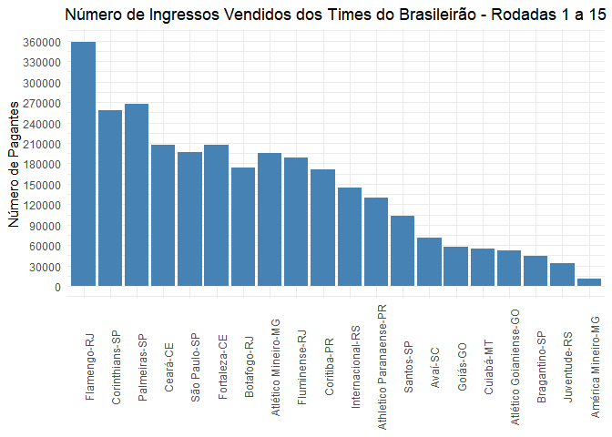
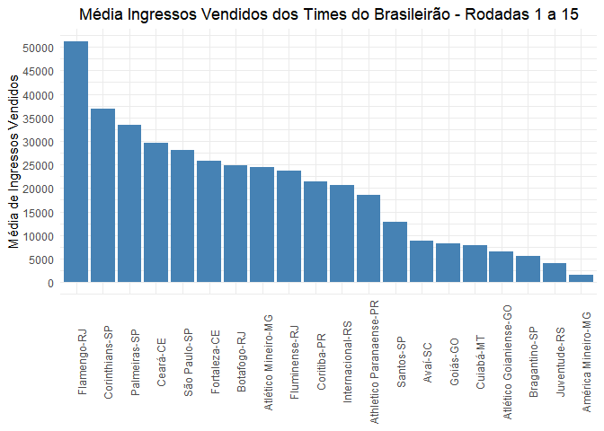

<!-- README.md is generated from README.Rmd. Please edit that file -->

# rendas.brasileirão

Pacote criado para baixar de forma automática as rendas dos times do
brasileirão. Há também a possibilidade de baixar as rendas dos times de
outras séries. Verifique as funções do pacote.

# Formas de usar

O pacote está armazenado nesse repositório do github para instalar
execute a função abaixo.

``` r
devtools::install_github("BaruqueRodrigues/renda.brasileirao")
```

O uso é simples, você deve passar as rodadas que você tem interesse.

A função baixa_rendas_brasileirao() retorna a um dataframe com as
rodadas desejadas.

``` r
rodadas <- 1:15
ano <- 2022
df_rendas <- rendas.brasileirao::baixa_rendas_brasileirao(n_rodadas = rodadas, ano = ano)

df_rendas
#> # A tibble: 150 × 42
#>    rodadas data       hora  clubem  clubev id_tabela id_clubem id_clubev escudom
#>    <chr>   <date>     <chr> <chr>   <chr>  <chr>     <chr>     <chr>     <chr>  
#>  1 1       2022-04-09 16h30 Flumin… Santo… 88416     11        17        /image…
#>  2 1       2022-04-09 19h00 Atléti… Flame… 88422     3         10        /image…
#>  3 1       2022-04-09 21h00 Palmei… Ceará… 88418     1         29        /image…
#>  4 1       2022-04-10 11h00 Coriti… Goiás… 88424     7         32        /image…
#>  5 1       2022-04-10 16h00 Atléti… Inter… 88415     4         13        /image…
#>  6 1       2022-04-10 16h00 Botafo… Corin… 88419     6         2         /image…
#>  7 1       2022-04-10 18h00 Fortal… Cuiab… 88421     47        45        /image…
#>  8 1       2022-04-10 19h00 São Pa… Athle… 88417     18        25        /image…
#>  9 1       2022-04-10 19h00 Avaí-SC Améri… 88423     26        22        /image…
#> 10 1       2022-04-11 20h00 Juvent… Braga… 88420     92        28        /image…
#> # … with 140 more rows, and 33 more variables: escudov <chr>, pagante <dbl>,
#> #   ingresso <dbl>, ingresso_vendido <dbl>, placarm_tn <chr>, placarv_tn <chr>,
#> #   prorrogacao <chr>, placarm_pr <chr>, placarv_pr <chr>, penaltis <chr>,
#> #   placarm_pe <chr>, placarv_pe <chr>, renda_bruta <dbl>,
#> #   renda_liq_sort <dbl>, renda_liq <dbl>, valor_renda_liq <dbl>,
#> #   estadio <chr>, cidade <chr>, id_periodo <chr>, so_por_rodada <chr>,
#> #   pm_abreviacao <chr>, pv_abreviacao <chr>, arbitro_principal <chr>, …
```

O pacote permite a criação de tabela de visualização. Existem também
funções para criação de tabelas de outras séries.

``` r
df_rendas %>% 
rendas.brasileirao::cria_tabela_serie_a(renda_liq, clubem, placarm_tn, placarv_tn,
                                        "Renda Líquida")
```


Também adicionamos a função que extraí as estatisticas dos times da
série a

``` r
statisticas_brasileirao_2019 <- rendas.brasileirao::pega_estatisticas(2019)
#> Joining, by = "id_time"

glimpse(statisticas_brasileirao_2019)
#> Rows: 20
#> Columns: 113
#> $ id_time                                    <int> 5981, 1968, 1963, 5926, 196…
#> $ nome_time                                  <chr> "Flamengo", "Santos", "Palm…
#> $ ano                                        <dbl> 2019, 2019, 2019, 2019, 201…
#> $ goals_scored                               <int> 86, 60, 61, 64, 51, 39, 44,…
#> $ goals_conceded                             <int> 37, 33, 32, 39, 32, 30, 39,…
#> $ own_goals                                  <int> 1, 1, 1, 3, 0, 1, 1, 1, 1, …
#> $ assists                                    <int> 63, 39, 44, 48, 35, 32, 26,…
#> $ shots                                      <int> 586, 584, 567, 523, 591, 52…
#> $ penalty_goals                              <int> 6, 5, 5, 7, 3, 3, 1, 4, 8, …
#> $ penalties_taken                            <int> 8, 7, 6, 9, 4, 4, 3, 4, 9, …
#> $ free_kick_goals                            <int> 0, 1, 0, 2, 1, 0, 0, 0, 2, …
#> $ free_kick_shots                            <int> 26, 29, 28, 37, 25, 31, 33,…
#> $ goals_from_inside_the_box                  <int> 77, 49, 57, 52, 42, 33, 36,…
#> $ goals_from_outside_the_box                 <int> 8, 9, 4, 11, 7, 6, 7, 5, 4,…
#> $ shots_from_inside_the_box                  <int> 373, 337, 342, 286, 340, 26…
#> $ shots_from_outside_the_box                 <int> 213, 247, 225, 237, 251, 25…
#> $ headed_goals                               <int> 14, 11, 10, 12, 12, 6, 10, …
#> $ left_foot_goals                            <int> 42, 18, 20, 18, 14, 16, 18,…
#> $ right_foot_goals                           <int> 29, 29, 31, 32, 23, 17, 15,…
#> $ big_chances                                <int> 127, 88, 86, 79, 96, 53, 62…
#> $ big_chances_created                        <int> 102, 62, 64, 55, 72, 42, 42…
#> $ big_chances_missed                         <int> 67, 55, 51, 45, 70, 29, 36,…
#> $ shots_on_target                            <int> 221, 213, 207, 191, 217, 17…
#> $ shots_off_target                           <int> 215, 266, 235, 180, 226, 22…
#> $ blocked_scoring_attempt                    <int> 150, 105, 125, 152, 148, 12…
#> $ successful_dribbles                        <int> 434, 398, 336, 496, 329, 47…
#> $ dribble_attempts                           <int> 716, 723, 575, 753, 512, 77…
#> $ corners                                    <int> 263, 201, 201, 225, 236, 19…
#> $ hit_woodwork                               <int> 16, 20, 10, 6, 16, 11, 10, …
#> $ fast_breaks                                <int> 28, 26, 19, 19, 23, 21, 25,…
#> $ fast_break_goals                           <int> 3, 3, 4, 3, 3, 5, 5, 2, 1, …
#> $ fast_break_shots                           <int> 26, 23, 15, 16, 20, 16, 20,…
#> $ average_ball_possession                    <dbl> 58.84211, 56.55263, 50.3947…
#> $ total_passes                               <int> 18548, 17097, 14670, 19981,…
#> $ accurate_passes                            <int> 15750, 14161, 12088, 17228,…
#> $ accurate_passes_percentage                 <dbl> 84.91482, 82.82740, 82.3994…
#> $ total_own_half_passes                      <int> 7032, 7951, 5977, 7944, 782…
#> $ accurate_own_half_passes                   <int> 6386, 7116, 5409, 7259, 711…
#> $ accurate_own_half_passes_percentage        <dbl> 90.81342, 89.49818, 90.4969…
#> $ total_opposition_half_passes               <int> 12226, 9771, 9367, 12692, 1…
#> $ accurate_opposition_half_passes            <int> 9525, 7181, 6868, 10105, 81…
#> $ accurate_opposition_half_passes_percentage <dbl> 77.90774, 73.49299, 73.3212…
#> $ total_long_balls                           <int> 1304, 1403, 1402, 1477, 159…
#> $ accurate_long_balls                        <int> 756, 746, 770, 867, 998, 55…
#> $ accurate_long_balls_percentage             <dbl> 57.97546, 53.17177, 54.9215…
#> $ total_crosses                              <int> 710, 625, 674, 655, 776, 62…
#> $ accurate_crosses                           <int> 161, 136, 189, 136, 194, 16…
#> $ accurate_crosses_percentage                <dbl> 22.67606, 21.76000, 28.0415…
#> $ clean_sheets                               <int> 14, 17, 15, 14, 15, 15, 12,…
#> $ tackles                                    <int> 651, 621, 619, 618, 504, 63…
#> $ interceptions                              <int> 323, 419, 347, 370, 346, 31…
#> $ saves                                      <int> 107, 103, 109, 121, 119, 11…
#> $ errors_leading_to_goal                     <int> 4, 2, 1, 2, 4, 1, 2, 3, 1, …
#> $ errors_leading_to_shot                     <int> 9, 7, 2, 8, 10, 4, 6, 3, 10…
#> $ penalties_commited                         <int> 8, 3, 8, 9, 8, 4, 5, 7, 7, …
#> $ penalty_goals_conceded                     <int> 6, 2, 7, 9, 6, 4, 4, 5, 5, …
#> $ clearances                                 <int> 525, 642, 637, 621, 573, 68…
#> $ clearances_off_line                        <int> 1, 1, 1, 1, 1, 2, 3, 1, 4, …
#> $ last_man_tackles                           <int> 1, 0, 1, 0, 1, 1, 0, 1, 1, …
#> $ total_duels                                <int> 4286, 4385, 4154, 4146, 407…
#> $ duels_won                                  <int> 2201, 2181, 2206, 2127, 192…
#> $ duels_won_percentage                       <dbl> 51.35324, 49.73774, 53.1054…
#> $ total_ground_duels                         <int> 3069, 3162, 2909, 3010, 274…
#> $ ground_duels_won                           <int> 1552, 1558, 1514, 1572, 127…
#> $ ground_duels_won_percentage                <dbl> 50.57022, 49.27261, 52.0453…
#> $ total_aerial_duels                         <int> 1217, 1223, 1245, 1136, 133…
#> $ aerial_duels_won                           <int> 649, 623, 692, 555, 658, 63…
#> $ aerial_duels_won_percentage                <dbl> 53.32786, 50.94031, 55.5823…
#> $ possession_lost                            <int> 4715, 4798, 4406, 4644, 484…
#> $ offsides                                   <int> 38, 73, 66, 47, 55, 59, 71,…
#> $ fouls                                      <int> 592, 577, 609, 482, 642, 63…
#> $ yellow_cards                               <int> 88, 103, 72, 80, 81, 84, 94…
#> $ yellow_red_cards                           <int> 2, 6, 1, 1, 1, 2, 0, 0, 5, …
#> $ red_cards                                  <int> 3, 10, 4, 2, 1, 6, 3, 1, 6,…
#> $ avg_rating                                 <dbl> 7.008431, 6.934933, 6.94323…
#> $ accurate_final_third_passes_against        <int> 1998, 2330, 2761, 2734, 211…
#> $ accurate_opposition_half_passes_against    <int> 4732, 5285, 6626, 6497, 479…
#> $ accurate_own_half_passes_against           <int> 5532, 5119, 6215, 6096, 575…
#> $ accurate_passes_against                    <int> 10144, 10277, 12725, 12449,…
#> $ big_chances_against                        <int> 57, 52, 40, 46, 69, 60, 60,…
#> $ big_chances_created_against                <int> 41, 35, 26, 27, 51, 47, 46,…
#> $ big_chances_missed_against                 <int> 33, 32, 22, 28, 45, 42, 39,…
#> $ clearances_against                         <int> 811, 726, 682, 657, 794, 68…
#> $ corners_against                            <int> 127, 180, 131, 178, 160, 17…
#> $ crosses_successful_against                 <int> 120, 127, 116, 144, 181, 13…
#> $ crosses_total_against                      <int> 476, 613, 583, 602, 653, 62…
#> $ dribble_attempts_total_against             <int> 678, 735, 584, 645, 549, 57…
#> $ dribble_attempts_won_against               <int> 385, 468, 331, 383, 343, 31…
#> $ errors_leading_to_goal_against             <int> 6, 6, 2, 7, 3, 3, 7, 2, 3, …
#> $ errors_leading_to_shot_against             <int> 5, 11, 9, 8, 7, 8, 6, 5, 5,…
#> $ hit_woodwork_against                       <int> 10, 8, 5, 9, 12, 8, 9, 12, …
#> $ interceptions_against                      <int> 401, 387, 317, 379, 416, 38…
#> $ key_passes_against                         <int> 292, 325, 284, 355, 344, 35…
#> $ long_balls_successful_against              <int> 892, 845, 852, 793, 1024, 9…
#> $ long_balls_total_against                   <int> 1954, 1930, 1719, 1676, 217…
#> $ offsides_against                           <int> 74, 51, 24, 13, 68, 45, 33,…
#> $ red_cards_against                          <int> 9, 6, 3, 7, 4, 1, 4, 6, 7, …
#> $ shots_against                              <int> 399, 452, 391, 481, 463, 47…
#> $ shots_blocked_against                      <int> 94, 126, 86, 117, 95, 117, …
#> $ shots_from_inside_the_box_against          <int> 217, 219, 175, 256, 276, 24…
#> $ shots_from_outside_the_box_against         <int> 182, 233, 216, 225, 187, 23…
#> $ shots_off_target_against                   <int> 161, 190, 164, 206, 217, 21…
#> $ shots_on_target_against                    <int> 144, 136, 141, 158, 151, 14…
#> $ blocked_scoring_attempt_against            <int> 94, 126, 86, 117, 95, 117, …
#> $ tackles_against                            <int> 615, 618, 533, 639, 554, 66…
#> $ total_final_third_passes_against           <int> 3059, 3554, 3875, 3932, 329…
#> $ opposition_half_passes_total_against       <int> 7031, 7935, 8994, 8969, 733…
#> $ own_half_passes_total_against              <int> 6353, 5903, 6953, 6784, 657…
#> $ total_passes_against                       <int> 12908, 13225, 15364, 15151,…
#> $ yellow_cards_against                       <int> 85, 110, 99, 88, 90, 87, 78…
#> $ id                                         <int> 1180, 2362, 1086, 1663, 172…
#> $ matches                                    <int> 38, 38, 38, 38, 38, 38, 38,…
#> $ awarded_matches                            <int> 0, 0, 0, 0, 0, 0, 0, 0, 0, …
```

A partir do dataset podemos construir algumas visualizações como a da
renda bruta por time.

``` r
df_rendas %>% 
  mutate(renda_bruta = as.numeric(renda_bruta)) %>% 
  ggplot(aes(x= reorder(clubem, -renda_bruta),
             y=renda_bruta))+
  geom_col(fill = "steelblue")+
  theme_minimal()+
  theme(axis.text.x = element_text(angle = 90),
        plot.title = element_text(hjust = .5))+
  scale_y_continuous(breaks = seq(0, 18000000, 2000000))+
  labs(x= NULL,
       y= "Renda Bruta em Reais",
       title = "Renda Bruta dos Times do Brasileirão 2022 - Rodadas 1 a 15")
```


O número de ingressos vendidos

``` r
df_rendas %>% 
  mutate(pagante = as.numeric(pagante)) %>% 
  ggplot(aes(x= reorder(clubem, -pagante),
             y=pagante))+
  geom_col(fill = "steelblue")+
  theme_minimal()+
  theme(axis.text.x = element_text(angle = 90),
        plot.title = element_text(hjust = .5))+
  scale_y_continuous(breaks = seq(0, 360000, 30000))+
  labs(x= NULL,
       y= "Número de Pagantes",
       title = "Número de Ingressos Vendidos dos Times do Brasileirão - Rodadas 1 a 15")
```



A média dos ingressos vendidos

``` r
df_rendas %>% 
  mutate(pagante = as.numeric(pagante)) %>% 
  group_by(clubem) %>% 
  summarise(pagante = mean(pagante)) %>% 
  ggplot(aes(x= reorder(clubem, -pagante),
             y=(pagante)))+
  geom_col(fill = "steelblue")+
  theme_minimal()+
  theme(axis.text.x = element_text(angle = 90),
        plot.title = element_text(hjust = .5))+
  scale_y_continuous(breaks = seq(0, 55000, 5000))+
  labs(x= NULL,
       y= "Média de Ingressos Vendidos",
       title = "Média Ingressos Vendidos dos Times do Brasileirão - Rodadas 1 a 15")
```


